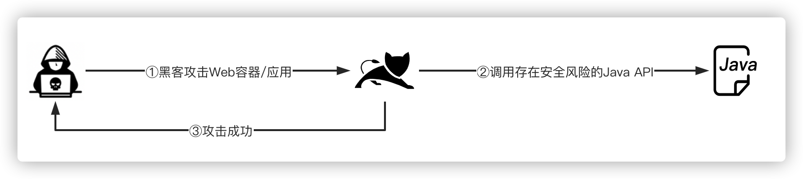
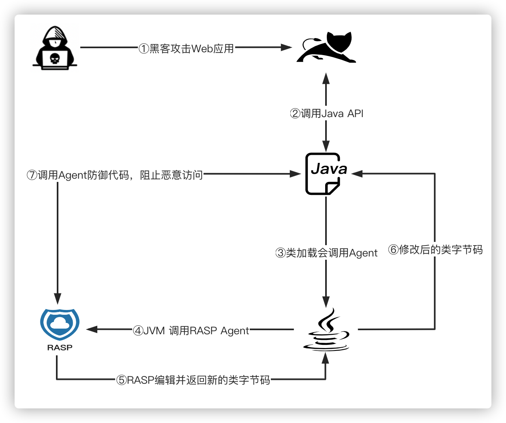
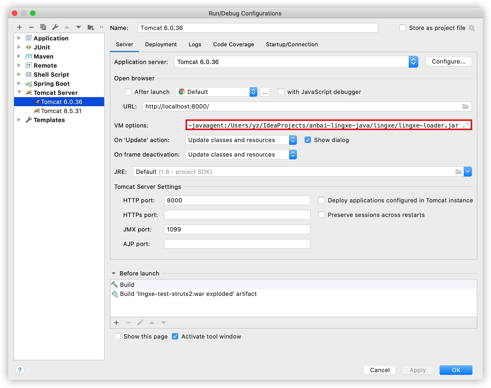
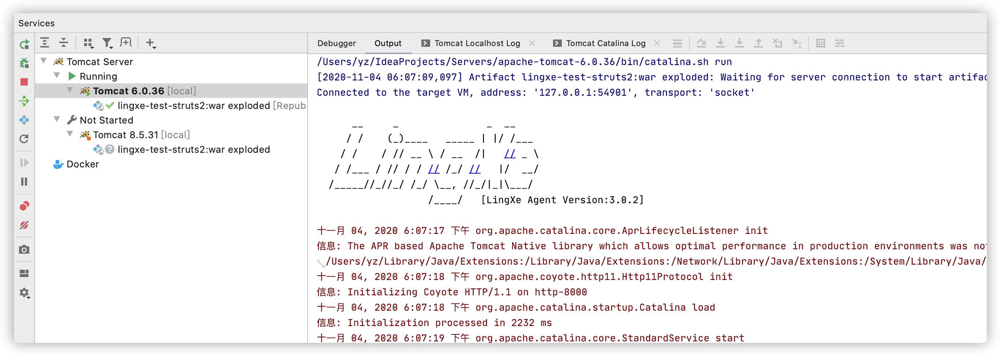
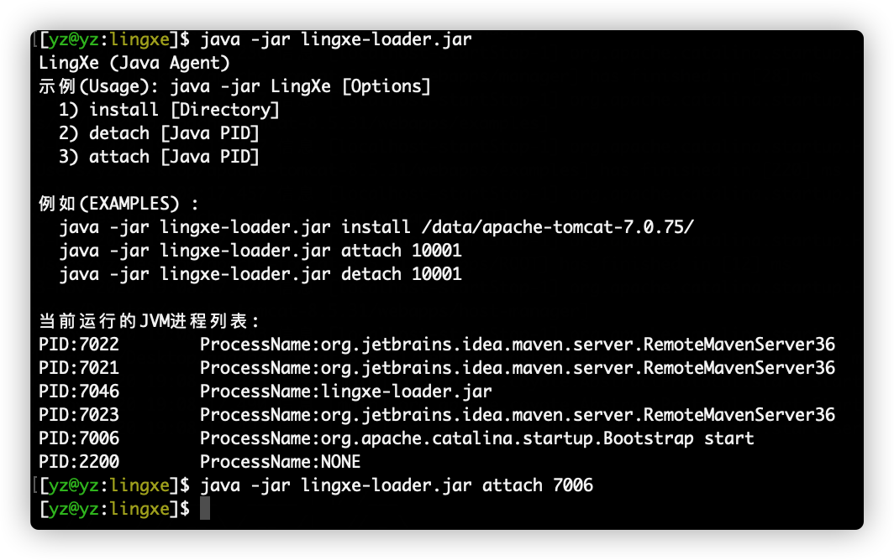
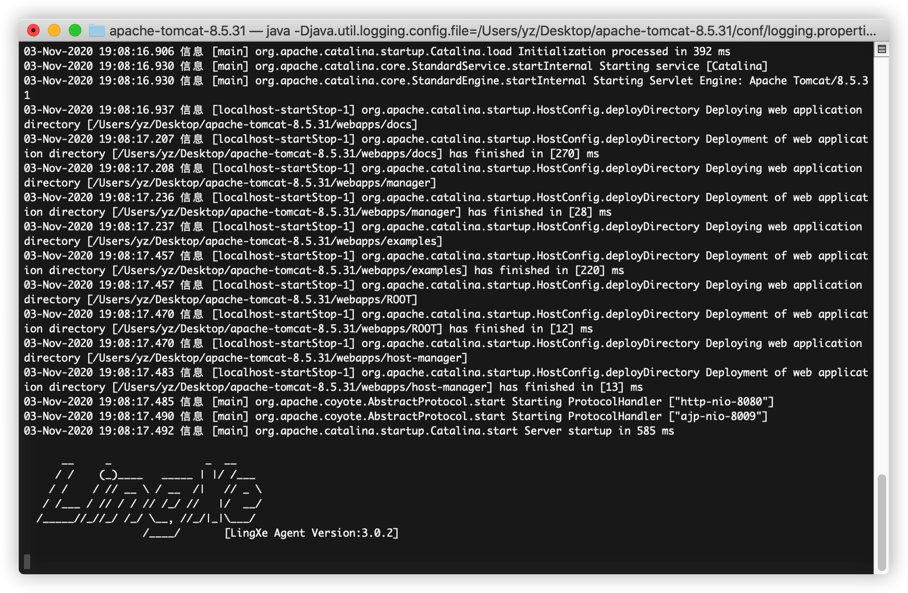

# Java RASP技术

`"Runtime application self-protection"`一词，简称为`RASP`。RASP是一种新型Web应用安全防御技术，RASP使用Agent技术动态编辑字节码，与应用程序融为一体，能实时检测和阻断恶意访问或黑客攻击，使应用程序具备自我保护能力。

## RASP防御原理

在如果没有RASP的防御，黑客可以利用Web容器/应用的漏洞攻击应用服务器。

## Agent 模式

 JDK1.5开始引入了Agent机制，在启动java程序时添加`-javaagent`参数，JVM在加载类文件的时候会先加载Agent中注册的`ClassFileTransformer`的`transform`方法，并传入类加载器、类名称、类二进制等信息。RASP会实时分析被加载的类是否需要被防御，如果待加载的类需要被防御就会动态修改该类方法插入RASP防御代码并将修改后的类二进制返回给JVM加载，这种方式因为必须是在容器启动时添加JVM参数，所以需要重启Web容器，在一些生产环境的服务是不允许停止的，所以重启问题成了其极大阻碍。

容器启动后可以看到Agent：

## Attach模式

JDK1.6新增了Attach方式，可以对运行中的java进程附加agent，RASP可以以进程注入的方式Attach到Java其他进程来实现防御。

进程注入成功后可以在控制台中看到输出的Logo信息：

## RASP与传统WAF的区别

传统的WAF(网站防火墙)一般都是基于流量解析的(CDN、硬件盒子)，他们的面临如下几个比较严重的问题:

1. 无法精准的解析Http/Https协议，可能会直接导致漏洞或误报；
2. CDN类型的防御找到用户真实IP就可以绕过防御；
3. 无法结合应用程序运行时环境分析黑客攻击，如：无法监控文件系统、无法精准的获取数据库最终执行的SQL语句、无法识别本地命令执行等问题；
4. 硬件盒子类无法及时更新规则，防御能力较低；
5. 不支持请求参数值清理，只支持请求拦截，误报率高、对用户业务系统影响很大；
6. WAF所有的检测只能针对请求参数，多基于正则来实现的，导致绕过率高；
7. 通常WAF规则只能应对已经公开的通用漏洞；
8. 不支持或者难支持防御比较复杂的业务系统或框架，如：SSRF、Java反序列化、AJP攻击等；

