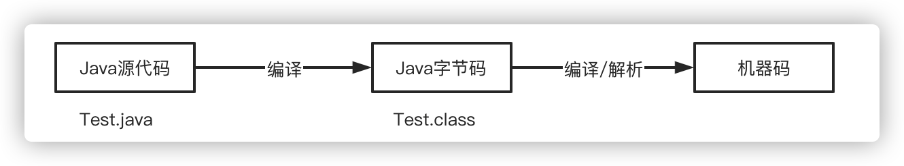
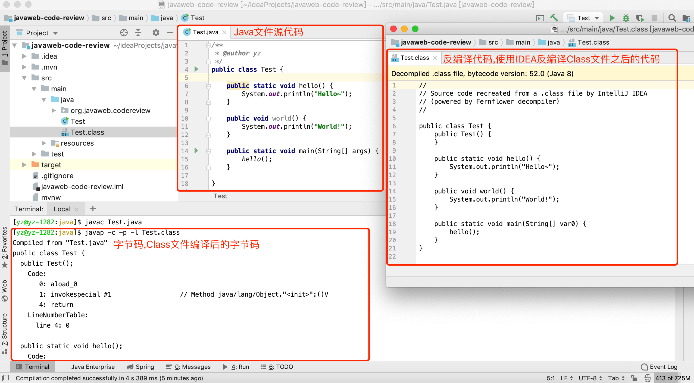
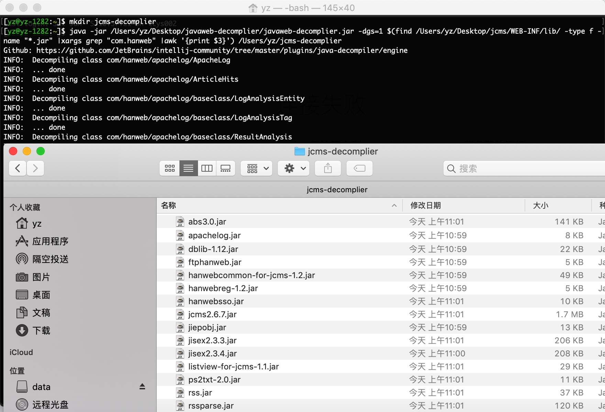

# Java类编译与反编译基础

在渗透测试的时候需要审计的代码通常是`class文件`或者`jar包`，那么我们应该如何审计呢？让我们先来学习一下什么是Java源码和字节码。

### 1. Java类编译与反编译基础

简单的说Java源码就是未经编译的`.java`文件，我们可以很轻松的阅读其中的代码逻辑，而字节码`.class`文件则是`.java`文件经过编译之后产生的字节码文件，因为`.class`文件是编译后的二进制文件所以我们是无法直接阅读的，只能通过反编译工具将二进制文件转换成`java代码`或者`ASM代码`。

**示例代码Test.java:**

```java
/**
 * @author yz
 */
public class Test {

	public static void hello() {
		System.out.println("Hello~");
	}

	public void world() {
		System.out.println("World!");
	}

	public static void main(String[] args) {
		hello();
	}

}
```

**Test.java编译执行流程:**



**Test.java 源码、字节码**



由于class文件的可读性较差，通常我们需要使用Java反编译工具来反编译代码。我们通常会使用到[JD-GUI](http://jd.benow.ca/)、[IDEA Fernflower插件](https://github.com/JetBrains/intellij-community/tree/master/plugins/java-decompiler/engine/src/org/jetbrains/java/decompiler)、[Bytecode-Viewer](https://github.com/Konloch/bytecode-viewer/releases)、[Fernflower](https://the.bytecode.club/showthread.php?tid=5)、[JAD](http://www.javadecompilers.com/jad)、[JBE](http://www.cs.ioc.ee/~ando/jbe/)、[JEB](https://www.pnfsoftware.com/jeb/manual/) 等工具来反编译class。

其中`JD-GUI`可能是目前反编译中使用的最多的工具了，但是个人觉得`JD-GUI`的反编译能力远不如经过`IDEA`(IDEA应该是使用的改版后的`Fernflower`)，因为`IDEA`默认支持对`jar`和`class`的反编译，所以我个人强烈推荐使用`IDEA`来反编译class代码。

当然，反编译工具很多时候也不是万能的，`JD-GUI`经常遇到无法反编译或反编译过程中程序直接崩溃的情况，遇到这类情况我们通常可以使用`IDEA`反编译试试，如果`IDEA`也无法反编译可以使用`JBE`来加载`class文件`读取程序的字节码，如果`JBE`仍无法读取类信息还可以使用`JDK`自带的`javap命令`来读取`class类字节码`，如果上诉所有的方法都无法反编译，那么恐怕是这个类本身就存在无法编译问题要么可能就是类文件被加密处理过。可能你会说java编译的class不是说不可以加密吗？没错，这里所说的加密其实是为了保护编译后的class代码不可反编译，通过实现`自定义ClassLoader`来`loadClass`加密后的类方式而已,这种加密方式曾在实战中也有遇到。

### 2. 反编译整个Jar技巧

通常我们在某些特殊的场景下拿到的只是jar文件，那么我们应该如何反编译整个jar包的class文件呢？

#### 2.1. Fernflower

Fernflower可以很轻松的实现jar的完整反编译，执行如下命令即可： `java -jar fernflower.jar jarToDecompile.jar decomp/` 其中`jarToDecompile.jar`是需要反编译的jar文件，`decomp`是反编译后的`class文件`所存放的目录。需要注意的是`Fernflower`如遇无法反编译的情况可能会生成空的java文件！

#### 2.2. JD-GUI

`JD-GUI`是一个带GUI的反编译工具，在`JD-GUI`的菜单中点击`File`-->`Save All Sources`即可反编译jar。

#### 2.3. IDEA

IDEA默认就支持jar包反编译，同时还支持class文件名(`⇧⌘F`)、类方法名称(`⇧⌘O`)搜索。

#### 2.4. Bytecode-Viewer

`FernFlower`提供了GUI版本[Bytecode-Viewer](https://github.com/Konloch/bytecode-viewer/releases),`Bytecode-Viewer`提供了直接反编译的`class`、`jar`、`zip`、`apk`、`dex`功能，直接拖拽jar就可以直接对整个jar进行反编译了。


#### 2.5. Find命令

`find`命令并不能支持Java反编译，但是`find`命令可以非常方便的搜索经过编译后的二进制文件中的内容,所以有的时候使用`find`命令通常是最简单实用的，直接解压jar包然后使用find命令搜索: `find ./ -type f -name "*.class" |xargs grep XXXX` 即可搞定。

#### 2.6 使用Find命令和Fernflower实现批量反编译jar

当我们只有项目war包且源码经过打包后发布到`WEB-INF/lib`的情况下，我们不得不去找出待审计源码的具体jar文件并反编译。遇到这种情况我们可以巧妙的使用`find`命令来反编译所有目标的jar包。

这里以`jcms`的一个非常老版本为例,`jcms`最终给客户部署的war包中源码并不是在`WEB-INF/classes`目录下，而是将整个`jcms`系统按模块打包成了多个jar包放在了`WEB-INF/lib`目录下。我们可以通过搜索`com.hanweb`包名称来找出所有jar中包含了`jcms`的文件并通过`Fernflower`来反编译。

```bash
java -jar /Users/yz/Desktop/javaweb-decomplier/javaweb-decomplier.jar -dgs=1 $(find /Users/yz/Desktop/jcms/WEB-INF/lib/ -type f -name "*.jar" |xargs grep "com.hanweb" |awk '{print $3}') /Users/yz/jcms-decomplier
```

执行上面的命令后会在`jcms-decomplier`目录下看到所有的jar已经被`Fernflower`反编译了。



依赖的jar: [javaweb-decomplier](https://github.com/anbai-inc/javaweb-decomplier)、[Intellij java-decompiler](https://github.com/JetBrains/intellij-community/tree/master/plugins/java-decompiler/engine)。

### 3. IntelliJ IDEA 推荐

`IntelliJ IDEA`是`Jetbrains`出品的一款非常强大的`Java IDE`，IDEA提供了强大的代码搜索、近乎完美的反编译、动态调试等功能可以最大程度的辅助我们代码审计。

不可以否认，与IDEA相比虽然Eclipse和Netbeans也有与之类似的功能，但是在真正的实战体验中个人更倾向于使用IDEA，虽然曾经的我也是一个重度Eclipse开发者。