# IntelliJ IDEA Java程序调试

## 1. 创建或打开一个Java项目

如果有需要调试的项目源码，可以直接打开一个存在的项目，如果没有项目源码只有class或者jar文件的话需要在IDEA中添加jar到依赖库。

## 2. 调试模式参数配置

Java应用程序可以在运行时添加启动参数即可调试，需要注意的是不同的JDK版本的调试参数可能会不一样。

JDK5-8: 

```java
-agentlib:jdwp=transport=dt_socket,server=y,suspend=y,address=5005
```

JDK9+：

```java
-agentlib:jdwp=transport=dt_socket,server=y,suspend=y,address=*:5005
```

`suspend=n`表示的是启动Java应用时是否立即进入调试模式，`suspend=y`表示启动即暂停，`suspend=n`则表示启动时不需要暂停。`address=*:5005`表示的是`Debug`监听的服务地址和端口，根据需求修改，上述配置会监听到`0.0.0.0`。

## 3. 在IDEA中启用远程调试

点击工具栏的`Add Configuration...`，点击左侧的`+`号，选择`Remote`，如下图：

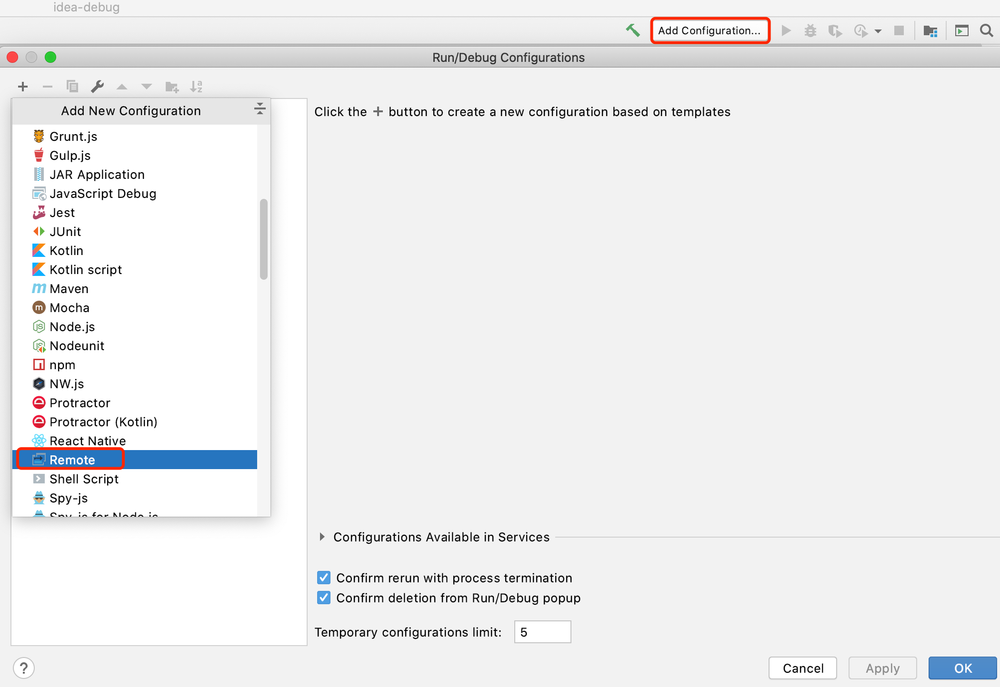


配置远程Debug信息，填入远程服务的IP地址、端口信息，注意JDK版本，`JDK8+`使用的调试参数是不一样的，最后如果默认选择的`classpath`不对需要手动选择下`classpath`。

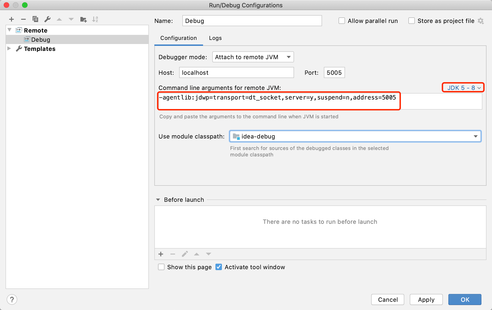

## 4. 远程调试Java应用程序

以调试模式启动Java应用也很简单，只需要加上调试参数即可:

```java
java -agentlib:jdwp=transport=dt_socket,server=y,suspend=y,address=5005 Test
```

这个时候程序会处于等待状态（光标会一致闪烁，等待远程连接）：

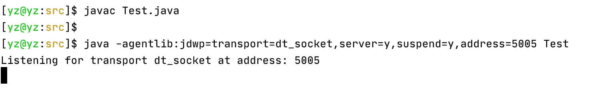

### 4.1 有源码调试

假设我们有需要调试的应用程序代码，我们可以直接在Java类上设置断点即可调试。

示例-Test.java：

```java
/**
 * Creator: yz
 * Date: 2020-05-19
 */
public class Test {

	public static void main(String[] args) {
		  System.out.println(args);
	}

}
```

在待调试的程序点设置断点，并点击`IDEA Debug`配置：
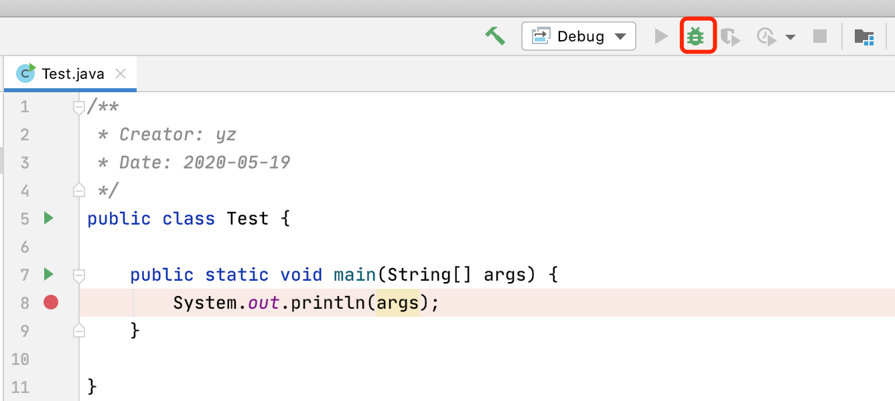

这个时候就可以看到程序已经运行至断点的位置了：

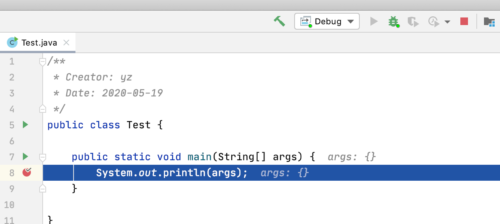


### 4.2 无源码，只有jar或者class文件调试

如上示例，假设我们这个时候只有Test.class的class文件或者Test.class对应的`test.jar`文件，我们应该怎么调试呢？

只有class的情况下我们进入源码所在的包，然后打包成jar文件即可：

```bash
cd src
jar -cvf test.jar *
ls -la
```

命令执行结果:

```bash
已添加清单
正在添加: Test.class(输入 = 342) (输出 = 187)(压缩了 45%)
[yz@yz:src]$ ls -la
total 16
drwxr-xr-x  4 yz  staff  128 May 19 17:21 .
drwxr-xr-x  5 yz  staff  160 May 19 16:57 ..
-rw-r--r--  1 yz  staff  342 May 19 17:20 Test.class
-rw-r--r--  1 yz  staff  641 May 19 17:22 test.jar
```

这个时候统计目录就会生成一个`test.jar`，我们只需要把这个jar添加到`classpath`然后设置好断点就可以调试了。

添加`jar`到`IDEA`的`classpath`，可以直接选择jar目录或者jar文件然后右键`Add as Library`，也可以选择项目以外的目录或者jar文件。

示例-直接选择项目中的jar：

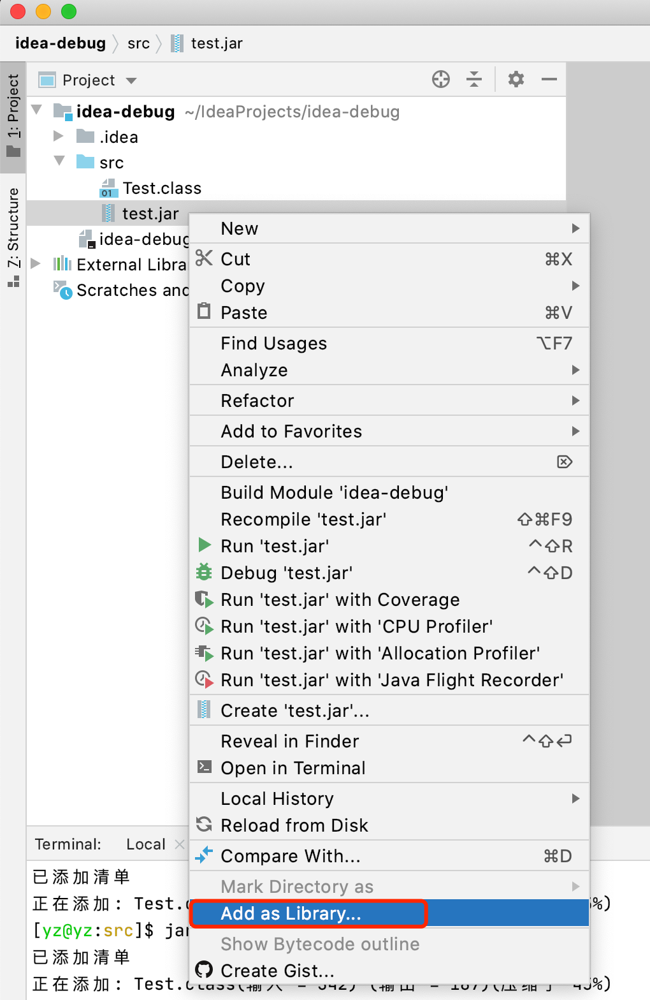

示例-选择项目以外的jar：

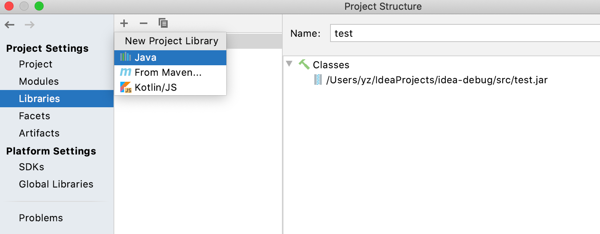

选择`jar`需要添加的`classpath`信息，通常不需要修改：

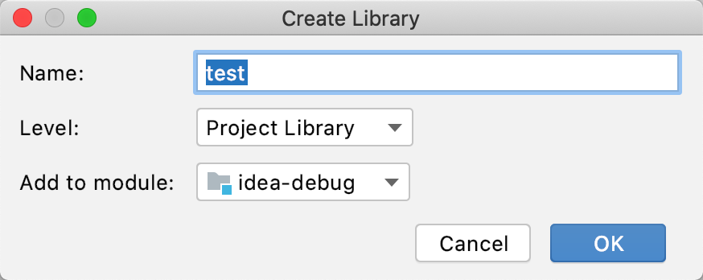

启动Test示例：

```bash
java -agentlib:jdwp=transport=dt_socket,server=y,suspend=y,address=5005 -cp test.jar Test
```

展开`test.jar`并在Test.class中设置断点，最后点击工具栏的调试按钮即可调试：

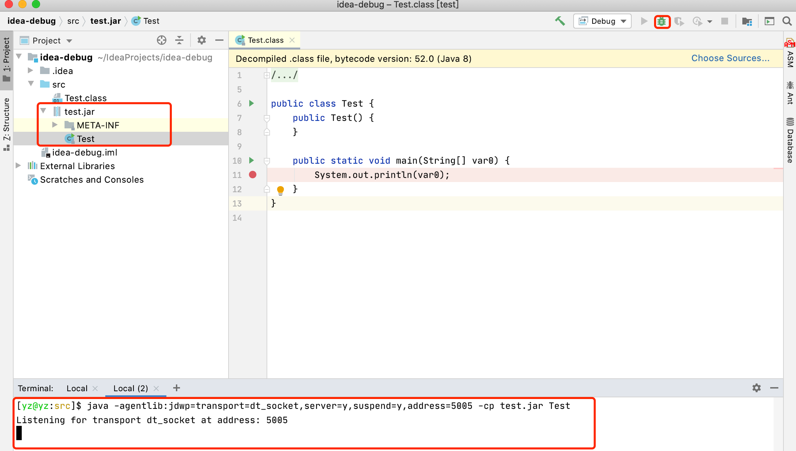

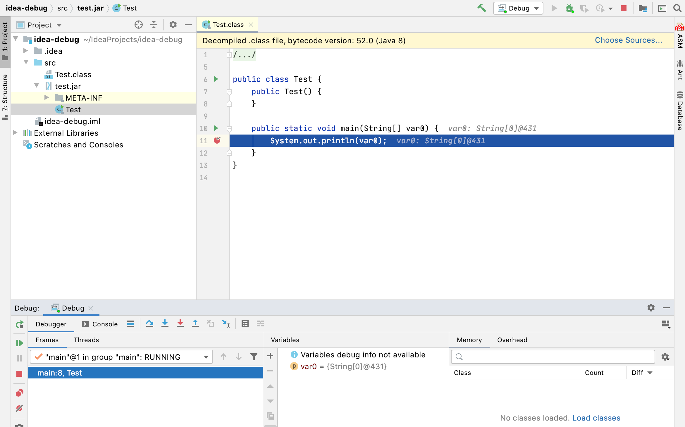


## 5. 调试Tomcat示例

常见的中间件启动脚本中都内置了调试参数，如Tomcat的`bin/catalina.sh`就内置了调试参数：

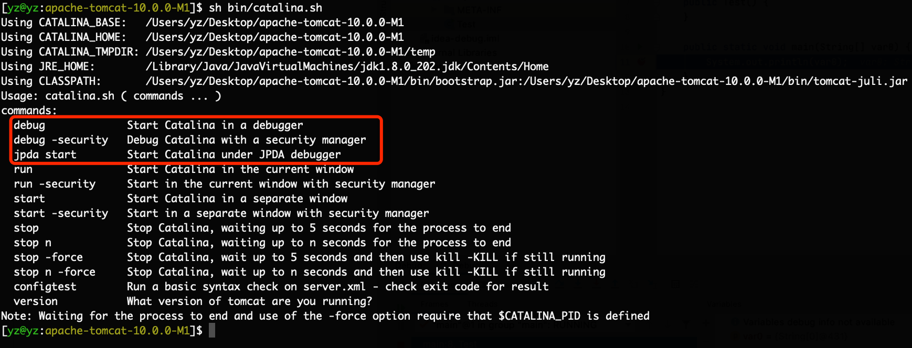

但最简单直接的方式是直接在`Tomcat`的启动脚本`catalina.sh`(Windows换成catalina.bat)中添加`Debug`参数即可：

```bash
JAVA_OPTS="-agentlib:jdwp=transport=dt_socket,server=y,suspend=y,address=5005"
```

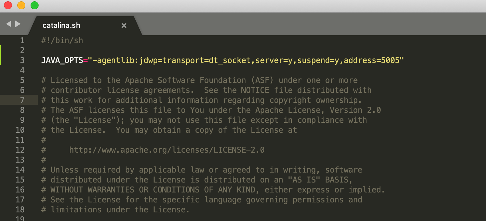

然后再使用`catalina.sh`启动Tomcat就会发现`Tomcat`会处于等待远程连接状态：

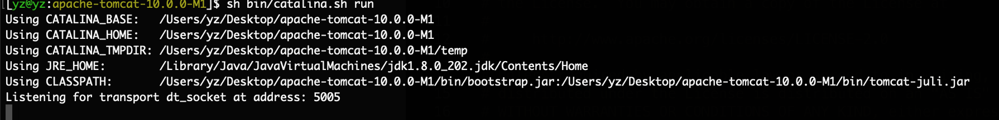

接下来就只需要导入`Tomcat`的jar并设置断点就可以调试了。

添加`Tomcat`的`lib`目录到`IDEA`的`classpath`:

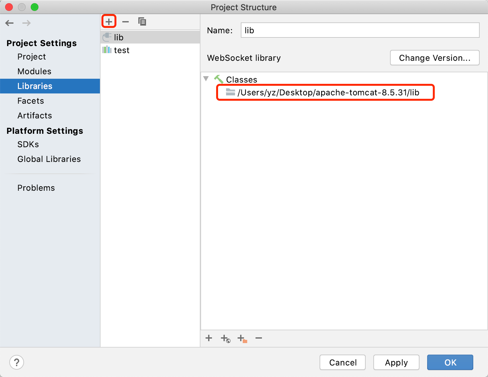

展开左侧`External Libraries`->`lib`->`选择需要断点的类`->`点击工具栏的Debug`:

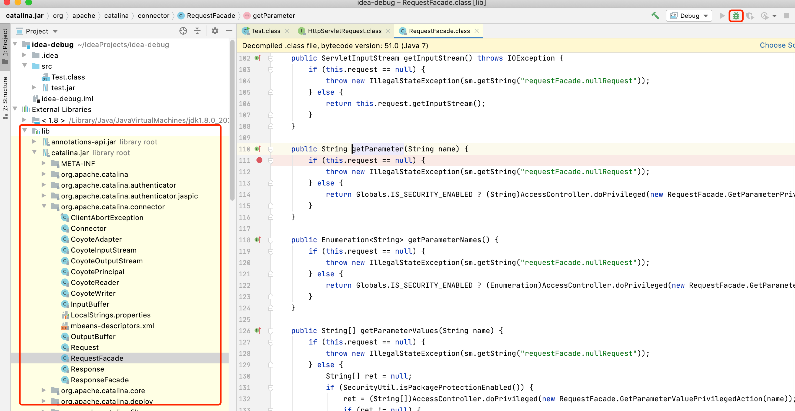

然后在`webapps/ROOT`目录下新建一个`test.jsp`:

```jsp
<%=request.getParameter("id")%>
```

最后点击工具栏的Debug后控制台的`Tomcat`就会自动启动，知道触发断点为止，上图示例中我设置的断点是`org.apache.catalina.connector.RequestFacade#getParameter`，所以需要使用浏览器请求任意页面并传入参数(访问`http://localhost:8080/test.jsp?id=yzmm`)即可进入断点：

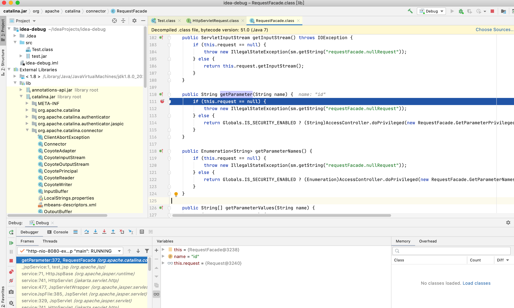

其实调试Tomcat最简单的方式是直接启动一个Maven Web项目并使用`Tomcat`启动，然后在`pom.xml`中配置对应版本的`Tomcat`的依赖就可以直接Debug了，使用这种调试方法可以让您学会如何使用IDEA调试任意的Java程序，仅此而已。

## 6. 条件断点

某些时候我们需要设置一个断点调试的时候会发现一些我们不希望关心的断点也进来了，会比较影响`Debug`，这个时候我们可以使用`IDEA`的条件断点的方式来设置断点。先在对应的行设置一个断点，然后再点击断点的红点图标`右键`设置断点停止条件了。例如下图示例我们设置一个当用户名为`admin`时进入调试模式：

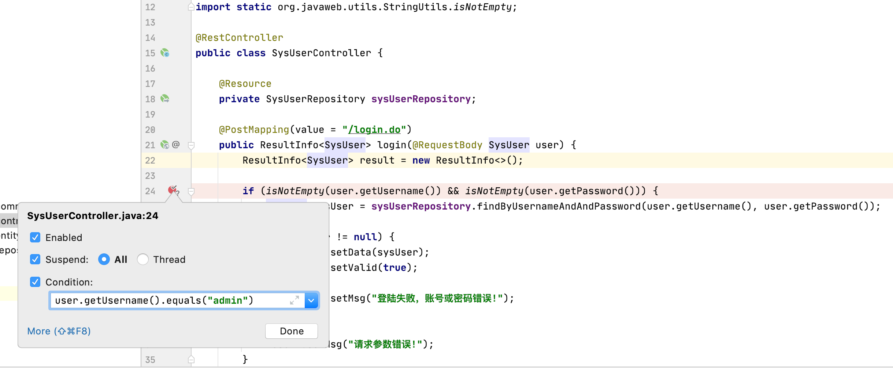

## 7. 动态获取表达式值

调试模式时我们可以点击下图的`计算器`图标或者使用快捷键`⌥F8`来执行任意的`Java`代码片段，如下图：


如果想要执行多行，点击`放大`/`缩小`的小图标切换：


## 8. 查看所有断点、暂停/启用所有断点

如果断点数量被设置的比较多，可能会比较难于管理，所幸，`IDEA`提供了对所有断点批量管理的功能，点击下图的小图标或者使用快捷键`⇧⌘F8`即可批量管理所有断点：

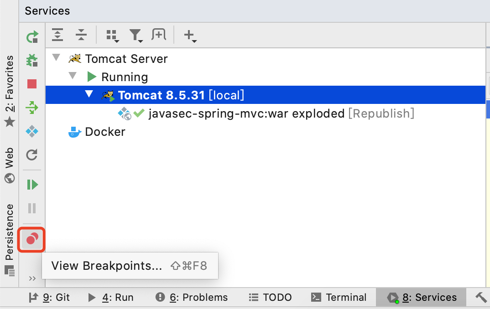

断点批量管理功能，新版的`IDEA`还新增了异常断点功能：

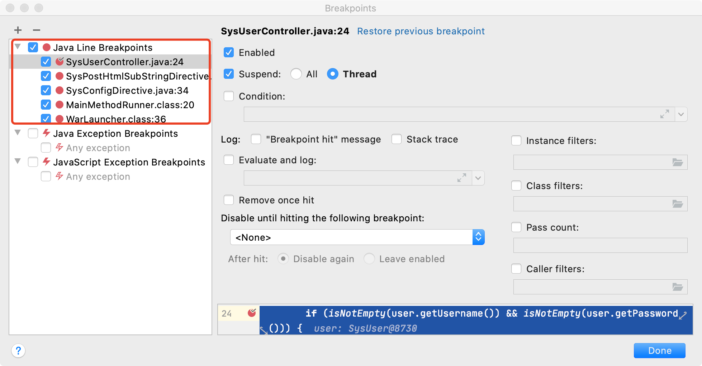

如果想要一次性放过所有的断点而又不想一个个的去勾掉断点，可以点击红色圆圈带×的小图标：

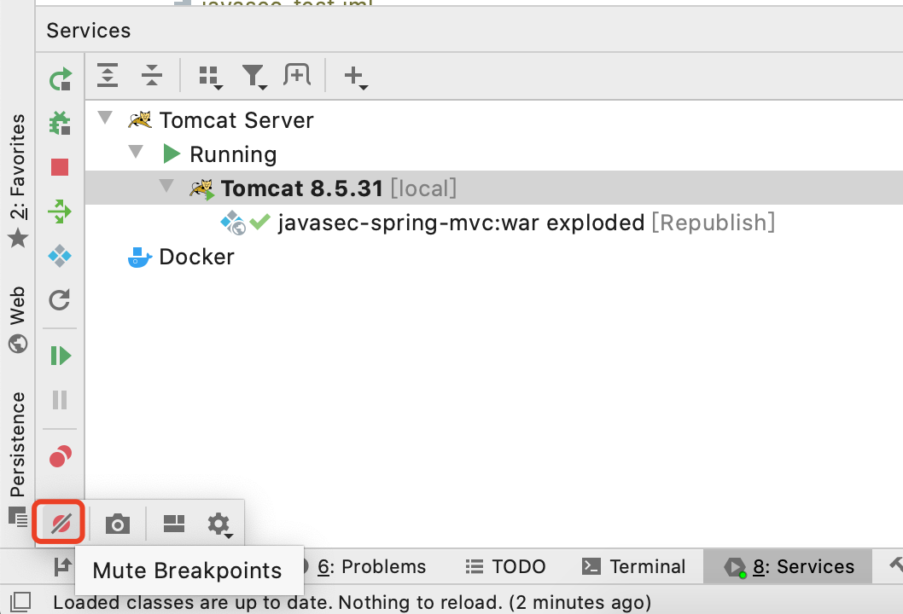

这样就可以看到所有已被设置了断点的图标都变成了灰色，也就是暂停了所有断点功能：

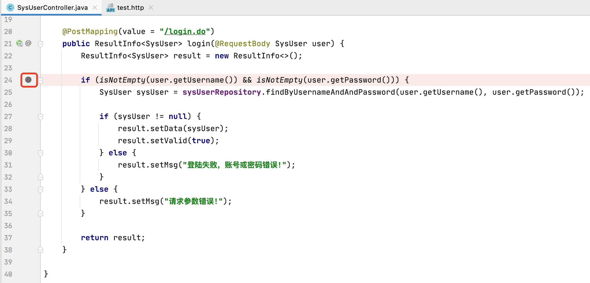

再次点击该图标就会恢复到调试模式。

## 9. 接口调试/成员变量值监控

在使用`IDEA`调试的时候可以把断点设置到接口方法上，所有的接口实现类的被设置了断点的方法都可以`Debug`，如下图：

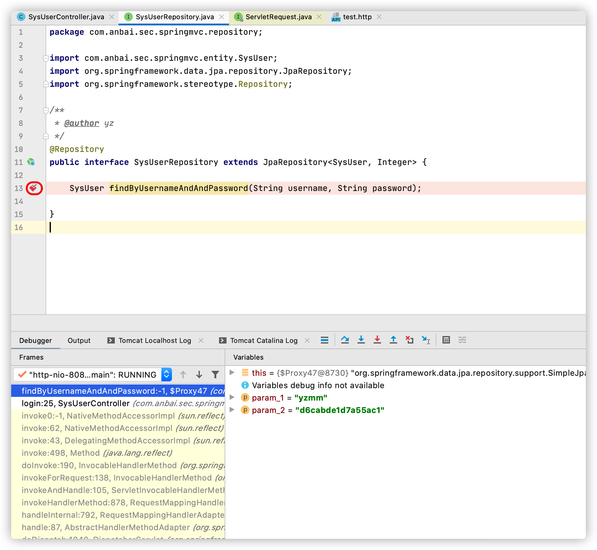

`IDEA`还支持对成员变量值进行监控，当被设置了监控的变量值发生改变时会进入断点：

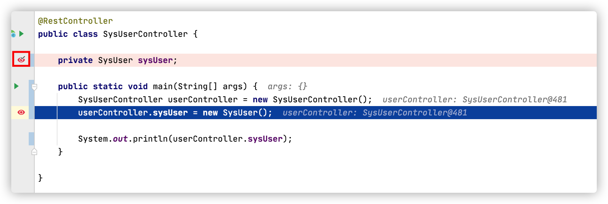

## 10. 代码覆盖率/性能

`IDEA`自带了`Coverage`和`CPU Profiling`功能，运行程序的时候选择对应的小图标就可以看到测试结果了，如下图：

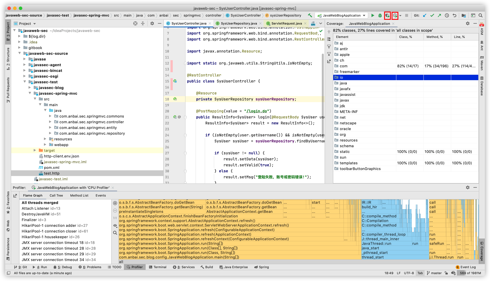