# IDEA代码搜索技巧

IDEA的搜索快捷键是:`⇧⌘F`,使用IDEA提供的搜索功能可以非常快速的定位漏洞点信息。

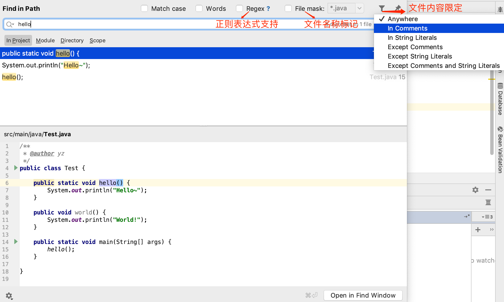

IDEA可以通过自定义搜索范围来精确查找我们需要审计的代码。默认搜索的是所有的位置，不过我们可以点击红色箭头指向的`...`按钮来细化我们的搜索范围。

## 1. 自定义范围搜索

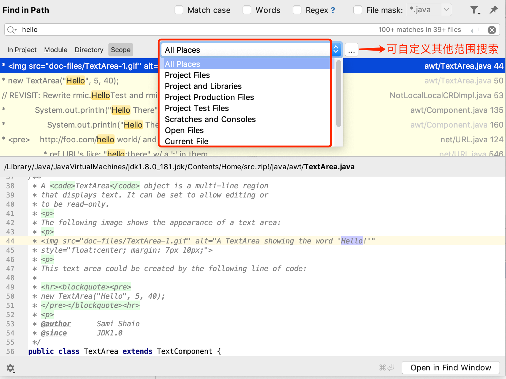

**自定义搜索范围示例:**

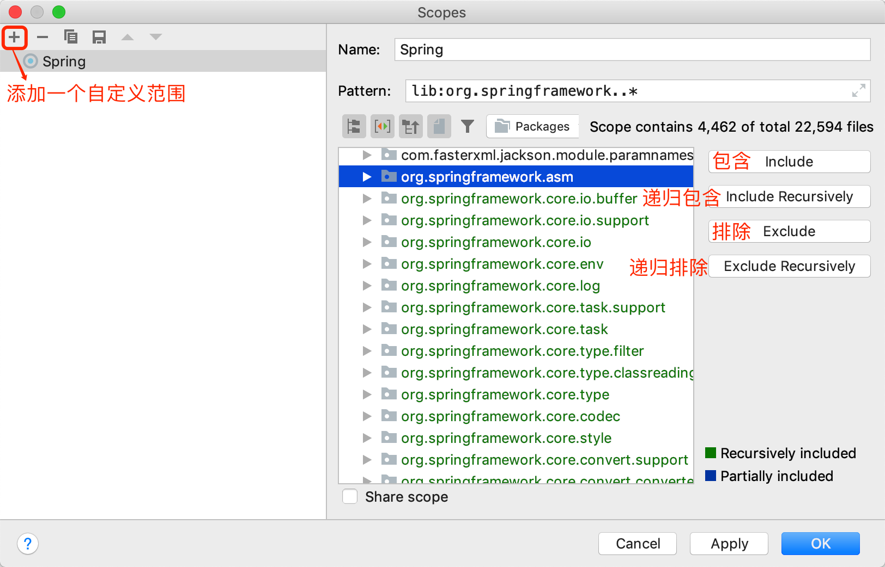

自定义搜索范围后就可以在搜索时使用自定义的配置进行范围搜索了，有助于我们在挖漏洞的时候缩小代码定位范围。

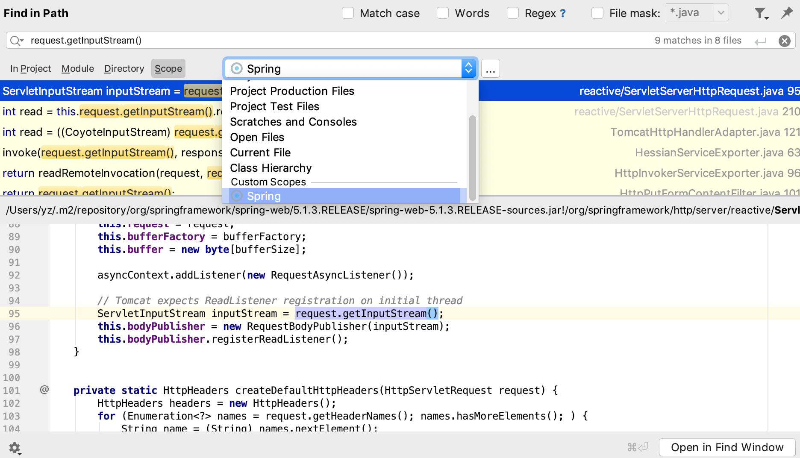

## 2. 标记搜索

搜索快捷键: `⌘O`，标记搜索支持`类名`、`方法名`搜索（`包括class或jar文件`中的方法也支持搜索）。

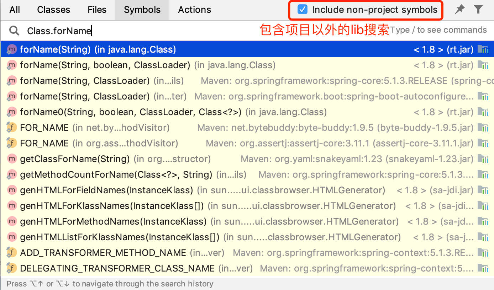

## 3. Java调用链搜索

当我们审计代码的时候发现某个方法或类有漏洞时我们需要定位到漏洞的请求地址(触发点)，复杂业务系统往往会让我们很难定位到漏洞的触发点。借助IDEA的方法调用链搜索功能就可以很轻松的找出方法的调用链和触发点。

选择`类或者方法名`-->`右键`-->`Find Useages`或者使用快捷键`⌥F7`

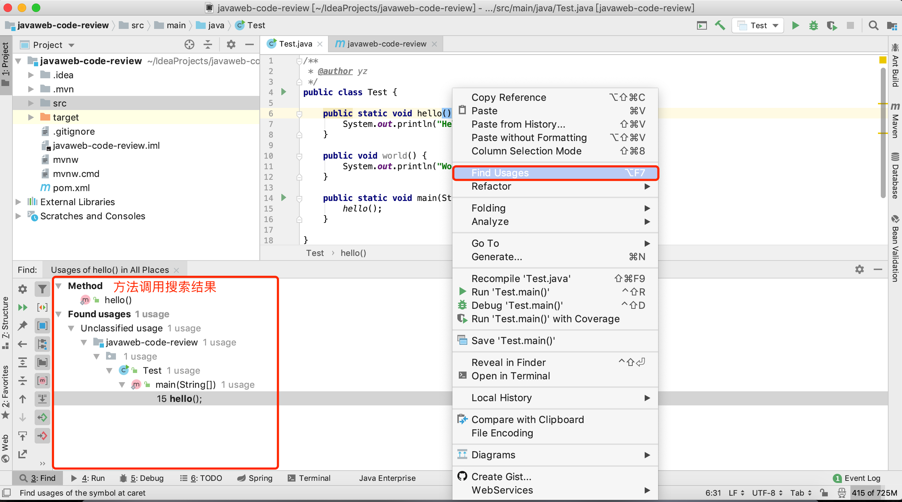

## 4. 显示类所有方法

 如果某个类有非常多的方法，我们无法快速找到想看的方法时可以使用快捷键`⌘F12`	

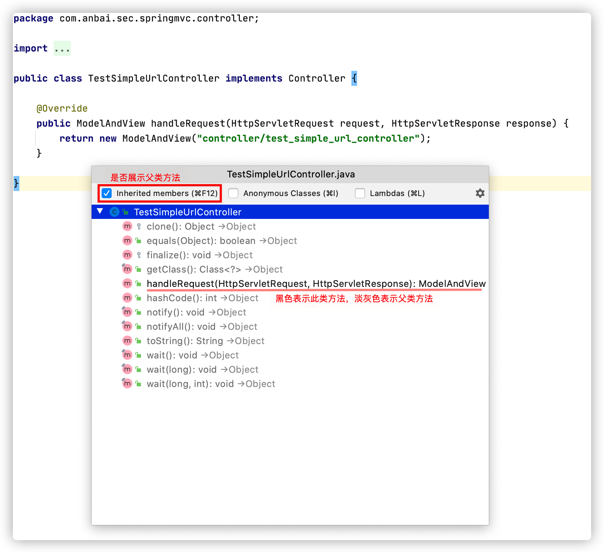

如果想显示父类方法可以把`Inherited members`勾上，反之去掉。

## 5. 显示类继承关系

某些类实现的非常复杂，继承和实现了非常多的类，比较影响我们分析业务，这个时候我们可以在某个类的空白处`右键`->`Diagrams`->`Show Diagram`或者使用快捷键`⌥⇧⌘U`

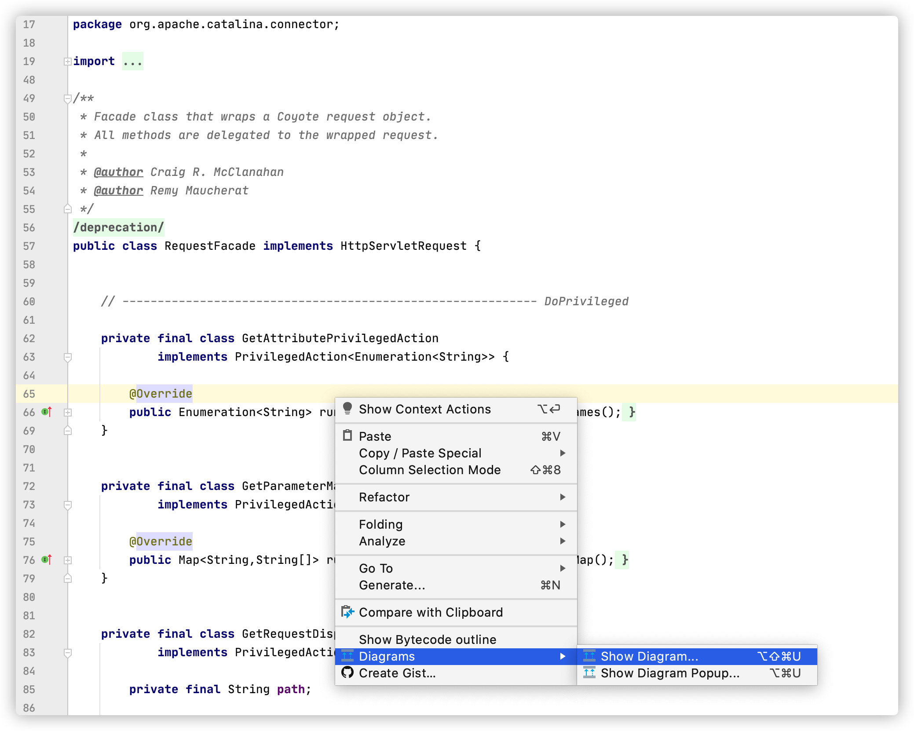

示例`RequestFacade`类的继承关系图：

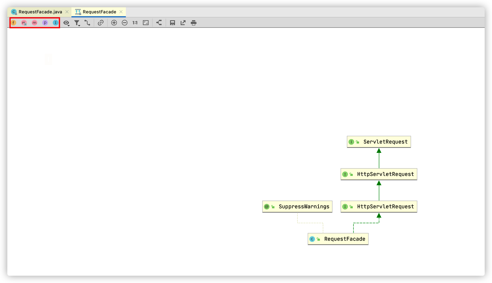

点击左上角的小图标`F`、`M❤`、`M`、`P`、`I`分别会展示详细的：`成员变量`、`构造方法`、`方法`、`属性`、`内部类`。

如果想显示多个类的继承关系，可以将任意类文件拖拽到右图就会生成多类之间的继承关系，如`Tomcat`中的`HttpServletRequest`类和`ApplicationHttpRequest`类都实现了`HttpServletRequest`接口，那么拖拽到一起就可以看到它们俩之间的如下关联关系：

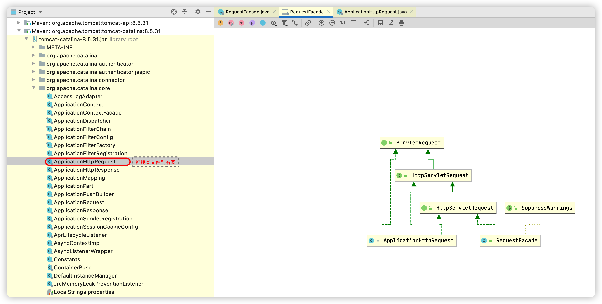

## 6. 自动反编译

IDEA的反编译效果非常的不错，大部分时间都可以直接使用IDEA的反编译功能来代替反编译工具。

### 6.1 自动反编译class文件

将任意的`class`文件丢到`IDEA`的源码目录就可以立即看到反编译之后的文件，这样就可以省去打开反编译工具的时间了，如图：

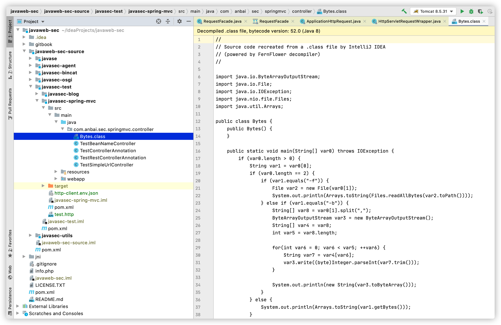

请注意，直接在`IDEA`中粘贴是会出错的，应该以文件的形式拷贝到对应目录。如果嫌打开目录IDEA中的文件所在目录过于麻烦，可以点击文件名或在已打开的文件中`右键`->`Reveal in Finder`

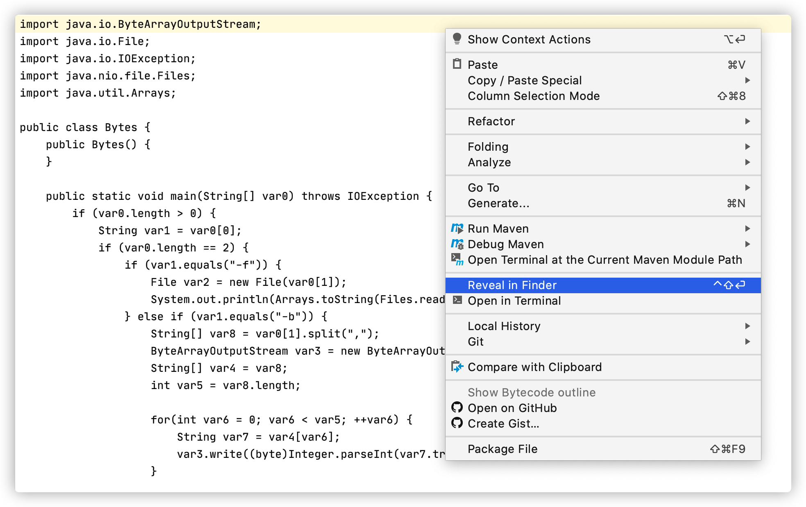

如果不想鼠标点击可以设置个自己喜欢的快捷键，这样就会非常方便了：

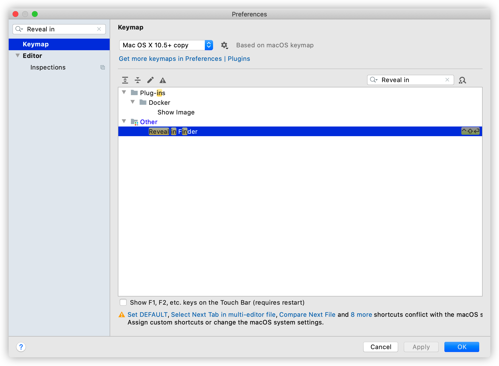

### 6.2 jar文件反编译

`IDEA`反编译`jar`文件也是非常的方便，只需把`jar`包丢到任意目录，然后`右键`->`Add as library`就可以了。

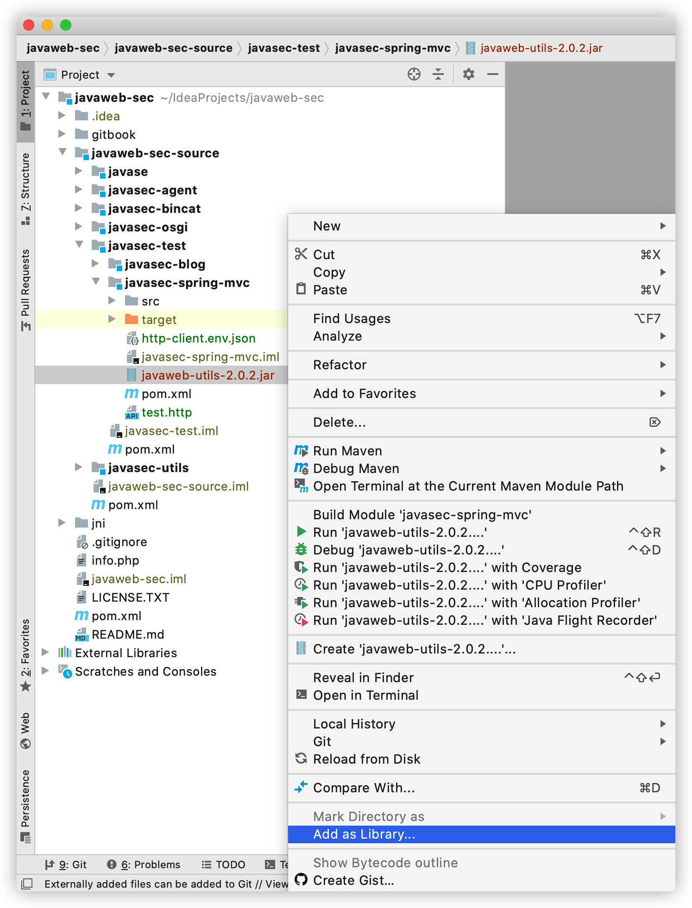

`jar`反编译示例：

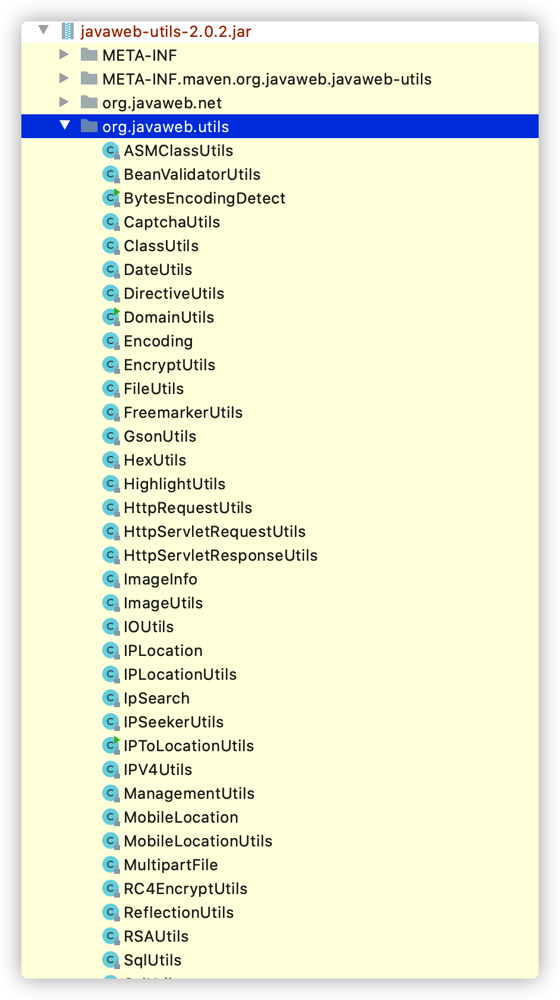

### 7. Http请求测试

很多人为了测试API接口总喜欢使用`Burp`或者`Postman`之类的工具去发送`Http`请求，殊不知`IDEA`就内置了非常方便的`Http`请求工具。在项目的任意位置：`右键`->`new`->`File`->`test.http`，然后就会创建出一个叫`test.http`的文件。

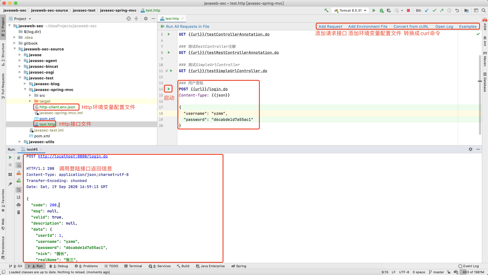

`Http`环境变量配置文件不是必须的，如需配置，需点击右上角的`Add Environment File`，然后自行添加变量，如：

```json
{
  "dev": {
    "url": "http://localhost:8080",
    "json": "application/json"
  }
}
```

