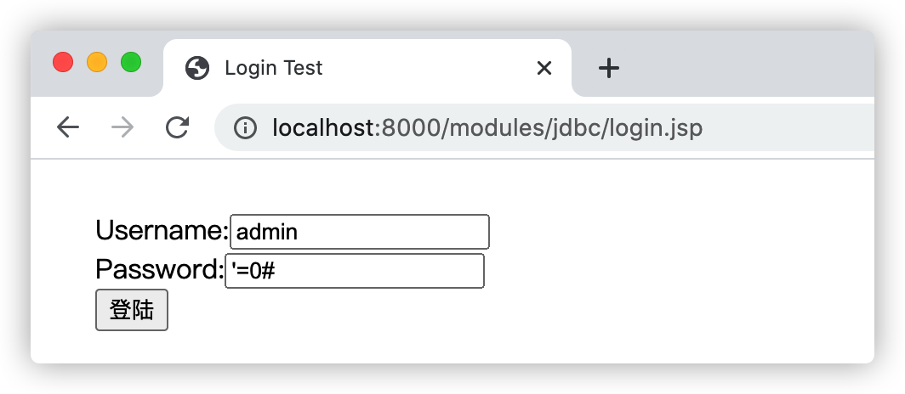
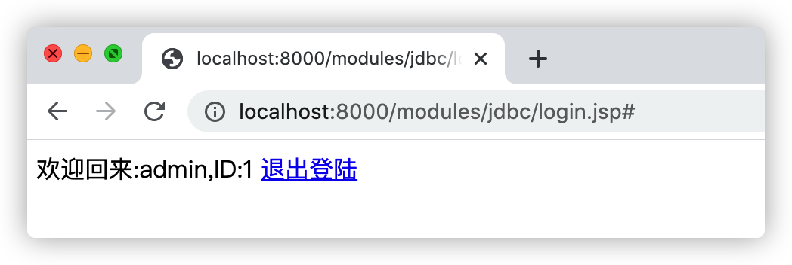
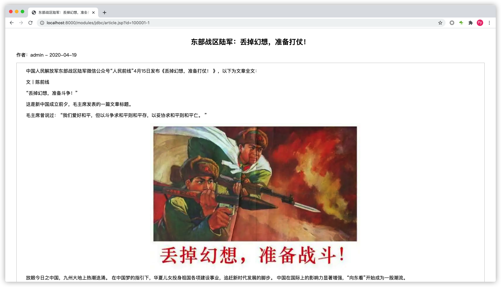
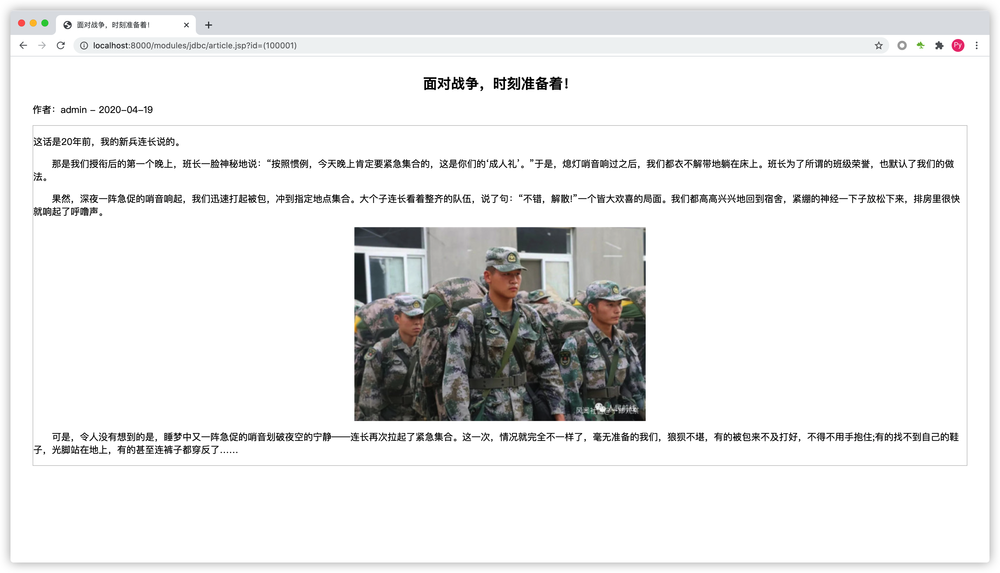
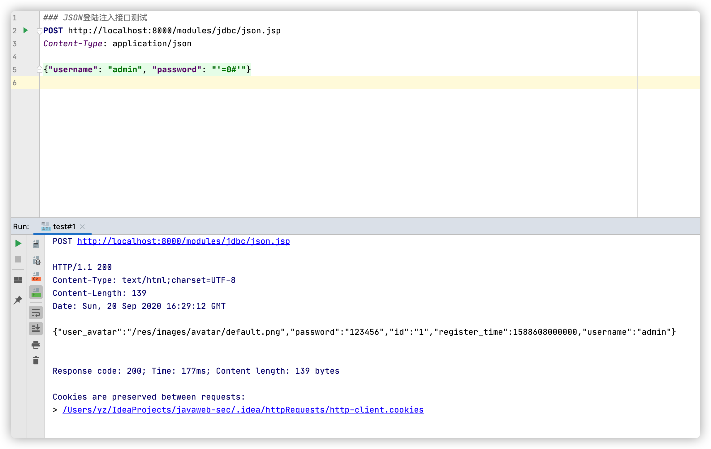

# SQL注入防御漏洞

SQL注入是网络攻击中最为常见的攻击方式，通过向服务器端发送恶意的SQL语句或SQL语句片段注入到服务器端的数据库查询逻辑中，改变原有的查询逻辑，从而可以轻松读取数据库内容，甚至是利用数据库内部功能或缺陷`提升权限`来获取服务器权限。

## 1. 用户后台系统登陆注入

### 1.1 登陆位置注入测试

检测数据库最短的的Payload是:`'`或者`"`，而利用SQL注入实现攻击的最短Payload(`Mysql`)是：`'=0#`。

示例-用户登陆存在注入代码(`login.jsp`)：

```jsp
<%@ page contentType="text/html;charset=UTF-8" language="java" %>
<%@ page import="java.sql.Connection" %>
<%@ page import="java.sql.DriverManager" %>
<%@ page import="java.sql.ResultSet" %>
<%@ page import="java.util.HashMap" %>
<%@ page import="java.util.Map" %>

<%
//    MYSQL sys_user示例表，测试时请先创建对应的数据库和表
//
//    CREATE TABLE `sys_user` (
//        `id` int(9) unsigned NOT NULL AUTO_INCREMENT COMMENT '用户ID',
//        `username` varchar(16) NOT NULL COMMENT '用户名',
//        `password` varchar(32) NOT NULL COMMENT '用户密码',
//        `user_avatar` varchar(255) DEFAULT NULL COMMENT '用户头像',
//        `register_time` datetime DEFAULT NULL COMMENT '注册时间',
//        PRIMARY KEY (`id`),
//        UNIQUE KEY `idx_sys_user_username` (`username`) USING BTREE
//    ) ENGINE=InnoDB AUTO_INCREMENT=6 DEFAULT CHARSET=utf8 COMMENT='系统用户表'
//
//    INSERT INTO `sys_user` VALUES ('1', 'admin', '123456', '/res/images/avatar/default.png', '2020-05-05 17:21:27'), ('2', 'test', '123456', '/res/images/avatar/default.png', '2020-05-06 18:27:10'), ('3', 'root', '123456', '/res/images/avatar/default.png', '2020-05-06 18:28:27'), ('4', 'user', '123456', '/res/images/avatar/default.png', '2020-05-06 18:31:34'), ('5', 'rasp', '123456', '/res/images/avatar/default.png', '2020-05-06 18:32:08');
%>

<%
    String sessionKey = "USER_INFO";
    Object sessionUser = session.getAttribute(sessionKey);

    // 退出登陆
    if (sessionUser != null && "exit".equals(request.getParameter("action"))) {
        session.removeAttribute(sessionKey);
        out.println("<script>alert('再见!');location.reload();</script>");
        return;
    }

    Map<String, String> userInfo = null;

    // 检查用户是否已经登陆成功
    if (sessionUser instanceof Map) {
        userInfo = (Map<String, String>) sessionUser;
        out.println("<p>欢迎回来:" + userInfo.get("username") + ",ID:" + userInfo.get("id") + " \r<a href='?action=exit'>退出登陆</a></p>");
        return;
    }

    String username = request.getParameter("username");
    String password = request.getParameter("password");

    // 处理用户登陆逻辑
    if (username != null && password != null) {
        userInfo = new HashMap<String, String>();
        ResultSet  rs         = null;
        Connection connection = null;

        try {
            Class.forName("com.mysql.jdbc.Driver");
            connection = DriverManager.getConnection("jdbc:mysql://localhost:3306/javaweb-bbs", "root", "root");

            String sql = "select id,username,password from sys_user where username = '" + username + "' and password = '" + password + "'";
            System.out.println(sql);

            rs = connection.prepareStatement(sql).executeQuery();

            while (rs.next()) {
                userInfo.put("id", rs.getString("id"));
                userInfo.put("username", rs.getString("username"));
                userInfo.put("password", rs.getString("password"));
            }

            // 检查是否登陆成功
            if (userInfo.size() > 0) {
                // 设置用户登陆信息
                session.setAttribute(sessionKey, userInfo);

                // 跳转到登陆成功页面
                response.sendRedirect(request.getServletPath());
            } else {
                out.println("<script>alert('登陆失败，账号或密码错误!');history.back(-1)</script>");
            }
        } catch (Exception e) {
            out.println("<script>alert('登陆失败，服务器异常!');history.back(-1)</script>");
        } finally {
            // 关闭数据库连接
            if (rs != null)
                rs.close();

            if (connection != null)
                connection.close();
        }

        return;
    }
%>
<html>
<head>
    <title>Login Test</title>
</head>
<body>
<div style="margin: 30px;">
    <form action="#" method="POST">
        Username:<input type="text" name="username" value="admin"/><br/>
        Password:<input type="text" name="password" value="'=0#"/><br/>
        <input type="submit" value="登陆"/>
    </form>
</div>
</body>
</html>
```

访问：http://localhost:8000/modules/jdbc/login.jsp，如下图：



攻击者通过在密码参数处输入：`'=0#`即可使用SQL注入的方式改变查询逻辑，绕过密码认证并登陆系统，因此用于检测用户账号密码是否存在的SQL语句变成了：

`select id,username,password from sys_user where username = 'admin' and password = ''=0#'`

其中的`password`的值预期是传入用户密码，但是实际上被攻击者传入了可改变查询逻辑的SQL语句，将运算结果改变为`true`，从而攻击者可以使用错误的用户及密码登陆系统，如下图：



毫无疑问因为攻击者输入的信息足够的短小简洁，但是对于用户网站系统来说却有极强的杀伤性，绝大多数的`WAF`或者`RASP`产品都无法精准辨别`'=0#`的威胁性，无法正确做到精准防御。


## 2. 文章详情页注入

通常情况下在用户系统发布文章后会在数据库中产生一条记录，并生成一个固定的文章ID，用户浏览文章信息只需要传入文章ID，即在后端通过文章ID查询文章详情信息。

示例-存在SQL注入的文章详情代码：

```jsp
<%@ page contentType="text/html;charset=UTF-8" language="java" %>
<%@ page import="java.sql.Connection" %>
<%@ page import="java.sql.DriverManager" %>
<%@ page import="java.sql.ResultSet" %>
<%@ page import="java.util.HashMap" %>
<%@ page import="java.util.Map" %>

<%
//    MYSQL sys_article示例表，测试时请先创建对应的数据库和表
//    CREATE TABLE `sys_article` (
//        `id` int(11) unsigned NOT NULL AUTO_INCREMENT COMMENT '文章ID',
//        `user_id` int(9) NOT NULL COMMENT '用户ID',
//        `title` varchar(100) NOT NULL COMMENT '标题',
//        `author` varchar(16) NOT NULL COMMENT '作者',
//        `content` longtext NOT NULL COMMENT '文章内容',
//        `publish_date` datetime NOT NULL COMMENT '发布时间',
//        `click_count` int(11) unsigned NOT NULL DEFAULT '0' COMMENT '文章点击数量',
//        PRIMARY KEY (`id`),
//        KEY `index_title` (`title`) USING BTREE
//    ) ENGINE=InnoDB AUTO_INCREMENT=100002 DEFAULT CHARSET=utf8 COMMENT='系统文章表';
//
//    INSERT INTO `sys_article` VALUES ('100000', '1', '东部战区陆军：丢掉幻想，准备打仗！', 'admin', '<p style=\"font-family:PingFangSC-Regular, 微软雅黑, STXihei, Verdana, Calibri, Helvetica, Arial, sans-serif;font-size:16px;text-indent:32px;background-color:#FFFFFF;\">\n	中国人民解放军东部战区陆军微信公众号“人民前线”4月15日发布《丢掉幻想，准备打仗！ 》，以下为文章全文：\n</p>\n<p style=\"font-family:PingFangSC-Regular, 微软雅黑, STXihei, Verdana, Calibri, Helvetica, Arial, sans-serif;font-size:16px;text-indent:32px;background-color:#FFFFFF;\">\n	文丨陈前线\n</p>\n<p style=\"font-family:PingFangSC-Regular, 微软雅黑, STXihei, Verdana, Calibri, Helvetica, Arial, sans-serif;font-size:16px;text-indent:32px;background-color:#FFFFFF;\">\n	“丢掉幻想，准备斗争！”\n</p>\n<p style=\"font-family:PingFangSC-Regular, 微软雅黑, STXihei, Verdana, Calibri, Helvetica, Arial, sans-serif;font-size:16px;text-indent:32px;background-color:#FFFFFF;\">\n	这是新中国成立前夕，毛主席发表的一篇文章标题。\n</p>\n<p style=\"font-family:PingFangSC-Regular, 微软雅黑, STXihei, Verdana, Calibri, Helvetica, Arial, sans-serif;font-size:16px;text-indent:32px;background-color:#FFFFFF;\">\n	毛主席曾说过： “我们爱好和平，但以斗争求和平则和平存，以妥协求和平则和平亡。 ”\n</p>\n<p style=\"font-family:PingFangSC-Regular, 微软雅黑, STXihei, Verdana, Calibri, Helvetica, Arial, sans-serif;font-size:16px;text-indent:32px;background-color:#FFFFFF;text-align:center;\">\n	\n</p>\n<p style=\"font-family:PingFangSC-Regular, 微软雅黑, STXihei, Verdana, Calibri, Helvetica, Arial, sans-serif;font-size:16px;text-indent:32px;background-color:#FFFFFF;\">\n	放眼今日之中国，九州大地上热潮迭涌。 在中国梦的指引下，华夏儿女投身祖国各项建设事业，追赶新时代发展的脚步。 中国在国际上的影响力显著增强，“向东看”开始成为一股潮流。\n</p>', '2020-04-19 17:35:06', '4'), ('100001', '1', '面对战争，时刻准备着！', 'admin', '<p style=\"font-family:&quot;font-size:16px;background-color:#FFFFFF;text-align:justify;\">\n	这话是20年前，我的新兵连长说的。\n</p>\n<p style=\"font-family:&quot;font-size:16px;background-color:#FFFFFF;text-align:justify;\">\n	&emsp;&emsp;那是我们授衔后的第一个晚上，班长一脸神秘地说：“按照惯例，今天晚上肯定要紧急集合的，这是你们的‘成人礼’。”于是，熄灯哨音响过之后，我们都衣不解带地躺在床上。班长为了所谓的班级荣誉，也默认了我们的做法。\n</p>\n<p style=\"font-family:&quot;font-size:16px;background-color:#FFFFFF;text-align:justify;\">\n	&emsp;&emsp;果然，深夜一阵急促的哨音响起，我们迅速打起被包，冲到指定地点集合。大个子连长看着整齐的队伍，说了句：“不错，解散!”一个皆大欢喜的局面。我们都高高兴兴地回到宿舍，紧绷的神经一下子放松下来，排房里很快就响起了呼噜声。\n</p>\n<p align=\"center\" style=\"font-family:&quot;font-size:16px;background-color:#FFFFFF;\">\n	\n</p>\n<p style=\"font-family:&quot;font-size:16px;background-color:#FFFFFF;text-align:justify;\">\n	&emsp;&emsp;可是，令人没有想到的是，睡梦中又一阵急促的哨音划破夜空的宁静——连长再次拉起了紧急集合。这一次，情况就完全不一样了，毫无准备的我们，狼狈不堪，有的被包来不及打好，不得不用手抱住;有的找不到自己的鞋子，光脚站在地上，有的甚至连裤子都穿反了……\n</p>', '2020-04-19 17:37:40', '17');
%>

<%
    String id = request.getParameter("id");
    Map<String, Object> articleInfo = new HashMap<String, Object>();
    ResultSet rs = null;
    Connection connection = null;

    if (id != null) {
        try {
            Class.forName("com.mysql.jdbc.Driver");
            connection = DriverManager.getConnection("jdbc:mysql://localhost:3306/javaweb-bbs", "root", "root");

            String sql = "select * from sys_article where id = " + id;
            System.out.println(sql);

            rs = connection.prepareStatement(sql).executeQuery();

            while (rs.next()) {
                articleInfo.put("id", rs.getInt("id"));
                articleInfo.put("user_id", rs.getInt("user_id"));
                articleInfo.put("title", rs.getString("title"));
                articleInfo.put("author", rs.getString("author"));
                articleInfo.put("content", rs.getString("content"));
                articleInfo.put("publish_date", rs.getDate("publish_date"));
            }
        } catch (Exception e) {
            e.printStackTrace();
        } finally {
            // 关闭数据库连接
            if (rs != null)
                rs.close();

            if (connection != null)
                connection.close();
        }
    }
%>
<html>
<head>
    <title><%=articleInfo.get("title")%></title>
</head>
<body>
<div style="margin: 30px;">
    <h2 style="height: 30px; text-align: center;"><%=articleInfo.get("title")%></h2>
    <p>作者：<%=articleInfo.get("author")%> - <%=articleInfo.get("publish_date")%></p>
    <div style="border: 1px solid #C6C6C6;">
        <%=articleInfo.get("content")%>
    </div>
</div>
</body>
</html>
```

访问示例程序并传入参数`id=100001`后会显示文章详情，请求：http://localhost:8000/modules/jdbc/article.jsp?id=100001，如下图：


### 2.1 union select类型的SQL注入攻击测试

攻击者在ID处构造并传入恶意的SQL注入语句后，可以轻松的读取出数据库信息，如将请求中的`id`参数值改为`100001 and 1=2 union select 1,2,user(),version(),database(),6`,服务器端将会返回数据库名称、请求：http://localhost:8000/modules/jdbc/article.jsp?id=100001%20and%201=2%20union%20select%201,2,user(),version(),database(),6,7，如下图：


由于攻击的Payload中包含了`union、select、user()、version()、database()`敏感关键字，大部分的`WAF`都能够识别此类SQL注入。

### 2.2 算数运算结果探测型攻击测试

但如果攻击者将注入语句改为检测语句:`100001-1`的时候页面会输出文章`id`为`100000`的文章，由于`id`参数存在注入，数据库最终查询到的文章`id`为`100001-1`也就是`id`为`100000`的文章，请求：http://localhost:8000/modules/jdbc/article.jsp?id=100001-1，如下图：



几乎可以绕过`99%`的`WAF`和大部分的`RASP`产品了，此类SQL注入攻击属于不具有攻击性的探测性攻击。


### 2.3 数据库函数型攻击测试

部分攻击者使用了数据库的一些特殊函数进行注入攻击，可能会导致`WAF`无法识别，但是RASP具备特殊函数注入攻击的精准检测和防御能力。

例如上述示例中攻击者传入的`id`参数值为:`(100001-1)`或者`(100001)`用于探测数据表中是否存在`id`值为`100000`的文章，请求：http://localhost:8000/modules/jdbc/article.jsp?id=(100001)，如下图：



或者传入的`id`参数值为:`(select 100000)`来探测数据库是否存在`id`值为`100000`的文章，请求：http://localhost:8000/modules/jdbc/article.jsp?id=(select%20100000)，如下图：


大多数数据库支持使用`()`来包裹一个整数型的字段值，但是`99%`的`WAF`和极大多数的`RASP`产品是无法识别此类型的注入攻击的。


## 3. SQL注入-JSON传参测试

示例-存在SQL注入漏洞的代码示例(JSON传参方式)：

```jsp
<%@ page contentType="text/html;charset=UTF-8" language="java" %>
<%@ page import="java.sql.Connection" %>
<%@ page import="java.sql.DriverManager" %>
<%@ page import="java.sql.ResultSet" %>
<%@ page import="java.util.HashMap" %>
<%@ page import="java.util.Map" %>
<%@ page import="com.alibaba.fastjson.JSON" %>
<%@ page import="org.apache.commons.io.IOUtils" %>
<%@ page import="com.alibaba.fastjson.JSONObject" %>

<%
    //    MYSQL sys_user示例表，测试时请先创建对应的数据库和表
//
//    CREATE TABLE `sys_user` (
//        `id` int(9) unsigned NOT NULL AUTO_INCREMENT COMMENT '用户ID',
//        `username` varchar(16) NOT NULL COMMENT '用户名',
//        `password` varchar(32) NOT NULL COMMENT '用户密码',
//        `user_avatar` varchar(255) DEFAULT NULL COMMENT '用户头像',
//        `register_time` datetime DEFAULT NULL COMMENT '注册时间',
//        PRIMARY KEY (`id`),
//        UNIQUE KEY `idx_sys_user_username` (`username`) USING BTREE
//    ) ENGINE=InnoDB AUTO_INCREMENT=6 DEFAULT CHARSET=utf8 COMMENT='系统用户表'
//
//    INSERT INTO `sys_user` VALUES ('1', 'admin', '123456', '/res/images/avatar/default.png', '2020-05-05 17:21:27'), ('2', 'test', '123456', '/res/images/avatar/default.png', '2020-05-06 18:27:10'), ('3', 'root', '123456', '/res/images/avatar/default.png', '2020-05-06 18:28:27'), ('4', 'user', '123456', '/res/images/avatar/default.png', '2020-05-06 18:31:34'), ('5', 'rasp', '123456', '/res/images/avatar/default.png', '2020-05-06 18:32:08');
%>

<%
    String contentType = request.getContentType();

    // 只接受JSON请求
    if (contentType != null && contentType.toLowerCase().contains("application/json")) {
        String     content  = IOUtils.toString(request.getInputStream());
        JSONObject json     = JSON.parseObject(content);
        String     username = json.getString("username");
        String     password = json.getString("password");

        // 处理用户登陆逻辑
        if (username != null && password != null) {
            ResultSet           rs         = null;
            Connection          connection = null;
            Map<String, Object> userInfo   = new HashMap<String, Object>();

            try {
                Class.forName("com.mysql.jdbc.Driver");
                connection = DriverManager.getConnection("jdbc:mysql://localhost:3306/javaweb-bbs", "root", "root");

                String sql = "select * from sys_user where username = '" + username + "' and password = '" + password + "'";
                System.out.println(sql);

                rs = connection.prepareStatement(sql).executeQuery();

                while (rs.next()) {
                    userInfo.put("id", rs.getString("id"));
                    userInfo.put("username", rs.getString("username"));
                    userInfo.put("password", rs.getString("password"));
                    userInfo.put("user_avatar", rs.getString("user_avatar"));
                    userInfo.put("register_time", rs.getDate("register_time"));
                }

                // 检查是否登陆成功
                if (userInfo.size() > 0) {
                    // 设置用户登陆信息
                    out.println(JSON.toJSONString(userInfo));
                } else {
                    out.println("<script>alert('登陆失败，账号或密码错误!');history.back(-1)</script>");
                }
            } catch (Exception e) {
            	e.printStackTrace();
                out.println("<script>alert('登陆失败，服务器异常!');history.back(-1)</script>");
            } finally {
                // 关闭数据库连接
                if (rs != null)
                    rs.close();

                if (connection != null)
                    connection.close();
            }
        }
    }
%>
```

如果应用系统本身通过JSON格式传参，传统的`WAF`可能无法识别，如果后端将参数进行SQL语句的拼接，则将会导致SQL注入漏洞。攻击者通过篡改JSON中对应参数的数据，达到SQL注入攻击的目的，如下图：



