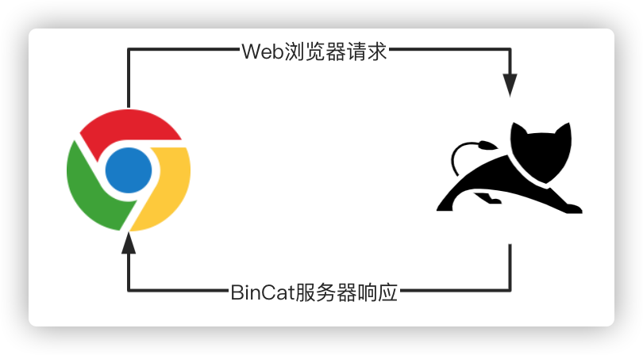
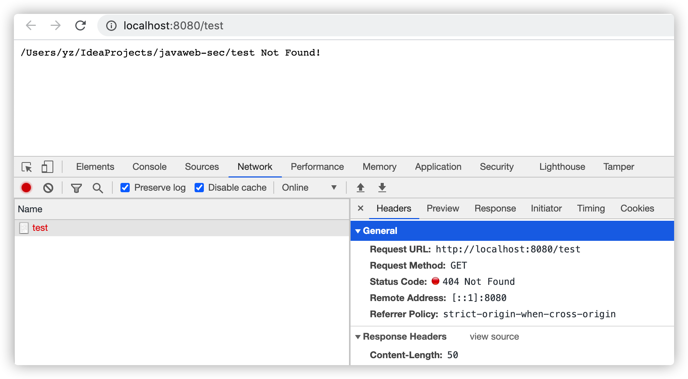

# BinCat V1-简单的请求文件访问处理

实现一个简单的Web服务器非常容易，使用`ServerSocket`在服务器端监听端口并等待浏览器请求，一旦接收到浏览器数据后就开始解析Http协议，最后将服务器端请求处理完后通过`Socket`返回给浏览器即可。



V1版本，我们先实现一个简单的读取服务器静态文件的功能，在后续版逐渐完善。

**BinCatServerV1实现代码：**

```java
package com.anbai.sec.server;

import java.io.*;
import java.net.ServerSocket;
import java.net.Socket;
import java.util.logging.Logger;

/**
 * ServerSocket示例
 */
public class BinCatServerV1 {

	private static final Logger LOG = Logger.getLogger("info");

	public static void main(String[] args) {
		try {
			// 设置服务监听端口
			int port = 8080;

			// 设置服务名称
			String serverName = "BinCat-0.0.1";

			// 创建ServerSocket，监听本地端口
			ServerSocket ss = new ServerSocket(port);

			LOG.info(serverName + " 启动成功，监听端口: " + port);

			while (true) {
				// 等待客户端连接
				Socket socket = ss.accept();

				try {
					// 获取Socket输入流对象
					InputStream in = socket.getInputStream();

					// 获取Socket输出流对象
					OutputStream out = socket.getOutputStream();

					// 创建输出流对象
					BufferedReader br = new BufferedReader(new InputStreamReader(in));

					// 从Socket中读取一行数据
					String str = br.readLine();

					if (str == null) {
						continue;
					}

					// 切割请求Http协议信息
					String[] strs = str.split("\\s+");

					// 解析Http请求URL地址
					String url = strs[1];

					// 输出服务器返回信息
					String msg = "";

					// 当前服务器运行目录下的文件
					File file = new File(System.getProperty("user.dir"), url);

					if (file.exists()) {
						out.write("HTTP/1.1 200 OK\n".getBytes());
						msg = file.getAbsolutePath();
					} else {
						out.write("HTTP/1.1 404 Not Found\n".getBytes());
						msg = file.getAbsolutePath() + " Not Found!";
					}

					// 输出返回字节数
					out.write(("Content-Length: " + msg.getBytes().length + "\n").getBytes());

					// 写入换行
					out.write("\n".getBytes());

					// 将读取到的数据写入到客户端Socket
					out.write(msg.getBytes());

					in.close();
					out.close();
				} catch (IOException e) {
					LOG.info("处理客户端请求异常:" + e);
				} finally {
					socket.close();
				}
			}
		} catch (IOException e) {
			e.printStackTrace();
		}
	}

}
```

启动`BinCat`服务后控制台将输出:

```
九月 09, 2020 5:18:50 下午 com.anbai.sec.server.BinCatServerV1 main
信息: BinCat-0.0.1启动成功，监听端口:8080
```

浏览器请求[localhost:8080](http://localhost:8080)即可在浏览器中输出当前请求的文件是否存在:


请求一个不存在的文件地址，浏览器将会输出错误信息，如请求[localhost:8080/test](http://localhost:8080/test)：



从上图中我们可以看到响应的状态码和body都能够正确的被浏览器解析。