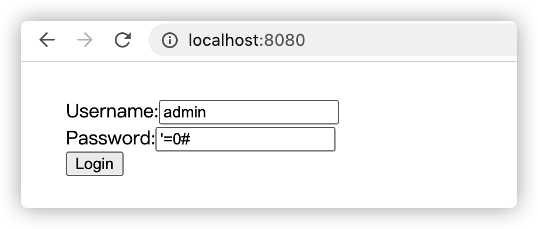

# BinCat V2-简单解析请求参数

V2版本我们需要支持请求参数解析以及简单的HTML页面渲染功能。

**BinCatServerV2实现代码：**

```java
package com.anbai.sec.server;

import java.io.*;
import java.net.ServerSocket;
import java.net.Socket;
import java.net.URLDecoder;
import java.util.Map;
import java.util.concurrent.ConcurrentHashMap;
import java.util.logging.Logger;

/**
 * ServerSocket Http 服务器示例
 */
public class BinCatServerV2 {

	private static final Logger LOG = Logger.getLogger("info");

	public static void main(String[] args) {
		try {
			// 设置服务监听端口
			int port = 8080;

			// 设置服务名称
			String serverName = "BinCat-0.0.2";

			// 创建ServerSocket，监听本地端口
			ServerSocket ss = new ServerSocket(port);

			LOG.info(serverName + " 启动成功，监听端口: " + port);

			while (true) {
				// 等待客户端连接
				Socket socket = ss.accept();

				try {
					// 获取Socket输入流对象
					InputStream in = socket.getInputStream();

					// 获取Socket输出流对象
					OutputStream out = socket.getOutputStream();

					// 创建数据输出流对象
					DataInputStream dis = new DataInputStream(in);

					// 从Socket中读取一行数据，读取请求的URL
					String str = dis.readLine();

					if (str == null) {
						socket.close();
						continue;
					}

					// 切割请求Http协议信息
					String[] strs = str.split("\\s+");

					// 解析Http请求方法类型
					String method = strs[0];

					// 解析Http请求URL地址
					String url = strs[1];

					// 初始化Http请求URL地址
					String requestURL = url;

					// 初始化Http请求的QueryString
					String queryString;

					// 解析Http请求版本信息
					String httpVersion = strs[2];

					// 创建Header对象
					Map<String, String> header = new ConcurrentHashMap<String, String>();

					// 初始化请求参数数组
					Map<String, String> parameterMap = new ConcurrentHashMap<String, String>();

					// 解析GET请求参数
					if (url.contains("?")) {
						String[] parameterStrs = url.split("\\?");
						requestURL = parameterStrs[0];
						queryString = parameterStrs[1];

						// 按"&"切割GET请求的参数
						String[] parameters = queryString.split("&");

						// 解析GET请求参数
						for (String parameter : parameters) {
							String[] tmp = parameter.split("=", -1);

							if (tmp.length == 2) {
								parameterMap.put(tmp[0], URLDecoder.decode(tmp[1]));
							}
						}
					}

					// 解析请求头信息
					while (true) {
						// 按行读取Header头信息
						String line = dis.readLine();

						// 当读取到空行时停止解析Header
						if ("".equals(line)) {
							break;
						}

						// 切割Header的Key/Value
						String[] headers = line.split(":\\s*", -1);

						header.put(headers[0], headers[1]);
					}

					// 输出服务器返回信息
					StringBuffer msg = new StringBuffer();

					// 处理Http请求,当浏览器请求主页时返回服务器信息
					if ("/".equals(requestURL)) {
						out.write("HTTP/1.1 200 OK\n".getBytes());

						// 根据Http请求类型处理不同的请求
						if ("GET".equalsIgnoreCase(method)) {
							// 输出服务器处理结果
							msg.append("<html>\n" +
									"<head>\n" +
									"    <title>Login Test</title>\n" +
									"</head>\n" +
									"<body>\n" +
									"<div style=\"margin: 30px;\">\n" +
									"    <form action=\"/\" method=\"POST\">\n" +
									"        Username:<input type=\"text\" name=\"username\" value=\"admin\"/><br/>\n" +
									"        Password:<input type=\"text\" name=\"password\" value=\"'=0#\"/><br/>\n" +
									"        <input type=\"submit\" value=\"Login\"/>\n" +
									"    </form>\n" +
									"</div>\n" +
									"</body>\n" +
									"</html>");
						} else if ("POST".equalsIgnoreCase(method)) {
							String contentType = header.get("Content-Type");

							// 解析POST请求参数
							if ("application/x-www-form-urlencoded".equalsIgnoreCase(contentType)) {
								// 获取请求的主体长度
								int contentLength = Integer.parseInt(header.get("Content-Length"));

								// 创建一个和请求体一样大小的缓冲区
								byte[] bytes = new byte[contentLength];

								// 读取POST主体内容
								dis.read(bytes);

								// 解析POST请求内容
								String body = new String(bytes, "ISO8859-1");

								// 按"&"切割POST请求的参数
								String[] parameters = body.split("&");

								// 解析POST请求参数
								for (String parameter : parameters) {
									String[] tmp = parameter.split("=", -1);

									if (tmp.length == 2) {
										parameterMap.put(tmp[0], URLDecoder.decode(tmp[1]));
									}
								}

								// 定义SQL语句
								String sql = "select id,username,password from sys_user where username = '" +
										parameterMap.get("username") + "' and password = '" +
										parameterMap.get("password") + "'";

								msg.append("<font color='red'>JDBC 查询SQL:" + sql + "</font>\n");
								msg.append("<h3>请求头:</h3>\n");
								msg.append("<pre>\n");

								for (String key : header.keySet()) {
									msg.append(key + ": " + header.get(key) + "\n");
								}

								msg.append("<pre>\n");
								msg.append("<h3>请求参数:</h3>\n");

								// 循环遍历请求参数
								for (String key : parameterMap.keySet()) {
									msg.append(key + ": " + parameterMap.get(key) + "\n");
								}
							}
						}
					} else {
						out.write("HTTP/1.1 404 Not Found\n".getBytes());

						// 输出错误信息
						msg.append("404");
					}

					// 输出Web服务器信息
					out.write(("Server: " + serverName + "\n").getBytes());

					// 输出返回的消息类型
					out.write(("Content-Type: text/html; charset=UTF-8\n").getBytes());

					// 请求响应内容
					byte[] responseByte = msg.toString().getBytes();

					// 输出返回字节数
					out.write(("Content-Length: " + responseByte.length + "\n").getBytes());

					// 写入换行
					out.write("\n".getBytes());

					// 将读取到的数据写入到客户端Socket
					out.write(responseByte);

					in.close();
					out.close();
				} catch (IOException e) {
					LOG.info("处理客户端请求异常:" + e);
				} finally {
					socket.close();
				}
			}
		} catch (IOException e) {
			e.printStackTrace();
		}
	}

}
```

## 请求参数解析测试

访问Web服务测试[http://localhost:8080](http://localhost:8080):



提交登陆表单测试：

