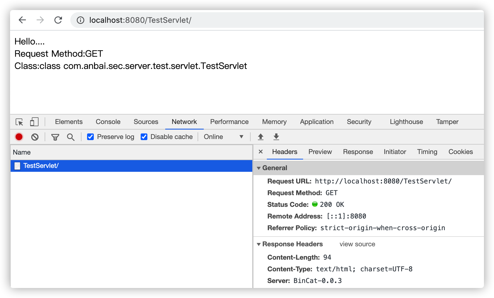
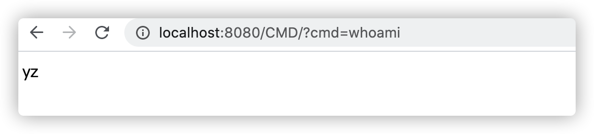
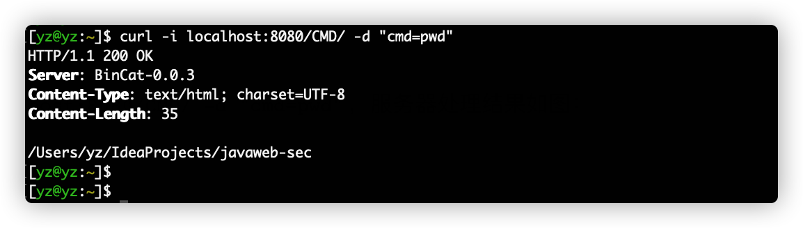
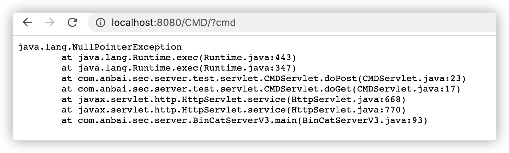

# BinCat V3-实现Servlet3.x API


`V1`和`V2`我们完成了一个简单的文件访问服务和请求参数解析服务，`V3`我们继续添加`Servlet API`，从而理解`Servlet`的工作原理。

添加`Servlet3.x`依赖：

```xml
<dependency>
    <groupId>javax.servlet</groupId>
    <artifactId>javax.servlet-api</artifactId>
    <version>3.0.1</version>
</dependency>
```

创建`com.anbai.sec.server.servlet.BinCatRequest`类并继承`javax.servlet.http.HttpServletRequest`，然后需要实现`HttpServletRequest`接口方法，作为一个非标准的`Servlet容器`我们自然是没必要严格的是实现里面的所有方法，选择几个方法实现一下就行了。

注意：示例以下中省去了解析协议`Servlet`接口的代码，完整代码请参考：`com.anbai.sec.server.servlet`包下的完整实现代码。

## HttpServletRequest实现

**BinCatRequest.java示例代码片段:**

```java
package com.anbai.sec.server.servlet;

import org.javaweb.utils.StringUtils;

import javax.servlet.*;
import javax.servlet.http.*;
import java.io.*;
import java.net.Socket;
import java.net.URLDecoder;
import java.security.Principal;
import java.util.*;
import java.util.concurrent.ConcurrentHashMap;
import java.util.logging.Logger;

/**
 * BinCat 请求解析实现对象，解析Http请求协议和参数
 */
public class BinCatRequest implements HttpServletRequest {

	// 客户端Socket连接对象
	private final Socket clientSocket;

	// Socket输入流对象
	private final InputStream socketInputStream;

	// Http请求头对象
	private Map<String, String> headerMap;

	// Http请求参数对象
	private Map<String, String[]> parameterMap;

	// Http请求attribute对象
	private final Map<String, Object> attributeMap = new ConcurrentHashMap<String, Object>();

	// Http请求Cookie对象
	private Cookie[] cookie;

	// Http请求Cookie对象
	private final Map<String, String> cookieMap = new ConcurrentHashMap<String, String>();

	// Http请求Session对象
	private final Map<String, BinCatSession> sessionMap = new ConcurrentHashMap<String, BinCatSession>();

	// Http请求方法类型
	private String requestMethod;

	// Http请求URL
	private String requestURL;

	// Http请求QueryString
	private String queryString;

	// Http请求协议版本信息
	private String httpVersion;

	// 是否已经解析过Http请求参数，防止多次解析请求参数
	private volatile boolean parsedParameter = false;

	// Http请求内容长度
	private int contentLength;

	// Http请求内容类型
	private String contentType;

	// 存储Session的ID名称
	private static final String SESSION_ID_NAME = "JSESSIONID";

	// Http请求主机名
	private String host;

	// Http请求主机端口
	private int port;

	private static final Logger LOG = Logger.getLogger("info");

	public BinCatRequest(Socket clientSocket) throws IOException {
		this.clientSocket = clientSocket;
		this.socketInputStream = clientSocket.getInputStream();

		// 解析Http协议
		parse();
	}

	/**
	 * 解析Http请求协议，不解析Body部分
	 *
	 * @throws IOException
	 */
	private void parse() throws IOException {
		// 此处省略Http请求协议解析、参数解析等内容...
	}

	/**
	 * 解析Http请求参数
	 *
	 * @throws IOException Http协议解析异常
	 */
	private synchronized void parseParameter() {
		// 此处省略Http请求协议解析、参数解析等内容...
	}

  // 此处省略HttpServletRequest接口中的大部分方法，仅保留几个示例方法...

	public String getHeader(String name) {
		return this.headerMap.get(name);
	}

	public ServletInputStream getInputStream() throws IOException {
		return new ServletInputStream() {
			@Override
			public int read() throws IOException {
				return socketInputStream.read();
			}
		};
	}

	public String getParameter(String name) {
		if (!parsedParameter) {
			this.parseParameter();
		}

		if (parameterMap.containsKey(name)) {
			return this.parameterMap.get(name)[0];
		}

		return null;
	}
  
	public String getRemoteAddr() {
		return clientSocket.getInetAddress().getHostAddress();
	}

	public void setAttribute(String name, Object o) {
		attributeMap.put(name, o);
	}

}
```

## HttpServletResponse实现

**BinCatResponse.java示例代码片段:**

```java
package com.anbai.sec.server.servlet;

import javax.servlet.ServletOutputStream;
import javax.servlet.http.Cookie;
import javax.servlet.http.HttpServletResponse;
import java.io.ByteArrayOutputStream;
import java.io.IOException;
import java.io.PrintWriter;
import java.net.Socket;
import java.net.URLEncoder;
import java.util.*;

public class BinCatResponse implements HttpServletResponse {

	private final Socket socket;

	private final Map<String, String> header;

	private final ByteArrayOutputStream out;

	private int status = 404;

	private String statusMessage = "Not Found";

	private String charset = "UTF-8";

	private int contentLength = 0;

	private String contentType = "text/html; charset=UTF-8";

	private String location;

	public BinCatResponse(Socket socket, Map<String, String> header, ByteArrayOutputStream out) {
		this.socket = socket;
		this.header = header;
		this.out = out;
	}

  // 此处省略HttpServletResponse接口中的大部分方法，仅保留几个示例方法...
  
	public void setHeader(String name, String value) {
		this.header.put(name, value);
	}
  
	public String getHeader(String name) {
		return header.get(name);
	}

	public PrintWriter getWriter() throws IOException {
		return new PrintWriter(out);
	}

}
```

## HttpSession实现

**BinCatSession.java示例代码片段:**

```java
package com.anbai.sec.server.servlet;

import javax.servlet.ServletContext;
import javax.servlet.http.HttpSession;
import javax.servlet.http.HttpSessionContext;
import java.util.Enumeration;
import java.util.Map;
import java.util.concurrent.ConcurrentHashMap;

/**
 * BinCat Session实现
 */
public class BinCatSession implements HttpSession {

	private final String sessionID;

	// Http请求Session对象
	private final Map<String, Object> sessionMap = new ConcurrentHashMap<String, Object>();

	public BinCatSession(String sessionID) {
		this.sessionID = sessionID;
	}

  // 此处省略HttpSession接口中的大部分方法，仅保留几个示例方法...
  
	public Object getAttribute(String name) {
		return this.sessionMap.get(name);
	}

	public void setAttribute(String name, Object value) {
		this.sessionMap.put(name, value);
	}

}
```

## Servlet类注册

`Servlet3.0`支持`web.xml`和注解两种方式配置，但不管是通过那种方式都需要知道`Servlet`的处理类和映射的`URL`地址，这里为了方法理解我将解析`web.xml`和扫描`@WebServlet`注解的步骤省略了，直接改成了手动配置一个Servlet映射类对象。

**注册Servlet类对象代码片段：**

```java
// 初始化Servlet映射类对象
final Set<Class<? extends HttpServlet>> servletList = new HashSet<Class<? extends HttpServlet>>();

// 手动注册Servlet类
servletList.add(TestServlet.class);
servletList.add(CMDServlet.class);
```

当接收到浏览器请求时候我们需要根据请求的URL地址来动态调用Servlet类相关的代码。

**调用Servlet类处理Http请求代码片段：**

```java
// 处理Http请求URL
for (Class<? extends HttpServlet> clazz : servletList) {
    WebServlet webServlet  = clazz.getAnnotation(WebServlet.class);
    String[]   urlPatterns = webServlet.urlPatterns();

    for (String urlPattern : urlPatterns) {
        try {
          // 检测请求的URL地址和Servlet的地址是否匹配
          if (Pattern.compile(urlPattern).matcher(uri).find()) {
              // 修改状态码
              response.setStatus(200, "OK");

              // 创建Servlet类实例
              HttpServlet httpServlet = clazz.newInstance();

              // 调用Servlet请求处理方法
              httpServlet.service(request, response);
              break;
          }
        } catch (IOException e) {
           // 修改状态码
				   response.setStatus(500, "Internal Server Error");
         	 e.printStackTrace();
        }
    }
}
```

## BinCat V3实现

`V3`简单的封装了`BinCatRequest`、`BinCatResponse`、`BinCatSession`，还是先了部分的`Servlet API`从而实现了一个最初级的`Servlet容器`。

**V3处理流程:**

1. 创建服务端`Socket`连接(`ServerSocket`)。
2. 手动注册`Servlet`类。
3. 创建用于处理请求的`BinCatRequest`对象。
4. `BinCatRequest`解析请求协议、请求头、请求参数、`Cookie`等。
5. 创建用于处理请求的`BinCatResponse`对象。
6. 解析`Servlet`类的`@WebServlet`注解，反射调用`Servlet`类方法处理Http请求。
7. 输出响应信息以及`Servlet`处理结果。
8. 关闭`Socket`连接。

**BinCatServerV3实现代码:**

```java
package com.anbai.sec.server;

import com.anbai.sec.server.servlet.BinCatRequest;
import com.anbai.sec.server.servlet.BinCatResponse;
import com.anbai.sec.server.test.servlet.CMDServlet;
import com.anbai.sec.server.test.servlet.TestServlet;
import org.javaweb.utils.StringUtils;

import javax.servlet.annotation.WebServlet;
import javax.servlet.http.HttpServlet;
import java.io.ByteArrayOutputStream;
import java.io.IOException;
import java.io.InputStream;
import java.io.OutputStream;
import java.net.ServerSocket;
import java.net.Socket;
import java.util.HashSet;
import java.util.Map;
import java.util.Set;
import java.util.concurrent.ConcurrentHashMap;
import java.util.logging.Logger;
import java.util.regex.Pattern;

/**
 * ServerSocket Http 服务器示例
 */
public class BinCatServerV3 {

	private static final Logger LOG = Logger.getLogger("info");

	public static void main(String[] args) {
		try {
			// 设置服务监听端口
			int port = 8080;

			// 设置服务名称
			String serverName = "BinCat-0.0.3";

			// 创建ServerSocket，监听本地端口
			ServerSocket ss = new ServerSocket(port);

			// 初始化Servlet映射类对象
			final Set<Class<? extends HttpServlet>> servletList = new HashSet<Class<? extends HttpServlet>>();

			// 手动注册Servlet类
			servletList.add(TestServlet.class);
			servletList.add(CMDServlet.class);

			LOG.info(serverName + " 启动成功，监听端口: " + port);

			while (true) {
				// 等待客户端连接
				Socket socket = ss.accept();

				try {
					// 获取Socket输入流对象
					InputStream in = socket.getInputStream();

					// 获取Socket输出流对象
					OutputStream out = socket.getOutputStream();

					// 创建BinCat请求处理对象
					BinCatRequest request = new BinCatRequest(socket);

					// 创建BinCat请求处理结果输出流
					ByteArrayOutputStream baos = new ByteArrayOutputStream();

					// 创建BinCat请求处理结果Header对象
					Map<String, String> responseHeader = new ConcurrentHashMap<String, String>();

					// 创建BinCat响应处理对象
					BinCatResponse response = new BinCatResponse(socket, responseHeader, baos);

					// 请求URI地址
					String uri = request.getRequestURI();

					// 处理Http请求URL
					for (Class<? extends HttpServlet> clazz : servletList) {
						WebServlet webServlet  = clazz.getAnnotation(WebServlet.class);
						String[]   urlPatterns = webServlet.urlPatterns();

						for (String urlPattern : urlPatterns) {
							try {
								// 检测请求的URL地址和Servlet的地址是否匹配
								if (Pattern.compile(urlPattern).matcher(uri).find()) {
									// 修改状态码
									response.setStatus(200, "OK");

									// 创建Servlet类实例
									HttpServlet httpServlet = clazz.newInstance();

									// 调用Servlet请求处理方法
									httpServlet.service(request, response);
									break;
								}
							} catch (Exception e) {
								// 修改状态码
								response.setStatus(500, "Internal Server Error");
								e.printStackTrace();

								baos.write(("<pre>" + StringUtils.exceptionToString(e) + "</pre>").getBytes());
							}
						}
					}

					// 处理Http响应内容
					out.write(("HTTP/1.1 " + response.getStatus() + " " + response.getMessage() + "\n").getBytes());
					// 输出Web服务器信息
					out.write(("Server: " + serverName + "\n").getBytes());
					// 输出返回的消息类型
					out.write(("Content-Type: " + response.getContentType() + "\n").getBytes());
					// 输出返回字节数
					out.write(("Content-Length: " + baos.size() + "\n").getBytes());

					// 输出用户自定义的Header
					for (String key : responseHeader.keySet()) {
						out.write((key + ": " + responseHeader.get(key) + "\n").getBytes());
					}

					// 写入换行
					out.write("\n".getBytes());
					// 将读取到的数据写入到客户端Socket
					out.write(baos.toByteArray());

					in.close();
					out.close();
				} catch (Exception e) {
					LOG.info("处理客户端请求异常:" + e);
				} finally {
					socket.close();
				}
			}
		} catch (IOException e) {
			e.printStackTrace();
		}
	}

}
```

## Servlet功能测试

为了验证`BinCat`是否真的具备了`Servlet`处理能力，我们写两个测试用例：`TestServlet`和`CMDServlet`。

**TestServlet示例代码：**

```java
package com.anbai.sec.server.test.servlet;

import javax.servlet.annotation.WebServlet;
import javax.servlet.http.HttpServlet;
import javax.servlet.http.HttpServletRequest;
import javax.servlet.http.HttpServletResponse;
import java.io.IOException;
import java.io.OutputStream;

@WebServlet(name = "TestServlet", urlPatterns = "/TestServlet/")
public class TestServlet extends HttpServlet {

   @Override
   public void doGet(HttpServletRequest request, HttpServletResponse response) throws IOException {
      doPost(request, response);
   }

   @Override
   public void doPost(HttpServletRequest request, HttpServletResponse response) throws IOException {
      OutputStream out = response.getOutputStream();
      out.write(("Hello....<br/>Request Method:" + request.getMethod() + "<br/>Class:" + this.getClass()).getBytes());
   }

}
```

浏览器请求[http://localhost:8080/TestServlet/](http://localhost:8080/TestServlet/):



**CMDServlet示例代码：**

```java
package com.anbai.sec.server.test.servlet;

import org.javaweb.utils.IOUtils;

import javax.servlet.annotation.WebServlet;
import javax.servlet.http.HttpServlet;
import javax.servlet.http.HttpServletRequest;
import javax.servlet.http.HttpServletResponse;
import java.io.IOException;
import java.io.OutputStream;

@WebServlet(name = "CMDServlet", urlPatterns = "/CMD/")
public class CMDServlet extends HttpServlet {

   @Override
   public void doGet(HttpServletRequest request, HttpServletResponse response) throws IOException {
      doPost(request, response);
   }

   @Override
   public void doPost(HttpServletRequest request, HttpServletResponse response) throws IOException {
      String cmd   = request.getParameter("cmd");
      byte[] bytes = IOUtils.toByteArray(Runtime.getRuntime().exec(cmd).getInputStream());

      OutputStream out = response.getOutputStream();
      out.write(bytes);
      out.flush();
      out.close();
   }

}
```

浏览器请求[http://localhost:8080/CMD/?cmd=whoami](http://localhost:8080/CMD/?cmd=whoami):



使用`curl`发送POST请求:`curl -i localhost:8080/CMD/ -d "cmd=pwd"`，服务器可以正常接收POST参数，处理结果如图：



**请求一个错误服务：**



至此，我们已经实现了一个非常初级的`Servlet容器`了。