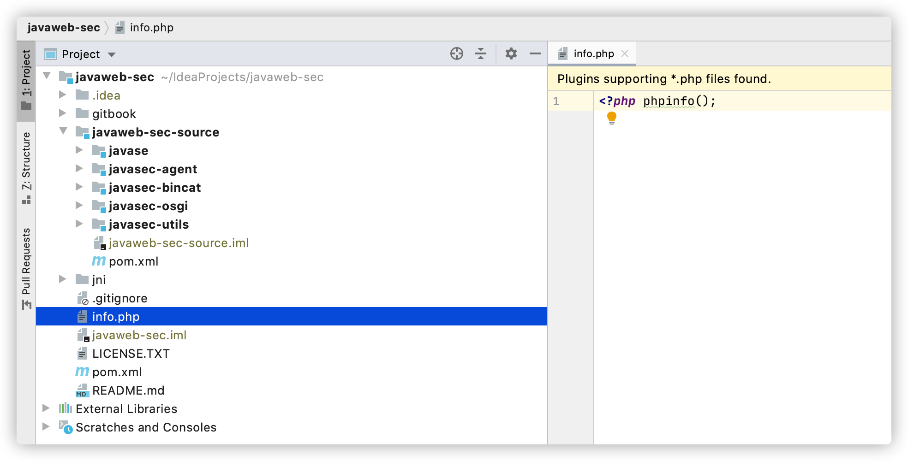
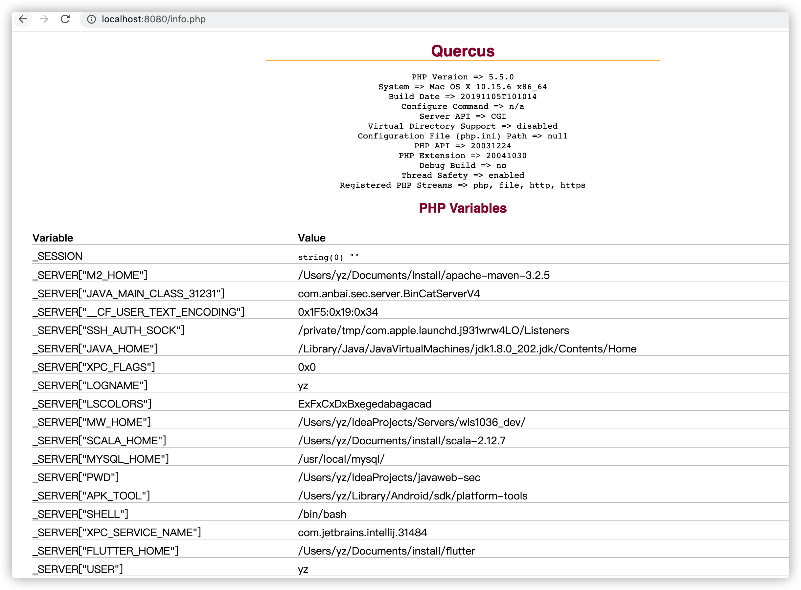
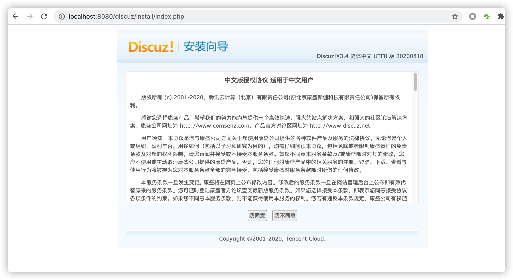

# BinCat V4-实现PHP文件解析

## Quercus-QuercusServlet

`Quercus`是一个`Resin`实现的解析并运行`php`文件的`jar`库，其本质是使用`QuercusServlet`处理所有访问`.php`的文件请求，`Quercus`会将php文件翻译成`java class`文件并在JVM中执行。

添加`Quercus`依赖：

```xml
<dependency>
  <groupId>com.caucho</groupId>
  <artifactId>quercus</artifactId>
  <version>4.0.63</version>
</dependency>
```

然后创建一个`Quercus`的`Servlet`映射，因为`BinCat`只支持注解，所以无法在`QuercusServlet`类上添加`@WebServlet`注解，但是我们可以写一个类去继承`QuercusServlet`从而间接的完成`Servlet`声明。

**QuercusPHPServlet示例：**

```java
package com.anbai.sec.server.test.servlet;

import com.caucho.quercus.servlet.QuercusServlet;

import javax.servlet.annotation.WebServlet;

@WebServlet(name = "QuercusPHPServlet", urlPatterns = ".*\\.php$")
public class QuercusPHPServlet extends QuercusServlet {


}
```

**BinCatConfig示例代码(方便统一的Servlet注册)：**

```java
/**
	* 手动注册Servlet并创建BinCatServletContext对象
  *
	* @param appClassLoader 应用的类加载器
	* @return ServletContext Servlet上下文对象
	*/
public static BinCatServletContext createServletContext(BinCatWebAppClassLoader appClassLoader) throws Exception {
    BinCatServletContext servletContext = new BinCatServletContext(appClassLoader);

    // 手动注册Servlet类
    Class<Servlet>[] servletClass = new Class[]{
      TestServlet.class,
      CMDServlet.class,
      QuercusPHPServlet.class
        };

    for (Class<Servlet> clazz : servletClass) {
      Servlet    servlet    = clazz.newInstance();
      WebServlet webServlet = clazz.getAnnotation(WebServlet.class);

      if (webServlet != null) {
        // 获取WebInitParam配置
        WebInitParam[] webInitParam = webServlet.initParams();

        // 动态创建Servlet对象
        ServletRegistration.Dynamic dynamic = servletContext.addServlet(webServlet.name(), servlet);

        // 动态设置Servlet映射地址
        dynamic.addMapping(webServlet.urlPatterns());

        // 设置Servlet启动参数
        for (WebInitParam initParam : webInitParam) {
          dynamic.setInitParameter(initParam.name(), initParam.value());
        }
      }
    }

    // 创建ServletContext
    return servletContext;
}
```

因为`QuercusServlet`创建时需要必须有`ServletContext`对象，所以我们必须实现`ServletContext`接口。除此之外，`Servlet`创建时还需要调用`Servlet`的初始化方法(`public void init(ServletConfig config) throws ServletException`)。调用`init`的时候还需要实现`ServletConfig`接口。

**初始化Servlet代码片段：**

```java
/**
	* 初始化Servlet
	*
	* @param servletContext Servlet上下文
	* @throws ServletException Servlet处理异常
	*/
public static void initServlet(BinCatServletContext servletContext) throws ServletException {
  Set<BinCatServletRegistrationDynamic> dynamics = servletContext.getRegistrationDynamics();

  for (BinCatServletRegistrationDynamic dynamic : dynamics) {
    Servlet             servlet          = dynamic.getServlet();
    String              servletName      = dynamic.getServletName();
    Map<String, String> initParameterMap = dynamic.getInitParameters();

    servlet.init(new BinCatServletConfig(servletContext, servletName, initParameterMap));
  }
}
```


## BinCatServletContext实现

在`Servlet`容器启动的时候必须创建一个`ServletContext`(`Servlet`上下文)，用于管理容器中的所有`Servlet`对象。在创建`BinCatServletContext`的时候需要创建并初始化所有的`Servlet`并存储到`servletMap`中。

**BinCatServletContext代码片段：**

```java
package com.anbai.sec.server.servlet;

import javax.servlet.*;
import javax.servlet.annotation.WebServlet;
import javax.servlet.descriptor.JspConfigDescriptor;
import java.io.File;
import java.io.InputStream;
import java.net.MalformedURLException;
import java.net.URL;
import java.util.*;
import java.util.concurrent.ConcurrentHashMap;

public class BinCatServletContext implements ServletContext {

	// 创建一个装动态注册的Servlet的Map
	private final Map<String, Servlet> servletMap = new HashMap<>();

	// 创建一个装ServletContext初始化参数的Map
	private final Map<String, String> initParameterMap = new HashMap<>();

	// 创建一个装ServletContext属性对象的Map
	private final Map<String, Object> attributeMap = new HashMap<>();

	// 创建一个装Servlet动态注册的Set
	private final Set<BinCatServletRegistrationDynamic> registrationDynamics = new LinkedHashSet<>();

	// BinCatWebAppClassLoader，Web应用的类加载器
	private final BinCatWebAppClassLoader appClassLoader;

	public BinCatServletContext(BinCatWebAppClassLoader appClassLoader) throws Exception {
		this.appClassLoader = appClassLoader;
	}
  
	// 此处省略ServletContext接口中的大部分方法，仅保留几个示例方法...
  
	@Override
	public Servlet getServlet(String name) throws ServletException {
		return servletMap.get(name);
	}

	@Override
	public Enumeration<Servlet> getServlets() {
		Set<Servlet> servlets = new HashSet<Servlet>();
		servlets.addAll(servletMap.values());

		return Collections.enumeration(servlets);
	}

	@Override
	public Enumeration<String> getServletNames() {
		Set<String> servlets = new HashSet<String>();
		servlets.addAll(servletMap.keySet());

		return Collections.enumeration(servlets);
	}

}
```

## BinCatServletConfig实现

在创建`BinCatServletContext`时我们指定了一个`ServletConfig`实现：`BinCatServletConfig`，`ServletConfig`用于指定`Servlet`启动时的配置信息。

**BinCatServletConfig实现：**

```java
package com.anbai.sec.server.servlet;

import javax.servlet.ServletConfig;
import javax.servlet.ServletContext;
import javax.servlet.annotation.WebInitParam;
import javax.servlet.annotation.WebServlet;
import java.util.Collections;
import java.util.Enumeration;
import java.util.HashSet;
import java.util.Set;

public class BinCatServletConfig implements ServletConfig {

   private final BinCatServletContext servletContext;

   private final WebServlet webServlet;

   private final WebInitParam[] webInitParam;

   public BinCatServletConfig(BinCatServletContext servletContext, WebServlet webServlet) {
      this.servletContext = servletContext;
      this.webServlet = webServlet;
      this.webInitParam = webServlet.initParams();
   }

   @Override
   public String getServletName() {
      return webServlet.name();
   }

   @Override
   public ServletContext getServletContext() {
      return this.servletContext;
   }

   @Override
   public String getInitParameter(String name) {
      for (WebInitParam initParam : webInitParam) {
         String paramName = initParam.name();

         if (paramName.equals(name)) {
            return initParam.value();
         }
      }

      return null;
   }

   @Override
   public Enumeration<String> getInitParameterNames() {
      Set<String> initParamSet = new HashSet<String>();

      for (WebInitParam initParam : webInitParam) {
         initParamSet.add(initParam.name());
      }

      return Collections.enumeration(initParamSet);
   }

}
```

## BinCatDispatcherServlet实现

为了方便后续的`BinCat`版本处理Http请求和响应处理结果，我们简单的封装了`BinCatDispatcherServlet`和`BinCatResponseHandler`对象。`BinCatDispatcherServlet`会根据浏览器请求的不同URL地址去调用对应的`Servlet`服务，除此之外还提供了一个简单的静态资源文件处理逻辑和`PHP`解析功能。

**BinCatDispatcherServlet实现代码：**

```java
package com.anbai.sec.server.handler;

import com.anbai.sec.server.servlet.BinCatRequest;
import com.anbai.sec.server.servlet.BinCatResponse;
import com.anbai.sec.server.servlet.BinCatServletContext;
import com.anbai.sec.server.servlet.BinCatServletRegistrationDynamic;
import org.javaweb.utils.FileUtils;
import org.javaweb.utils.StringUtils;

import java.io.ByteArrayOutputStream;
import java.io.File;
import java.io.IOException;
import java.nio.file.Files;
import java.util.Collection;
import java.util.Set;
import java.util.regex.Pattern;

public class BinCatDispatcherServlet {

	public void doDispatch(BinCatRequest req, BinCatResponse resp, ByteArrayOutputStream out) throws IOException {
		// 请求URI地址
		String uri = req.getRequestURI();

		// 获取ServletContext
		BinCatServletContext servletContext = (BinCatServletContext) req.getServletContext();

		// 获取Http请求的文件
		File requestFile = new File(req.getRealPath(uri));

		// 处理Http请求的静态文件，如果文件存在(.php后缀除外)就直接返回文件内容，不需要调用Servlet
		if (requestFile.exists() && requestFile.isFile() && !uri.endsWith(".php")) {
			// 修改状态码
			resp.setStatus(200, "OK");

			// 解析文件的MimeType
			String mimeType = Files.probeContentType(requestFile.toPath());

			if (mimeType == null) {
				String fileSuffix = FileUtils.getFileSuffix(requestFile.getName());
				resp.setContentType("text/" + fileSuffix);
			} else {
				resp.setContentType(mimeType);
			}

			out.write(Files.readAllBytes(requestFile.toPath()));
		} else {
			// 遍历所有已注册得Servlet，处理Http请求
			Set<BinCatServletRegistrationDynamic> dynamics = servletContext.getRegistrationDynamics();
			for (BinCatServletRegistrationDynamic dynamic : dynamics) {
				Collection<String> urlPatterns = dynamic.getMappings();

				for (String urlPattern : urlPatterns) {
					try {
						// 检测请求的URL地址和Servlet的地址是否匹配
						if (Pattern.compile(urlPattern).matcher(uri).find()) {
							// 修改状态码
							resp.setStatus(200, "OK");

							// 调用Servlet请求处理方法
							dynamic.getServlet().service(req, resp);
							return;
						}
					} catch (Exception e) {
						// 修改状态码,输出服务器异常信息到浏览器
						resp.setStatus(500, "Internal Server Error");
						e.printStackTrace();

						out.write(("<pre>" + StringUtils.exceptionToString(e) + "</pre>").getBytes());
					}
				}
			}
		}
	}

}
```

## BinCatResponseHandler实现

`BinCatResponseHandler`只是一个简单封装的用于向浏览器输出Http处理请求结果的对象。

**BinCatResponseHandler实现代码：**

```java
package com.anbai.sec.server.handler;

import com.anbai.sec.server.servlet.BinCatResponse;

import java.io.ByteArrayOutputStream;
import java.io.IOException;
import java.io.OutputStream;
import java.util.Map;

public class BinCatResponseHandler {

   public void processResult(BinCatResponse response, Map<String, String> responseHeader, String serverName,
                             OutputStream out, ByteArrayOutputStream baos) throws IOException {

      // 处理Http响应内容
      out.write(("HTTP/1.1 " + response.getStatus() + " " + response.getMessage() + "\n").getBytes());
      // 输出Web服务器信息
      out.write(("Server: " + serverName + "\n").getBytes());
      // 输出返回的消息类型
      out.write(("Content-Type: " + response.getContentType() + "\n").getBytes());
      // 输出返回字节数
      out.write(("Content-Length: " + baos.size() + "\n").getBytes());

      // 输出用户自定义的Header
      for (String key : responseHeader.keySet()) {
         out.write((key + ": " + responseHeader.get(key) + "\n").getBytes());
      }

      // 写入换行
      out.write("\n".getBytes());
      // 将读取到的数据写入到客户端Socket
      out.write(baos.toByteArray());
   }

}
```

## BinCat V4实现

`V4`在`V3`的基础上实现了`ServletConfig`、`ServletContext`接口，从而实现了`Servlet`的`实例化`和`初始化`，`BinCatDispatcherServlet`实现的`Servlet`服务调用。

**BinCatServerV4实现代码：**

```java
package com.anbai.sec.server;

import com.anbai.sec.server.config.BinCatConfig;
import com.anbai.sec.server.handler.BinCatDispatcherServlet;
import com.anbai.sec.server.handler.BinCatResponseHandler;
import com.anbai.sec.server.servlet.BinCatRequest;
import com.anbai.sec.server.servlet.BinCatResponse;
import com.anbai.sec.server.servlet.BinCatServletContext;

import java.io.ByteArrayOutputStream;
import java.io.InputStream;
import java.io.OutputStream;
import java.net.ServerSocket;
import java.net.Socket;
import java.util.Map;
import java.util.concurrent.ConcurrentHashMap;
import java.util.logging.Logger;

/**
 * ServerSocket Http 服务器示例
 */
public class BinCatServerV4 {

	// 设置服务监听端口
	private static final int PORT = 8080;

	// 设置服务名称
	private static final String SERVER_NAME = "BinCat-0.0.4";

	private static final Logger LOG = Logger.getLogger("info");

	public static void main(String[] args) {
		try {
			// 创建ServerSocket，监听本地端口
			ServerSocket ss = new ServerSocket(PORT);

			// 创建BinCatServletContext对象
			BinCatServletContext servletContext = BinCatConfig.createServletContext();

			// 初始化Servlet
			BinCatConfig.initServlet(servletContext);

			LOG.info(SERVER_NAME + " 启动成功，监听端口: " + PORT);

			while (true) {
				// 等待客户端连接
				Socket socket = ss.accept();

				try {
					// 获取Socket输入流对象
					InputStream in = socket.getInputStream();

					// 获取Socket输出流对象
					OutputStream out = socket.getOutputStream();

					// 创建BinCat请求处理对象
					BinCatRequest request = new BinCatRequest(socket, servletContext);

					// 创建BinCat请求处理结果输出流
					ByteArrayOutputStream baos = new ByteArrayOutputStream();

					// 创建BinCat请求处理结果Header对象
					Map<String, String> responseHeader = new ConcurrentHashMap<String, String>();

					// 创建BinCat响应处理对象
					BinCatResponse response = new BinCatResponse(socket, responseHeader, baos);

					// 创建BinCatDispatcherServlet对象，用于分发Http请求
					BinCatDispatcherServlet dispatcherServlet = new BinCatDispatcherServlet();

					// 创建BinCatResponseHandler对象，用于处理Http请求结果
					BinCatResponseHandler responseHandler = new BinCatResponseHandler();

					// 使用BinCatDispatcherServlet处理Servlet请求
					dispatcherServlet.doDispatch(request, response, baos);

					// 响应服务器处理结果
					responseHandler.processResult(response, responseHeader, SERVER_NAME, out, baos);

					in.close();
					out.close();
				} catch (Exception e) {
					LOG.info("处理客户端请求异常:" + e);
				} finally {
					socket.close();
				}
			}
		} catch (Exception e) {
			e.printStackTrace();
		}
	}

}
```

## BinCat PHP解析测试

我们需要在`javaweb-sec`项目根目录创建一个测试文件，如`info.php`:

```php
<?php phpinfo();?>
```



启动BinCat V4后访问[http://localhost:8080/info.php](http://localhost:8080/info.php):



复制一个最新版本的`Discuz`到`javaweb-sec`目录，尝试安装`Discuz`，访问：[http://localhost:8080/discuz/install/index.php](http://localhost:8080/discuz/install/index.php)



`Discuz`环境检测正常：


测试`BinCat`的`PHP`解析功能正常，只是开始安装`Discuz`时无法下一步，无异常和错误卡了，无法完成安装。