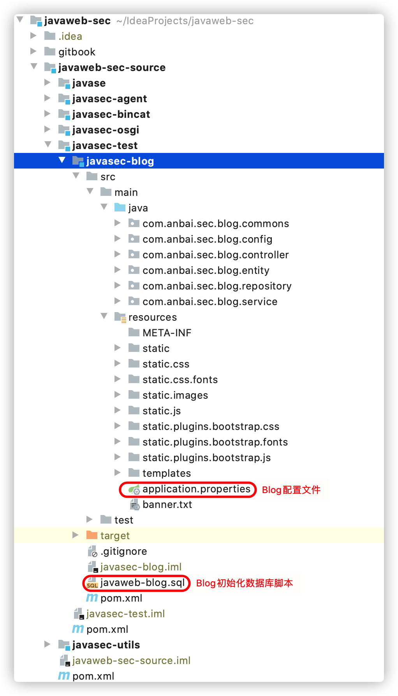
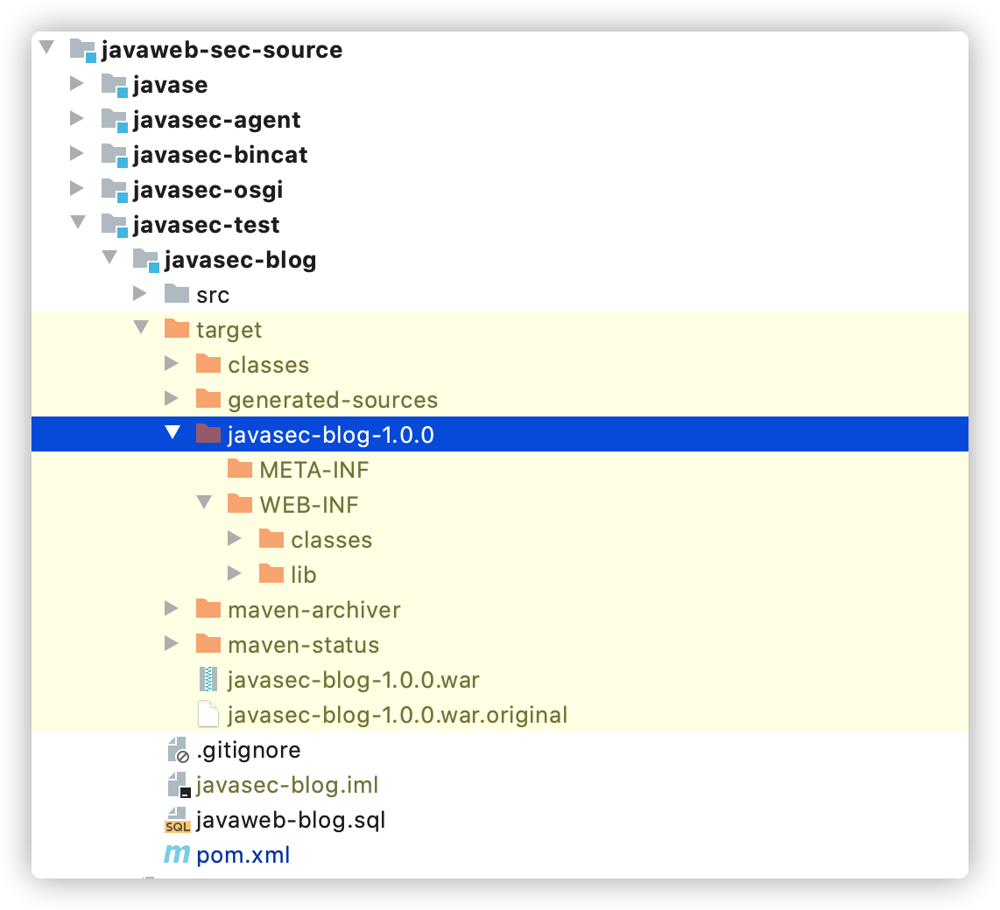
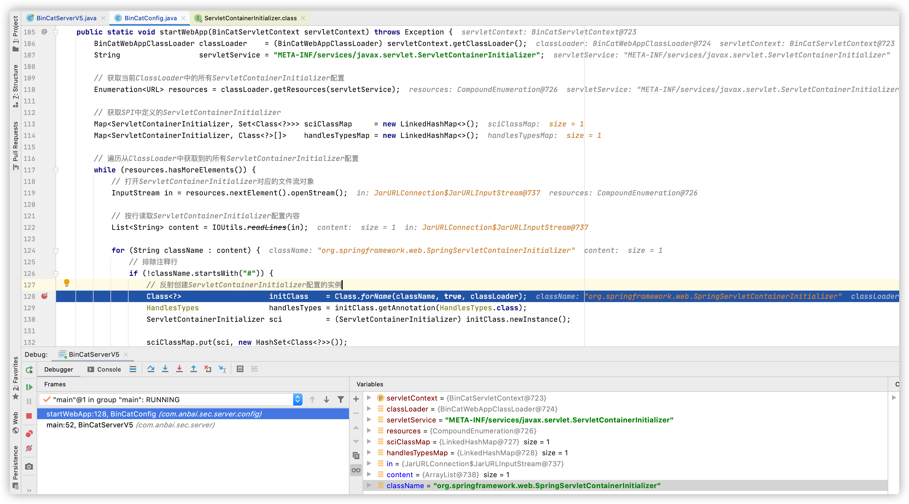
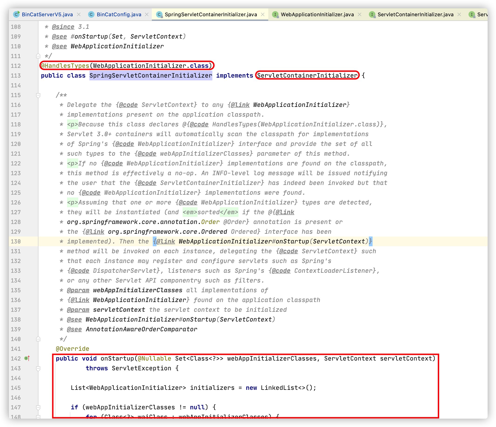
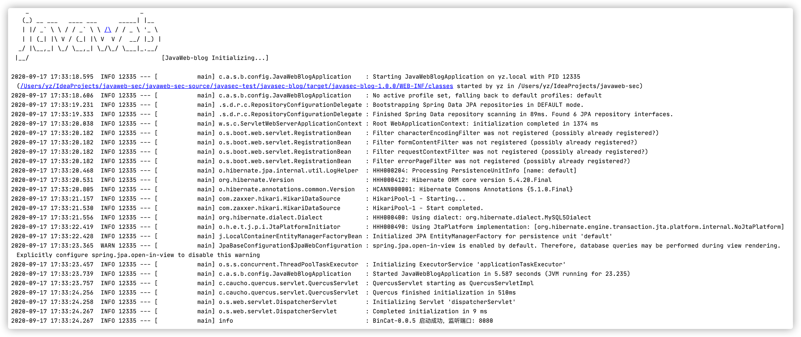
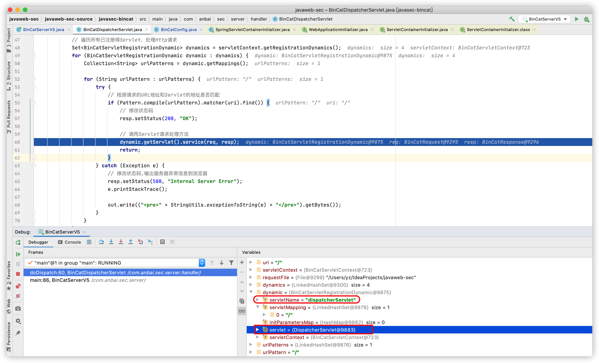
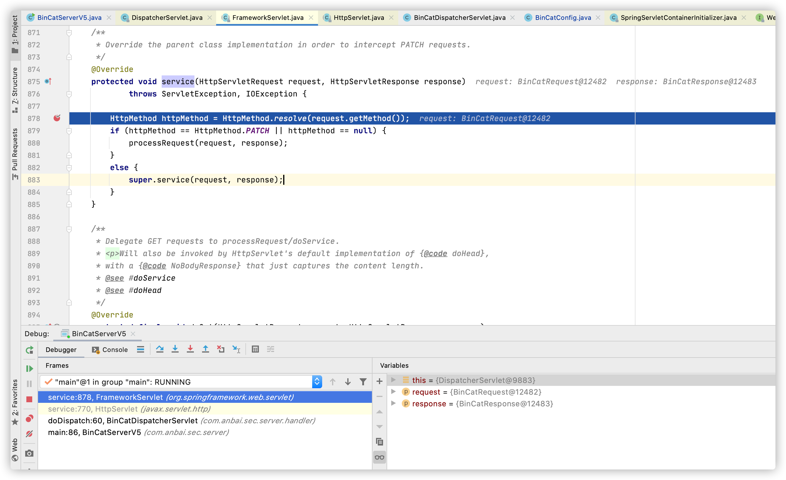
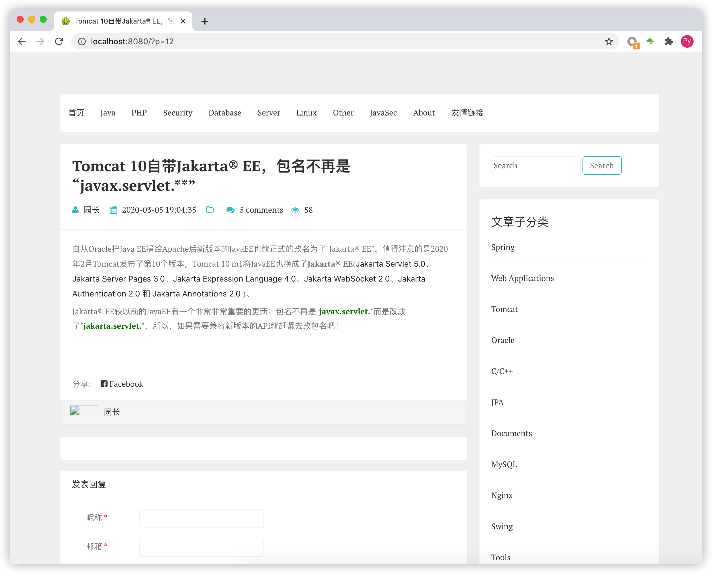

# BinCat V5-支持SpringBoot应用

时至今日(`2020年9月`)，`SpringBoot`因其配置非常简单功能强大，已经成为了绝大部分微服务项目的首选架构，`Servlet 3+`的新特性也为`SpringBoot`的便捷配置提供了非常大的帮助。我们将使用`BinCat V5`启动并运行一个用`SpringBoot`实现的`Blog`应用，从而来学习`Servlet`容器的工作原理。


## 创建基于SpringBoot的javasec-blog项目

首先我们在`javaweb-sec`项目下创建一个`javasec-test`的模块(用于存储`javasec`文章所用到的测试项目)，然后我们在`javasec-test`模块中创建一个`javasec-blog`模块(一个标准的`SpringBoot`项目)，`javasec-blog`项目是一个用于演示的博客项目。



### javasec-blog War项目构建

`SpringBoot`不但支持嵌入式部署也支持传统的`war`包部署方式，但需要注意的是`war`包部署的时候需要做一些特殊的修改。`BinCat`目前只实现了基于`war`部署的方式，所以我们需要将`javasec-blog`打成一个`war`包。

**构建项目的时候可参考如下步骤(1-3步默认已修改，不需要关注)：**

1. 修改`pom.xml`添加`<packaging>war</packaging>`，默认是`jar`。

2. 修改`pom.xml`的`build`、`plugins`标签，添加:

   ```xml
   <plugin>
       <groupId>org.apache.maven.plugins</groupId>
       <artifactId>maven-war-plugin</artifactId>
       <version>${maven-deploy-plugin.version}</version>
       <configuration>
           <failOnMissingWebXml>false</failOnMissingWebXml>
       </configuration>
   </plugin>
   ```

3. 修改`SpringBoot`启动类代码，示例中是：`JavaWebBlogApplication`。继承`org.springframework.boot.web.servlet.support.SpringBootServletInitializer`，然后重写`configure`方法。如下：

   ```java
   package com.anbai.sec.blog.config;
   
   import org.springframework.boot.SpringApplication;
   import org.springframework.boot.autoconfigure.SpringBootApplication;
   import org.springframework.boot.builder.SpringApplicationBuilder;
   import org.springframework.boot.web.servlet.support.SpringBootServletInitializer;
   
   /**
    * @author yz
    */
   @SpringBootApplication(scanBasePackages = "com.anbai.sec.blog.*")
   public class JavaWebBlogApplication extends SpringBootServletInitializer {
   
      public static void main(String[] args) {
         SpringApplication.run(JavaWebBlogApplication.class, args);
      }
   
      @Override
      protected SpringApplicationBuilder configure(SpringApplicationBuilder builder) {
         return builder.sources(JavaWebBlogApplication.class);
      }
   
   }
   ```

4. 修改`javaweb-sec-source/javasec-test/javasec-blog/src/main/resources/application.properties`配置文件中的数据库信息。

5. 新建`Mysql`数据库`javaweb-blog`，并导入`javaweb-sec-source/javasec-test/javaweb-blog.sql`。

6. 使用`maven`命令构建整个`javaweb-sec`项目(第二次构建的时候可以单独build blog项目)，在`javaweb-sec`根目录执行：`mvn clean install`。

   

项目构建成功后结构如下：



## BinCat V5实现

因为`V5`要实现正常的运行一个`SpringBoot`项目，所以我们需要写一个支持单应用的`Servlet`容器，而且还需要实现之前版本未实现的其他`Servlet`接口。

### BinCatWebAppClassLoader实现

为了实现加载Web应用的资源和类文件，我们需要实现一个类简单的加载器，用于加载`WEB-INF`目录下的`classes`和`libs`中的所有文件。

**BinCatWebAppClassLoader代码：**

```java
package com.anbai.sec.server.loader;

import java.net.URL;
import java.net.URLClassLoader;

public class BinCatWebAppClassLoader extends URLClassLoader {

	public BinCatWebAppClassLoader(URL[] urls, ClassLoader parent) {
		super(urls, parent);
	}

}
```

为了统一加载Web应用的资源文件，我们还需要将`BinCatWebAppClassLoader`的类示例设置为当前线程的类加载器，如下：

```java
// 定义需要加载的Web应用路径，默认配置的路径必须先使用maven编译:javasec-blog项目
String webAppFile = System.getProperty("user.dir") + 
  "/javaweb-sec-source/javasec-test/javasec-blog/target/javasec-blog-1.0.0/";

// 创建BinCatWebAppClassLoader，加载Web应用
BinCatWebAppClassLoader appClassLoader = BinCatConfig.createAppClassLoader(webAppFile);

// 设置当前线程的上下文类加载器
Thread.currentThread().setContextClassLoader(appClassLoader);
```

这样一来在整个`Web应用`(示例中指的是`javasec-blog`项目)默认将会使用`BinCatWebAppClassLoader`来实现资源文件和类文件的加载了。

### BinCatWebAppClassLoader初始化

`BinCatWebAppClassLoader`在初始化的时候需要加载所有应用的`WEB-INF`目录的类和资源文件，但由于`V5`版本我们只想实现单应用的部署，所以我们只需要加载我们预设好的`Web应用`目录就好了。在初始化`BinCatWebAppClassLoader`的时候将`WEB-INF/classes`目录和`WEB-INF/libs`目录下的所有`jar文件`都添加到`BinCatWebAppClassLoader`当中。

**BinCatWebAppClassLoader创建并加载Web应用资源代码：**

```java
public static BinCatWebAppClassLoader createAppClassLoader(String webAppFile) throws IOException {
   File     webRoot      = new File(webAppFile);
   File     webInfoDir   = new File(webRoot, "WEB-INF");
   File     libDir       = new File(webInfoDir, "lib");
   File     classesDir   = new File(webInfoDir, "classes");
   Set<URL> classPathURL = new HashSet<>();

   File[] libs = libDir.listFiles(new FilenameFilter() {
      @Override
      public boolean accept(File dir, String name) {
         return name.endsWith(".jar");
      }
   });

   // 加载lib目录下所有的jar文件
   for (File lib : libs) {
      classPathURL.add(lib.toURL());
   }

   // 加载classes目录的所有资源文件
   classPathURL.add(classesDir.toURL());

   // 创建Web应用的类加载器
   return new BinCatWebAppClassLoader(
         classPathURL.toArray(new URL[classPathURL.size()]), BinCatConfig.class.getClassLoader()
   );
}
```

### BinCatServletContext实现

在`V4`版本中我们虽然已经实现了一个`BinCatServletContext`，但是我们并没有实现`Servlet`的动态注册功能，而且`V4`实现的`Servlet`注册和初始化过程都是静态的，我们需要将整个过程升级为动态的。

1. 为了能够在`BinCatServletContext`中获取到我们自定义的`Web应用`的类加载器，我们需要在创建`BinCatServletContext`的时候将将其缓存到类对象中。
2. 创建一个`Map<String, Servlet> servletMap`和`Set<BinCatServletRegistrationDynamic> registrationDynamics`对象用于缓存动态注册的`Servlet`。
3. 创建一个`Map<String, String> initParameterMap`对象用于记录`ServletContext`初始化参数。
4. 创建一个`Map<String, Object> attributeMap`，用于记录`ServletContext`中的属性对象(`attribute`)。

**BinCatServletContext代码：**

```java
package com.anbai.sec.server.servlet;

import com.anbai.sec.server.loader.BinCatWebAppClassLoader;

import javax.servlet.*;
import javax.servlet.descriptor.JspConfigDescriptor;
import java.io.File;
import java.io.InputStream;
import java.net.MalformedURLException;
import java.net.URL;
import java.util.*;

public class BinCatServletContext implements ServletContext {

	// 创建一个装动态注册的Servlet的Map
	private final Map<String, Servlet> servletMap = new HashMap<>();

	// 创建一个装ServletContext初始化参数的Map
	private final Map<String, String> initParameterMap = new HashMap<>();

	// 创建一个装ServletContext属性对象的Map
	private final Map<String, Object> attributeMap = new HashMap<>();

	// 创建一个装Servlet动态注册的Set
	private final Set<BinCatServletRegistrationDynamic> registrationDynamics = new LinkedHashSet<>();

	// BinCatWebAppClassLoader，Web应用的类加载器
	private final BinCatWebAppClassLoader appClassLoader;
  
  // 此处省略ServletContext接口中的大部分方法，仅保留几个实现了的示例方法...

	public BinCatServletContext(BinCatWebAppClassLoader appClassLoader) throws Exception {
		this.appClassLoader = appClassLoader;
	}

	@Override
	public Servlet getServlet(String name) throws ServletException {
		return servletMap.get(name);
	}

	@Override
	public Enumeration<Servlet> getServlets() {
		Set<Servlet> servlets = new HashSet<Servlet>(servletMap.values());
		return Collections.enumeration(servlets);
	}

	@Override
	public Enumeration<String> getServletNames() {
		Set<String> servlets = new HashSet<String>(servletMap.keySet());
		return Collections.enumeration(servlets);
	}

	@Override
	public String getRealPath(String path) {
		return new File(System.getProperty("user.dir"), path).getAbsolutePath();
	}

	public Map<String, String> getInitParameterMap() {
		return initParameterMap;
	}

	@Override
	public String getInitParameter(String name) {
		return initParameterMap.get(name);
	}

	@Override
	public Enumeration<String> getInitParameterNames() {
		return Collections.enumeration(initParameterMap.keySet());
	}

	@Override
	public boolean setInitParameter(String name, String value) {
		if (!initParameterMap.containsKey(name)) {
			initParameterMap.put(name, value);

			return true;
		}

		return false;
	}

	@Override
	public Object getAttribute(String name) {
		return attributeMap.get(name);
	}

	@Override
	public Enumeration<String> getAttributeNames() {
		return Collections.enumeration(attributeMap.keySet());
	}

	@Override
	public void setAttribute(String name, Object object) {
		attributeMap.put(name, object);
	}

	@Override
	public void removeAttribute(String name) {
		attributeMap.remove(name);
	}

	@Override
	public ServletRegistration.Dynamic addServlet(String servletName, Servlet servlet) {
		servletMap.put(servletName, servlet);

		BinCatServletRegistrationDynamic dynamic = new BinCatServletRegistrationDynamic(servletName, servlet, this);
		registrationDynamics.add(dynamic);

		return dynamic;
	}

	@Override
	public ClassLoader getClassLoader() {
		return this.appClassLoader;
	}

	public Map<String, Servlet> getServletMap() {
		return servletMap;
	}

	public Set<BinCatServletRegistrationDynamic> getRegistrationDynamics() {
		return registrationDynamics;
	}

}
```

### BinCatServletContext初始化

在初始化`BinCatServletContext`时我们通过手动注册`Servlet`的方式初始化了几个容器内置的`Servlet`，并通过扫描初始化`Servlet`类注解的方式将`Servlet`在`BinCatServletContext`中注册。

**BinCatServletContext初始化代码：**

```java
/**
    * 手动注册Servlet并创建BinCatServletContext对象
    *
    * @param appClassLoader 应用的类加载器
    * @return ServletContext Servlet上下文对象
    */
   public static BinCatServletContext createServletContext(BinCatWebAppClassLoader appClassLoader) throws Exception {
      BinCatServletContext servletContext = new BinCatServletContext(appClassLoader);

      // 手动注册Servlet类
      Class<Servlet>[] servletClass = new Class[]{
            TestServlet.class,
            CMDServlet.class,
            QuercusPHPServlet.class
      };

      for (Class<Servlet> clazz : servletClass) {
         Servlet    servlet    = clazz.newInstance();
         WebServlet webServlet = clazz.getAnnotation(WebServlet.class);

         if (webServlet != null) {
            // 获取WebInitParam配置
            WebInitParam[] webInitParam = webServlet.initParams();

            // 动态创建Servlet对象
            ServletRegistration.Dynamic dynamic = servletContext.addServlet(webServlet.name(), servlet);

            // 动态设置Servlet映射地址
            dynamic.addMapping(webServlet.urlPatterns());

            // 设置Servlet启动参数
            for (WebInitParam initParam : webInitParam) {
               dynamic.setInitParameter(initParam.name(), initParam.value());
            }
         }
      }

      // 创建ServletContext
      return servletContext;
   }
```

### BinCatServletRegistrationDynamic实现

`BinCatServletContext`中核心的是`addServlet`方法的动态注册`Servlet`，如下：

```java
@Override
public ServletRegistration.Dynamic addServlet(String servletName, Servlet servlet) {
  servletMap.put(servletName, servlet);

  BinCatServletRegistrationDynamic dynamic = new BinCatServletRegistrationDynamic(servletName, servlet, this);
  registrationDynamics.add(dynamic);

  return dynamic;
}
```

当`Web应用`调用`addServlet`注册一个`Servlet`对象时会返回一个`ServletRegistration.Dynamic`对象，通过这个`Dynamic`对象可以设置`Servlet`的映射信息和初始化信息。但因为`ServletRegistration.Dynamic`是一个接口，所以我们必须实现此接口的所有方法。

**BinCatServletRegistrationDynamic代码：**

```java
package com.anbai.sec.server.servlet;

import javax.servlet.MultipartConfigElement;
import javax.servlet.Servlet;
import javax.servlet.ServletRegistration;
import javax.servlet.ServletSecurityElement;
import java.util.*;

public class BinCatServletRegistrationDynamic implements ServletRegistration.Dynamic {

	private final String servletName;

	private final Set<String> servletMapping = new LinkedHashSet<>();

	private final Map<String, String> initParametersMap = new HashMap<>();

	private final Servlet servlet;

	private final BinCatServletContext servletContext;

	public BinCatServletRegistrationDynamic(String servletName, Servlet servlet, BinCatServletContext servletContext) {
		this.servletName = servletName;
		this.servlet = servlet;
		this.servletContext = servletContext;
	}

	@Override
	public void setLoadOnStartup(int loadOnStartup) {

	}

	@Override
	public Set<String> setServletSecurity(ServletSecurityElement constraint) {
		return null;
	}

	@Override
	public void setMultipartConfig(MultipartConfigElement multipartConfig) {

	}

	@Override
	public void setRunAsRole(String roleName) {

	}

	@Override
	public void setAsyncSupported(boolean isAsyncSupported) {

	}

	@Override
	public Set<String> addMapping(String... urlPatterns) {
		Collections.addAll(servletMapping, urlPatterns);

		return servletMapping;
	}

	@Override
	public Collection<String> getMappings() {
		return servletMapping;
	}

	@Override
	public String getRunAsRole() {
		return null;
	}

	@Override
	public String getName() {
		return servletName;
	}

	@Override
	public String getClassName() {
		return servlet.getClass().getName();
	}

	@Override
	public boolean setInitParameter(String name, String value) {
		if (!initParametersMap.containsKey(name)) {
			initParametersMap.put(name, value);

			return true;
		}

		return false;
	}

	@Override
	public String getInitParameter(String name) {
		return initParametersMap.get(name);
	}

	@Override
	public Set<String> setInitParameters(Map<String, String> initParameters) {
		initParametersMap.putAll(initParameters);

		return initParametersMap.keySet();
	}

	@Override
	public Map<String, String> getInitParameters() {
		return initParametersMap;
	}

	public Servlet getServlet() {
		return servlet;
	}

	public String getServletName() {
		return servletName;
	}

}
```

### 实现Web应用的启动

在启动我们的示例应用之前我们已经创建了一个`BinCatWebAppClassLoader`和`BinCatServletContext`，其中`BinCatWebAppClassLoader`已经加载了`javasec-blog`项目的`WEB-INF`信息、`BinCatServletContext`也初始化了几个`BinCat`内置的`Servlet`。万事俱备，我们现在只欠如何启动`Servlet`容器了。

从`Servlet3.0`开始，`Servlet`除了可以从`web.xml`启动，还可以通过`SPI`机制动态获取`ServletContainerInitializer(简称SCI)`并通过`SCI`启动`Servlet容器`。因为`V5`并未打算实现传统的`web.xml`启动方式，而是只想实现`SCI`启动方式(这也是`SpringBoot`以`war包`部署的启动方式)。

`ServletContainerInitializer`是一个接口类，仅定义了一个叫`onStartup`的方法，所有实现了该接口的类只要重写`onStartup`方法将可以实现`Servlet容器`的启动。

**ServletContainerInitializer代码：**

```java
package javax.servlet;

import java.util.Set;

/**
 * Interface which allows a library/runtime to be notified of a web
 * application's startup phase and perform any required programmatic
 * registration of servlets, filters, and listeners in response to it.
 *
 * <p>Implementations of this interface may be annotated with
 * {@link javax.servlet.annotation.HandlesTypes HandlesTypes}, in order to
 * receive (at their {@link #onStartup} method) the Set of application
 * classes that implement, extend, or have been annotated with the class
 * types specified by the annotation.
 * 
 * <p>If an implementation of this interface does not use <tt>HandlesTypes</tt>
 * annotation, or none of the application classes match the ones specified
 * by the annotation, the container must pass a <tt>null</tt> Set of classes
 * to {@link #onStartup}.
 *
 * <p>When examining the classes of an application to see if they match
 * any of the criteria specified by the <tt>HandlesTypes</tt> annontation
 * of a <tt>ServletContainerInitializer</tt>, the container may run into
 * classloading problems if any of the application's optional JAR
 * files are missing. Because the container is not in a position to decide
 * whether these types of classloading failures will prevent
 * the application from working correctly, it must ignore them,
 * while at the same time providing a configuration option that would
 * log them. 
 *
 * <p>Implementations of this interface must be declared by a JAR file
 * resource located inside the <tt>META-INF/services</tt> directory and
 * named for the fully qualified class name of this interface, and will be 
 * discovered using the runtime's service provider lookup mechanism
 * or a container specific mechanism that is semantically equivalent to
 * it. In either case, <tt>ServletContainerInitializer</tt> services from web
 * fragment JAR files excluded from an absolute ordering must be ignored,
 * and the order in which these services are discovered must follow the
 * application's classloading delegation model.
 *
 * @see javax.servlet.annotation.HandlesTypes
 *
 * @since Servlet 3.0
 */
public interface ServletContainerInitializer {

    /**
     * Notifies this <tt>ServletContainerInitializer</tt> of the startup
     * of the application represented by the given <tt>ServletContext</tt>.
     *
     * <p>If this <tt>ServletContainerInitializer</tt> is bundled in a JAR
     * file inside the <tt>WEB-INF/lib</tt> directory of an application,
     * its <tt>onStartup</tt> method will be invoked only once during the
     * startup of the bundling application. If this
     * <tt>ServletContainerInitializer</tt> is bundled inside a JAR file
     * outside of any <tt>WEB-INF/lib</tt> directory, but still
     * discoverable as described above, its <tt>onStartup</tt> method
     * will be invoked every time an application is started.
     *
     * @param c the Set of application classes that extend, implement, or
     * have been annotated with the class types specified by the 
     * {@link javax.servlet.annotation.HandlesTypes HandlesTypes} annotation,
     * or <tt>null</tt> if there are no matches, or this
     * <tt>ServletContainerInitializer</tt> has not been annotated with
     * <tt>HandlesTypes</tt>
     *
     * @param ctx the <tt>ServletContext</tt> of the web application that
     * is being started and in which the classes contained in <tt>c</tt>
     * were found
     *
     * @throws ServletException if an error has occurred
     */
    public void onStartup(Set<Class<?>> c, ServletContext ctx)
        throws ServletException; 
}
```

因为`BinCatWebAppClassLoader`已经加载了示例项目的所有资源文件，所以我们可以使用`BinCatWebAppClassLoader`来获取到示例项目中的所有路径为：`META-INF/services/javax.servlet.ServletContainerInitializer`的资源文件。

```java
BinCatWebAppClassLoader classLoader    = (BinCatWebAppClassLoader) servletContext.getClassLoader();
String                  servletService = "META-INF/services/javax.servlet.ServletContainerInitializer";

// 获取当前ClassLoader中的所有ServletContainerInitializer配置
Enumeration<URL> resources = classLoader.getResources(servletService);
```

`SCI`资源文件中配置的是实现了`SCI`接口的`Java类`，一个`SCI`资源文件可能会配置多个实现类(多个类以换行分割)。读取到`SCI`资源文件后我们将可以使用反射的方式去加载资源文件中配置的`Java类`了。

**读取SCI配置并加载SCI实现类示例：**




上图示例中可以看到我们通过读取`BinCatWebAppClassLoader`中的`SCI`资源时获取到了一个类名为：`org.springframework.web.SpringServletContainerInitializer`的类。`SpringServletContainerInitializer`实现了`ServletContainerInitializer`，所以想要启动示例的`SpringBoot`项目仅需要调用该类的`onStartup`方法将可以了。`onStartup`方法需要两个参数：`Set<Class<?>> c`和`ServletContext ctx`，即可`SCI启动类对象集合`和`Servlet上下文`。因为`ServletContext`我们可以轻易的获取到，所以我们重点是如何获取到`SCI启动类对象集合`了。

通过阅读源码不难发现，在实现了`SCI`的接口类类名上会有一个叫做`@HandlesTypes`的注解，读取到这个注解的值将可以找到处理`SCI启动类对象集合`的类对象，然后反向去找该类对象的实现类将可以找到所有需要被`SCI`启动的类数组了。

**SpringServletContainerInitializer示例：**



创建`SCI`实现类示例和获取该示例的`HandlesTypes`配置方式如下：

```java
Class<?>	initClass    					= Class.forName(className, true, classLoader);
HandlesTypes	handlesTypes 			= initClass.getAnnotation(HandlesTypes.class);
ServletContainerInitializer sci = (ServletContainerInitializer) initClass.newInstance();

sciClassMap.put(sci, new HashSet<Class<?>>());

if (handlesTypes != null) {
  Class[] handlesClass = handlesTypes.value();

  handlesTypesMap.put(sci, handlesClass);
}
```

获取到`@HandlesTypes`配置的类名后剩下的就是如何在示例项目中的所有类中找出`@HandlesTypes`配置的类实例了，如上图中`SpringServletContainerInitializer`配置的`@HandlesTypes`是`WebApplicationInitializer`，那么我们现在就必须通过扫包和类文件的方式找出所有`WebApplicationInitializer`的子类，然后再通过上一步创建出来的`SCI`实例调用`onStartup`方法完成`Servlet`容器启动。

为了扫描当前类加载所有的类对象，我们需要先获取出当前类加载加载的所有的类名称，然后再依次扫描这些类是否是`@HandlesTypes`中配置的类(如：`WebApplicationInitializer`)的子类。

**获取BinCatWebAppClassLoader加载的所有的类名代码：**

```java
/**
 * 获取BinCatWebAppClassLoader类加载器加载的所有class类名
 *
 * @param classLoader     类加载器
 * @param sciClassMap     SCI类对象
 * @param handlesTypesMap SCI类对象配置的HandlesTypes对象映射Map
 * @return
 * @throws Exception
 */
private static void findInitializerClass(
  BinCatWebAppClassLoader classLoader,
  Map<ServletContainerInitializer, Set<Class<?>>> sciClassMap,
  Map<ServletContainerInitializer, Class<?>[]> handlesTypesMap) throws Exception {

  // 创建一个存储所有被BinCatWebAppClassLoader加载的类名称对象
  Set<String> classList = new HashSet<>();

  // 获取BinCatWebAppClassLoader加载的所有URL地址
  URL[] urls = classLoader.getURLs();

  for (URL url : urls) {
    File file = new File(url.toURI());

    // 遍历所有的jar文件
    if (file.isFile() && file.getName().endsWith(".jar")) {
      JarFile               jarFile  = new JarFile(file);
      Enumeration<JarEntry> jarEntry = jarFile.entries();

      while (jarEntry.hasMoreElements()) {
        JarEntry entry    = jarEntry.nextElement();
        String   fileName = entry.getName();

        // 遍历jar文件中的所有class文件，并转换成java类名格式，如com/anbai/Test.class会转换成com.anbai.Test
        if (fileName.endsWith(".class")) {
          String className = fileName.replace(".class", "").replace("/", ".");
          classList.add(className);
        }
      }
    } else if (file.isDirectory()) {
      // 遍历所有classes目录下的.class文件，并转换成java类名格式
      Collection<File> files = FileUtils.listFiles(file, new String[]{"class"}, true);

      for (File classFile : files) {
        String className = classFile.toString().substring(file.toString().length())
          .replace(".class", "").replaceAll("^/", "").replace("/", ".");

        classList.add(className);
      }
    }
  }

  // 通过ASM方式获取所有Java类的继承关系，并判断是否是HandlesTypes配置中的类的子类
  for (String className : classList) {
    // 通过ASM的方式获取当前类的所有父类(包括继承和实现的所有类)
    Set<String> superClassList = ClassUtils.getSuperClassListByAsm(className, classLoader);

    // 遍历所有HandlesTypes配置
    for (ServletContainerInitializer sci : handlesTypesMap.keySet()) {
      // 获取HandlesTypes配置的类数组对象
      Class[] handlesTypesClass = handlesTypesMap.get(sci);

      // 遍历所有HandlesTypes配置的类数组对象
      for (Class typesClass : handlesTypesClass) {
        // 获取HandlesTypes配置的类名称
        String typeClassName = typesClass.getName();

        // 检测当前Java类是否是HandlesTypes配置的类的子类，如果是就记录下来
        if (superClassList.contains(typeClassName) && !className.equals(typeClassName)) {
          // 获取SCI启动类对象集合
          Set<Class<?>> sciClass = sciClassMap.get(sci);

          // 反射加载当前类对象
          Class clazz = classLoader.loadClass(className);

          // 将找到的SCI启动类添加到集合中
          sciClass.add(clazz);
        }
      }
    }
  }
}
```

整个扫包过程会比较缓慢，因为一次性扫描了1万多个类，并且还是用`ASM`解析了这1万多个类的继承关系。最终我们将会得出一个`Map<ServletContainerInitializer, Set<Class<?>>> sciClassMap`对象，我们通过遍历这个`sciClassMap`并依次调用`onStartup`方法即可实现`Servlet容器`的启动。

**启动所有SCI代码：**

```java
for (ServletContainerInitializer initializer : sciClassMap.keySet()) {
  Set<Class<?>> initClassSet = sciClassMap.get(initializer);

  // 调用Servlet容器初始化的onStartup方法，启动容器
  initializer.onStartup(initClassSet, servletContext);
}
```

`initializer.onStartup(initClassSet, servletContext);`因为传入了`ServletContext`，所以`initializer`很有可能会通过`ServletContext`动态注册一些`Filter`、`Servlet`、`Listener`，而这些`Filter`、`Servlet`、`Listener`和我们`BinCat`的内置的`Servlet`都处于未初始化的状态，这个时候我们就必须要做一些初始化工作(`V5`版本只支持`Servlet`，并不支持`Filter`和`Listener`)了。

**初始化ServletContext中的所有Servlet代码：**

```java
initServlet(servletContext);
```

完成以上所有逻辑后我们的`BinCat`也就算启动成功了，剩下的就是如何处理浏览器请求了。



### Servlet请求处理

`V5`依旧是根据浏览器请求的URL地址调用对应的`Servlet`的`service`方法处理`Servlet`请求，访问`javasec-blog`首页测试：[http://localhost:8080/](http://localhost:8080/)


请求的`/`最终会调用`SpringMVC`的`org.springframework.web.servlet.DispatcherServlet`类处理请求，如下：



`dynamic.getServlet().service(req, resp)`最终会调用`Spring`的`DispatcherServlet`类的父类`org.springframework.web.servlet.FrameworkServlet`的`service`方法，如下：




访问文章详情页测试：[http://localhost:8080/?p=12](http://localhost:8080/?p=12)



至此，耗时大约一周时间，我们的`BinCat`从支持解析简单的`HelloWorld`到如今已经实现了启动单`Web应用`的`SpringBoot`了，当然这里面充斥这各种各样的Bug和安全问题，我们的目标并不是实现一个`国产化Java中间件`，而是将`BinCat`变成一个存在各种各样漏洞的靶场。