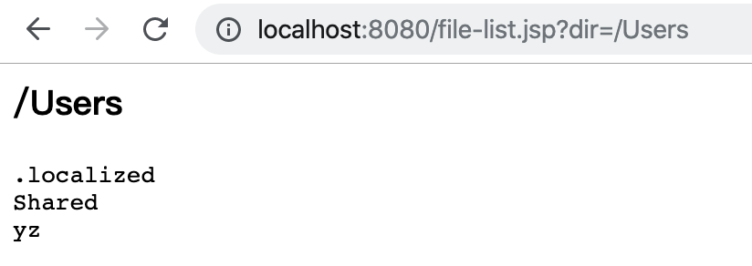
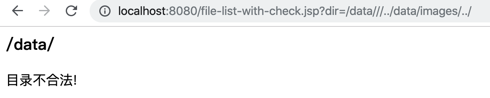

# Java 任意目录遍历漏洞

任意目录遍历漏洞顾名思义攻击者可以通过漏洞遍历出服务器操作系统中的任意目录文件名，从而导致服务器敏感信息泄漏，某些场景下甚至可能会导致服务器被非法入侵。

**Java 任意目录遍历漏洞示例代码:**

```java
<%@ page import="java.io.File" %><%--
  Created by IntelliJ IDEA.
  User: yz
  Date: 2019/12/4
  Time: 6:08 下午
  To change this template use File | Settings | File Templates.
--%>
<%@ page contentType="text/html;charset=UTF-8" language="java" %>
<%
    // 定义需要遍历的目录
    String dirStr = request.getParameter("dir");

    out.println("<h3>" + dirStr + "</h3>");

    if (dirStr != null) {
        File   dir  = new File(dirStr);
        File[] dirs = dir.listFiles();

        out.println("<pre>");

        for (File file : dirs) {
            out.println(file.getName());
        }

        out.println("</pre>");
    }

%>
```

当我们通过不断修改URL中的dir参数即可遍历出制定目录的任意文件，漏洞演示URL:http://localhost:8080/file-list.jsp?dir=/Users



这个漏洞可能由Web应用本身的开发不规范导致，也有可能是因为`MVC框架`、`项目依赖的第三方库`、`Web服务器自身`导致的。如果是由于自身开发不规范导致的那么需要程序严格控制用户传入目录参数是否合法！

**检测用户参数合法性代码示例(请根据具体业务需求调整判定逻辑):**

```java
<%@ page import="java.io.File" %><%--
  Created by IntelliJ IDEA.
  User: yz
  Date: 2019/12/4
  Time: 6:08 下午
  To change this template use File | Settings | File Templates.
--%>
<%@ page contentType="text/html;charset=UTF-8" language="java" %>
<%!
    // 定义限制用户遍历的文件目录常量
    private static final String IMAGE_DIR = "/data/images/";
%>
<%
    // 定义需要遍历的目录
    String dirStr = request.getParameter("dir");

    if (dirStr != null) {
        File dir = new File(dirStr);

        // 获取文件绝对路径，转换成标准的文件路径
        String fileDir = (dir.getAbsoluteFile().getCanonicalFile() + "/").replace("\\\\", "").replaceAll("/+", "/");
        out.println("<h3>" + fileDir + "</h3>");

        // 检查当前用户传入的目录是否包含在系统限定的目录下
        if (fileDir.startsWith(IMAGE_DIR)) {
            File[] dirs = dir.listFiles();

            out.println("<pre>");

            for (File file : dirs) {
                out.println(file.getName());
            }

            out.println("</pre>");
        } else {
            out.println("目录不合法!");
        }
    }

%>
```

请求遍历非系统限制的目录示例：



