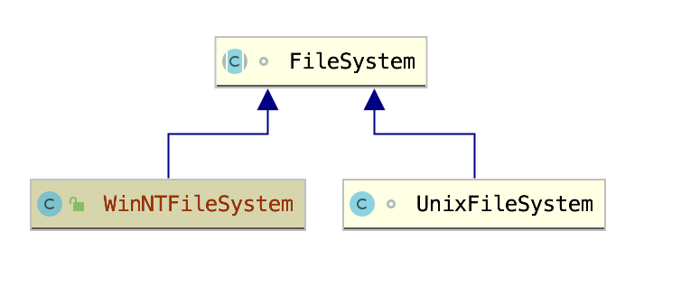
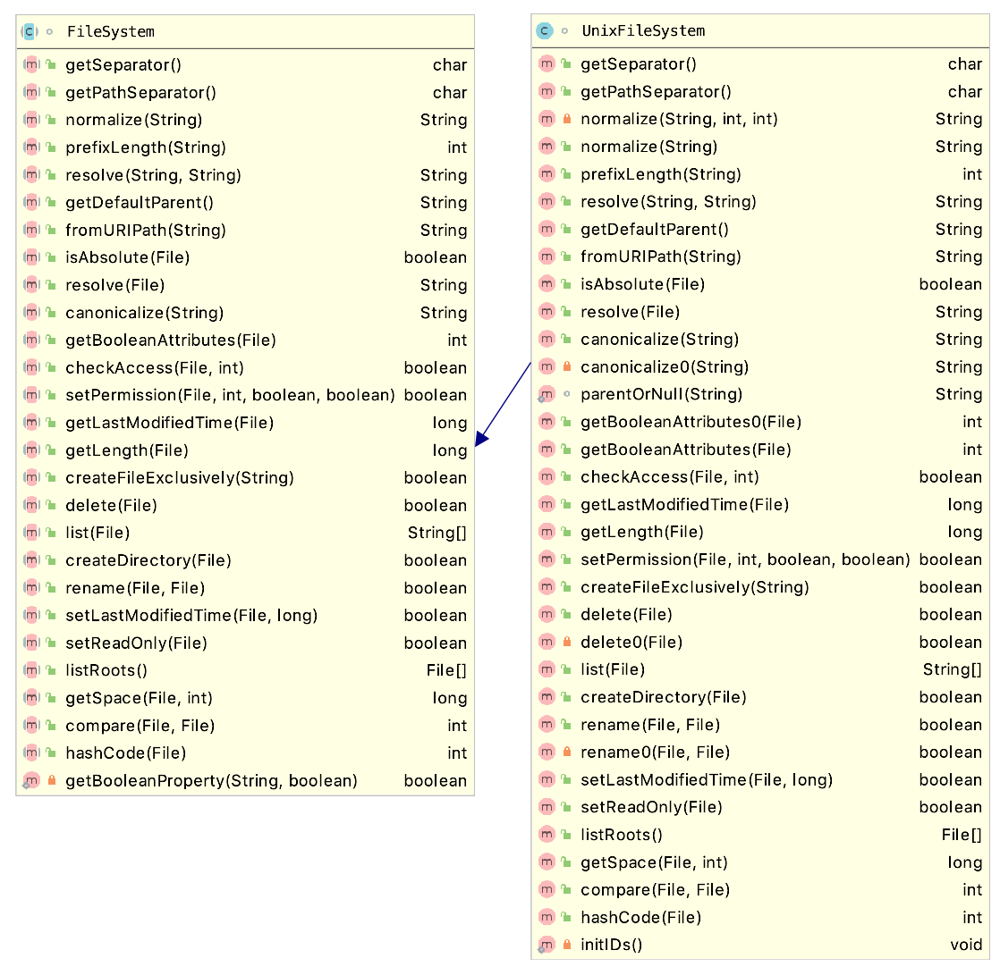
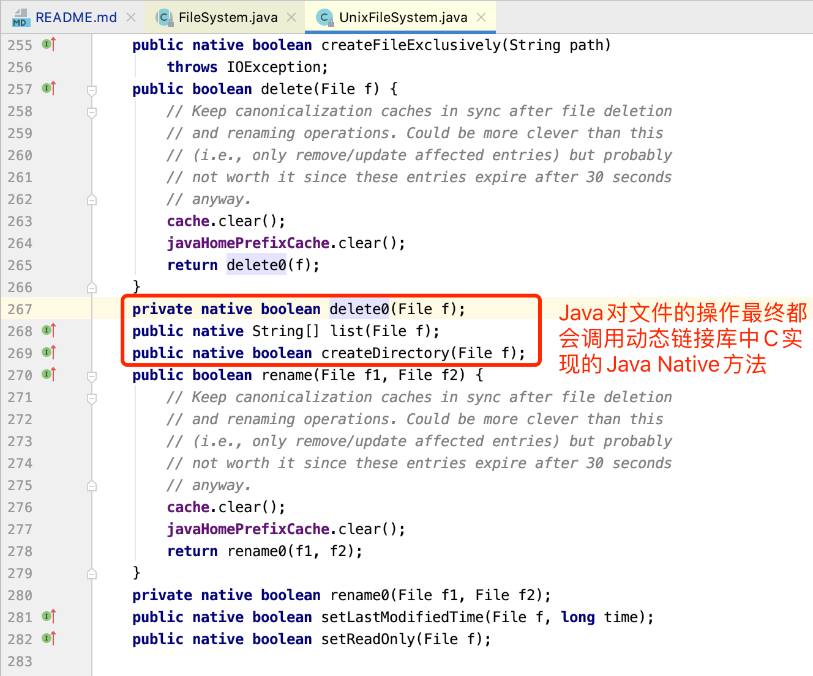
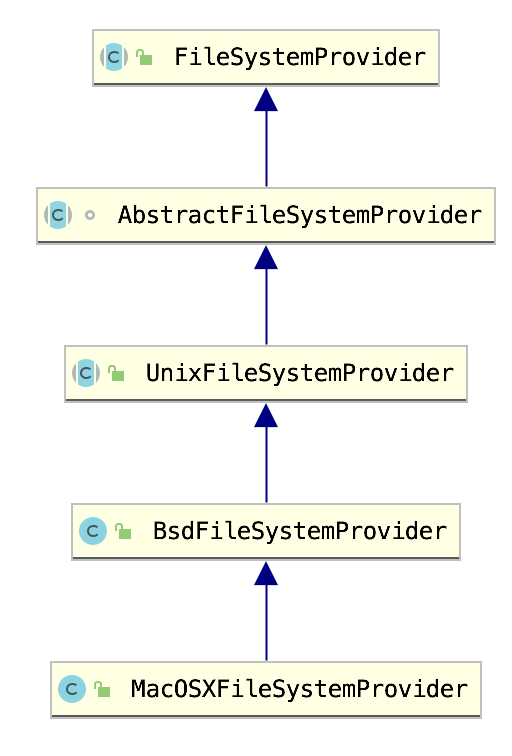

# Java 文件系统基础

在Java语言中对文件的任何操作最终都是通过`JNI`调用`C语言`函数实现的。JDK会根据不同的操作系统(`AIX,Linux,MacOSX,Solaris,Unix,Windows`)编译成不同的版本。

## Java BIO 文件系统

Java抽象出了一个叫做文件系统的对象:`java.io.FileSystem`，不同的操作系统有不一样的文件系统,例如`Windows`和`Unix`就是两种不一样的文件系统： `java.io.UnixFileSystem`、`java.io.WinNTFileSystem`。

`java.io.FileSystem`是一个抽象类，它抽象了对文件的操作，不同操作系统版本的JDK会实现其抽象的方法从而也就实现了跨平台的文件的访问操作。

示例中的`java.io.UnixFileSystem`最终会通过JNI调用native方法来实现对文件的操作:

由此我们可以得出Java只不过是实现了对文件操作的封装而已，最终读写文件的实现都是通过调用native方法实现的。

不过需要特别注意一下几点：

1. 并不是所有的文件操作都在`java.io.FileSystem`中定义,文件的读取最终调用的是`java.io.FileInputStream#read0`、`java.io.RandomAccessFile#read0`,而写文件调用的是`java.io.FileOutputStream#writeBytes`、`java.io.RandomAccessFile#write0`。
2.  Java有两类文件系统API！一套是基于`BIO`的，另一套是基于`NIO`的。

## Java NIO 文件系统

Java 7提出了一个基于NIO的文件系统，这个NIO文件系统和BIO是完全独立的。`java.nio.file.spi.FileSystemProvider`对文件的封装和`java.io.FileSystem`同理。

NIO的文件操作区别于BIO，不同的系统的最终实现类是不一样的，比如Mac的实现类是: `sun.nio.fs.UnixNativeDispatcher`,而Windows的实现类是`sun.nio.fs.WindowsNativeDispatcher`。

合理的利用NIO文件系统这一特性我们可以绕过某些只是防御了`java.io.FileSystem`的`WAF`/`RASP`。