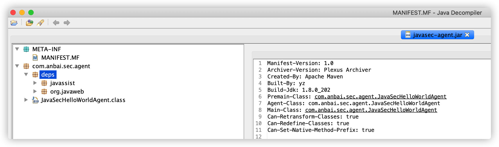

# Java Agent

Java Agent和普通的Java类并没有任何区别，普通的Java程序中规定了`main`方法为程序入口，而Java Agent则将`premain`（Agent模式）和`agentmain`（Attach模式）作为了Agent程序的入口，如下：

```java
public static void premain(String args, Instrumentation inst) {}
public static void agentmain(String args, Instrumentation inst) {}
```

Java Agent还限制了我们必须以jar包的形式运行或加载，我们必须将编写好的Agent程序打包成一个jar文件。除此之外，Java Agent还强制要求了所有的jar文件中必须包含`/META-INF/MANIFEST.MF`文件，且该文件中必须定义好`Premain-Class`（Agent模式）或`Agent-Class:`（Agent模式）配置，如：

```java
Premain-Class: com.anbai.sec.agent.CrackLicenseAgent
Agent-Class: com.anbai.sec.agent.CrackLicenseAgent
```

如果我们需要修改已经被JVM加载过的类的字节码，那么还需要设置在`MANIFEST.MF`中添加`Can-Retransform-Classes: true`或`Can-Redefine-Classes: true`。


## Agent 实现破解License示例

学习Java Agent除了可以做`APM`、`RASP`等产品，我们还可以做一些趣味性事情，比如我们可以使用Agent机制实现Java商业软件破解，我们常用的`IntelliJ IDEA`就是使用Agent方式动态修改License类校验逻辑来实现破解的。

假设我们有一个Java类`CrackLicenseTest`，每五秒钟就会自动调用`checkExpiry`方法检测授权是否过期，如果过期就会一直不断的提示重新购买授权（或者直接退出Java程序）。

**检测授权时间是否过期示例代码：**

```java
package com.anbai.sec.agent;

import java.text.ParseException;
import java.text.SimpleDateFormat;
import java.util.Date;
import java.util.concurrent.TimeUnit;

/**
 * Creator: yz
 * Date: 2020/10/29
 */
public class CrackLicenseTest {

    private static final SimpleDateFormat DATE_FORMAT = new SimpleDateFormat("yyyy-MM-dd HH:mm:ss");

    private static boolean checkExpiry(String expireDate) {
        try {
            Date date = DATE_FORMAT.parse(expireDate);

            // 检测当前系统时间早于License授权截至时间
            if (new Date().before(date)) {
                return false;
            }
        } catch (ParseException e) {
            e.printStackTrace();
        }

        return true;
    }

    public static void main(String[] args) {
        // 设置一个已经过期的License时间
        final String expireDate = "2020-10-01 00:00:00";

        new Thread(new Runnable() {
            @Override
            public void run() {
                while (true) {
                    try {
                        String time = "[" + DATE_FORMAT.format(new Date()) + "] ";

                        // 检测license是否已经过期
                        if (checkExpiry(expireDate)) {
                            System.err.println(time + "您的授权已过期，请重新购买授权！");
                        } else {
                            System.out.println(time + "您的授权正常，截止时间为：" + expireDate);
                        }

                        // sleep 1秒
                        TimeUnit.SECONDS.sleep(5);
                    } catch (InterruptedException e) {
                        e.printStackTrace();
                    }
                }
            }
        }).start();
    }

}
```

程序运行结果：

```bash
[2020-10-29 23:51:44] 您的授权已过期，请重新购买授权！
[2020-10-29 23:51:49] 您的授权已过期，请重新购买授权！
[2020-10-29 23:51:54] 您的授权已过期，请重新购买授权！
[2020-10-29 23:51:59] 您的授权已过期，请重新购买授权！
[2020-10-29 23:52:04] 您的授权已过期，请重新购买授权！
```

如果我们要破解这种简单的基于系统时间检测授权是否过期的程序我们有非常多的实现方式，例如：修改系统时间、破解License算法，修改程序授权到期时间、修改检测是否到期类方法的业务逻辑等。

修改类方法业务逻辑又有多种方法，如：反编译类文件，修改类方法、使用字节码编辑工具，修改类方法字节码、使用Java Agent + 字节码编辑工具，在程序校验时修改类字节码。

在不重新编译某个类的情况下(甚至有可能是不重启Java应用服务的情况下)动态的改变类方法的执行逻辑是非常困难的，但如果使用`Agent`的`Instrumentation API`就可以非常容易的实现了。

**破解CrackLicenseTest的授权检测示例代码：**

```java
/*
 * 灵蜥Java Agent版 [Web应用安全智能防护系统]
 * ----------------------------------------------------------------------
 * Copyright © 安百科技（北京）有限公司
 */
package com.anbai.sec.agent;

import com.sun.tools.attach.VirtualMachine;
import com.sun.tools.attach.VirtualMachineDescriptor;
import javassist.ClassPool;
import javassist.CtClass;
import javassist.CtMethod;

import java.io.ByteArrayInputStream;
import java.io.File;
import java.lang.instrument.ClassFileTransformer;
import java.lang.instrument.Instrumentation;
import java.lang.instrument.UnmodifiableClassException;
import java.net.URL;
import java.security.ProtectionDomain;
import java.util.List;

/**
 * Creator: yz
 * Date: 2020/1/2
 */
public class CrackLicenseAgent {

    /**
     * 需要被Hook的类
     */
    private static final String HOOK_CLASS = "com.anbai.sec.agent.CrackLicenseTest";

    /**
     * Java Agent模式入口
     *
     * @param args 命令参数
     * @param inst Instrumentation
     */
    public static void premain(String args, final Instrumentation inst) {
        loadAgent(args, inst);
    }

    /**
     * Java Attach模式入口
     *
     * @param args 命令参数
     * @param inst Instrumentation
     */
    public static void agentmain(String args, final Instrumentation inst) {
        loadAgent(args, inst);
    }

    public static void main(String[] args) {
        if (args.length == 0) {
            List<VirtualMachineDescriptor> list = VirtualMachine.list();

            for (VirtualMachineDescriptor desc : list) {
                System.out.println("进程ID：" + desc.id() + "，进程名称：" + desc.displayName());
            }

            return;
        }

        // Java进程ID
        String pid = args[0];

        try {
            // 注入到JVM虚拟机进程
            VirtualMachine vm = VirtualMachine.attach(pid);

            // 获取当前Agent的jar包路径
            URL agentURL = CrackLicenseAgent.class.getProtectionDomain().getCodeSource().getLocation();
            String agentPath = new File(agentURL.toURI()).getAbsolutePath();

            // 注入Agent到目标JVM
            vm.loadAgent(agentPath);
            vm.detach();
        } catch (Exception e) {
            e.printStackTrace();
        }
    }

    /**
     * 加载Agent
     *
     * @param arg  命令参数
     * @param inst Instrumentation
     */
    private static void loadAgent(String arg, final Instrumentation inst) {
        // 创建ClassFileTransformer对象
        ClassFileTransformer classFileTransformer = createClassFileTransformer();

        // 添加自定义的Transformer，第二个参数true表示是否允许Agent Retransform，
        // 需配合MANIFEST.MF中的Can-Retransform-Classes: true配置
        inst.addTransformer(classFileTransformer, true);

        // 获取所有已经被JVM加载的类对象
        Class[] loadedClass = inst.getAllLoadedClasses();

        for (Class clazz : loadedClass) {
            String className = clazz.getName();

            if (inst.isModifiableClass(clazz)) {
                // 使用Agent重新加载HelloWorld类的字节码
                if (className.equals(HOOK_CLASS)) {
                    try {
                        inst.retransformClasses(clazz);
                    } catch (UnmodifiableClassException e) {
                        e.printStackTrace();
                    }
                }
            }
        }
    }

    private static ClassFileTransformer createClassFileTransformer() {
        return new ClassFileTransformer() {

            /**
             * 类文件转换方法，重写transform方法可获取到待加载的类相关信息
             *
             * @param loader              定义要转换的类加载器；如果是引导加载器，则为 null
             * @param className           类名,如:java/lang/Runtime
             * @param classBeingRedefined 如果是被重定义或重转换触发，则为重定义或重转换的类；如果是类加载，则为 null
             * @param protectionDomain    要定义或重定义的类的保护域
             * @param classfileBuffer     类文件格式的输入字节缓冲区（不得修改）
             * @return 字节码byte数组。
             */
            @Override
            public byte[] transform(ClassLoader loader, String className, Class<?> classBeingRedefined,
                                    ProtectionDomain protectionDomain, byte[] classfileBuffer) {

                // 将目录路径替换成Java类名
                className = className.replace("/", ".");

                // 只处理com.anbai.sec.agent.CrackLicenseTest类的字节码
                if (className.equals(HOOK_CLASS)) {
                    try {
                        ClassPool classPool = ClassPool.getDefault();

                        // 使用javassist将类二进制解析成CtClass对象
                        CtClass ctClass = classPool.makeClass(new ByteArrayInputStream(classfileBuffer));

                        // 使用CtClass对象获取checkExpiry方法，类似于Java反射机制的clazz.getDeclaredMethod(xxx)
                        CtMethod ctMethod = ctClass.getDeclaredMethod(
                                "checkExpiry", new CtClass[]{classPool.getCtClass("java.lang.String")}
                        );

                        // 在checkExpiry方法执行前插入输出License到期时间代码
                        ctMethod.insertBefore("System.out.println(\"License到期时间：\" + $1);");

                        // 修改checkExpiry方法的返回值，将授权过期改为未过期
                        ctMethod.insertAfter("return false;");

                        // 将使用javassist修改后的类字节码给JVM加载
                        return ctClass.toBytecode();
                    } catch (Exception e) {
                        e.printStackTrace();
                    }
                }

                return classfileBuffer;
            }
        };
    }

}
```

添加pom.xml：

```xml
<?xml version="1.0" encoding="UTF-8"?>
<project xmlns="http://maven.apache.org/POM/4.0.0"
         xmlns:xsi="http://www.w3.org/2001/XMLSchema-instance"
         xsi:schemaLocation="http://maven.apache.org/POM/4.0.0 http://maven.apache.org/xsd/maven-4.0.0.xsd">

    <parent>
        <artifactId>javaweb-sec-source</artifactId>
        <groupId>com.anbai</groupId>
        <version>1.0.0</version>
    </parent>

    <modelVersion>4.0.0</modelVersion>
    <artifactId>javasec-agent</artifactId>
    <packaging>jar</packaging>

    <properties>
        <asm.version>9.0</asm.version>
        <java.version>1.7</java.version>
        <package.name>com.anbai.sec.agent</package.name>
        <manifest-file.name>MANIFEST.MF</manifest-file.name>
        <maven-jar-plugin.version>2.3.2</maven-jar-plugin.version>
        <maven-shade-plugin.version>3.2.2</maven-shade-plugin.version>
    </properties>

    <dependencies>

        <dependency>
            <groupId>org.javassist</groupId>
            <artifactId>javassist</artifactId>
            <version>${javassist.version}</version>
        </dependency>

        <dependency>
            <groupId>org.javaweb</groupId>
            <artifactId>javaweb-utils</artifactId>
            <version>${javaweb.version}</version>
        </dependency>

        <dependency>
            <groupId>com.sun</groupId>
            <artifactId>tools</artifactId>
            <version>${java.version}</version>
            <scope>system</scope>
            <systemPath>${java.home}/../lib/tools.jar</systemPath>
        </dependency>

    </dependencies>

    <build>
        <finalName>javasec-agent</finalName>
        <plugins>
            <plugin>
                <groupId>org.apache.maven.plugins</groupId>
                <artifactId>maven-compiler-plugin</artifactId>
                <configuration>
                    <source>${java.version}</source>
                    <target>${java.version}</target>
                    <encoding>UTF-8</encoding>
                </configuration>
            </plugin>

            <plugin>
                <groupId>org.apache.maven.plugins</groupId>
                <artifactId>maven-jar-plugin</artifactId>
                <version>${maven-jar-plugin.version}</version>

                <configuration>
                    <archive>
                        <manifestFile>src/main/resources/${manifest-file.name}</manifestFile>
                    </archive>
                </configuration>
            </plugin>

            <plugin>
                <groupId>org.apache.maven.plugins</groupId>
                <artifactId>maven-shade-plugin</artifactId>
                <version>${maven-shade-plugin.version}</version>
                <executions>
                    <execution>
                        <phase>package</phase>
                        <goals>
                            <goal>shade</goal>
                        </goals>
                        <configuration>
                            <filters>
                                <filter>
                                    <artifact>*:*</artifact>
                                    <excludes>
                                        <exclude>MANIFEST.MF</exclude>
                                        <exclude>META-INF/maven/</exclude>
                                    </excludes>
                                </filter>
                            </filters>

                            <artifactSet>
                                <includes>
                                    <include>org.javassist:javassist:jar:*</include>
                                    <include>org.javaweb:javaweb-utils:jar:*</include>
                                </includes>
                            </artifactSet>

                            <!-- 修改第三方依赖包名称 -->
                            <relocations>
                                <relocation>
                                    <pattern>com.anbai.sec.agent</pattern>
                                    <shadedPattern>${package.name}</shadedPattern>
                                </relocation>
                                <relocation>
                                    <pattern>org.apache</pattern>
                                    <shadedPattern>${package.name}.deps.org.apache</shadedPattern>
                                </relocation>
                                <relocation>
                                    <pattern>org.javaweb</pattern>
                                    <shadedPattern>${package.name}.deps.org.javaweb</shadedPattern>
                                </relocation>
                                <relocation>
                                    <pattern>javassist</pattern>
                                    <shadedPattern>${package.name}.deps.javassist</shadedPattern>
                                </relocation>
                            </relocations>
                        </configuration>
                    </execution>
                </executions>
            </plugin>
        </plugins>
    </build>

</project>
```

最后再执行如下命令使用`Maven`构建`Agent Jar`包：

```bash
cd ~/IdeaProjects/javaweb-sec/javaweb-sec-source/javasec-agent
mvn clean install
```

`Maven`构建完成后在`javaweb-sec/javaweb-sec-source/javasec-agent/target`目录会自动生成一个`javasec-agent.jar`文件。



我们需要在运行`CrackLicenseTest`的时候添加`-javaagent:jar路径`参数，例如：

```bash
cd ~/IdeaProjects/javaweb-sec/javaweb-sec-source/javasec-agent
java -javaagent:/Users/yz/IdeaProjects/javaweb-sec/javaweb-sec-source/javasec-agent/target/javasec-agent.jar -cp target/test-classes/ com.anbai.sec.agent.CrackLicenseTest
```

程序执行结果：

```java
License到期时间：2020-10-01 23:59:01
[2020-10-30 01:20:15] 您的授权正常，截止时间为：2020-10-01 23:59:01
License到期时间：2020-10-01 23:59:01
[2020-10-30 01:20:20] 您的授权正常，截止时间为：2020-10-01 23:59:01
License到期时间：2020-10-01 23:59:01
[2020-10-30 01:20:25] 您的授权正常，截止时间为：2020-10-01 23:59:01
```

由上示例可以看到`CrackLicenseTest`类的`checkExpiry`方法已经被我们使用Java Agent机制动态编辑类字节码的方式修改成功了。

