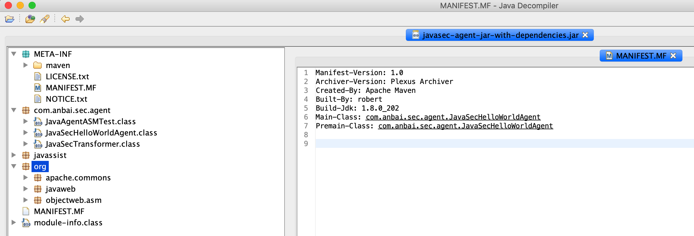

# Java Agent

Java Agent和普通的Java类并没有任何区别，普通的Java程序中规定了`main`方法为程序入口，而Java Agent则将`premain`（Agent模式）和`agentmain`（Attach模式）作为了Agent程序的入口，如下：

```java
public static void premain(String args, Instrumentation inst) {}
public static void agentmain(String args, Instrumentation inst) {}
```

Java Agent还限制了我们必须以jar包的形式运行或加载，我们必须将编写好的Agent程序打包成一个jar文件。除此之外，Java Agent还强制要求了所有的jar文件中必须包含`/META-INFo/MANIFEST.MF`文件，且该文件中必须定义好`Premain-Class`（Agent模式）或`Agent-Class:`（Agent模式）配置，如：

```java
Premain-Class: com.anbai.sec.agent.JavaSecHelloWorldAgent
Agent-Class: com.anbai.sec.agent.JavaSecHelloWorldAgent
```

如果我们需要修改已经被JVM加载过的类的字节码，那么还需要设置在`MANIFEST.MF`中添加`Can-Retransform-Classes: true`或`Can-Redefine-Classes: true`。


## Java Agent Hello World

为了便于理解Agent机制，让我们来运行一个非常简单的`Java`的`HelloWorld`程序。

**HelloWorld示例代码：**

```java
package com.anbai.sec.agent;

/**
 * Creator: yz
 * Date: 2020/1/2
 */
public class HelloWorld {

   public static void main(String[] args) {
      System.out.println("Hello World...");
   }

}
```

程序运行结果：

```
Hello World...
```

假设我们现在有一个需求：必须在不重新编译某个类的情况下(甚至有可能是不重启应用服务的情况下)动态的改变类方法的执行逻辑是非常困难的，但如果使用`Agent`的`Instrumentation API`就可以非常容易的实现了，例如将下列程序(`HelloWorld.java`)的输出变成`Hello Java Agent!`。

为了方便编辑类字节码，我们可以选择引入`ASM`或`Javassist`：

```xml
<dependency>
    <groupId>org.ow2.asm</groupId>
    <artifactId>asm-commons</artifactId>
    <version>9.0</version>
</dependency>

<dependency>
    <groupId>org.javassist</groupId>
    <artifactId>javassist</artifactId>
    <version>3.27.0-GA</version>
</dependency>
```

然后我们需要编写一个简单的测试类：

```java
/*
 * 灵蜥Java Agent版 [Web应用安全智能防护系统]
 * ----------------------------------------------------------------------
 * Copyright © 安百科技（北京）有限公司
 */
package com.anbai.sec.agent;

import javassist.ClassPool;
import javassist.CtClass;
import javassist.CtMethod;
import javassist.NotFoundException;

import java.io.ByteArrayInputStream;
import java.lang.instrument.ClassFileTransformer;
import java.lang.instrument.Instrumentation;
import java.security.ProtectionDomain;

/**
 * Creator: yz
 * Date: 2020/1/2
 */
public class JavaSecHelloWorldAgent {

    /**
     * Java Agent模式入口
     *
     * @param args 命令参数
     * @param inst Agent Instrumentation 实例
     */
    public static void premain(String args, final Instrumentation inst) {
        // 添加自定义的Transformer
        inst.addTransformer(new ClassFileTransformer() {

            /**
             * 类文件转换方法，重写transform方法可获取到待加载的类相关信息
             *
             * @param loader              定义要转换的类加载器；如果是引导加载器，则为 null
             * @param className           类名,如:java/lang/Runtime
             * @param classBeingRedefined 如果是被重定义或重转换触发，则为重定义或重转换的类；如果是类加载，则为 null
             * @param protectionDomain    要定义或重定义的类的保护域
             * @param classfileBuffer     类文件格式的输入字节缓冲区（不得修改）
             * @return 返回一个通过ASM修改后添加了防御代码的字节码byte数组。
             */
            @Override
            public byte[] transform(ClassLoader loader, String className, Class<?> classBeingRedefined,
                                    ProtectionDomain protectionDomain, byte[] classfileBuffer) {

                // 将目录路径替换成Java类名
                className = className.replace("/", ".");

                // 只处理com.anbai.sec.agent.HelloWorld类的字节码
                if (className.equals("com.anbai.sec.agent.HelloWorld")) {
                    try {
                        ClassPool classPool = ClassPool.getDefault();

                        // 使用javassist将类二进制解析成CtClass对象
                        CtClass ctClass = classPool.makeClass(new ByteArrayInputStream(classfileBuffer));

                        // 使用CtClass对象获取main方法，类似于Java反射机制的clazz.getDeclaredMethod(xxx)
                        CtMethod ctMethod = ctClass.getDeclaredMethod(
                                "main", new CtClass[]{classPool.getCtClass("java.lang.String[]")}
                        );

                        // 直接修改main方法的字节码
                        ctMethod.setBody("System.out.println(\"Hello Java Agent!\");");

                        // 将使用javassist修改后的类字节码给JVM加载
                        return ctClass.toBytecode();
                    } catch (Exception e) {
                        e.printStackTrace();
                    }
                }

                return classfileBuffer;
            }
        }, true);
        // 第二个参数true表示是否允许Agent Retransform，需配合MANIFEST.MF中的Can-Retransform-Classes: true配置
    }

    public static void main(String[] args) {
        ClassPool classPool = ClassPool.getDefault();

        try {
            System.out.println(classPool.getCtClass("java.lang.String[]"));
        } catch (NotFoundException e) {
            e.printStackTrace();
        }
    }

}
```

然后我们还需要在pom中添加maven构建插件，将Agent代码和其原来的第三方jar包打包成一个独立的jar文件，并使用打包插件配置好`Premain-Class`的Agent入口类，如下：

```xml
<plugin>
    <groupId>org.apache.maven.plugins</groupId>
    <artifactId>maven-assembly-plugin</artifactId>
    <configuration>
        <descriptorRefs>
            <descriptorRef>jar-with-dependencies</descriptorRef>
        </descriptorRefs>
        <archive>
            <manifest>
                <mainClass>com.anbai.sec.agent.JavaSecHelloWorldAgent</mainClass>
            </manifest>
            <manifestEntries>
                <Premain-Class>com.anbai.sec.agent.JavaSecHelloWorldAgent</Premain-Class>
                <Agent-Class>com.anbai.sec.agent.JavaSecHelloWorldAgent</Agent-Class>
                <Can-Redefine-Classes>true</Can-Redefine-Classes>
                <Can-Retransform-Classes>true</Can-Retransform-Classes>
            </manifestEntries>
        </archive>
    </configuration>
    <executions>
        <execution>
            <id>make-assembly</id>
            <phase>package</phase>
            <goals>
                <goal>single</goal>
            </goals>
        </execution>
    </executions>
</plugin>
```

最后再执行如下命令使用`Maven`构建`Agent Jar`包：

```bash
cd javaweb-sec/javaweb-sec-source/javasec-agent
mvn clean install
```

`Maven`构建完成后在`javaweb-sec/javaweb-sec-source/javasec-agent/target`目录会自动生成一个`javasec-agent-jar-with-dependencies.jar`文件。



我们需要在运行`HelloWorld`的时候添加`-javaagent:jar路径`参数，例如：

```bash
java -jar -javaagent:/Users/yz/IdeaProjects/javaweb-sec/javaweb-sec-source/javasec-agent/target/javasec-agent-jar-with-dependencies.jar com.anbai.sec.agent.HelloWorld
```

程序执行结果：

```java
Hello Java Agent!
```

由上示例可以看到`HelloWorld`类的`main`方法已经被我们使用Java Agent机制动态编辑类字节码的方式修改成功了，程序最终执行结果也被我们成功的修改为了：`Hello Java Agent`。

