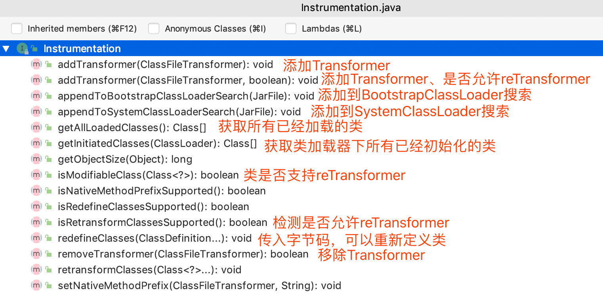

# Java Agent

`JDK1.5`开始，`Java`新增了`Instrumentation(Java Agent API)`和`JVMTI(JVM Tool Interface)`功能，允许`JVM`在加载某个`class文件`之前对其字节码进行修改，同时也支持对已加载的`class(类字节码)`进行重新加载(`Retransform`)。

利用`Java Agent`这一特性衍生出了`APM(Application Performance Management，应用性能管理)`、`RASP(Runtime application self-protection，运行时应用自我保护)`、`IAST(Interactive Application Security Testing，交互式应用程序安全测试)`等相关产品，它们都无一例外的使用了`Instrumentation/JVMTI`的`API`来实现动态修改`Java类字节码`并插入监控或检测代码。

**`Java Agent`有两种运行模式：**

1. 启动`Java程序`时添加`-javaagent(Instrumentation API实现方式)`或`-agentpath/-agentlib(JVMTI的实现方式)`参数，如`java -javaagent:/data/XXX.jar LingXeTest`。
2. `JDK1.6`新增了`attach(附加方式)`方式，可以对运行中的`Java进程`附加`Agent`。

这两种运行方式的最大区别在于第一种方式只能在程序启动时指定`Agent`文件，而`attach`方式可以在`Java程序`运行后根据`进程ID`动态注入`Agent`到`JVM`。

## Java Agent Hello World

让我们来运行一个`Java`的`HelloWorld`程序。

**HelloWorld示例代码：**

```java
package com.anbai.sec.agent;

/**
 * Creator: yz
 * Date: 2020/1/2
 */
public class HelloWorld {

   public static void main(String[] args) {
      System.out.println("Hello World...");
   }

}
```

程序运行结果：

```
Hello World...
```

假设我们现在有一个需求：必须在不重新编译某个类的情况下(甚至有可能是不重启应用服务的情况下)动态的改变类方法的执行逻辑是非常困难的，但如果使用`Agent`的`Instrumentation API`就可以非常容易的实现了，例如将下列程序(`HelloWorld.java`)的输出变成`Hello Agent...`。

首先我们需要修改：`javaweb-sec/javaweb-sec-source/javasec-agent/src/main/resources/MANIFEST.MF`文件中的`Premain-Class`配置为`com.anbai.sec.agent.JavaSecHelloWorldAgent`，然后再执行如下命令使用`Maven`构建`Agent Jar`包：

```bash
cd javaweb-sec/javaweb-sec-source/javasec-agent
mvn clean install
```

`Maven`构建完成后在`javaweb-sec/javaweb-sec-source/javasec-agent/target`目录会自动生成一个`javasec-agent.jar`文件，这个文件也就是我们写好的用于处理`HelloWorld`程序输出结果的`Java Agent`程序。

**JavaSecHelloWorldAgent动态替换HelloWorld字符串示例代码：**

```java
/*
 * 灵蜥Java Agent版 [Web应用安全智能防护系统]
 * ----------------------------------------------------------------------
 * Copyright © 安百科技（北京）有限公司
 */
package com.anbai.sec.agent;

import java.lang.instrument.ClassFileTransformer;
import java.lang.instrument.Instrumentation;
import java.security.ProtectionDomain;
import java.util.Arrays;

/**
 * Creator: yz
 * Date: 2020/1/2
 */
public class JavaSecHelloWorldAgent {

	/**
	 * 替换HelloWorld的输出字符串为"Hello Agent..."，将二进制转换成字符串数组，替换字符串数组并生成新的二进制
	 *
	 * @param className   类名
	 * @param classBuffer 类字节码
	 * @return 替换后的类字节码
	 */
	private static byte[] replaceBytes(String className, byte[] classBuffer) {
		// 将类字节码转换成byte字符串
		String bufferStr = Arrays.toString(classBuffer);
		System.out.println(className + "类替换前的字节码:" + bufferStr);

		bufferStr = bufferStr.replace("[", "").replace("]", "");

		// 查找需要替换的Java二进制内容
		byte[] findBytes = "Hello World...".getBytes();

		// 把搜索的字符串byte转换成byte字符串
		String findStr = Arrays.toString(findBytes).replace("[", "").replace("]", "");

		// 二进制替换后的byte值，注意这个值需要和替换的字符串长度一致，不然会破坏常量池
		byte[] replaceBytes = "Hello Agent...".getBytes();

		// 把替换的字符串byte转换成byte字符串
		String replaceStr = Arrays.toString(replaceBytes).replace("[", "").replace("]", "");

		bufferStr = bufferStr.replace(findStr, replaceStr);

		// 切割替换后的byte字符串
		String[] byteArray = bufferStr.split("\\s*,\\s*");

		// 创建新的byte数组，存储替换后的二进制
		byte[] bytes = new byte[byteArray.length];

		// 将byte字符串转换成byte
		for (int i = 0; i < byteArray.length; i++) {
			bytes[i] = Byte.parseByte(byteArray[i]);
		}

		System.out.println(className + "类替换后的字节码:" + Arrays.toString(bytes));

		// 返回修改后的二进制
		return bytes;
	}

	/**
	 * Java Agent模式入口
	 *
	 * @param args 命令参数
	 * @param inst Agent Instrumentation 实例
	 */
	public static void premain(String args, final Instrumentation inst) {
		// 添加自定义的Transformer
		inst.addTransformer(new ClassFileTransformer() {

			/**
			 * 类文件转换方法，重写transform方法可获取到待加载的类相关信息
			 *
			 * @param loader              定义要转换的类加载器；如果是引导加载器，则为 null
			 * @param className           类名,如:java/lang/Runtime
			 * @param classBeingRedefined 如果是被重定义或重转换触发，则为重定义或重转换的类；如果是类加载，则为 null
			 * @param protectionDomain    要定义或重定义的类的保护域
			 * @param classfileBuffer     类文件格式的输入字节缓冲区（不得修改）
			 * @return 返回一个通过ASM修改后添加了防御代码的字节码byte数组。
			 */
			@Override
			public byte[] transform(ClassLoader loader, String className, Class<?> classBeingRedefined,
			                        ProtectionDomain protectionDomain, byte[] classfileBuffer) {

				// 将目录路径替换成Java类名
				className = className.replace("/", ".");

				// 只处理com.anbai.sec.agent.HelloWorld类的字节码
				if (className.equals("com.anbai.sec.agent.HelloWorld")) {
					// 替换HelloWorld的输出字符串
					return replaceBytes(className, classfileBuffer);
				}

				return classfileBuffer;
			}
		}, true);// 第二个参数true表示是否允许Agent Retransform，需配合MANIFEST.MF中的Can-Retransform-Classes: true配置
	}

}
```

我们需要在运行`HelloWorld`的时候添加`-javaagent:jar路径`参数，例如：

```bash
java -jar -javaagent:/Users/yz/IdeaProjects/javaweb-sec/javaweb-sec-source/javasec-agent/target/javasec-agent.jar com.anbai.sec.agent.HelloWorld
```

程序执行结果：

```java
com.anbai.sec.agent.HelloWorld类替换前的字节码:[....省去两则一致的数据, 87, 111, 114, 108, 100, ...]
com.anbai.sec.agent.HelloWorld类替换后的字节码:[....省去两则一致的数据, 65, 103, 101, 110, 116, ...]
Hello Agent...
```

由上可以看到程序的最终执行结果已经被我们动态的修改为了：`Hello Agent...`，这种方式是最为简单暴力的修改二进制中的字符串值的方式在实际的业务场景下很显然是不可行的，因为只要修改后的字符串长度不一致就会破坏常量池导致程序无法执行，为了能够精准有效的修改类字节码我们通常会使用[ASM](https://mvnrepository.com/artifact/org.ow2.asm/asm/7.2)库。

## Instrumentation

`java.lang.instrument.Instrumentation`是`Java`提供的监测运行在`JVM`程序的`API`。利用`Instrumentation`我们可以实现如下功能：

1. 动态添加自定义的`Transformer(addTransformer)`。
2. 动态修改`classpath(appendToBootstrapClassLoaderSearch、appendToSystemClassLoaderSearch)`。
3. 动态获取所有`JVM`已加载的类(`getAllLoadedClasses`)。
4. 动态获取某个类加载器已实例化的所有类(`getInitiatedClasses`)。
5. 直接修改已加载的类的字节码(`redefineClasses`)。
6. 动态设置`JNI`前缀(`setNativeMethodPrefix`)。
7. 重加载指定类字节码(`retransformClasses`)。

**`Instrumentation`类方法如下：**




## ClassFileTransformer

`java.lang.instrument.ClassFileTransformer`是一个转换类文件的代理接口，我们可以在获取到`Instrumentation`对象后通过`addTransformer`方法添加自定义类文件转换器。

示例中我们使用了`addTransformer`注册了一个我们自定义的`Transformer`到`Java Agent`，当有新的类被`JVM`加载时`JVM`会自动回调用我们自定义的`Transformer`类的`transform`方法，传入该类的`transform`信息(`类名、类加载器、类字节码`等)，我们可以根据传入的类信息决定是否需要修改类字节码，修改完字节码后我们将新的类字节码返回给`JVM`，`JVM`会验证类和相应的修改是否合法，如果符合类加载要求`JVM`会加载我们修改后的类字节码。

**`ClassFileTransformer类代码：`**

```java
package java.lang.instrument;

public interface ClassFileTransformer {
  
  /**
	 * 类文件转换方法，重写transform方法可获取到待加载的类相关信息
	 *
	 * @param loader              定义要转换的类加载器；如果是引导加载器，则为 null
	 * @param className           类名,如:java/lang/Runtime
	 * @param classBeingRedefined 如果是被重定义或重转换触发，则为重定义或重转换的类；如果是类加载，则为 null
	 * @param protectionDomain    要定义或重定义的类的保护域
	 * @param classfileBuffer     类文件格式的输入字节缓冲区（不得修改）
	 * @return 返回一个通过ASM修改后添加了防御代码的字节码byte数组。
	 */
	byte[] transform(ClassLoader loader, String className, Class<?> classBeingRedefined,
	                        ProtectionDomain protectionDomain, byte[] classfileBuffer);
  
}
```

**重写`transform`方法需要注意以下事项：**

1. `ClassLoader`如果是被`Bootstrap ClassLoader(引导类加载器)`所加载那么`loader`参数的值是空。
2. 修改类字节码时需要特别注意插入的代码在对应的`ClassLoader`中可以正确的获取到，否则会报`ClassNotFoundException`，比如修改`java.io.FileInputStream(该类由Bootstrap ClassLoader加载)`时插入了我们检测代码，那么我们将必须保证`FileInputStream`能够获取到我们的检测代码类。
3. `JVM`类名的书写方式路径方式：`java/lang/String`而不是我们常用的类名方式：`java.lang.String`。
4. 类字节必须符合`JVM`校验要求，如果无法验证类字节码会导致`JVM`崩溃或者`VerifyError(类验证错误)`。
5. 如果修改的是`retransform`类(修改已被`JVM`加载的类)，修改后的类字节码不得`新增方法`、`修改方法参数`、`类成员变量`。
6. `addTransformer`时如果没有传入`retransform`参数(默认是`false`)就算`MANIFEST.MF`中配置了`Can-Redefine-Classes: true`而且手动调用了`retransformClasses`方法也一样无法`retransform`。
7. 卸载`transform`时需要使用创建时的`Instrumentation`实例。