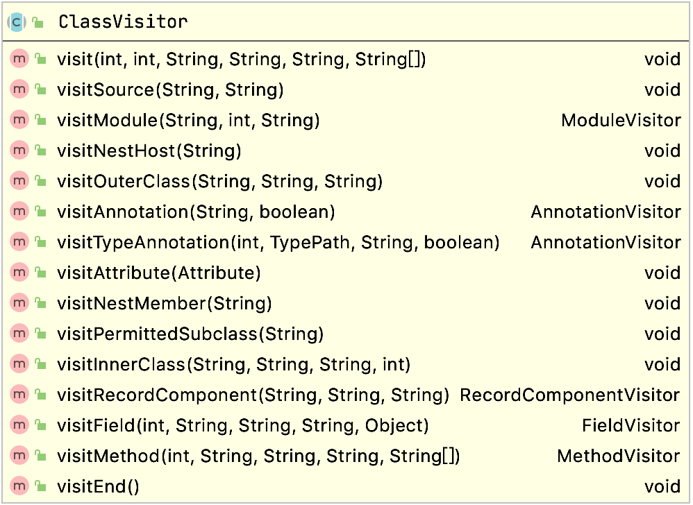
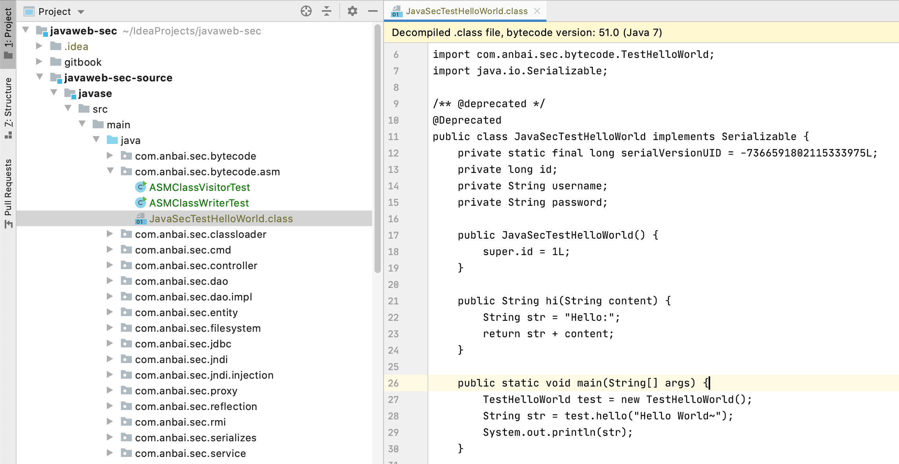

# Java类字节码库

Java字节码库允许我们通过字节码库的API动态创建或修改Java类、方法、变量等操作而被广泛使用，本章节将讲解ASM和Javassist库的使用。


## ASM

ASM是一种通用Java字节码操作和分析框架，它可以直接以二进制形式修改一个现有的类或动态生成类文件。ASM的版本更新快（`ASM 9.0`已经支持`JDK 16`）、[性能高](https://asm.ow2.io/performance.html)、功能全，学习成本也相对较高。

ASM提供了三个基于`ClassVisitor API`的核心API，用于生成和转换类：

1. `ClassReader`类用于解析class文件或二进制流；
2. `ClassWriter`类是`ClassVisitor`的子类，用于生成类二进制；
3. `ClassVisitor`是一个抽象类，自定义`ClassVisitor`需要重写`visitXXX`方法；

### ClassReader和ClassVisitor

`ClassReader`类用于解析类字节码，创建`ClassReader`对象可传入类名、类字节码数组或者类输入流对象。

创建完`ClassReader`对象就会触发字节码解析（解析class基础信息，如常量池、接口信息等），所以可以直接通过`ClassReader`对象获取类的基础信息，如下：

```java
// 创建ClassReader对象，用于解析类对象，可以根据类名、二进制、输入流的方式创建
final ClassReader cr = new ClassReader(className);

System.out.println(
      "解析类名：" + cr.getClassName() + "，父类：" + cr.getSuperName() +
            "，实现接口：" + Arrays.toString(cr.getInterfaces())
);
```

调用`ClassReader`类的`accpet`方法需要传入自定义的`ClassVisitor`对象，`ClassReader`会按照如下顺序，依次调用该`ClassVisitor`的类方法。

```java
visit [ visitSource ] [ visitModule ][ visitNestHost ][ visitPermittedclass ][ visitOuterClass ] ( visitAnnotation | visitTypeAnnotation | visitAttribute )* ( visitNestMember | visitInnerClass | visitRecordComponent | visitField | visitMethod )* visitEnd
```

**ClassVisitor类图：**



### 读取类/成员变量/方法信息

为了学习`ClassVisitor`，我们写一个简单的读取类、成员变量、方法信息的一个示例，需要重写`ClassVisitor`类的`visit`、`visitField`和`visitMethod`方法。

测试代码：

```java
package com.anbai.sec.bytecode.asm;

import org.objectweb.asm.ClassReader;
import org.objectweb.asm.ClassVisitor;
import org.objectweb.asm.FieldVisitor;
import org.objectweb.asm.MethodVisitor;

import java.io.IOException;
import java.util.Arrays;

import static org.objectweb.asm.ClassReader.EXPAND_FRAMES;
import static org.objectweb.asm.Opcodes.ASM9;

public class ASMClassVisitorTest {

	public static void main(String[] args) {
		// 定义需要解析的类名称
		String className = "com.anbai.sec.bytecode.TestHelloWorld";

		try {
			// 创建ClassReader对象，用于解析类对象，可以根据类名、二进制、输入流的方式创建
			final ClassReader cr = new ClassReader(className);

			System.out.println(
					"解析类名：" + cr.getClassName() + "，父类：" + cr.getSuperName() +
							"，实现接口：" + Arrays.toString(cr.getInterfaces())
			);

			System.out.println("-----------------------------------------------------------------------------");

			// 使用自定义的ClassVisitor访问者对象，访问该类文件的结构
			cr.accept(new ClassVisitor(ASM9) {
				@Override
				public void visit(int version, int access, String name, String signature, String superName, String[] interfaces) {
					System.out.println(
							"变量修饰符：" + access + "\t 类名：" + name + "\t 父类名：" + superName +
									"\t 实现的接口：" + Arrays.toString(interfaces)
					);

					System.out.println("-----------------------------------------------------------------------------");

					super.visit(version, access, name, signature, superName, interfaces);
				}

				@Override
				public FieldVisitor visitField(int access, String name, String desc, String signature, Object value) {
					System.out.println(
							"变量修饰符：" + access + "\t 变量名称：" + name + "\t 描述符：" + desc + "\t 默认值：" + value
					);

					return super.visitField(access, name, desc, signature, value);
				}

				@Override
				public MethodVisitor visitMethod(int access, String name, String desc, String signature, String[] exceptions) {

					System.out.println(
							"方法修饰符：" + access + "\t 方法名称：" + name + "\t 描述符：" + desc +
									"\t 抛出的异常：" + Arrays.toString(exceptions)
					);

					return super.visitMethod(access, name, desc, signature, exceptions);
				}
			}, EXPAND_FRAMES);
		} catch (IOException e) {
			e.printStackTrace();
		}

	}

}
```

程序执行后输出：

```java
解析类名：com/anbai/sec/bytecode/TestHelloWorld，父类：java/lang/Object，实现接口：[java/io/Serializable]
-----------------------------------------------------------------------------
变量修饰符：131105	 类名：com/anbai/sec/bytecode/TestHelloWorld	 父类名：java/lang/Object	 实现的接口：[java/io/Serializable]
-----------------------------------------------------------------------------
变量修饰符：26	 变量名称：serialVersionUID	 描述符：J	 默认值：-7366591802115333975
变量修饰符：2	 变量名称：id	 描述符：J	 默认值：null
变量修饰符：2	 变量名称：username	 描述符：Ljava/lang/String;	 默认值：null
变量修饰符：2	 变量名称：password	 描述符：Ljava/lang/String;	 默认值：null
方法修饰符：1	 方法名称：<init>	 描述符：()V	 抛出的异常：null
方法修饰符：1	 方法名称：hello	 描述符：(Ljava/lang/String;)Ljava/lang/String;	 抛出的异常：null
方法修饰符：9	 方法名称：main	 描述符：([Ljava/lang/String;)V	 抛出的异常：null
方法修饰符：1	 方法名称：getId	 描述符：()J	 抛出的异常：null
方法修饰符：1	 方法名称：setId	 描述符：(J)V	 抛出的异常：null
方法修饰符：1	 方法名称：getUsername	 描述符：()Ljava/lang/String;	 抛出的异常：null
方法修饰符：1	 方法名称：setUsername	 描述符：(Ljava/lang/String;)V	 抛出的异常：null
方法修饰符：1	 方法名称：getPassword	 描述符：()Ljava/lang/String;	 抛出的异常：null
方法修饰符：1	 方法名称：setPassword	 描述符：(Ljava/lang/String;)V	 抛出的异常：null
方法修饰符：1	 方法名称：toString	 描述符：()Ljava/lang/String;	 抛出的异常：null
```

通过这个简单的示例，我们可以通过ASM实现遍历一个类的基础信息。

### ClassWriter

使用`ClassWriter`可以实现类修改功能

**修改类和方法名称示例**

```java
package com.anbai.sec.bytecode.asm;

import org.javaweb.utils.FileUtils;
import org.objectweb.asm.ClassReader;
import org.objectweb.asm.ClassVisitor;
import org.objectweb.asm.ClassWriter;
import org.objectweb.asm.MethodVisitor;

import java.io.File;
import java.io.IOException;

import static org.objectweb.asm.ClassReader.EXPAND_FRAMES;
import static org.objectweb.asm.ClassWriter.COMPUTE_FRAMES;
import static org.objectweb.asm.Opcodes.ASM9;

public class ASMClassWriterTest {

	public static void main(String[] args) {
		// 定义需要解析的类名称
		String className = "com.anbai.sec.bytecode.TestHelloWorld";

		// 定义修改后的类名
		final String newClassName = "JavaSecTestHelloWorld";

		try {
			// 创建ClassReader对象，用于解析类对象，可以根据类名、二进制、输入流的方式创建
			final ClassReader cr = new ClassReader(className);

			// 创建ClassWriter对象
			final ClassWriter cw = new ClassWriter(cr, COMPUTE_FRAMES);

			// 使用自定义的ClassVisitor访问者对象，访问该类文件的结构
			cr.accept(new ClassVisitor(ASM9, cw) {
				@Override
				public void visit(int version, int access, String name, String signature, String superName, String[] interfaces) {
					super.visit(version, access, newClassName, signature, superName, interfaces);
				}

				@Override
				public MethodVisitor visitMethod(int access, String name, String desc, String signature, String[] exceptions) {
					// 将"hello"方法名字修改为"hi"
					if (name.equals("hello")) {
						return super.visitMethod(access, "hi", desc, signature, exceptions);
					}

					return super.visitMethod(access, name, desc, signature, exceptions);
				}
			}, EXPAND_FRAMES);

			File classFilePath = new File(new File(System.getProperty("user.dir"), "javaweb-sec-source/javase/src/main/java/com/anbai/sec/bytecode/asm/"), newClassName + ".class");

			// 修改后的类字节码
			byte[] classBytes = cw.toByteArray();

			// 写入修改后的字节码到新的类文件
			FileUtils.writeByteArrayToFile(classFilePath, classBytes);
		} catch (IOException e) {
			e.printStackTrace();
		}
	}

}
```

修改成功后将会生成一个名为`JavaSecTestHelloWorld.class`的新的class文件，反编译`JavaSecTestHelloWorld`类会发现`TestHelloWorld`类的`hello`方法也已被修改为了`hi`，如下图：

