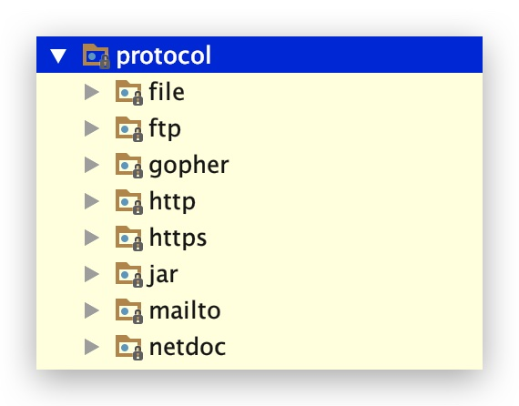
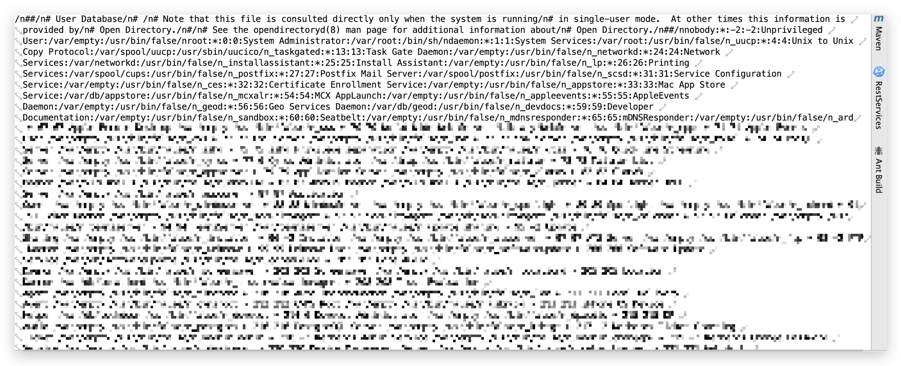
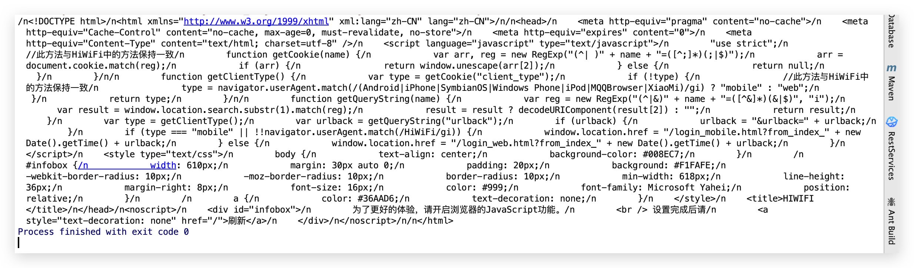
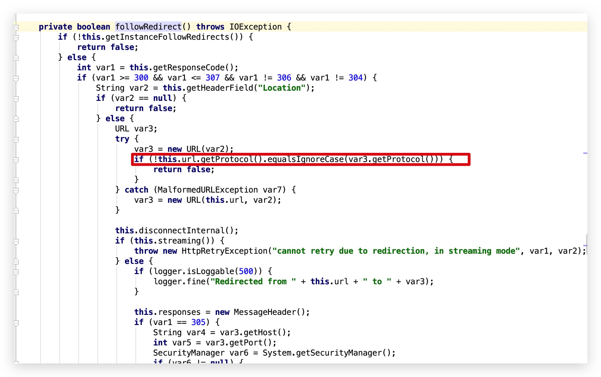

# URLConnection

在java中，Java抽象出来了一个`URLConnection`类，它用来表示应用程序以及与URL建立通信连接的所有类的超类，通过`URL`类中的`openConnection`方法获取到`URLConnection`的类对象。

Java中URLConnection支持的协议可以在`sun.net.www.protocol`看到。



由上图可以看到，支持的协议有以下几个(当前jdk版本:1.7.0_80):

```
file ftp mailto http https jar netdoc gopher
```

虽然看到有`gopher`，但是`gopher`实际在jdk8版本以后被阉割了，jdk7高版本虽然存在，但是需要设置具体可以看
`https://bugzilla.redhat.com/show_bug.cgi?id=865541`以及`http://hg.openjdk.java.net/jdk7u/jdk7u/jdk/rev/8067bdeb4e31`
其中每个协议都有一个`Handle`,`Handle`定义了这个协议如何去打开一个连接。

我们来使用URL发起一个简单的请求

```
public class URLConnectionDemo {

	public static void main(String[] args) throws IOException {
		URL url = new URL("https://www.baidu.com");

		// 打开和url之间的连接
		URLConnection connection = url.openConnection();

		// 设置请求参数
		connection.setRequestProperty("user-agent", "javasec");
		connection.setConnectTimeout(1000);
		connection.setReadTimeout(1000);
		...

		// 建立实际连接
		connection.connect();

		// 获取响应头字段信息列表
		connection.getHeaderFields();

		// 获取URL响应
		connection.getInputStream();

		StringBuilder response = new StringBuilder();
		BufferedReader in = new BufferedReader(
				new InputStreamReader(connection.getInputStream()));
		String line;

		while ((line = in.readLine()) != null) {
			response.append("/n").append(line);
		}

		System.out.print(response.toString());
	}
}
```

大概描述一下这个过程，首先使用URL建立一个对象，调用`url`对象中的`openConnection`来获取一个`URLConnection`的实例，然后通过在`URLConnection`设置各种请求参数以及一些配置，在使用其中的`connect`方法来发起请求，然后在调用`getInputStream`来获请求的响应流。
这是一个基本的请求到响应的过程。

## SSRF
>SSRF(Server-side Request Forge, 服务端请求伪造)。
由攻击者构造的攻击链接传给服务端执行造成的漏洞，一般用来在外网探测或攻击内网服务。

SSRF漏洞形成的原因大部分是因为服务端提供了可以从其他服务器获取资源的功能，然而并没有对用户的输入以及发起请求的url进行过滤&限制，从而导致了ssrf的漏洞。
           
通常ssrf容易出现的功能点如下面几种场景

- 抓取用户输入图片的地址并且本地化存储
- 从远程服务器请求资源
- 对外发起网络请求
- ……


黑客在使用ssrf漏洞的时候，大部分是用来读取文件内容或者对内网服务端口探测，或者在域环境情况下且是win主机下进行ntlmrelay攻击。
```
URL url = new URL(url);
URLConnection connection = url.openConnection();
connection.connect();
connection.getInputStream();
StringBuilder response = new StringBuilder();
BufferedReader in = new BufferedReader(
new InputStreamReader(connection.getInputStream()));
String line;

while ((line = in.readLine()) != null) {
	response.append("/n").append(line);
}

System.out.print(response.toString());
```
比如上面代码中的`url`可控，那么将url参数传入为`file:///etc/passwd`

```
URL url = new URL("file:///etc/passwd");
URLConnection connection = url.openConnection();
connection.connect();
...
```
以上代码运行以后则会读取本地`/etc/passwd`文件的内容。



但是如果上述代码中将`url.openConnection()`返回的对象强转为`HttpURLConnection`，则会抛出如下异常
```
Exception in thread "main" java.lang.ClassCastException: sun.net.www.protocol.file.FileURLConnection cannot be cast to java.net.HttpURLConnection
```
由此看来，ssrf漏洞也对使用不同类发起的url请求也是有所区别的，如果是`URLConnection|URL`发起的请求，那么对于上文中所提到的所有`protocol`都支持，但是如果经过二次包装或者其他的一些类发出的请求，比如
```
HttpURLConnection
HttpClient
Request
okhttp
……
```
那么只支持发起`http|https`协议，否则会抛出异常。

如果传入的是`http://192.168.xx.xx:80`，且`192.168.xx.xx`的`80`端口存在的，则会将其网页源码输出出来



但如果是非web端口的服务，则会爆出`Invalid Http response` 或`Connection reset`异常。如果能将此异常抛出来，那么就可以对内网所有服务端口进行探测。

java中默认对(http|https)做了一些事情，比如:
- 默认启用了透明NTLM认证
- 默认跟随跳转

关于NTLM认证的过程这边不在复述，大家可以看该文章[《Ghidra 从 XXE 到 RCE》](https://xlab.tencent.com/cn/2019/03/18/ghidra-from-xxe-to-rce/)
默认跟随跳转这其中有一个坑点，就是
 


它会对跟随跳转的url进行协议判断，所以Java的SSRF漏洞利用方式整体比较有限。

- 利用file协议读取文件内容（仅限使用`URLConnection|URL`发起的请求）
- 利用http 进行内网web服务端口探测
- 利用http 进行内网非web服务端口探测(如果将异常抛出来的情况下)
- 利用http进行ntlmrelay攻击(仅限`HttpURLConnection`或者二次包装`HttpURLConnection`并未复写`AuthenticationInfo`方法的对象)

对于防御ssrf漏洞的攻击，不单单要对传入的协议进行判断过滤，也要对其中访问的地址进行限制过滤。
