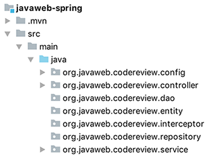

# Java Web 简介
Java web是一种基于B/S架构的网络应用程序的技术实现。这种结构的Web应用程序被大量的企业级应用所采用。随着Web应用程序的规模不断扩大，传统的Web开发模式无法满足日渐复杂的业务需要，所以出现了更加合理更加先进的MVC开发模式。随之而来的也出现了一系列的基于MVC模式的开发框架，Struts框架、Spring MVC 等。

为了更好的管理项目，我们通常会采用分层架构的方式来开发Java Web项目，这也就是Java的分层思想，分层设计的好处在于可以非常方便的分清楚包之间的业务逻辑关系。

常见的JavaWeb项目分层：

- 视图层（View 视图)
- 控制层（Controller、Action 控制层）
- 服务层（Service）
- 业务逻辑层BO(business object) 
- 实体层（entity 实体对象、VO(value object) 值对象 、模型层（bean）
- 持久层（dao- Data Access Object 数据访问层、PO- persistant object  持久对象）

基于Java分层架构的示例项目:

