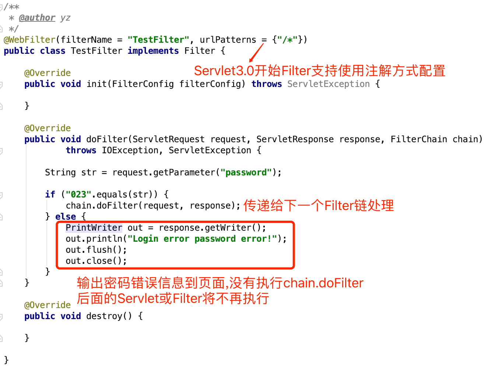

# Filter

Filter是JavaWeb中的过滤器,用于过滤URL请求。通过Filter我们可以实现URL请求资源权限验证、用户登陆检测等功能。Filter是一个接口，实现一个Filter只需要重写`init`、`doFilter`、`destroy`方法即可，其中过滤逻辑都在`doFilter`方法中实现。

Filter和Servlet一样是Java Web中最为核心的部分，使用Servlet和Filter可以实现后端接口开发和权限控制，当然使用Filter机制也可以实现MVC框架，`Struts2`实现机制就是使用的Filter。

Filter的配置类似于Servlet，由`<filter>`和`<filter-mapping>`两组标签组成，如果Servlet版本大于3.0同样可以使用注解的方式配置Filter。

