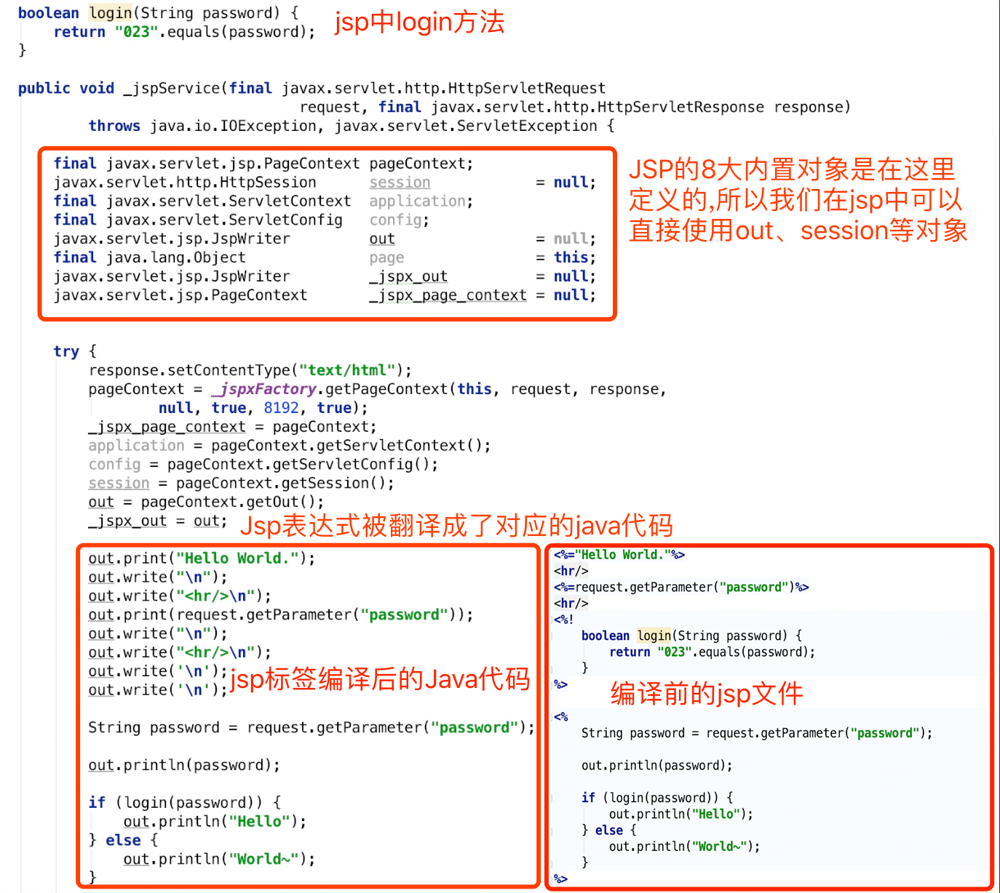

# JSP、Servlet之间的关系

JSP、JSPX 文件是可以直接被 Java 容器直接解析的动态脚本， jsp 和其他脚本语言无异，不但可以用于页面数据展示，也可以用来处理后端业务逻辑。

从本质上说 JSP 就是一个`Servlet` ，因为 jsp 文件最终会被编译成 class 文件，而这个 class 文件实际上就是一个特殊的`Servlet` 。

JSP文件会被编译成一个java类文件，如`index.jsp`在Tomcat中`Jasper`编译后会生成`index_jsp.java`和`index_jsp.class`两个文件。而`index_jsp.java` 继承于`HttpJspBase`类，`HttpJspBase`是一个实现了`HttpJspPage`接口并继承了`HttpServlet`的标准的`Servlet`，`__jspService`方法其实是`HttpJspPage`接口方法，类似于`Servlet`中的`service`方法，这里的`__jspService`方法其实就是`HttpJspBase`的`service`方法调用。

