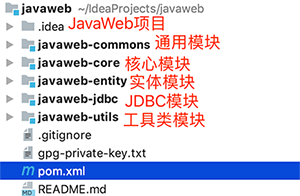

# Java 模块化开发

如今的较为大型的 Java Web 项目通常都采用了模块化方式开发，借助于`Maven`、`Gradle`依赖管理工具，Java可以非常轻松的完成模块化开发。除此之外使用`OSGi`(`Open Service Gateway Initiative` 可实现模块热部署)技术开发来Java动态模块化系统也是较为常见的。

采用模块化开发也会给我们做代码审计带来一定的难度，因为需要在更多的依赖库中去寻找需要我们审计的代码。

使用Maven开发的 JavaWeb 项目示例:

