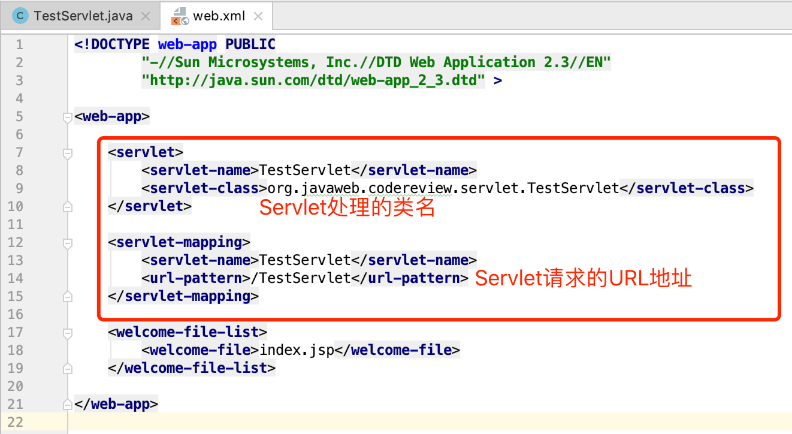

# Servlet

Servlet 是在 Java Web 容器上运行的“小程序”,通常我们用 Servlet 来处理一些较为复杂的服务器端的业务逻辑。值得注意的是在 Servlet3.0 之后( Tomcat7+)可以使用注解方式配置 Servlet 了。

基于注解的Servlet:

Servlet3.0 之前的版本都需要在 web.xml 中配置，Servlet是"两对标签"，由"和"组成，Spring MVC框架就是基于Servlet技术实现的。

基于配置实现的Servlet：

HttpServlet类：

实现一个 Servlet 很简单，只需要继承`javax.servlet.http.HttpServlet`类并重写`doXXX`方法或者`service`方法就可以了，其中需要注意的是重写`HttpServlet`类的`service`方法可以获取到上述七种Http请求方法的请求。