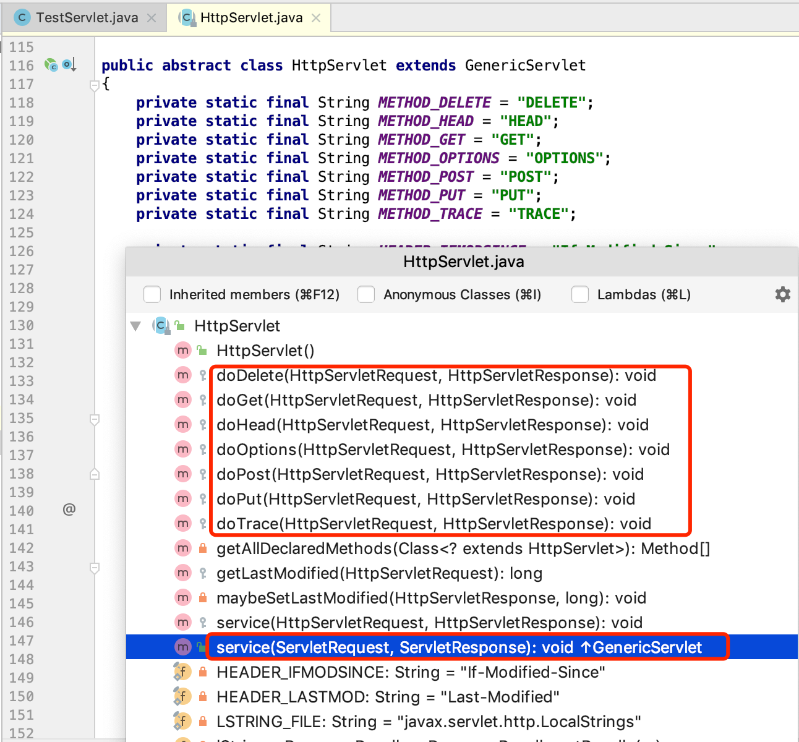
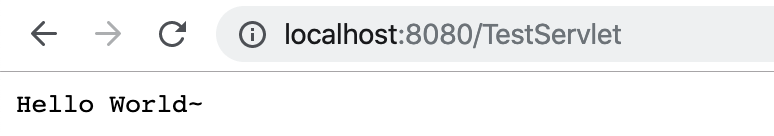
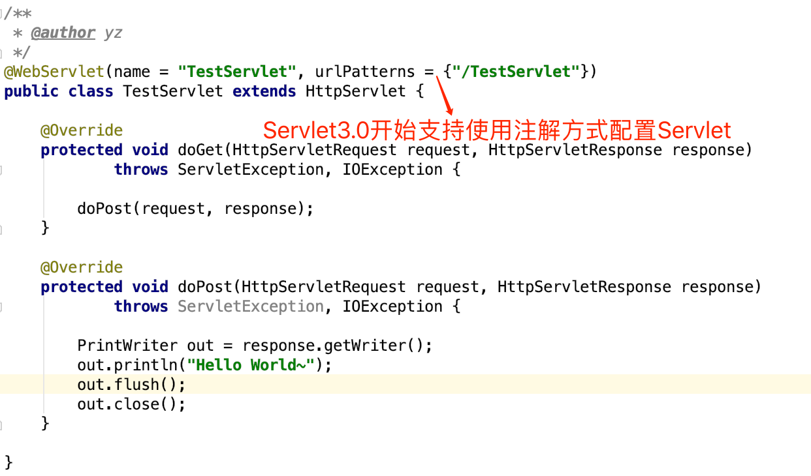

# Servlet

`Servlet `是在 `Java Web`容器中运行的`小程序`,通常我们用` Servlet `来处理一些较为复杂的服务器端的业务逻辑。` Servlet `是`Java EE`的核心,也是所有的MVC框架的实现的根本！

## 基于Web.xml配置

`Servlet3.0` 之前的版本都需要在` web.xml` 中配置`servlet标签`，`servlet标签`是由`servlet`和`servlet-mapping`标签组成的,两者之间通过在`servlet`和`servlet-mapping`标签中同样的`servlet-name`名称来实现关联的。

## Servlet的定义

定义一个 Servlet 很简单，只需要继承`javax.servlet.http.HttpServlet`类并重写`doXXX`(如`doGet、doPost`)方法或者`service`方法就可以了，其中需要注意的是重写`HttpServlet`类的`service`方法可以获取到上述七种Http请求方法的请求。

**javax.servlet.http.HttpServlet：**

在写`Servlet`之前我们先了解下`HttpServlet`,`javax.servlet.http.HttpServlet`类继承于`javax.servlet.GenericServlet`，而`GenericServlet`又实现了`javax.servlet.Servlet`和`javax.servlet.ServletConfig`。`javax.servlet.Servlet`接口中只定义了`servlet`基础生命周期方法：`init(初始化)`、`getServletConfig(配置)`、`service(服务)`、`destroy(销毁)`,而`HttpServlet`不仅实现了`servlet`的生命周期并通过封装`service`方法抽象出了`doGet/doPost/doDelete/doHead/doPut/doOptions/doTrace`方法用于处理来自客户端的不一样的请求方式，我们的Servlet只需要重写其中的请求方法或者重写`service`方法即可实现`servlet`请求处理。

**javax.servlet.http.HttpServlet类:**



### **TestServlet示例代码:**

```java
package com.anbai.sec.servlet;

import javax.servlet.http.HttpServlet;
import javax.servlet.http.HttpServletRequest;
import javax.servlet.http.HttpServletResponse;
import java.io.IOException;
import java.io.PrintWriter;

/**
 * Creator: yz
 * Date: 2019/12/14
 */
// 如果使用注解方式请取消@WebServlet注释并注释掉web.xml中TestServlet相关配置
//@WebServlet(name = "TestServlet", urlPatterns = {"/TestServlet"})
public class TestServlet extends HttpServlet {

	@Override
	protected void doGet(HttpServletRequest request, HttpServletResponse response) throws IOException {
		doPost(request, response);
	}

	@Override
	protected void doPost(HttpServletRequest request, HttpServletResponse response) throws IOException {
		PrintWriter out = response.getWriter();
		out.println("Hello World~");
		out.flush();
		out.close();
	}

}
```

**请求`TestServlet`示例:**



### Servlet Web.xml配置

定义好了Servlet类以后我们需要在`web.xml`中配置servlet标签才能生效。

**基于配置实现的Servlet：**


## Servlet 3.0 基于注解方式配置

**基于注解的Servlet:**

值得注意的是在 Servlet 3.0 之后( Tomcat7+)可以使用注解方式配置 Servlet 了,在任意的Java类添加`javax.servlet.annotation.WebServlet`注解即可。

基于注解的方式配置Servlet实质上是对基于`web.xml`方式配置的简化，极大的简化了Servlet的配置方式，但是也提升了对Servlet配置管理的难度，因为我们不得不去查找所有包含了`@WebServlet`注解的类来寻找Servlet的定义，而不再只是查看`web.xml`中的`servlet`标签配置。



## Servlet 3.0 特性

1. 新增动态注册`Servlet`、`Filter` 和` Listener`的API(`addServlet`、`addFilter`、`addListener`)。
2. 新增` @WebServlet`、`@WebFilter`、`@WebInitParam`、` @WebListener`、`@MultipartConfig`注解。
3. 文件上传支持，`request.getParts()`。
4. `非阻塞 IO`，添加`异步 IO`。
5. 可插拔性(`web-fragment.xml`、`ServletContainerInitializer`)。

